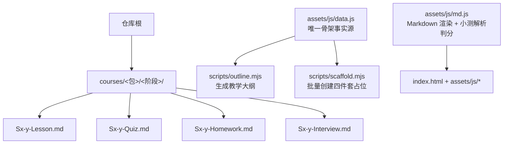
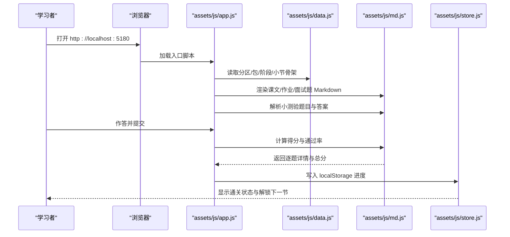
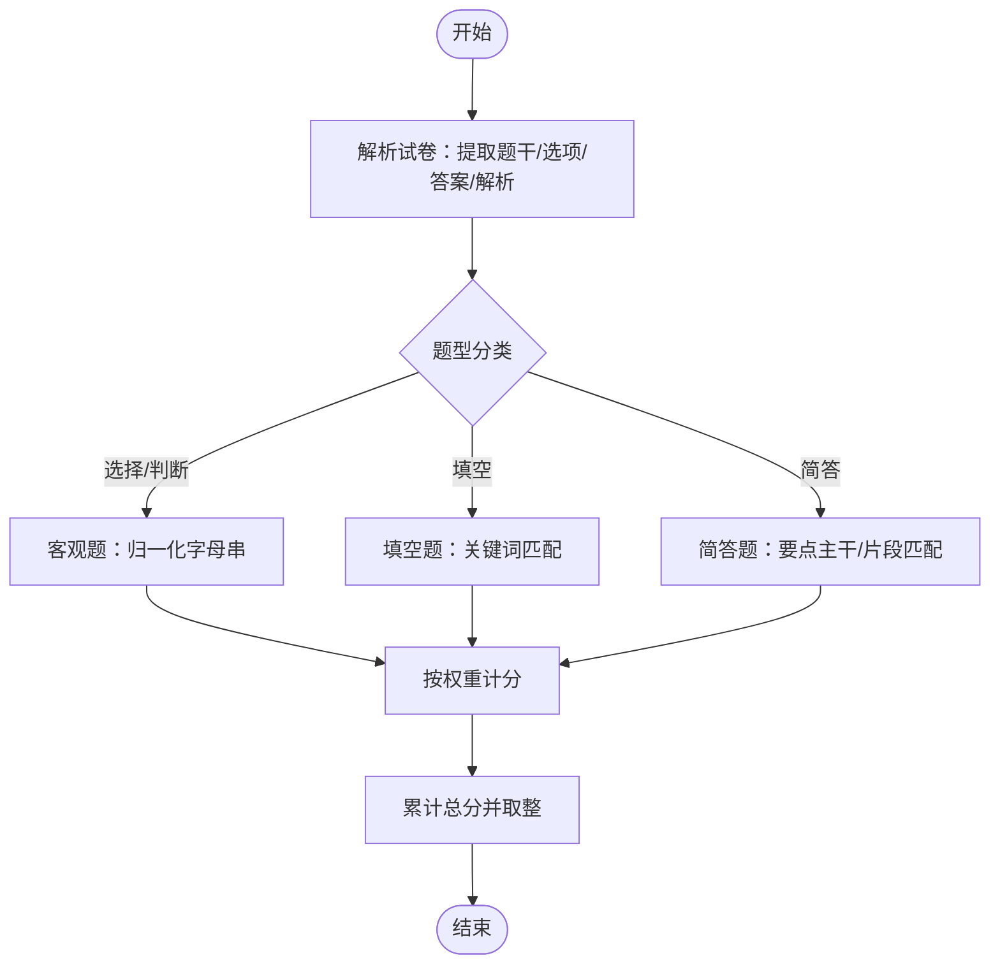
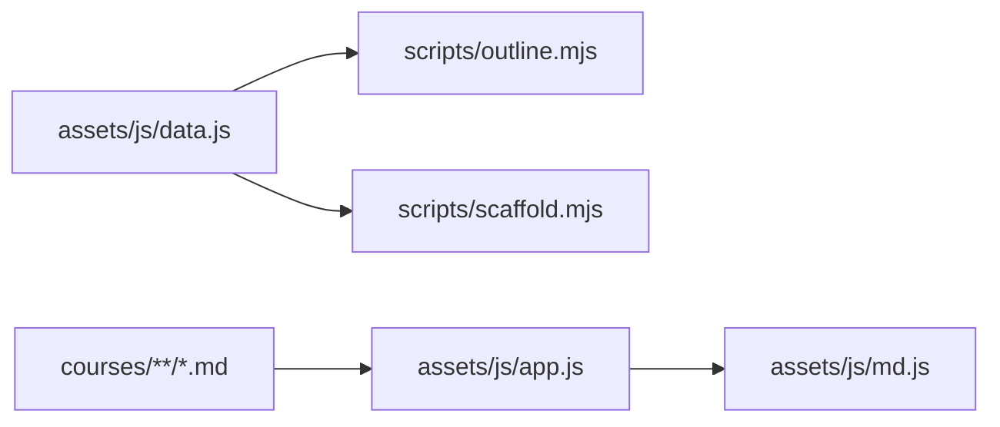

# Markdown 内容规范

<cite>
**本文引用的文件**   
- [README.md](file://README.md)
- [assets/js/md.js](file://assets/js/md.js)
- [assets/js/data.js](file://assets/js/data.js)
- [scripts/scaffold.mjs](file://scripts/scaffold.mjs)
- [scripts/outline.mjs](file://scripts/outline.mjs)
- [courses/java-basics/s1/S1-1-Lesson.md](file://courses/java-basics/s1/S1-1-Lesson.md)
- [courses/java-basics/s1/S1-1-Quiz.md](file://courses/java-basics/s1/S1-1-Quiz.md)
- [courses/java-basics/s1/S1-1-Homework.md](file://courses/java-basics/s1/S1-1-Homework.md)
- [courses/java-basics/s1/S1-1-Interview.md](file://courses/java-basics/s1/S1-1-Interview.md)
</cite>

## 目录
1. [引言](#引言)
2. [项目结构](#项目结构)
3. [核心组件](#核心组件)
4. [架构总览](#架构总览)
5. [详细组件分析](#详细组件分析)
6. [依赖关系分析](#依赖关系分析)
7. [性能与可维护性](#性能与可维护性)
8. [故障排查指南](#故障排查指南)
9. [结论](#结论)
10. [附录：四件套模板速查](#附录四件套模板速查)

## 引言
本规范面向大 Java 后端学习平台的内容创作者，统一 Lesson（课文）、Quiz（测验）、Homework（作业）、Interview（面试题）四类 Markdown 文件的命名、结构与语法约定。平台以 `assets/js/data.js` 为唯一骨架事实源，通过脚手架与大纲工具自动生成占位与导航；前端自写 Markdown 渲染器负责解析正文与小测验，并驱动“小测 ≥ 60 分自动通关”的学习进度机制。

## 项目结构
课程采用“分区 → 课程包 → 阶段 → 小节”四层组织，每个小节固定产出四件套 Markdown 文件：

**图示来源**
- [README.md:13-34](file://README.md#L13-L34)
- [assets/js/data.js:1-8](file://assets/js/data.js#L1-L8)
- [scripts/scaffold.mjs:1-5](file://scripts/scaffold.mjs#L1-L5)
- [scripts/outline.mjs:1-6](file://scripts/outline.mjs#L1-L6)
- [assets/js/md.js:1-11](file://assets/js/md.js#L1-L11)

**章节来源**
- [README.md:13-34](file://README.md#L13-L34)
- [assets/js/data.js:1-8](file://assets/js/data.js#L1-L8)

## 核心组件
- 骨架数据源：`assets/js/data.js` 定义分区、课程包、阶段、小节元组，决定站点导航、解锁顺序与重要级详略。
- 内容渲染与评测：`assets/js/md.js` 提供 Markdown 渲染、标题抽取、站内链接路由，以及小测验的解析与判分。
- 脚手架工具：`scripts/scaffold.mjs` 按 data.js 为每个小节补齐 Lesson/Quiz/Homework/Interview 四个占位文件。
- 大纲工具：`scripts/outline.mjs` 从 data.js 生成《教学大纲.md》，作为全站内容结构的镜像。

**章节来源**
- [assets/js/data.js:1-8](file://assets/js/data.js#L1-L8)
- [assets/js/md.js:1-11](file://assets/js/md.js#L1-L11)
- [scripts/scaffold.mjs:1-5](file://scripts/scaffold.mjs#L1-L5)
- [scripts/outline.mjs:1-6](file://scripts/outline.mjs#L1-L6)

## 架构总览
站点运行时由 HTML 外壳加载原生 ES Module，读取 data.js 构建目录树，再渲染对应 Markdown 内容；小测验通过 md.js 解析并判分，分数达到阈值后更新浏览器本地进度，并解锁下一小节。

**图示来源**
- [README.md:19-21](file://README.md#L19-L21)
- [assets/js/md.js:193-283](file://assets/js/md.js#L193-L283)
- [assets/js/md.js:329-337](file://assets/js/md.js#L329-L337)

## 详细组件分析

### 四件套文件命名与用途
- 命名规则：`<阶段号>-<小节号>-{Lesson,Quiz,Homework,Interview}.md`，例如 `S1-1-Lesson.md`。
- 阶段与课程包目录使用小写短横线，小节文件名编号使用大写前缀，保证与 data.js 中的 id 映射一致。
- 四种文件职责：
  - Lesson：知识点讲解、原理剖析、工程实践、代码示例、错误用例。
  - Quiz：客观题与主观题混合卷，支持自动判分。
  - Homework：动手验证型作业，附参考答案要点与验收标准。
  - Interview：高频追问链、期望答题要点、边界与踩坑说明。

**章节来源**
- [README.md:22-31](file://README.md#L22-L31)
- [assets/js/data.js:1-8](file://assets/js/data.js#L1-L8)

### Markdown 通用语法规范
- 标题层级：允许 h1–h6；页面头部由课程目录统一提供，正文首行一级标题会被渲染器剥离以避免重复。
- 代码块：使用三反引号标注语言，渲染器会保留语言标签并转义内容。
- 引用块：用于难度、重要性、学习产出等元信息；每行独立展示。
- 表格：标准 Markdown 表格，表头与分隔行必须完整。
- 列表：有序与无序均可；在题干、选项、解析中保持一致缩进。
- 链接：站内相对 `.md` 链接会被转换为站点路由；外链在新窗口打开。
- 图片：先于链接处理，避免被误识别为链接。

**章节来源**
- [assets/js/md.js:51-59](file://assets/js/md.js#L51-L59)
- [assets/js/md.js:71-79](file://assets/js/md.js#L71-L79)
- [assets/js/md.js:99-104](file://assets/js/md.js#L99-L104)
- [assets/js/md.js:106-117](file://assets/js/md.js#L106-L117)
- [assets/js/md.js:119-137](file://assets/js/md.js#L119-L137)
- [assets/js/md.js:36-41](file://assets/js/md.js#L36-L41)

### 测验文件格式与判分规则
- 题型识别：
  - 选择题：至少两个选项，题干含“多选”则为多选，否则单选。
  - 判断题：选项为“正确/错误”或等价表述时自动识别。
  - 填空题：题干含“填空/填写/补全/下划线”或包含连续下划线。
  - 简答题：无选项且非填空的主观题。
- 分值：
  - 题干可显式标注分值，如“（5分）”。
  - 未标注则整卷平均分摊到 100 分。
- 答案格式：
  - 客观题：字母串（A–H），支持多选；末尾“## 答案”段也支持数字序号+答案。
  - 主观题：参考答案文本或要点列表（“- 要点”），多个可接受答案用“/”或“|”分隔。
- 判分逻辑：
  - 客观题：严格匹配归一化后的字母串。
  - 填空题：关键词匹配，支持部分命中。
  - 简答题：按要点主干命中计满分，否则按片段命中率给部分分。
  - 整卷得分精确累加，仅在展示层取整，避免溢出。

**图示来源**
- [assets/js/md.js:193-283](file://assets/js/md.js#L193-L283)
- [assets/js/md.js:301-337](file://assets/js/md.js#L301-L337)

**章节来源**
- [assets/js/md.js:168-179](file://assets/js/md.js#L168-L179)
- [assets/js/md.js:193-283](file://assets/js/md.js#L193-L283)
- [assets/js/md.js:301-337](file://assets/js/md.js#L301-L337)

### 作业与面试题特殊格式
- 作业：
  - 问题描述需明确任务目标、输入输出、约束条件。
  - 参考答案要点应列出关键步骤与验收标准。
  - 建议区分必做与选做，并提供手写与运行要求。
- 面试题：
  - 每题给出期望时长、答题要点、追问链。
  - 强调“知道机制边界”，而非名词背诵。
  - 覆盖“是什么 / 为什么 / 怎么落地 / 踩过什么坑”。

**章节来源**
- [courses/java-basics/s1/S1-1-Homework.md:1-43](file://courses/java-basics/s1/S1-1-Homework.md#L1-L43)
- [courses/java-basics/s1/S1-1-Interview.md:1-47](file://courses/java-basics/s1/S1-1-Interview.md#L1-L47)

### 脚手架工具 scaffold.mjs
- 功能：
  - 遍历 data.js 所有小节，为缺失的 Lesson/Quiz/Homework/Interview 创建占位文件。
  - 不覆盖已有内容，幂等执行。
  - 占位文件带标题与“待补充”提示，确保检查脚本对非小测文件“至少一个二级标题”的要求通过。
- 用法：
  - 在仓库根执行 `node scripts/scaffold.mjs` 或 `npm run scaffold`。
  - 修改 data.js 增加小节后重跑即可补齐骨架。

**章节来源**
- [scripts/scaffold.mjs:1-5](file://scripts/scaffold.mjs#L1-L5)
- [scripts/scaffold.mjs:16-39](file://scripts/scaffold.mjs#L16-L39)
- [scripts/scaffold.mjs:41-55](file://scripts/scaffold.mjs#L41-L55)

### 大纲生成工具 outline.mjs
- 功能：
  - 从 data.js 生成《教学大纲.md》，逐分区/包/阶段/小节列出知识点。
  - 标注重要性星级与讲解详略档位。
  - 保持与首页各技术大方块的结构一致。
- 用法：
  - 在仓库根执行 `node scripts/outline.mjs` 或 `npm run outline`。
  - 修改 data.js 后重新生成，保证大纲与结构一致。

**章节来源**
- [scripts/outline.mjs:1-6](file://scripts/outline.mjs#L1-L6)
- [scripts/outline.mjs:10-19](file://scripts/outline.mjs#L10-L19)
- [scripts/outline.mjs:41-69](file://scripts/outline.mjs#L41-L69)

### 示例文件对照
- 课文示例：`courses/java-basics/s1/S1-1-Lesson.md`
  - 包含元信息引用块、多级标题、表格、代码块、流程图标记、关联技术栈与小结。
- 测验示例：`courses/java-basics/s1/S1-1-Quiz.md`
  - 包含单选、多选、判断、填空、简答，每题带答案与解析，末尾统一答案段可选。
- 作业示例：`courses/java-basics/s1/S1-1-Homework.md`
  - 明确必做/选做、参考答案要点、运行与手写要求。
- 面试题示例：`courses/java-basics/s1/S1-1-Interview.md`
  - 期望时长、答题要点、追问链，强调机制边界与实战经验。

**章节来源**
- [courses/java-basics/s1/S1-1-Lesson.md:1-123](file://courses/java-basics/s1/S1-1-Lesson.md#L1-L123)
- [courses/java-basics/s1/S1-1-Quiz.md:1-55](file://courses/java-basics/s1/S1-1-Quiz.md#L1-L55)
- [courses/java-basics/s1/S1-1-Homework.md:1-43](file://courses/java-basics/s1/S1-1-Homework.md#L1-L43)
- [courses/java-basics/s1/S1-1-Interview.md:1-47](file://courses/java-basics/s1/S1-1-Interview.md#L1-L47)

## 依赖关系分析
- data.js 是全站骨架事实源，驱动首页、地图、解锁链路、脚手架与大纲生成。
- md.js 提供 Markdown 渲染与小测验解析判分，被 app.js 调用以渲染内容与计算分数。
- scaffold.mjs 与 outline.mjs 均依赖 data.js，分别生成占位文件与教学大纲。
- 课程内容（courses/*.md）仅作为静态资源，不参与运行时逻辑。

**图示来源**
- [assets/js/data.js:1-8](file://assets/js/data.js#L1-L8)
- [assets/js/md.js:1-11](file://assets/js/md.js#L1-L11)
- [scripts/scaffold.mjs:1-5](file://scripts/scaffold.mjs#L1-L5)
- [scripts/outline.mjs:1-6](file://scripts/outline.mjs#L1-L6)

**章节来源**
- [assets/js/data.js:1-8](file://assets/js/data.js#L1-L8)
- [assets/js/md.js:1-11](file://assets/js/md.js#L1-L11)

## 性能与可维护性
- 渲染器零依赖，轻量高效；标题抽取与代码块处理避免二次改写。
- 小测验解析与判分逻辑集中，便于扩展新题型与评分策略。
- 脚手架与大纲工具保证内容结构与骨架数据一致，减少人工维护成本。
- 建议：
  - 保持 data.js 的唯一事实源地位，新增课程只改一处。
  - 使用脚手架批量补齐占位，避免遗漏。
  - 定期运行大纲生成与自检脚本，确保导航与完整性。

[本节为通用指导，无需具体文件引用]

## 故障排查指南
- 小测验无法判分：
  - 检查题干是否以三级标题开头，选项是否以 A–H 字母标注。
  - 确认答案格式为字母串或要点列表，末尾“## 答案”段序号与题号一致。
  - 若解析不出任何题，前端会降级为纯文档展示。
- 站内链接跳转异常：
  - 确保链接指向四件套命名规则的文件，内部路由会转换为站点路由。
  - 外链与新窗口打开不受影响。
- 占位文件缺失：
  - 运行脚手架工具重新生成，不会覆盖已有内容。
- 大纲不一致：
  - 重新运行大纲生成工具，确保与 data.js 同步。

**章节来源**
- [assets/js/md.js:193-283](file://assets/js/md.js#L193-L283)
- [assets/js/md.js:36-41](file://assets/js/md.js#L36-L41)
- [scripts/scaffold.mjs:41-55](file://scripts/scaffold.mjs#L41-L55)
- [scripts/outline.mjs:41-69](file://scripts/outline.mjs#L41-L69)

## 结论
本规范明确了大 Java 后端学习平台的四件套文件命名、Markdown 语法、测验判分与工具使用方法。通过 data.js 单一事实源、脚手架与大纲工具、以及自写渲染器与评测引擎，平台实现了内容创作的可扩展性与一致性。创作者应遵循本规范，确保内容质量与站点体验。

[本节为总结性内容，无需具体文件引用]

## 附录：四件套模板速查
- Lesson：
  - 标题：一节一个主题，配合元信息引用块。
  - 正文：原理 → 代码/配置 → 场景取舍。
  - 示例：必带注释、行注释讲影响、定义配应用、正误用例齐全。
- Quiz：
  - 题干：三级标题编号，可标注分值。
  - 选项：A–H 字母，多选需含“多选”。
  - 答案：客观题字母串，主观题要点列表或文本。
  - 总分：100 分，平均或标注。
- Homework：
  - 问题：明确任务、输入输出、约束。
  - 参考：要点与验收标准，必做/选做区分。
- Interview：
  - 结构：期望时长、答题要点、追问链。
  - 重点：机制边界、实战经验、踩坑记录。

**章节来源**
- [scripts/scaffold.mjs:16-39](file://scripts/scaffold.mjs#L16-L39)
- [assets/js/md.js:168-179](file://assets/js/md.js#L168-L179)
- [courses/java-basics/s1/S1-1-Lesson.md:1-123](file://courses/java-basics/s1/S1-1-Lesson.md#L1-L123)
- [courses/java-basics/s1/S1-1-Quiz.md:1-55](file://courses/java-basics/s1/S1-1-Quiz.md#L1-L55)
- [courses/java-basics/s1/S1-1-Homework.md:1-43](file://courses/java-basics/s1/S1-1-Homework.md#L1-L43)
- [courses/java-basics/s1/S1-1-Interview.md:1-47](file://courses/java-basics/s1/S1-1-Interview.md#L1-L47)