# 内容管理

<cite>
**本文引用的文件**   
- [README.md](file://README.md)
- [package.json](file://package.json)
- [assets/js/data.js](file://assets/js/data.js)
- [scripts/scaffold.mjs](file://scripts/scaffold.mjs)
- [scripts/outline.mjs](file://scripts/outline.mjs)
- [scripts/check.mjs](file://scripts/check.mjs)
</cite>

## 目录
1. [引言](#引言)
2. [项目结构](#项目结构)
3. [核心组件](#核心组件)
4. [架构总览](#架构总览)
5. [详细组件分析](#详细组件分析)
6. [依赖关系分析](#依赖关系分析)
7. [性能与质量特性](#性能与质量特性)
8. [故障排查指南](#故障排查指南)
9. [结论](#结论)
10. [附录：内容创作规范与最佳实践](#附录内容创作规范与最佳实践)

## 引言
本文件面向“大Java后端学习平台”的内容创作者与维护者，系统性说明以下内容管理与编写规范：
- 课程结构设计：15 个技术分区、86 个课程包、343 个小节的组织方式与拆分原则。
- Markdown 四件套命名约定与内容格式标准。
- 数据源设计：`data.js` 中 `CATEGORIES → packages → stages → sections` 的数据结构、字段定义与约束规则。
- 内容创作流程：如何添加新课程、扩展现有课程、使用脚手架生成占位文件。
- 自动化脚本作用与用法：scaffold（脚手架）、outline（大纲生成）、check（内容检查）等。
- 内容编写最佳实践：代码注释规范、例子程序要求、小测判分契约与一致性保障。

## 项目结构
平台采用“纯静态 + ES Module + Vite”的零运行时依赖架构，骨架事实源唯一，课程内容以 Markdown 形式存在，由前端渲染器解析并驱动学习地图、解锁链路与小测判分。

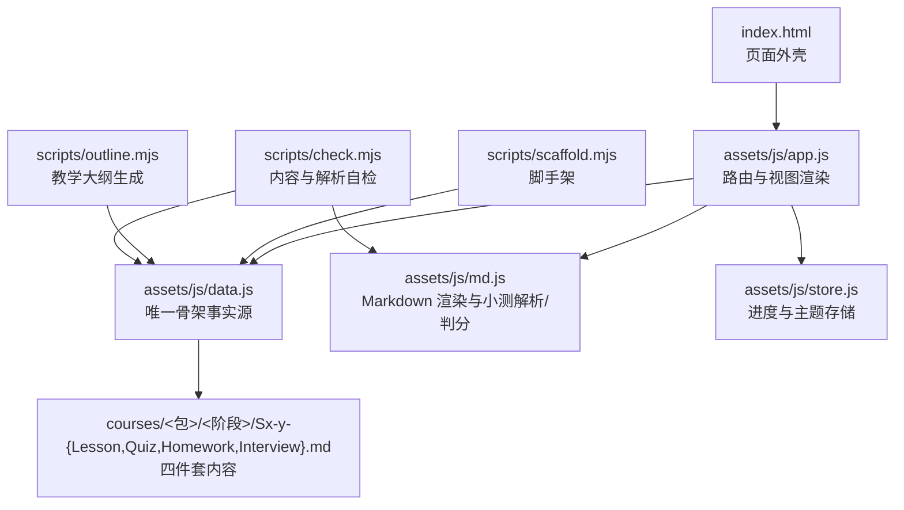

**图表来源**
- [README.md:13-34](file://README.md#L13-L34)
- [README.md:130-143](file://README.md#L130-L143)
- [README.md:145-170](file://README.md#L145-L170)

**章节来源**
- [README.md:13-34](file://README.md#L13-L34)
- [README.md:130-143](file://README.md#L130-L143)
- [README.md:145-170](file://README.md#L145-L170)

## 核心组件
- 骨架事实源 `assets/js/data.js`：定义 15 个分区、86 个课程包、343 个小节；小节元组为 `[id, title, summary, difficulty(1-5), importance(1-5)]`。
- 内容层 `courses/**`：每个小节对应 Lesson / Quiz / Homework / Interview 四个 Markdown 文件。
- 渲染与判分 `assets/js/md.js`：自写 Markdown 渲染器，含小测解析与判分逻辑。
- 工具脚本 `scripts/*`：脚手架、大纲生成、内容检查、示例审计等。

**章节来源**
- [assets/js/data.js:1-8](file://assets/js/data.js#L1-L8)
- [README.md:130-143](file://README.md#L130-L143)

## 架构总览
平台运行时的关键交互如下：用户通过浏览器访问页面，框架从 `data.js` 读取整棵目录树，渲染首页卡片、学习地图、课文与小测；小测答案经 `md.js` 解析与判分，结果写入 `store.js` 中的进度存储；内容工具脚本在开发时从 `data.js` 派生文件与文档。

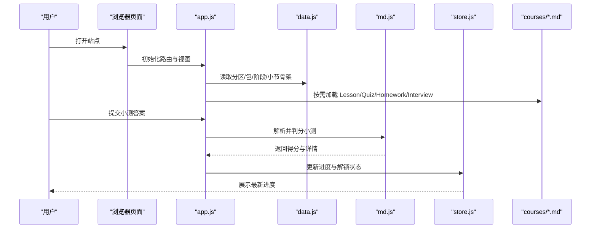

**图表来源**
- [README.md:13-34](file://README.md#L13-L34)
- [README.md:130-143](file://README.md#L130-L143)

## 详细组件分析

### 数据源设计：`assets/js/data.js`
- 顶层结构：`CATEGORIES` 数组，每项为一个技术分区，包含 `id`、`name`、`desc`、`packages`。
- 课程包：`packages` 数组，每项包含 `id`、`name`、`importance(1-5)`、`desc`、`stages`。
- 阶段：`stages` 数组，每项包含 `id`、`name`、`sections`。
- 小节：`sections` 数组，每项为元组 `[id, title, summary, difficulty(1-5), importance(1-5)]`。

字段定义与约束：
- `id`：小写短横线标识，用于路由与目录映射。
- `title`：小节标题，用于文件名与显示。
- `summary`：一句话知识点，用于教学大纲与卡片摘要。
- `difficulty`：难度星 1-5，影响讲解深度与题目难度。
- `importance`：重要星 1-5，决定详略分档（核心精讲/重点标准/标准概览/简明速览/了解即可）。

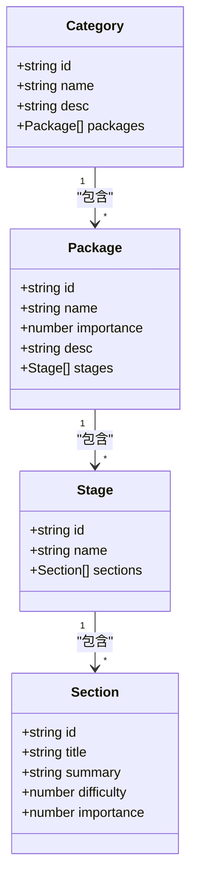

**图表来源**
- [assets/js/data.js:1-8](file://assets/js/data.js#L1-L8)
- [assets/js/data.js:10-10](file://assets/js/data.js#L10-L10)

**章节来源**
- [assets/js/data.js:1-8](file://assets/js/data.js#L1-L8)
- [assets/js/data.js:10-10](file://assets/js/data.js#L10-L10)

### 课程结构与分层关系
- 15 个大技术分区按业务与技术栈划分，如“计算机与算法基础”“Java 基础语言”“相关框架”“分布式系统”“架构设计与方法论”“数据库与缓存”“持久层与连接池”“中间件”“微服务治理”“构建、运维与 CI/CD”“测试”“性能调优工具”“安全”“其他补充”“专题”。
- 86 个课程包按产品/技术边界拆分，多门独立产品各自成包，同族或组合式主题保持合包。
- 343 个小节按阶段由浅入深排列，同一课程包内顺序解锁，跨包不互锁。

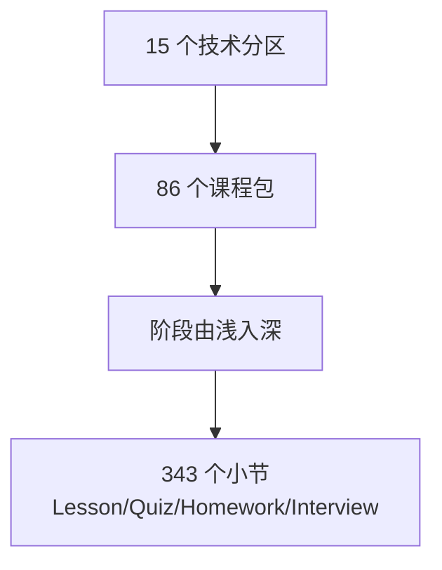

**图表来源**
- [README.md:172-221](file://README.md#L172-L221)

**章节来源**
- [README.md:172-221](file://README.md#L172-L221)

### Markdown 内容规范与四件套命名
- 四件套文件命名约定：`<阶段号>-<小节号>-{Lesson,Quiz,Homework,Interview}.md`，例如 `S1-2-Lesson.md`、`S1-2-Quiz.md`、`S1-2-Homework.md`、`S1-2-Interview.md`。
- 文件名编号大写（`S1-2-`），而站内 id、路由、进度键用小写。
- 非小测文件至少有一个二级标题；小测文件需遵循标准题格式以便自动判分，否则降级为手动过关模式。

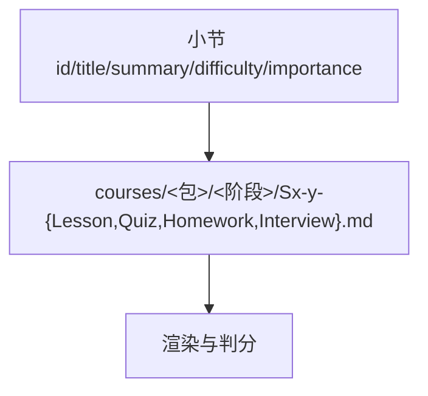

**图表来源**
- [README.md:22-31](file://README.md#L22-L31)
- [scripts/check.mjs:85-89](file://scripts/check.mjs#L85-L89)

**章节来源**
- [README.md:22-31](file://README.md#L22-L31)
- [scripts/check.mjs:85-89](file://scripts/check.mjs#L85-L89)

### 小测验格式与判分契约
- 标准题题干格式：`### N. 题目（分值）`；多选题干需含“【多选】”；判断题应提供两个对立选项。
- 每题用 `> 答案：` 给出标准答案；简答题用 `> - 要点` 列表给出得分关键词。
- 全卷分值合计应为 100；客观题答案必须为字母串（A-H），且与选项 key 一致。
- 自定义格式的小测（无法解析为标准题）会降级为文档展示，不阻断解锁链。

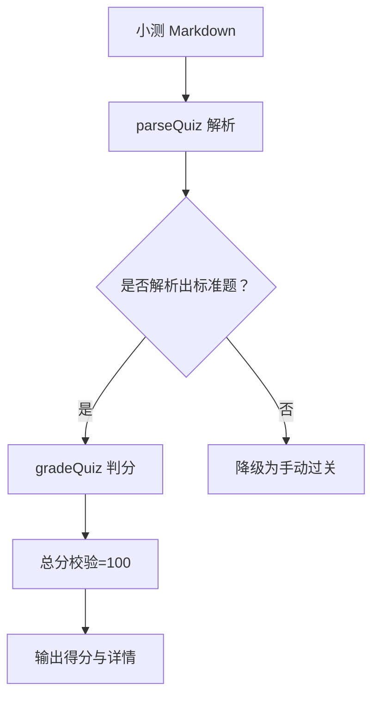

**图表来源**
- [scripts/scaffold.mjs:16-25](file://scripts/scaffold.mjs#L16-L25)
- [scripts/check.mjs:43-84](file://scripts/check.mjs#L43-L84)

**章节来源**
- [scripts/scaffold.mjs:16-25](file://scripts/scaffold.mjs#L16-L25)
- [scripts/check.mjs:43-84](file://scripts/check.mjs#L43-L84)

### 内容创作流程
- 加深某节：直接编辑对应 `courses/<包>/<阶段>/Sx-y-Lesson.md` 等四件套文件。
- 加一节课/阶段/包/分区：只改 `assets/js/data.js`，增补 `CATEGORIES → packages → stages → sections`。
- 生成占位文件：运行 `npm run scaffold`，为所有小节补齐缺失的四件套占位（幂等，已存在跳过）。
- 生成大纲：运行 `npm run outline`，由 `data.js` 重新生成《教学大纲.md》。
- 自检：运行 `npm run check`，校验包/小节 id 唯一性、重要性/难度取值合法、小测可解析判分。

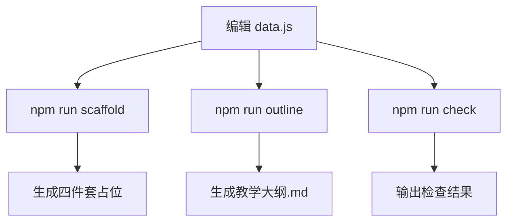

**图表来源**
- [README.md:89-99](file://README.md#L89-L99)
- [package.json:7-15](file://package.json#L7-L15)

**章节来源**
- [README.md:89-99](file://README.md#L89-L99)
- [package.json:7-15](file://package.json#L7-L15)

### 脚手架工具：scaffold.mjs
- 功能：遍历 `data.js` 中所有小节，为每个小节创建 Lesson/Quiz/Homework/Interview 四个 Markdown 占位文件。
- 行为：仅创建缺失文件，不覆盖已有内容；占位文件带标题与“待补充”提示，确保 `check.mjs` 对非小测文件的二级标题要求通过。
- 小测占位不含标准题，会被 `check.mjs` 与前端一起降级为“手动过关”模式，不影响解锁链。

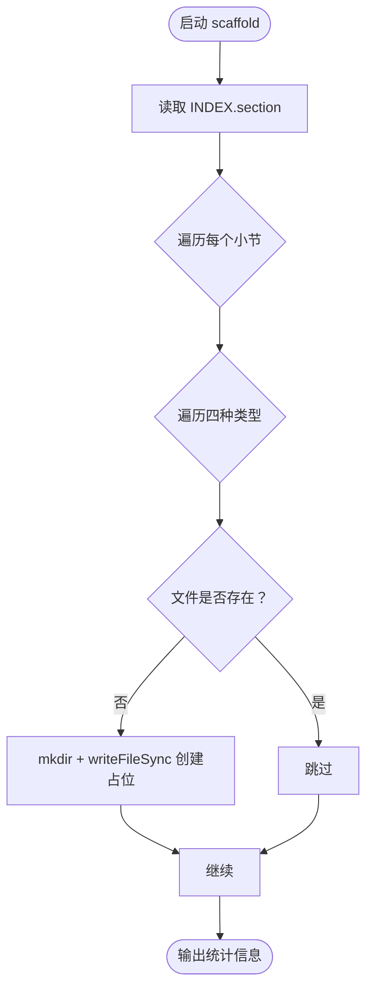

**图表来源**
- [scripts/scaffold.mjs:1-55](file://scripts/scaffold.mjs#L1-L55)

**章节来源**
- [scripts/scaffold.mjs:1-55](file://scripts/scaffold.mjs#L1-L55)

### 大纲生成工具：outline.mjs
- 功能：从 `data.js` 生成《教学大纲.md》，逐分区/包/阶段/小节列出知识点与详略分档。
- 详略分档：与 `app.js depthOf` 保持一致，依据 `importance` 映射到“核心精讲/重点标准/标准概览/简明速览/了解即可”。
- 输出：包含总览、推荐学习路径、各分区与包的知识点清单。

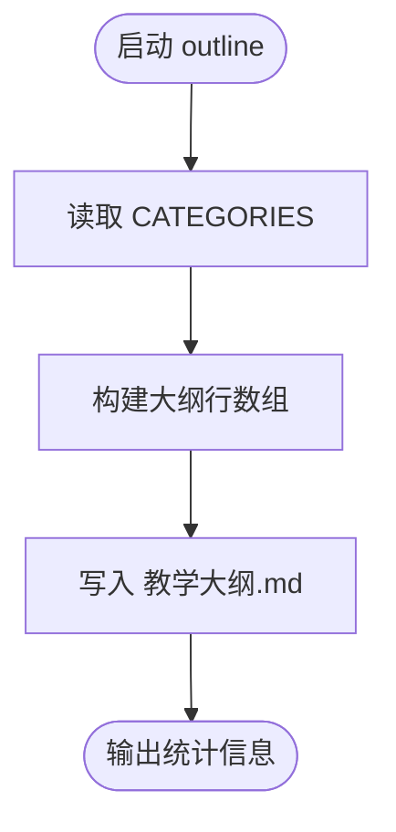

**图表来源**
- [scripts/outline.mjs:1-69](file://scripts/outline.mjs#L1-L69)

**章节来源**
- [scripts/outline.mjs:1-69](file://scripts/outline.mjs#L1-L69)

### 内容检查工具：check.mjs
- 功能：校验目录结构完整性 + 小测验 MD 是否能被正确解析判分。
- 校验项：
  - 包 id 唯一性与重要性取值范围。
  - 小节键唯一性与难度/重要性取值范围。
  - 小测文件解析与判分冒烟测试（满分 100、未作答 0、部分命中得分合理）。
  - 非小测文件至少一个二级标题，且无结构转义异常。
  - 渲染器冒烟测试（表格、代码块、目录抽取）。
  - 行内语法边界（加粗内含星号、下划线、链接）。
  - stripTitle 处理（仅去掉首个一级标题）。
  - 自定义格式小测降级展示。

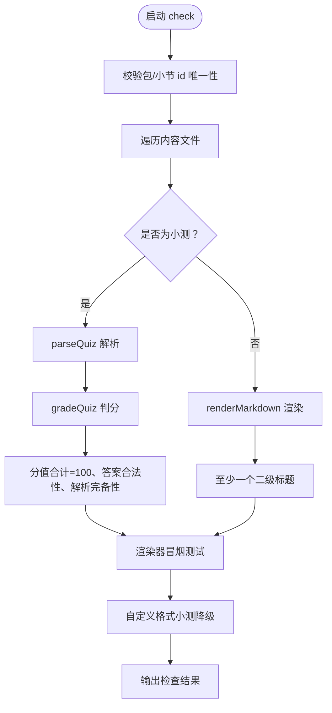

**图表来源**
- [scripts/check.mjs:1-119](file://scripts/check.mjs#L1-L119)

**章节来源**
- [scripts/check.mjs:1-119](file://scripts/check.mjs#L1-L119)

## 依赖关系分析
- `scripts/scaffold.mjs` 依赖 `assets/js/data.js` 的 `INDEX` 与 `secFile`。
- `scripts/outline.mjs` 依赖 `assets/js/data.js` 的 `CATEGORIES`。
- `scripts/check.mjs` 依赖 `assets/js/data.js` 的 `CATEGORIES`、`INDEX`、`secFile`、`secKey`，以及 `assets/js/md.js` 的 `renderMarkdown`、`parseQuiz`、`gradeQuiz`、`stripTitle`。
- 前端 `app.js` 依赖 `data.js` 与 `md.js` 进行渲染与判分。

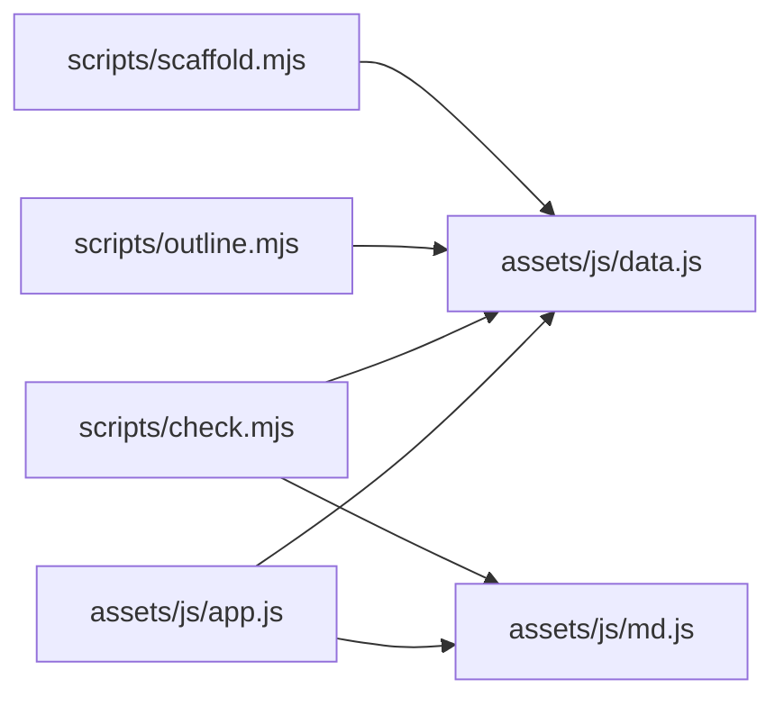

**图表来源**
- [scripts/scaffold.mjs:9-9](file://scripts/scaffold.mjs#L9-L9)
- [scripts/outline.mjs:6-6](file://scripts/outline.mjs#L6-L6)
- [scripts/check.mjs:7-8](file://scripts/check.mjs#L7-L8)

**章节来源**
- [scripts/scaffold.mjs:9-9](file://scripts/scaffold.mjs#L9-L9)
- [scripts/outline.mjs:6-6](file://scripts/outline.mjs#L6-L6)
- [scripts/check.mjs:7-8](file://scripts/check.mjs#L7-L8)

## 性能与质量特性
- 骨架事实源唯一，避免多处维护导致不一致。
- 脚手架与大纲生成基于 `data.js`，保证结构与文档同步。
- 内容检查脚本对小测判分进行冒烟测试，确保自动判分链路稳定。
- 渲染器支持表格、代码块、目录抽取与行内语法边界，提升内容可读性与一致性。

[本节为通用指导，无需具体文件分析]

## 故障排查指南
- 小测无法自动判分：检查题干格式是否符合 `### N. 题目（分值）`，答案是否为字母串且与选项匹配，分值合计是否为 100。
- 非小测文件渲染异常：确认至少有一个二级标题，且结构未被转义。
- 进度未解锁：确认小测得分 ≥ 60，或自定义格式小测已手动标记完成。
- 脚手架未生成文件：确认 `data.js` 中小节 id 与阶段编号正确，且目标目录不存在同名文件。

**章节来源**
- [scripts/check.mjs:43-89](file://scripts/check.mjs#L43-L89)
- [scripts/scaffold.mjs:41-55](file://scripts/scaffold.mjs#L41-L55)

## 结论
本平台通过唯一的骨架事实源 `data.js` 统一驱动课程结构、内容文件与工具脚本，配合脚手架、大纲生成与内容检查脚本，形成“结构即事实、内容即 Markdown、工具即脚本”的可扩展体系。内容创作者只需关注 `data.js` 与四件套 Markdown，即可高效扩展课程并保持全站一致性。

[本节为总结性内容，无需具体文件分析]

## 附录：内容创作规范与最佳实践

### 四件套文件命名与层级
- 命名约定：`<阶段号>-<小节号>-{Lesson,Quiz,Homework,Interview}.md`，例如 `S1-2-Lesson.md`。
- 层级关系：`courses/<包id>/<阶段id>/`，包 id 与阶段 id 为小写短横线，小节文件名编号为大写。

**章节来源**
- [README.md:22-31](file://README.md#L22-L31)

### 数据源字段与约束
- `CATEGORIES`：分区数组，包含 `id`、`name`、`desc`、`packages`。
- `packages`：课程包数组，包含 `id`、`name`、`importance(1-5)`、`desc`、`stages`。
- `stages`：阶段数组，包含 `id`、`name`、`sections`。
- `sections`：小节数组，元素为元组 `[id, title, summary, difficulty(1-5), importance(1-5)]`。
- 约束：包 id 唯一、小节键唯一、难度与重要性取值 1-5。

**章节来源**
- [assets/js/data.js:1-8](file://assets/js/data.js#L1-L8)
- [scripts/check.mjs:14-32](file://scripts/check.mjs#L14-L32)

### 小测验格式与判分
- 题干格式：`### N. 题目（分值）`；多选题干含“【多选】”；判断题提供两个对立选项。
- 答案格式：`> 答案：`；简答题要点用 `> - 要点` 列表。
- 分值合计：100；客观题答案为字母串（A-H），且与选项 key 一致。
- 自定义格式：无法解析为标准题时降级为手动过关。

**章节来源**
- [scripts/scaffold.mjs:16-25](file://scripts/scaffold.mjs#L16-L25)
- [scripts/check.mjs:43-84](file://scripts/check.mjs#L43-L84)

### 例子程序规范
- 必带注释：例子开头注释说明目的。
- 行注释讲影响与结果：关键语句后给出影响/输出/状态变化。
- 定义必配应用：给出实际使用代码，不允许只定义不使用。
- 逐知识点正确用例：每个知识点/场景有正确案例，并在注释中写明正确结果。
- 必备错误用例：给出错误用例，并用注释说明异常结果。

**章节来源**
- [README.md:106-116](file://README.md#L106-L116)

### 自动化脚本使用方法
- `npm run scaffold`：为所有小节补齐四件套占位（幂等）。
- `npm run outline`：由 `data.js` 重新生成《教学大纲.md》。
- `npm run check`：自检包/小节 id 唯一性、重要性/难度取值、小测可解析判分。

**章节来源**
- [package.json:7-15](file://package.json#L7-L15)
- [README.md:89-99](file://README.md#L89-L99)