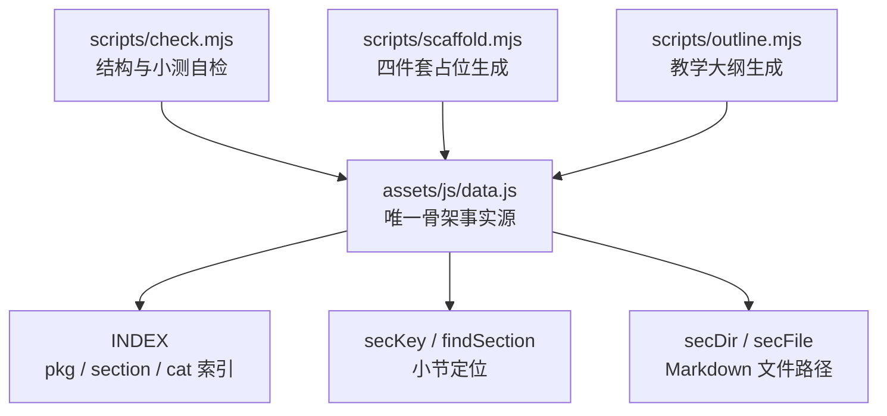
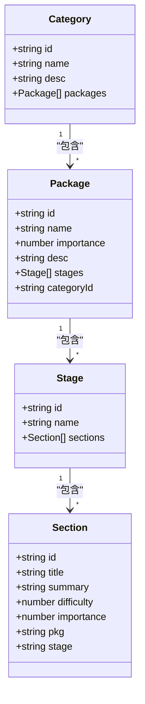
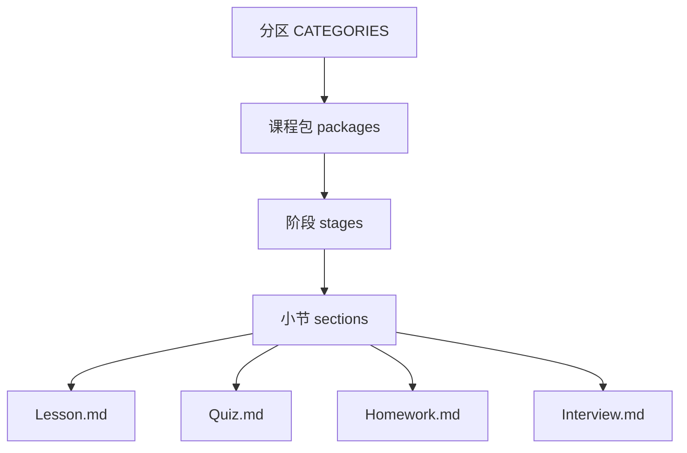
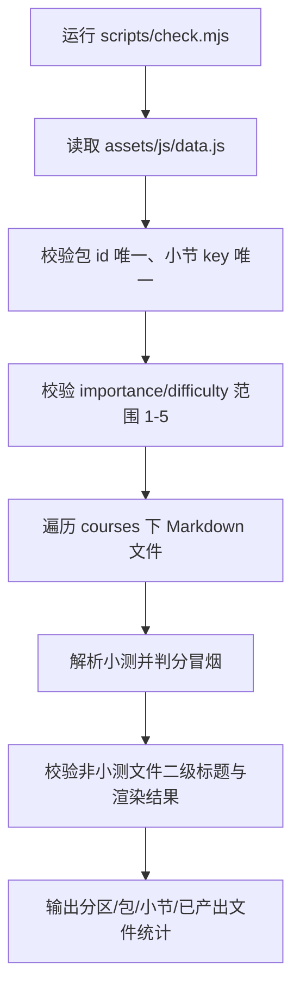
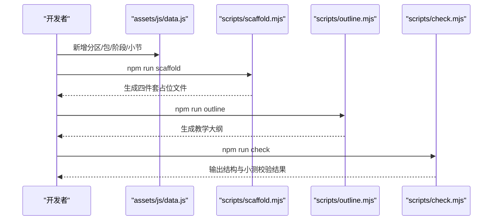
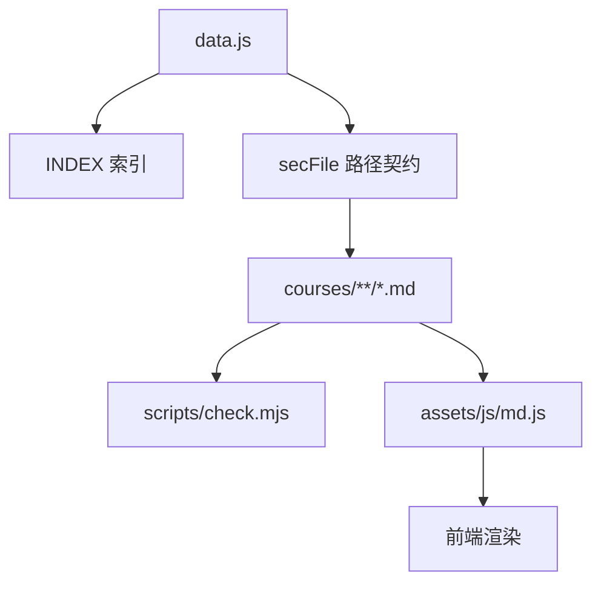

# 课程结构设计

<cite>
**本文引用的文件**   
- [assets/js/data.js](file://assets/js/data.js)
- [scripts/check.mjs](file://scripts/check.mjs)
- [scripts/scaffold.mjs](file://scripts/scaffold.mjs)
- [scripts/outline.mjs](file://scripts/outline.mjs)
- [README.md](file://README.md)
</cite>

## 目录
1. [引言](#引言)
2. [项目结构与数据入口](#项目结构与数据入口)
3. [核心数据结构：CATEGORIES → packages → stages → sections](#核心数据结构categories--packages--stages--sections)
4. [15 个技术分区的分类原则与组织逻辑](#15-个技术分区的分类原则与组织逻辑)
5. [86 个课程包的划分标准](#86-个课程包的划分标准)
6. [343 个小节的层级关系设计](#343-个小节的层级关系设计)
7. [data.js 数据模型、字段定义与验证规则](#datajs-数据模型字段定义与验证规则)
8. [课程结构最佳实践](#课程结构最佳实践)
9. [扩展指南：如何新增分区、包、阶段与小节](#扩展指南如何新增分区包阶段与小节)
10. [依赖关系与内容契约](#依赖关系与内容契约)
11. [常见问题与排错](#常见问题与排错)
12. [结论](#结论)

## 引言
本文件面向“大Java后端学习平台”的课程架构维护者与内容作者，目标是把仓库中已经存在的课程骨架讲清楚：**15 个大技术分区、86 个课程包、343 个小节**是如何被 `assets/js/data.js` 这个唯一骨架事实源组织和约束的。文档重点解释：
- 为什么这样分层；
- 每个层级的职责和约束；
- 难度、重要性、学习阶段的含义；
- 如何通过脚手架、自检脚本保证内容与结构一致；
- 如何在不改动框架代码的前提下扩展课程。

## 项目结构与数据入口
平台采用“纯静态 + 原生 ES Module”的结构：首页、路由、渲染、进度、小测判分等前端逻辑由 `assets/js` 下的 JS 文件提供，而课程内容全部是 Markdown 文件，放在 `courses/<包id>/<阶段id>/Sx-y-{Lesson,Quiz,Homework,Interview}.md`。

真正驱动整个站点结构的不是文件系统本身，而是 `assets/js/data.js`。它导出：
- `CATEGORIES`：15 个大技术分区；
- `INDEX`：运行时构建的索引对象，包含按 id 查找的包、小节、分区映射；
- `secKey` / `findSection` / `secDir` / `secFile`：小节键、查询、目录与文件路径工具。



**图表来源**
- [assets/js/data.js:991-1022](file://assets/js/data.js#L991-L1022)
- [scripts/check.mjs:1-119](file://scripts/check.mjs#L1-L119)
- [scripts/scaffold.mjs:1-55](file://scripts/scaffold.mjs#L1-L55)
- [scripts/outline.mjs:1-69](file://scripts/outline.mjs#L1-L69)

**章节来源**
- [README.md:13-34](file://README.md#L13-L34)
- [assets/js/data.js:1-8](file://assets/js/data.js#L1-L8)
- [assets/js/data.js:991-1022](file://assets/js/data.js#L991-L1022)

## 核心数据结构：CATEGORIES → packages → stages → sections
`data.js` 中的顶层结构是一个数组 `CATEGORIES`，每个元素代表一个技术分区。每个分区内部再嵌套：
- `packages`：该分区下的课程包；
- 每个 `package` 有 `stages`：学习阶段；
- 每个 `stage` 有 `sections`：小节列表。

小节在源码中以元组形式声明：
- `[小节id, 标题, 一句话知识点, 难度(1-5), 重要性(1-5)]`

运行时，`data.js` 会把所有小节元组转换为对象，并挂上 `pkg`、`stage`、`difficulty`、`importance` 等字段，同时构建全局 `INDEX.section`，供路由、进度、渲染、脚手架、自检脚本使用。



**图表来源**
- [assets/js/data.js:10-989](file://assets/js/data.js#L10-L989)
- [assets/js/data.js:991-1008](file://assets/js/data.js#L991-L1008)

**章节来源**
- [assets/js/data.js:1-8](file://assets/js/data.js#L1-L8)
- [assets/js/data.js:991-1008](file://assets/js/data.js#L991-L1008)

## 15 个技术分区的分类原则与组织逻辑
平台明确列出 15 个大技术分区，并在 README 中给出分区、课程包数量与小节数量的汇总。这些分区不是随意排列，而是体现“从基础到上层、从语言到系统、从单体到分布式、从开发到运维”的学习路径。

| # | 大技术分区 | 课程包数 | 小节数 | 分类意图 |
|---|------------|----------|--------|----------|
| 1 | 计算机与算法基础 | 3 | 40 | 数据结构、网络、Netty，作为后端能力地基 |
| 2 | Java 基础语言 | 4 | 31 | JDK 本体、现代演进、并发、JVM |
| 3 | 相关框架 | 6 | 25 | Spring Boot、Spring Core、MVC、AI、Jakarta EE、GraalVM |
| 4 | 分布式系统 | 2 | 12 | CAP/BASE、共识、事务、锁、ID、分片、一致性落地 |
| 5 | 架构设计与方法论 | 3 | 17 | 设计模式、DDD、系统设计方案 |
| 6 | 数据库与缓存 | 9 | 31 | MySQL、PG、TiDB、Redis、Lettuce、Redisson、Caffeine、MinIO、Memcached |
| 7 | 持久层与连接池 | 4 | 13 | MyBatis、JPA、Druid、HikariCP |
| 8 | 中间件 | 4 | 10 | RocketMQ、RabbitMQ、Kafka、任务调度 |
| 9 | 微服务治理 | 14 | 41 | Nacos、Gateway、OpenFeign、Sentinel、Seata、RPC、可观测性、网格、分库分表组件 |
| 10 | 构建、运维与 CI/CD | 10 | 40 | Maven、Gradle、Docker、Kubernetes、CI、日志、Shell |
| 11 | 测试 | 7 | 17 | JUnit、Mockito、Testcontainers、压测、Sonar、混沌工程 |
| 12 | 性能调优工具 | 3 | 7 | Arthas、Async-Profiler、JOL |
| 13 | 安全 | 6 | 19 | Spring Security、Shiro、OAuth2/JWT、Web 防御、数据加密 |
| 14 | 其他补充 | 4 | 10 | Elasticsearch、Temporal、Flink、Kafka Streams |
| 15 | 专题 | 7 | 30 | 高并发、高可用、幂等、电商、金融、电力、SNS |

**分类原则总结**：
1. **按技术领域分组**：例如“数据库与缓存”“持久层与连接池”“中间件”。
2. **按工程角色分组**：例如“构建、运维与 CI/CD”“测试”“性能调优工具”。
3. **按方法论分组**：例如“架构设计与方法论”“分布式系统理论”。
4. **按行业场景分组**：例如“专题”中的电商、金融、电力、SNS。
5. **按生态组合分组**：例如“微服务治理”聚合注册配置、网关、限流、事务、可观测、网格、分片组件。

**章节来源**
- [README.md:172-221](file://README.md#L172-L221)
- [assets/js/data.js:10-989](file://assets/js/data.js#L10-L989)

## 86 个课程包的划分标准
课程包是“一个首页卡片”，也是 Markdown 内容的根目录。划分标准主要遵循以下规则：

### 1. 独立产品独立成包
如果两个技术是独立产品，通常各自成包，并在包内设置关联小节做对比或选型说明。例如：
- Maven 与 Gradle；
- Docker 与 Kubernetes；
- JUnit 与 Mockito；
- Lettuce 与 Redisson；
- ELK 与 Loki；
- OAuth 2.0 与 JWT。

### 2. 同族或组合式主题合包
如果多个概念天然属于同一主题，则保持合包，避免碎片化。例如：
- MyBatis 与 MyBatis-Plus；
- Spring Cloud Alibaba 组合总览；
- RPC 原理；
- Web 攻防；
- 数据加密与签名。

### 3. 重要级决定讲解深度
每个包都有 `importance`（1-5），对应“了解即可 → 简明速览 → 标准概览 → 重点标准 → 核心精讲”。重要级越高，越要求源码、场景与行业实践。

### 4. 包内阶段体现学习顺序
包内可以有多个阶段，阶段之间由浅入深。例如：
- `java-basics`：语言基石 → 泛型与现代语法 → IO/反射/代理；
- `juc`：内存模型与锁 → AQS 与工具 → 进阶实战；
- `redis`：数据结构与原理 → 缓存工程问题；
- `kubernetes`：核心对象与发布 → 网络配置存储 → 弹性调度治理。

### 5. 包与包之间尽量解耦
跨包内容通过“关联小节”建立引用，而不是强耦合。例如：
- Lettuce 与 Redisson 的定位与选型；
- OpenTelemetry 与 SkyWalking/Prometheus 的关系；
- Istio 与 Linkerd 的选型对比；
- ShardingSphere 与 dist-data 理论的互补。

**章节来源**
- [README.md:223-227](file://README.md#L223-L227)
- [assets/js/data.js:10-989](file://assets/js/data.js#L10-L989)

## 343 个小节的层级关系设计
小节是学习的最小单元，对应四个 Markdown 文件：
- Lesson：课文；
- Quiz：小测；
- Homework：作业；
- Interview：面试题。

层级关系如下：



**图表来源**
- [assets/js/data.js:1-8](file://assets/js/data.js#L1-L8)
- [assets/js/data.js:991-1022](file://assets/js/data.js#L991-L1022)

### 各层级职责
| 层级 | 职责 | 约束 |
|------|------|------|
| CATEGORIES | 定义 15 个技术分区、分区名称、描述、包集合 | 顺序即首页分组顺序；与 README 分区表一致 |
| packages | 定义课程包、id、name、importance、desc、stages | id 必须唯一；importance 必须在 1-5 |
| stages | 定义学习阶段、id、name、sections | 阶段顺序即学习顺序 |
| sections | 定义小节 id、title、summary、difficulty、importance | id 必须唯一；difficulty/importance 必须在 1-5 |

### 小节命名与文件路径
- 小节 id 使用小写短横线，如 `s1-1`；
- 文件名编号使用大写，如 `S1-1-Lesson.md`；
- 路径格式：`courses/<包id>/<阶段id>/Sx-y-{Lesson,Quiz,Homework,Interview}.md`；
- 运行时通过 `secFile(sec, kind)` 生成路径，内部将 `sec.id.toUpperCase()` 转为大写。

**章节来源**
- [README.md:22-31](file://README.md#L22-L31)
- [assets/js/data.js:1015-1021](file://assets/js/data.js#L1015-L1021)

## data.js 数据模型、字段定义与验证规则
### 1. 顶层模型
`CATEGORIES` 是数组，每个分区对象包含：
- `id`：分区 id；
- `name`：分区中文名；
- `desc`：分区描述；
- `packages`：包数组。

### 2. 包模型
每个包对象包含：
- `id`：包 id；
- `name`：包名；
- `importance`：重要性 1-5；
- `desc`：包描述；
- `stages`：阶段数组。

### 3. 阶段模型
每个阶段对象包含：
- `id`：阶段 id；
- `name`：阶段名；
- `sections`：小节数组。

### 4. 小节模型
小节在源码中以元组声明，运行时转换为对象，字段包括：
- `id`：小节 id；
- `title`：小节标题；
- `summary`：一句话知识点；
- `difficulty`：难度 1-5；
- `importance`：重要性 1-5；
- `pkg`：所属包 id；
- `stage`：所属阶段 id。

### 5. 运行时索引
`data.js` 在模块加载时构建 `INDEX`：
- `INDEX.pkg`：包 id → 包对象；
- `INDEX.section`：小节 key → 小节对象；
- `INDEX.cat`：分区 id → 分区对象。

小节 key 由 `secKey(sec)` 生成，格式为：`pkgId#stageId#secId`。

### 6. 校验规则
`scripts/check.mjs` 对 `data.js` 进行结构性校验：
- 课程包 id 不能重复；
- 小节 key 不能重复；
- 包 `importance` 必须在 1-5；
- 小节 `difficulty` 和 `importance` 必须在 1-5。

此外，check 还会检查 Markdown 内容是否可解析、小测是否能判分、分值是否为 100、答案格式是否正确等。



**图表来源**
- [scripts/check.mjs:1-119](file://scripts/check.mjs#L1-L119)
- [assets/js/data.js:991-1022](file://assets/js/data.js#L991-L1022)

**章节来源**
- [assets/js/data.js:1-8](file://assets/js/data.js#L1-L8)
- [assets/js/data.js:991-1022](file://assets/js/data.js#L991-L1022)
- [scripts/check.mjs:14-32](file://scripts/check.mjs#L14-L32)

## 课程结构最佳实践
### 1. 如何合理划分学习阶段
- 阶段应体现“由浅入深”的学习顺序；
- 前一阶段是小节的基础，后一阶段在前一阶段之上展开；
- 阶段不宜过多，一般 1-3 个阶段足够；复杂主题可拆为“原理 → 工程 → 实战”三段；
- 阶段名应能表达学习目标，例如“阶段一 · 复杂度与线性结构”“阶段二 · 树与堆”。

### 2. 如何设置难度评级
- `difficulty` 表示小节本身的难度，适合用于学习路径提示；
- `importance` 表示讲解详略与重要性，影响首页标签颜色与教学大纲详略；
- 建议：
  - 核心基础用 4-5；
  - 重要但非核心用 3-4；
  - 辅助知识用 2-3；
  - 了解性知识用 1-2。

### 3. 如何建立内容间的依赖关系
- 不要通过硬编码依赖链接；
- 通过“关联小节”在描述中说明依赖；
- 例如：
  - Lettuce 与 Redisson 的选型对比；
  - OpenTelemetry 与 SkyWalking/Prometheus 的关系；
  - ShardingSphere 与 dist-data 理论的互补；
  - Istio 与 Linkerd 的选型对比。

### 4. 如何控制讲解详略
- 重要性 5：核心精讲，要求源码、场景、行业实践；
- 重要性 4：重点标准，讲透原理并配实战与权衡；
- 重要性 3：标准概览，够用机制 + 典型示例；
- 重要性 2：简明速览，定位、用法与取舍；
- 重要性 1：了解即可，知道是什么、何时需要。

### 5. 如何保证内容质量
- 每小节必须有 Lesson、Quiz、Homework、Interview 四件套；
- 小测总分应为 100；
- 客观题答案必须是字母串；
- 简答题应有得分关键词；
- 自定义格式小测会被降级为手动过关，不影响解锁链。

**章节来源**
- [README.md:103-104](file://README.md#L103-L104)
- [README.md:172-227](file://README.md#L172-L227)
- [scripts/check.mjs:34-91](file://scripts/check.mjs#L34-L91)

## 扩展指南：如何新增分区、包、阶段与小节
### 步骤一：编辑 data.js
在 `CATEGORIES` 中添加新的分区、包、阶段或小节。小节以元组形式添加：
- `[小节id, 标题, 一句话知识点, 难度, 重要性]`

### 步骤二：生成占位文件
运行脚手架命令，为新增小节补齐四件套占位文件：
```bash
npm run scaffold
```

### 步骤三：生成教学大纲
运行大纲生成命令，重新生成《教学大纲.md》：
```bash
npm run outline
```

### 步骤四：自检
运行自检命令，校验结构、小测、渲染：
```bash
npm run check
```

### 步骤五：编写内容
根据占位文件提示，逐步完善 Lesson、Quiz、Homework、Interview。



**图表来源**
- [assets/js/data.js:1-8](file://assets/js/data.js#L1-L8)
- [scripts/scaffold.mjs:1-55](file://scripts/scaffold.mjs#L1-L55)
- [scripts/outline.mjs:1-69](file://scripts/outline.mjs#L1-L69)
- [scripts/check.mjs:1-119](file://scripts/check.mjs#L1-L119)

**章节来源**
- [README.md:89-104](file://README.md#L89-L104)
- [scripts/scaffold.mjs:1-55](file://scripts/scaffold.mjs#L1-L55)
- [scripts/outline.mjs:1-69](file://scripts/outline.mjs#L1-L69)
- [scripts/check.mjs:1-119](file://scripts/check.mjs#L1-L119)

## 依赖关系与内容契约
### 1. 骨架事实源契约
- `assets/js/data.js` 是唯一骨架事实源；
- 首页、地图、路由、进度、脚手架、大纲、自检都依赖它；
- 加一门课只需改 data.js，无需改框架代码。

### 2. 文件路径契约
- 小节文件路径由 `secFile(sec, kind)` 生成；
- 路径格式固定：`courses/<包id>/<阶段id>/Sx-y-{Lesson,Quiz,Homework,Interview}.md`；
- 文件名编号大写，站内 id 小写。

### 3. 小测契约
- 小测 Markdown 需符合解析约定；
- 题目编号使用 `### N.` 格式；
- 每题总分合计为 100；
- 选择题答案必须是字母串；
- 判断题只有两个对立选项；
- 简答题需提供得分关键词；
- 自定义格式小测会被降级为手动过关。

### 4. 渲染契约
- 非小测 Markdown 必须至少有一个二级标题；
- 渲染结果不能出现转义残留；
- 表格、代码块、标题等必须正确渲染。



**图表来源**
- [assets/js/data.js:991-1022](file://assets/js/data.js#L991-L1022)
- [scripts/check.mjs:34-119](file://scripts/check.mjs#L34-L119)

**章节来源**
- [README.md:19-34](file://README.md#L19-L34)
- [assets/js/data.js:991-1022](file://assets/js/data.js#L991-L1022)
- [scripts/check.mjs:34-119](file://scripts/check.mjs#L34-L119)

## 常见问题与排错
### 1. 课程包 id 重复
- 现象：check 报错“课程包 id 重复”。
- 原因：多个包使用了相同 id。
- 解决：确保每个包 id 唯一。

### 2. 小节 key 重复
- 现象：check 报错“小节键重复”。
- 原因：不同包或阶段中存在相同 `pkg#stage#secId`。
- 解决：调整小节 id，确保全局唯一。

### 3. 难度或重要性越界
- 现象：check 报错“难度/重要性越界”。
- 原因：值不在 1-5 范围内。
- 解决：调整为 1-5 之间的整数。

### 4. 小测分值不为 100
- 现象：check 报错“分值合计不为 100”。
- 原因：题目分值总和错误。
- 解决：调整题目分值，使总和为 100。

### 5. 选择题答案异常
- 现象：check 报错“客观题答案异常”。
- 原因：答案不是字母串，或单选/多选/判断逻辑不符。
- 解决：修正答案格式与题型。

### 6. 未解析出二级标题
- 现象：check 报错“未解析出任何二级标题”。
- 原因：Markdown 缺少 `##` 标题。
- 解决：为 Lesson/Homework/Interview 添加二级标题。

### 7. 渲染异常
- 现象：check 报错“结构被转义，渲染异常”。
- 原因：Markdown 被错误转义。
- 解决：检查 Markdown 语法，避免多余转义。

**章节来源**
- [scripts/check.mjs:14-119](file://scripts/check.mjs#L14-L119)

## 结论
“大Java后端学习平台”的课程结构以 `assets/js/data.js` 为核心，通过“分区 → 包 → 阶段 → 小节”四层组织，配合脚手架、自检脚本与教学大纲生成器，形成一套可扩展、可验证、可维护的内容体系。

对于维护者来说，最重要的原则是：
- 只改 data.js，不改框架；
- 用脚手架生成占位；
- 用 check 保证结构与内容契约；
- 用 importance 控制讲解详略；
- 用阶段体现学习顺序；
- 用关联小节表达依赖关系。

这套结构既适合初学者按图索骥，也适合资深工程师按领域深入，最终服务于“想按资深架构师的标准，系统刷完 Java 后端技术栈”的目标。