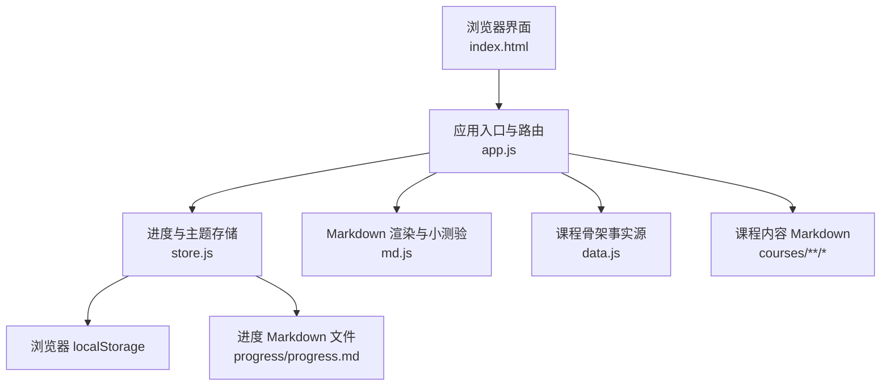
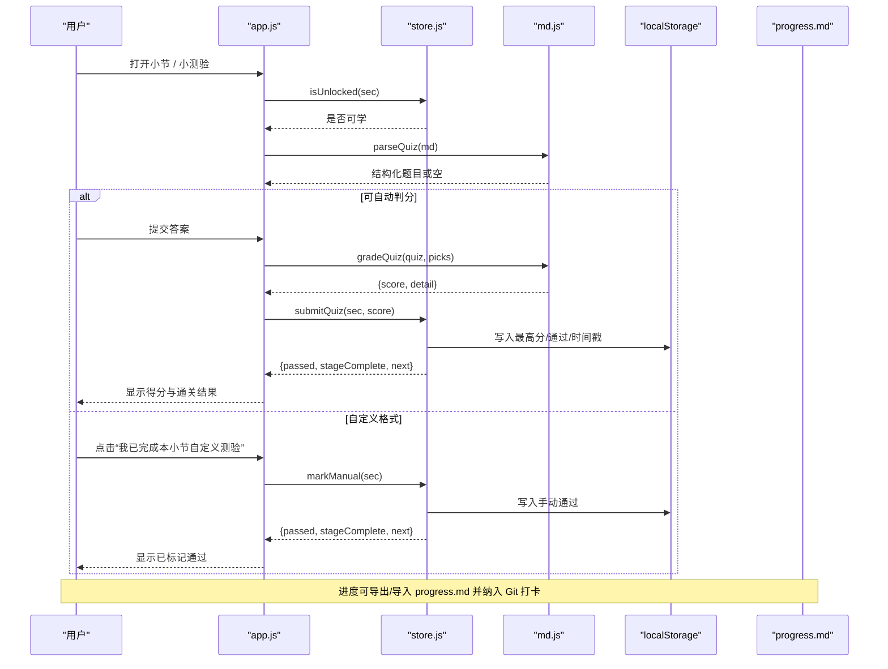
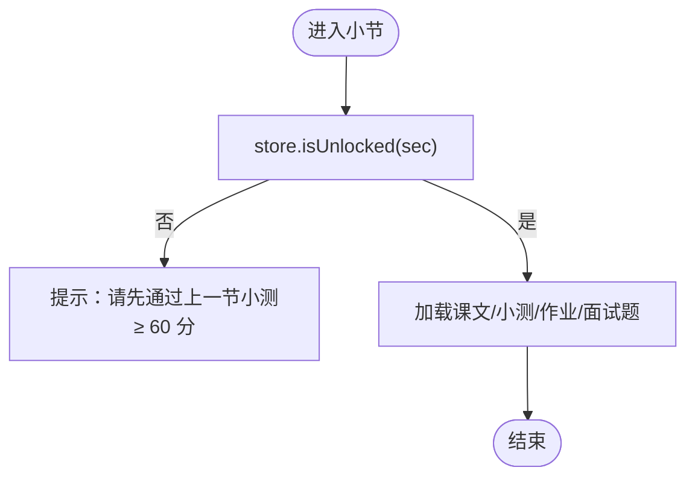
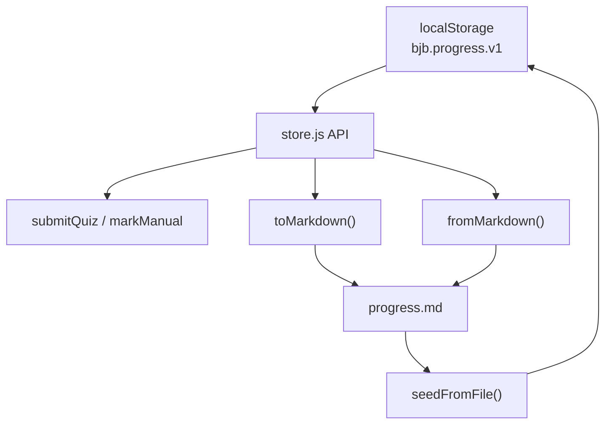
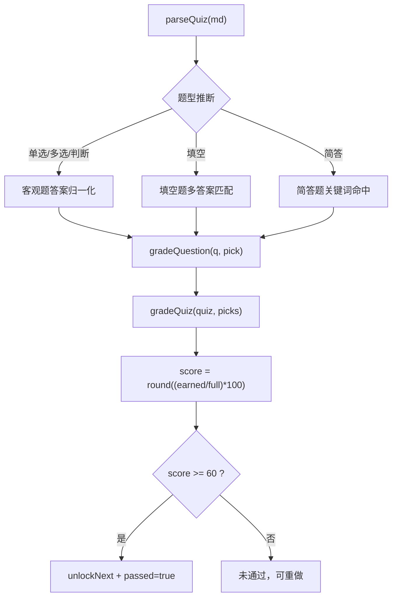
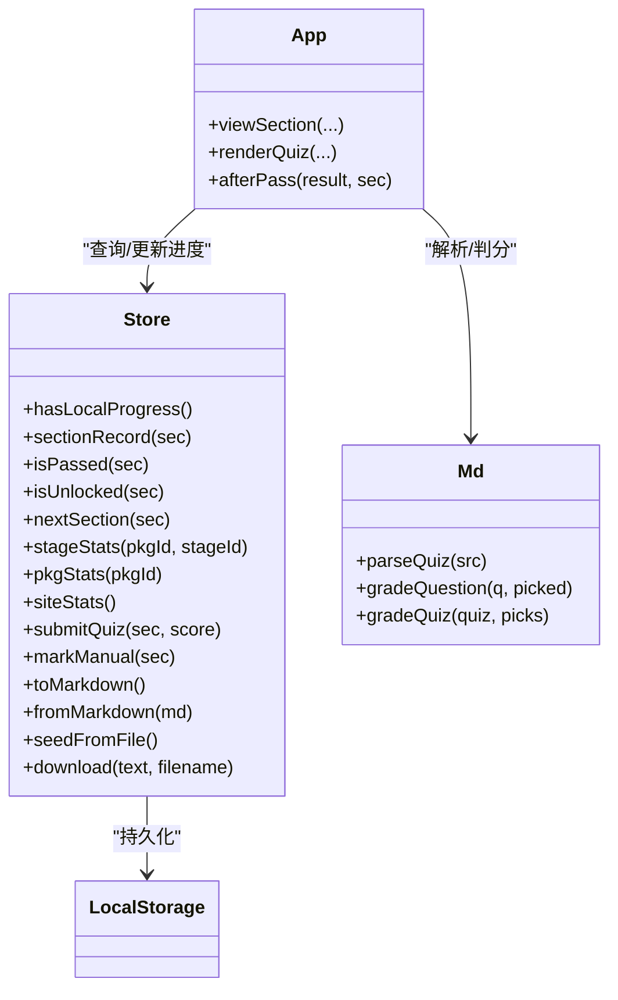
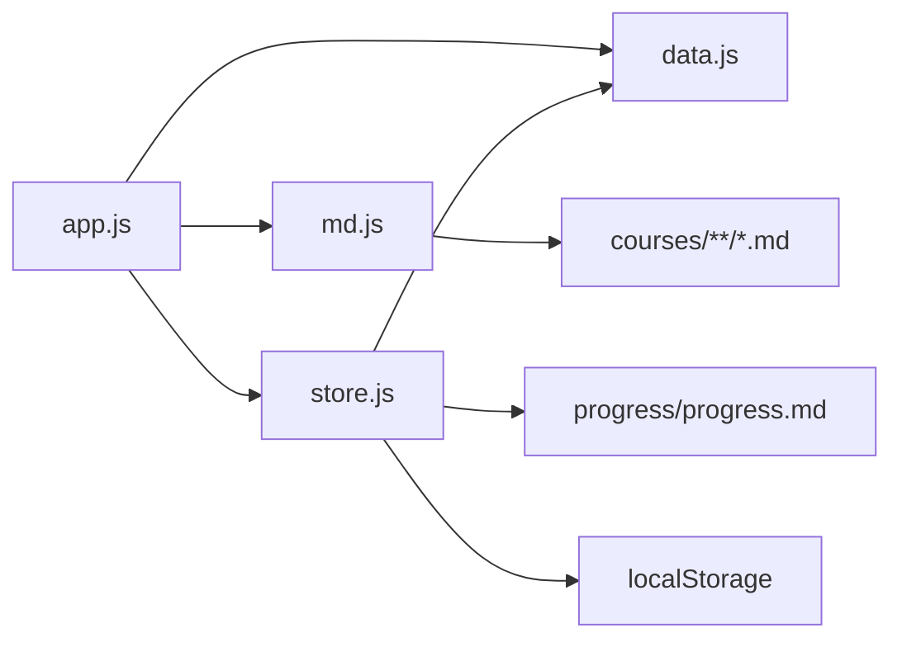

# 学习机制

<cite>
**本文引用的文件**   
- [README.md](file://README.md)
- [index.html](file://index.html)
- [assets/js/app.js](file://assets/js/app.js)
- [assets/js/store.js](file://assets/js/store.js)
- [assets/js/md.js](file://assets/js/md.js)
- [assets/js/data.js](file://assets/js/data.js)
- [progress/progress.md](file://progress/progress.md)
- [scripts/check.mjs](file://scripts/check.mjs)
</cite>

## 目录
1. [引言](#引言)
2. [项目结构](#项目结构)
3. [核心组件](#核心组件)
4. [架构总览](#架构总览)
5. [详细机制分析](#详细机制分析)
6. [依赖关系分析](#依赖关系分析)
7. [性能与扩展性](#性能与扩展性)
8. [故障排除指南](#故障排除指南)
9. [结论](#结论)

## 引言
本文件面向两类读者：
- 初学者：理解“过关卡”“进度追踪”“测验系统”“状态管理”等概念，知道如何学习、如何打卡。
- 开发者：掌握关键实现位置、数据流、判分算法、导入导出逻辑，以及调试和扩展方法。

大 Java 后端学习平台的核心学习机制围绕“课程包 → 阶段 → 小节”的层级组织展开：同一课程包内按顺序逐关解锁，不同课程包之间互不锁定；小节通过小测自动通关（≥ 60 分），或采用自定义格式时手动标记完成；学习进度以浏览器 `localStorage` 为主存储，并支持 Markdown 进度文件的导入导出，从而把本地学习记录纳入 Git 仓库形成 GitHub 打卡贡献。

## 项目结构
从学习机制角度，最相关的代码位于前端静态资源中：
- 路由与页面渲染：`assets/js/app.js`
- 进度与主题存储：`assets/js/store.js`
- Markdown 渲染与小测验解析/判分：`assets/js/md.js`
- 全站骨架事实源（分区/包/阶段/小节）：`assets/js/data.js`
- 仓库自带进度种子文件：`progress/progress.md`
- 内容自检脚本（含小测判分冒烟测试）：`scripts/check.mjs`
- 站点说明与学习机制约定：`README.md`
- 唯一页面外壳：`index.html`

**图示来源**
- [index.html:1-200](file://index.html#L1-L200)
- [assets/js/app.js:1-50](file://assets/js/app.js#L1-L50)
- [assets/js/store.js:1-30](file://assets/js/store.js#L1-L30)
- [assets/js/md.js:1-20](file://assets/js/md.js#L1-L20)
- [assets/js/data.js:1-10](file://assets/js/data.js#L1-L10)
- [progress/progress.md:1-19](file://progress/progress.md#L1-L19)

**章节来源**
- [README.md:13-37](file://README.md#L13-L37)
- [README.md:80-87](file://README.md#L80-L87)
- [README.md:130-170](file://README.md#L130-L170)

## 核心组件
- 应用层（`app.js`）：负责路由、页面渲染、小测验交互、提交判分、进度更新、下一节引导。
- 存储层（`store.js`）：维护 `localStorage` 主存储、通关阈值、同包顺序解锁、阶段统计、Markdown 进度导入导出、主题设置。
- 内容层（`md.js`）：自写 Markdown 渲染器、站内相对链接转路由、小测验解析 `parseQuiz`、单题评分 `gradeQuestion`、整卷评分 `gradeQuiz`。
- 骨架数据层（`data.js`）：定义 15 个大技术分区、86 个课程包、阶段与小节元组，是全站唯一事实源。
- 进度种子（`progress/progress.md`）：仓库自带的初始进度文件，首次启动且本地无进度时可自动恢复。
- 自检脚本（`scripts/check.mjs`）：校验小节 id、题型合法性、答案有效性，并对小测进行满分/未作答冒烟测试。

**章节来源**
- [assets/js/app.js:1-10](file://assets/js/app.js#L1-L10)
- [assets/js/store.js:1-10](file://assets/js/store.js#L1-L10)
- [assets/js/md.js:1-10](file://assets/js/md.js#L1-L10)
- [assets/js/data.js:1-8](file://assets/js/data.js#L1-L8)
- [progress/progress.md:1-19](file://progress/progress.md#L1-L19)
- [scripts/check.mjs:54-73](file://scripts/check.mjs#L54-L73)

## 架构总览
学习机制的整体流程如下：
1. 用户访问站点后，`app.js` 根据 `location.hash` 渲染首页、课程包、小节、小测验、作业、面试题、地图、进度页。
2. 进入小节时，`app.js` 调用 `store.isUnlocked` 判断是否可学；若未解锁则提示需先通过上一节小测（≥ 60 分）。
3. 进入小测验时，`app.js` 调用 `md.parseQuiz` 解析 Markdown 小测；若无法解析为结构化题目，则降级为自定义格式并提供“手动标记完成”。
4. 用户提交答案后，`app.js` 调用 `md.gradeQuiz` 计算得分，再调用 `store.submitQuiz` 更新最高分、通过状态和时间戳。
5. 若分数 ≥ 60，`store.submitQuiz` 返回“已通过”，并计算下一阶段完成情况和下一节；`app.js` 展示通关横幅并允许进入下一节。
6. 进度同时持久化到 `localStorage`；用户可在“进度”页导出 `progress.md`，或将已有 `progress.md` 导入恢复。
7. 首次启动时，若本地无进度且通过 HTTP 访问，`store.seedFromFile` 会尝试读取 `progress/progress.md` 播种解锁状态。

**图示来源**
- [assets/js/app.js:185-208](file://assets/js/app.js#L185-L208)
- [assets/js/app.js:248-294](file://assets/js/app.js#L248-L294)
- [assets/js/app.js:320-390](file://assets/js/app.js#L320-L390)
- [assets/js/store.js:71-99](file://assets/js/store.js#L71-L99)
- [assets/js/md.js:193-284](file://assets/js/md.js#L193-L284)
- [assets/js/md.js:329-337](file://assets/js/md.js#L329-L337)

## 详细机制分析

### 过关卡系统：同包顺序解锁与跨包不互锁
- 规则要点：
  - 同一课程包内，阶段和小节按固定顺序由浅入深；前一节未通过，后一节不可进入。
  - 不同课程包之间互不限制，可自由选择先后。
  - 小测 ≥ 60 分即自动通关本小节；阶段内全部小节通过后自动标记阶段完成。
- 实现要点：
  - `store.orderedSections` 按包的阶段顺序拼接小节列表。
  - `store.isUnlocked` 检查当前小节在包内的索引；若索引 ≤ 0 直接放行，否则要求前一小节已通过。
  - `store.nextSection` 返回包内下一小节，用于“下一节”导航。
  - `app.viewSection` 在未解锁时拒绝进入课程内容（作业题、面试题除外），并给出解锁提示。

**图示来源**
- [assets/js/store.js:28-45](file://assets/js/store.js#L28-L45)
- [assets/js/app.js:185-208](file://assets/js/app.js#L185-L208)

**章节来源**
- [README.md:33-37](file://README.md#L33-L37)
- [assets/js/store.js:28-45](file://assets/js/store.js#L28-L45)
- [assets/js/app.js:185-208](file://assets/js/app.js#L185-L208)

### 进度追踪机制：localStorage 主存储与 progress.md 导入导出
- 主存储设计：
  - 键名：`bjb.progress.v1`
  - 内容：每小节记录最高分、是否通过、最后提交时间戳；主题键 `bjb.theme`
  - 读写封装：`load()` / `save()` / `sectionRecord()` / `submitQuiz()` / `markManual()`
- 导入导出：
  - 导出：`toMarkdown()` 生成可读 Markdown 表格，包含小节进度与阶段完成情况。
  - 导入：`fromMarkdown()` 解析 Markdown 表格，兼容手写进度（编号大小写不敏感），恢复进度并保存。
  - 下载：`download()` 使用 Blob + URL.createObjectURL 触发浏览器下载。
- GitHub 打卡集成：
  - 将导出的 `progress.md` 提交回仓库并 `git push`，GitHub 上出现逐日提交与贡献绿格子。
  - 首次启动且本地无进度时，`seedFromFile()` 尝试读取仓库自带的 `progress/progress.md` 以恢复解锁状态。

**图示来源**
- [assets/js/store.js:4-18](file://assets/js/store.js#L4-L18)
- [assets/js/store.js:71-99](file://assets/js/store.js#L71-L99)
- [assets/js/store.js:110-182](file://assets/js/store.js#L110-L182)
- [progress/progress.md:1-19](file://progress/progress.md#L1-L19)

**章节来源**
- [README.md:80-87](file://README.md#L80-L87)
- [assets/js/store.js:4-18](file://assets/js/store.js#L4-L18)
- [assets/js/store.js:110-182](file://assets/js/store.js#L110-L182)

### 测验系统：题型支持、自动判分、答案验证、手动标记
- 题型支持：
  - 单选题：题干含选项 `- A. ...`，答案字母唯一。
  - 多选题：题干含“多选”，答案可为多个字母。
  - 判断题：选项为“正确/错误”等对立项。
  - 填空题：题干含“填空/填写/补全”或下划线，参考答案可用 `/`、`|`、`；`、`／` 分隔多个可接受答案。
  - 简答题：主观题，按参考答案关键词命中比例给部分分。
- 解析流程：
  - `parseQuiz` 解析三级标题题号、分值标注、选项行、答案/参考答案、解析、末尾统一答案段。
  - 自动推断题型：有选项则为选择题；选项为对立项则为判断题；无选项且含填空语义或下划线则为填空题；否则为简答题。
  - 分值分配：若每题显式标注分值则按标注；否则平均分配 100 分。
- 判分算法：
  - 客观题：答案归一化为排序后的字母串，完全匹配得满分，否则 0 分。
  - 填空题：规范化文本后，匹配任一可接受答案或包含关系即得满分。
  - 简答题：优先主干命中计满分；否则按片段命中率给部分分。
  - 整卷评分：逐题精确得分累加，避免分次四舍五入导致卷面溢出 100；最终百分制取整。
- 手动标记完成：
  - 当小测无法解析为结构化题目时，提供“我已完成本小节自定义测验，标记通过”按钮，调用 `store.markManual` 记录手动通过。

**图示来源**
- [assets/js/md.js:193-284](file://assets/js/md.js#L193-L284)
- [assets/js/md.js:301-337](file://assets/js/md.js#L301-L337)
- [assets/js/app.js:248-294](file://assets/js/app.js#L248-L294)
- [assets/js/app.js:320-390](file://assets/js/app.js#L320-L390)

**章节来源**
- [assets/js/md.js:168-284](file://assets/js/md.js#L168-L284)
- [assets/js/md.js:301-337](file://assets/js/md.js#L301-L337)
- [assets/js/app.js:248-294](file://assets/js/app.js#L248-L294)
- [scripts/check.mjs:54-73](file://scripts/check.mjs#L54-L73)

### 状态管理机制：解锁状态、分数记录、时间戳追踪
- 解锁状态：
  - `isPassed(sec)` 基于 `progress[secKey(sec)]?.passed`。
  - `isUnlocked(sec)` 基于包内顺序与前一小节通过状态。
- 分数记录：
  - `submitQuiz` 记录本次得分，并与历史最高分比较保留最大值。
  - 自定义格式通过 `markManual` 记录 `manual: true` 且 `score` 可为空。
- 时间戳追踪：
  - 每次提交或手动标记都会更新 `at` 字段，格式为 ISO 时间字符串的前 16 位（去掉 T）。
- 阶段与站点统计：
  - `stageStats` 计算阶段完成数与是否全部完成。
  - `pkgStats` 计算课程包完成数。
  - `siteStats` 汇总全站通过小节数，仅统计仍存在于骨架中的小节。

**图示来源**
- [assets/js/store.js:20-104](file://assets/js/store.js#L20-L104)
- [assets/js/app.js:185-208](file://assets/js/app.js#L185-L208)
- [assets/js/app.js:248-294](file://assets/js/app.js#L248-L294)
- [assets/js/md.js:193-284](file://assets/js/md.js#L193-L284)
- [assets/js/md.js:329-337](file://assets/js/md.js#L329-L337)

**章节来源**
- [assets/js/store.js:20-104](file://assets/js/store.js#L20-L104)
- [assets/js/app.js:185-208](file://assets/js/app.js#L185-L208)
- [assets/js/app.js:248-294](file://assets/js/app.js#L248-L294)

## 依赖关系分析
- `app.js` 依赖：
  - `data.js`：获取课程骨架、查找小节、生成小节文件路径。
  - `md.js`：渲染 Markdown、解析小测、判分。
  - `store.js`：查询解锁/通过状态、提交成绩、导出导入进度。
- `store.js` 依赖：
  - `data.js`：遍历分区/包/阶段/小节，生成进度 Markdown 与统计。
- `md.js` 依赖：
  - 无外部业务依赖，纯工具函数。
- 外部资源：
  - `courses/**/*.md`：课文、小测、作业、面试题。
  - `progress/progress.md`：进度种子文件。
  - `localStorage`：浏览器本地存储。

**图示来源**
- [assets/js/app.js:1-10](file://assets/js/app.js#L1-L10)
- [assets/js/store.js:1-3](file://assets/js/store.js#L1-L3)
- [assets/js/md.js:1-10](file://assets/js/md.js#L1-L10)

**章节来源**
- [assets/js/app.js:1-10](file://assets/js/app.js#L1-L10)
- [assets/js/store.js:1-3](file://assets/js/store.js#L1-L3)
- [assets/js/md.js:1-10](file://assets/js/md.js#L1-L10)

## 性能与扩展性
- 性能特性：
  - 运行时零第三方依赖，原生 ES Module + 自写 Markdown 渲染器，减少运行时开销。
  - 内容缓存：`app.js` 对已加载 Markdown 使用 `Map` 缓存，避免重复 fetch。
  - 构建期复制：Vite 构建后自动复制 `courses/` 与 `progress/` 到 `dist/`，部署为纯静态资源。
- 扩展建议：
  - 新增课程：只改 `data.js`，然后运行脚手架补齐四件套占位，再生成教学大纲与自检。
  - 新增题型：扩展 `parseQuiz` 与 `gradeQuestion`，并在 `KIND_LABEL` 与输入渲染处补充 UI。
  - 调整通关阈值：修改 `store.js` 中的 `PASS_LINE`，并同步更新 README 与 UI 文案。
  - 扩展进度字段：在 `sectionRecord` / `submitQuiz` / `toMarkdown` / `fromMarkdown` 中同步新增字段。

[本节为通用指导，不直接分析具体文件]

## 故障排除指南
常见问题与排查步骤：
- 小节始终未解锁：
  - 检查上一节是否已通过（≥ 60 分）；查看 `localStorage` 中对应小节记录的 `passed` 与 `score`。
  - 确认当前小节在同课程包内的顺序是否正确。
- 小测无法自动判分：
  - 检查小测 Markdown 是否符合约定格式（三级标题题号、选项行、答案/参考答案、解析）。
  - 若为自定义格式，应使用“手动标记完成”按钮。
- 分数异常或卷面溢出：
  - 使用 `npm run check` 执行自检脚本，其中包含满分与未作答冒烟测试。
  - 检查每题分值标注是否一致；若无标注则默认平均分配 100 分。
- 进度丢失或跨设备不同步：
  - 在“进度”页导出 `progress.md`，并将该文件提交回仓库；另一台设备导入同一文件即可恢复。
  - 首次启动时确保通过 HTTP 访问，以便 `seedFromFile()` 能读取 `progress/progress.md`。
- 主题或本地存储异常：
  - 检查 `localStorage` 中 `bjb.progress.v1` 与 `bjb.theme` 是否存在且格式正确。
  - 如需重置，可在“进度”页一键清空或清除浏览器 `localStorage`。

**章节来源**
- [assets/js/app.js:185-208](file://assets/js/app.js#L185-L208)
- [assets/js/app.js:248-294](file://assets/js/app.js#L248-L294)
- [assets/js/app.js:320-390](file://assets/js/app.js#L320-L390)
- [assets/js/store.js:71-99](file://assets/js/store.js#L71-L99)
- [assets/js/store.js:110-182](file://assets/js/store.js#L110-L182)
- [scripts/check.mjs:54-73](file://scripts/check.mjs#L54-L73)

## 结论
大 Java 后端学习平台的学习机制以“课程包内顺序解锁、跨包不互锁”为核心约束，以“小测 ≥ 60 分自动通关”为主要驱动，辅以“自定义格式手动标记完成”的灵活路径。进度以 `localStorage` 为主存储，并通过 Markdown 进度文件实现可移植、可审计、可打卡的学习轨迹。测验系统支持多种题型，具备健壮的解析与判分能力，并通过自检脚本保障质量。对于初学者，这套机制提供了清晰的学习路径与即时反馈；对于开发者，它提供了明确的扩展点与调试手段，便于持续演进。