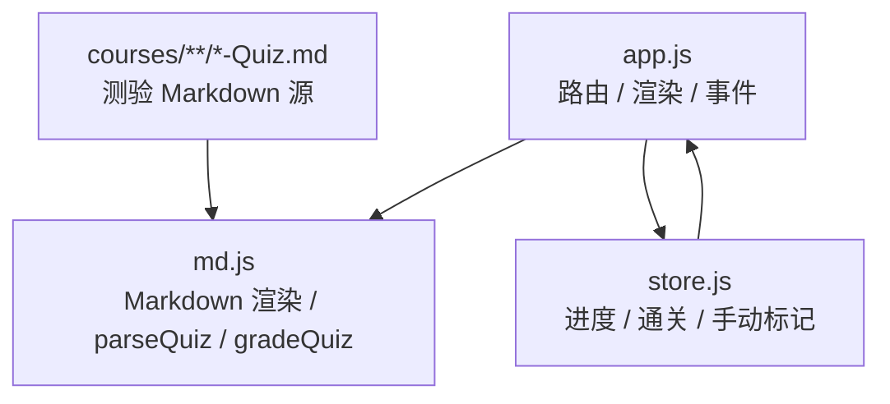
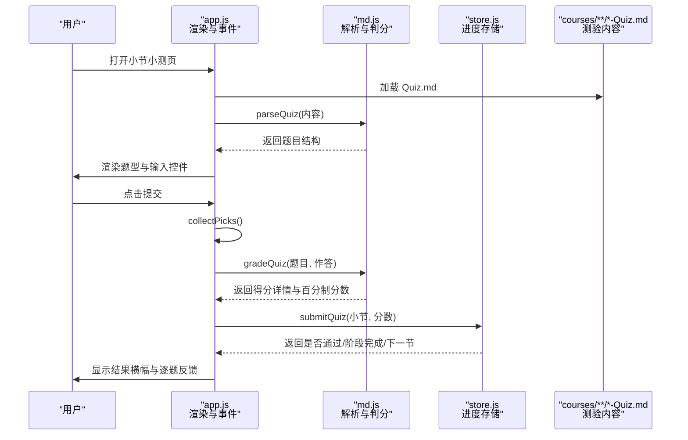
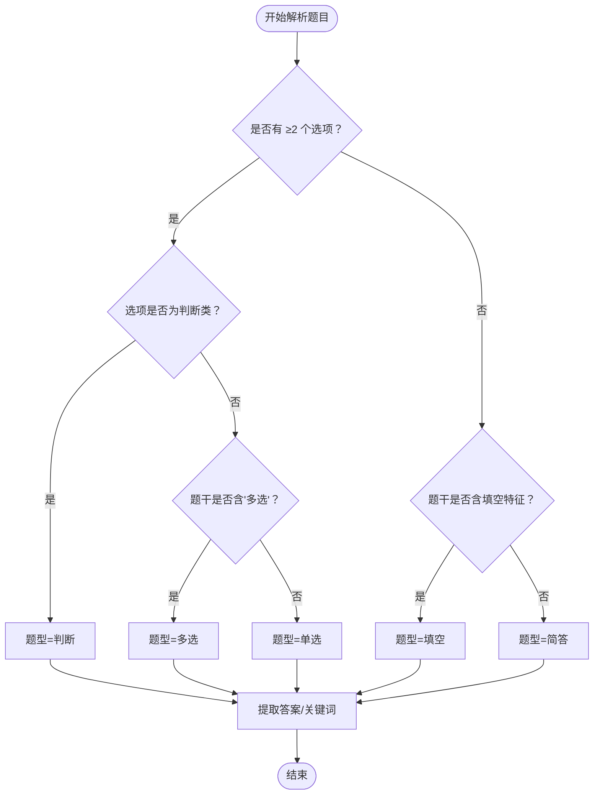
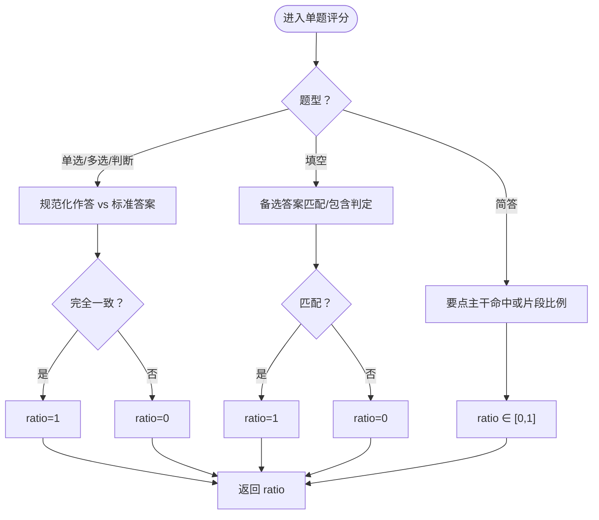
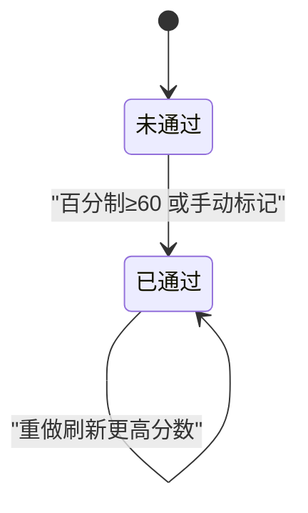
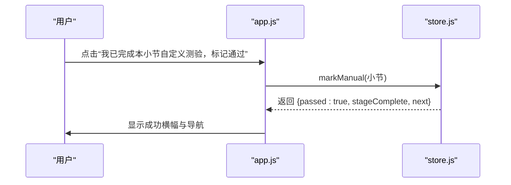
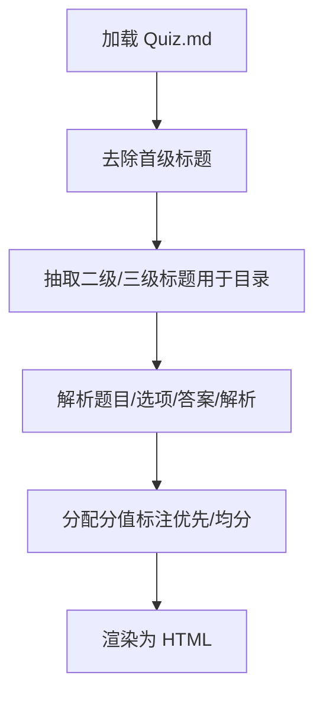
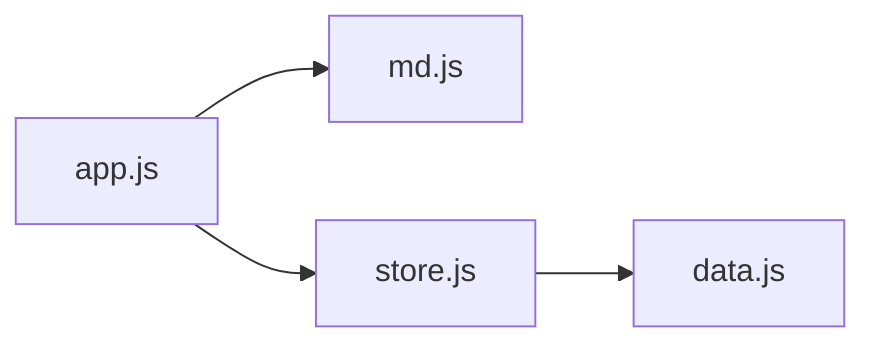

# 测验系统详解

<cite>
**本文引用的文件**   
- [README.md](file://README.md)
- [assets/js/app.js](file://assets/js/app.js)
- [assets/js/md.js](file://assets/js/md.js)
- [assets/js/store.js](file://assets/js/store.js)
- [courses/argocd/s1/S1-2-Quiz.md](file://courses/argocd/s1/S1-2-Quiz.md)
</cite>

## 目录
1. [引言](#引言)
2. [项目结构](#项目结构)
3. [核心组件](#核心组件)
4. [架构总览](#架构总览)
5. [详细组件分析](#详细组件分析)
6. [依赖关系分析](#依赖关系分析)
7. [性能与可扩展性](#性能与可扩展性)
8. [故障排除指南](#故障排除指南)
9. [结论](#结论)
10. [附录：题型语法规范与示例路径](#附录题型语法规范与示例路径)

## 引言
本文件面向“大Java后端学习平台”的测验子系统，目标是帮助初学者理解测验的学习价值，同时为开发者提供完整的实现细节、判分算法、状态管理与扩展方法。平台采用纯前端静态站点架构，测验内容以 Markdown 编写，由自研解析器解析并自动判分；未匹配约定格式的自定义测验支持手动标记完成。

## 项目结构
测验系统涉及三个关键层：
- 视图与交互层：路由、页面渲染、事件处理（app.js）
- 内容与解析层：Markdown 渲染、测验解析、判分（md.js）
- 状态与进度层：localStorage 持久化、通关判定、阶段解锁（store.js）

图表来源
- [assets/js/app.js:241-401](file://assets/js/app.js#L241-L401)
- [assets/js/md.js:168-337](file://assets/js/md.js#L168-L337)
- [assets/js/store.js:71-99](file://assets/js/store.js#L71-L99)

章节来源
- [README.md:13-37](file://README.md#L13-L37)
- [README.md:130-143](file://README.md#L130-L143)

## 核心组件
- 测验解析器（parseQuiz）
  - 从 Markdown 中抽取题目、选项、答案、关键词与解析。
  - 自动识别题型：单选、多选、判断、填空、简答。
  - 分值策略：题干标注则按标注分配；否则平均分配满分 100。
- 判分引擎（gradeQuestion / gradeQuiz）
  - 客观题精确匹配；主观题按参考答案要点主干命中或片段比例给分。
  - 卷面总分归一到百分制，≥60 分通过。
- 状态管理（submitQuiz / markManual）
  - 提交成绩后更新 localStorage，记录最高分、是否通过、时间戳。
  - 自定义格式测验可手动标记完成，不自动计分但可解锁下一节。
- 视图与交互（renderQuiz / collectPicks / 事件委托）
  - 渲染不同题型输入控件，收集作答，展示每题结果与解析。
  - 统一横幅提示是否通过、是否解锁下一节、阶段完成情况。

章节来源
- [assets/js/md.js:168-337](file://assets/js/md.js#L168-L337)
- [assets/js/store.js:71-99](file://assets/js/store.js#L71-L99)
- [assets/js/app.js:241-401](file://assets/js/app.js#L241-L401)

## 架构总览
测验系统的端到端流程如下：

图表来源
- [assets/js/app.js:248-390](file://assets/js/app.js#L248-L390)
- [assets/js/md.js:193-337](file://assets/js/md.js#L193-L337)
- [assets/js/store.js:71-86](file://assets/js/store.js#L71-L86)

## 详细组件分析

### 题型支持与解析逻辑
- 选择题（单选/多选/判断）
  - 识别规则：存在 ≥2 个选项行（如 `- A. ...`），且选项文本均为“正确/错误/对/错/√/×/true/false”时视为判断题；否则根据题干是否含“多选”区分单选或多选。
  - 答案格式：字母串（如 `ABD`），解析器会去分隔符、转大写、排序后标准化。
- 填空题
  - 识别规则：题干包含下划线（`___`）或关键词“填空/填写/补全/每个空/下划线”。
  - 答案格式：多个可接受答案用 `/`、`|`、`；`、`／` 等分隔；判分时允许完全相等、包含或被包含匹配。
- 简答题
  - 识别规则：非选择题且无填空特征。
  - 答案格式：优先使用“参考答案”后的要点列表（每行一个要点），否则按 `|` 或全文拆分出关键词；判分时先尝试主干命中，再按片段命中率计算部分分。

图表来源
- [assets/js/md.js:232-263](file://assets/js/md.js#L232-L263)

章节来源
- [assets/js/md.js:168-284](file://assets/js/md.js#L168-L284)

### 自动判分算法
- 客观题判分
  - 将用户作答规范化（去分隔符、大写、排序）后与标准答案严格比较，完全一致得满分，否则不得分。
- 主观题判分
  - 填空题：若提供多个备选答案，任一匹配即满分；否则按包含关系判定。
  - 简答题：
    - 若定义了要点列表，则以要点为单位打分；否则按答案中的 `|` 切分出的关键词打分。
    - 先尝试“主干命中”（括号前主体），命中计 1；否则按片段命中率（词元匹配数/词元总数）计算部分分。
- 卷面总分与百分制折算
  - 各题 maxScore 之和为卷面满分；实际得分累加后除以卷面满分，乘以 100 得到百分制分数。
  - 百分制 ≥60 即为通过。

图表来源
- [assets/js/md.js:301-324](file://assets/js/md.js#L301-L324)
- [assets/js/md.js:329-337](file://assets/js/md.js#L329-L337)

章节来源
- [assets/js/md.js:286-337](file://assets/js/md.js#L286-L337)

### 及格标准与通关机制
- 及格线：百分制 ≥60 分。
- 通关效果：
  - 小节通过：记录最高分、通过标志、时间戳。
  - 阶段完成：同包内所有小节通过后，阶段自动标记完成。
  - 解锁下一节：当前小节通过后，自动解锁同包顺序的下一小节。
- 手动标记完成：
  - 当测验无法解析为自动判分的题目时，提供“我已完成本小节自定义测验，标记通过”按钮。
  - 手动标记后，小节直接通过，但不计入自动判分分数（score 为空）。

图表来源
- [assets/js/store.js:71-99](file://assets/js/store.js#L71-L99)
- [assets/js/app.js:255-263](file://assets/js/app.js#L255-L263)

章节来源
- [assets/js/store.js:71-99](file://assets/js/store.js#L71-L99)
- [assets/js/app.js:248-294](file://assets/js/app.js#L248-L294)

### 手动标记完成功能
- 触发条件：测验 Markdown 未解析出任何可自动判分的题目（questions 为空）。
- 交互流程：
  - 渲染“我已完成本小节自定义测验，标记通过”按钮。
  - 点击后调用 store.markManual，设置 passed=true、manual=true、score=null。
  - 显示成功横幅，并根据阶段完成与下一节解锁情况给出导航。

图表来源
- [assets/js/app.js:345-351](file://assets/js/app.js#L345-L351)
- [assets/js/store.js:90-99](file://assets/js/store.js#L90-L99)

章节来源
- [assets/js/app.js:255-263](file://assets/js/app.js#L255-L263)
- [assets/js/app.js:345-401](file://assets/js/app.js#L345-L401)
- [assets/js/store.js:90-99](file://assets/js/store.js#L90-L99)

### Markdown 解析器与测验内容规范
- 标题与正文
  - 支持标题、段落、列表、表格、代码块、引用、粗斜体、行内代码、链接、分隔线。
  - 自动去除首级标题，避免与页面头部重复。
- 站内链接转换
  - 相对 `.md` 链接会被转换为站点 hash 路由，使跨课文互链指向渲染后的课程页。
- 测验内容语法
  - 题目以三级标题开头：`### 序号. 题干（可选：分值）`
  - 选项行：`- A. 选项文本`（至少两个选项才被视为选择题）
  - 答案与解析：
    - 行内：`> 答案：...` 或 `> 参考答案：...`
    - 末尾统一段：`## 答案` 下列表形式逐题给出答案
    - 可选：`> 解析：...`
  - 主观题参考答案：
    - 要点列表：在答案后以无序列表项列出要点，每个条目为一个得分关键词
    - 多答案分隔：`/`、`|`、`；`、`／`
- 分值分配
  - 题干显式标注分值则按标注分配；否则全卷平均分摊 100 分。

图表来源
- [assets/js/md.js:51-59](file://assets/js/md.js#L51-L59)
- [assets/js/md.js:62-150](file://assets/js/md.js#L62-L150)
- [assets/js/md.js:193-284](file://assets/js/md.js#L193-L284)

章节来源
- [assets/js/md.js:1-166](file://assets/js/md.js#L1-L166)
- [assets/js/md.js:168-284](file://assets/js/md.js#L168-L284)

## 依赖关系分析
- app.js 依赖 md.js 的 renderMarkdown、parseQuiz、stripTitle、renderInline、gradeQuiz。
- app.js 依赖 store.js 的进度查询与写入接口。
- md.js 提供纯函数式解析与判分，无外部运行时依赖。
- store.js 依赖 data.js 的结构索引（INDEX、secKey）进行进度键映射。

图表来源
- [assets/js/app.js:1-6](file://assets/js/app.js#L1-L6)
- [assets/js/store.js:1-3](file://assets/js/store.js#L1-L3)

章节来源
- [assets/js/app.js:1-6](file://assets/js/app.js#L1-L6)
- [assets/js/store.js:1-3](file://assets/js/store.js#L1-L3)

## 性能与可扩展性
- 性能特性
  - 解析与判分为纯函数，复杂度与题目数量线性相关；单次提交开销极低。
  - Markdown 渲染缓存于内存 Map，避免重复 fetch 与解析。
- 可扩展点
  - 新增题型：在 parseQuiz 与 gradeQuestion 中扩展识别与评分逻辑。
  - 自定义判分策略：替换 gradeQuestion 的实现，保留接口契约（返回 0~1 的比例）。
  - 主题与样式：通过 CSS 变量与 app.js 的事件委托扩展交互体验。
  - 进度文件：支持导入导出 Markdown 进度文件，便于跨设备恢复与 Git 打卡。

[本节为通用指导，不涉及具体文件分析]

## 故障排除指南
- 测验无法自动判分
  - 现象：页面显示“自定义格式”，并提供“我已完成...”按钮。
  - 原因：未解析出任何可自动判分的题目（缺少选项或答案）。
  - 解决：确保题目满足“三级标题 + 选项行 + 答案/参考答案”的语法；或使用“## 答案”末尾段。
  - 参考路径：[assets/js/app.js:255-263](file://assets/js/app.js#L255-L263)、[assets/js/md.js:193-284](file://assets/js/md.js#L193-L284)
- 主观题得分偏低
  - 现象：简答题部分命中但未得满分。
  - 原因：参考答案要点未命中主干，仅片段命中。
  - 解决：优化参考答案要点，使其更贴近常见表述；或在题干中明确关键词。
  - 参考路径：[assets/js/md.js:313-324](file://assets/js/md.js#L313-L324)
- 多选题判分异常
  - 现象：选择顺序不同导致判错。
  - 原因：解析器已对答案与作答进行排序与标准化，应检查答案字母是否正确。
  - 解决：核对答案字母与选项对应关系。
  - 参考路径：[assets/js/md.js:251-252](file://assets/js/md.js#L251-L252)、[assets/js/md.js:303-305](file://assets/js/md.js#L303-L305)
- 通关与解锁异常
  - 现象：通过小测后下一节仍锁定。
  - 原因：上一节未通过或未达 60 分；或手动标记未完成。
  - 解决：确认上一节通过状态与分数；必要时重新提交或手动标记。
  - 参考路径：[assets/js/store.js:33-45](file://assets/js/store.js#L33-L45)、[assets/js/store.js:71-86](file://assets/js/store.js#L71-L86)
- 进度文件导入失败
  - 现象：导入 progress.md 后无变化。
  - 原因：列序或键名不匹配；小节键不存在于 INDEX。
  - 解决：检查表格列序（小节键 | 标题 | 分数 | 状态 | 时间），并确保小节键存在于 data.js。
  - 参考路径：[assets/js/store.js:142-164](file://assets/js/store.js#L142-L164)

章节来源
- [assets/js/app.js:255-263](file://assets/js/app.js#L255-L263)
- [assets/js/md.js:251-324](file://assets/js/md.js#L251-L324)
- [assets/js/store.js:33-45](file://assets/js/store.js#L33-L45)
- [assets/js/store.js:71-86](file://assets/js/store.js#L71-L86)
- [assets/js/store.js:142-164](file://assets/js/store.js#L142-L164)

## 结论
测验系统以轻量、零依赖的前端实现提供了完整的测验解析、判分与状态管理能力。它既支持标准化的自动判分题型，也兼容自定义格式的手动标记完成；通过清晰的 Markdown 语法规范与稳健的判分算法，学习者可以循序渐进地掌握知识点，开发者则可基于现有接口快速扩展新的题型与判分策略。

[本节为总结性内容，不涉及具体文件分析]

## 附录：题型语法规范与示例路径
- 题型语法要点
  - 题目标题：`### 序号. 题干（可选：分值）`
  - 选项行：`- A. 选项文本`（≥2 个选项）
  - 答案与解析：
    - 行内：`> 答案：...` 或 `> 参考答案：...`
    - 末尾段：`## 答案` 下列表逐项给出答案
    - 可选：`> 解析：...`
  - 主观题参考答案：
    - 要点列表：每行一个要点
    - 多答案分隔：`/`、`|`、`；`、`／`
- 示例文件路径
  - [courses/argocd/s1/S1-2-Quiz.md](file://courses/argocd/s1/S1-2-Quiz.md)

章节来源
- [assets/js/md.js:168-284](file://assets/js/md.js#L168-L284)
- [courses/argocd/s1/S1-2-Quiz.md:1-100](file://courses/argocd/s1/S1-2-Quiz.md#L1-L100)