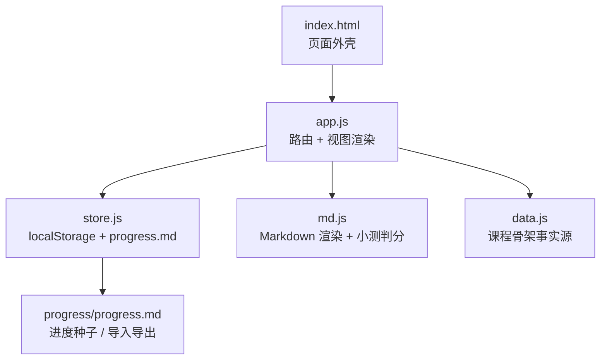
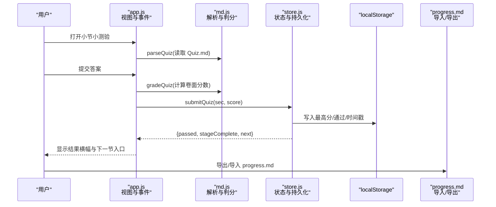
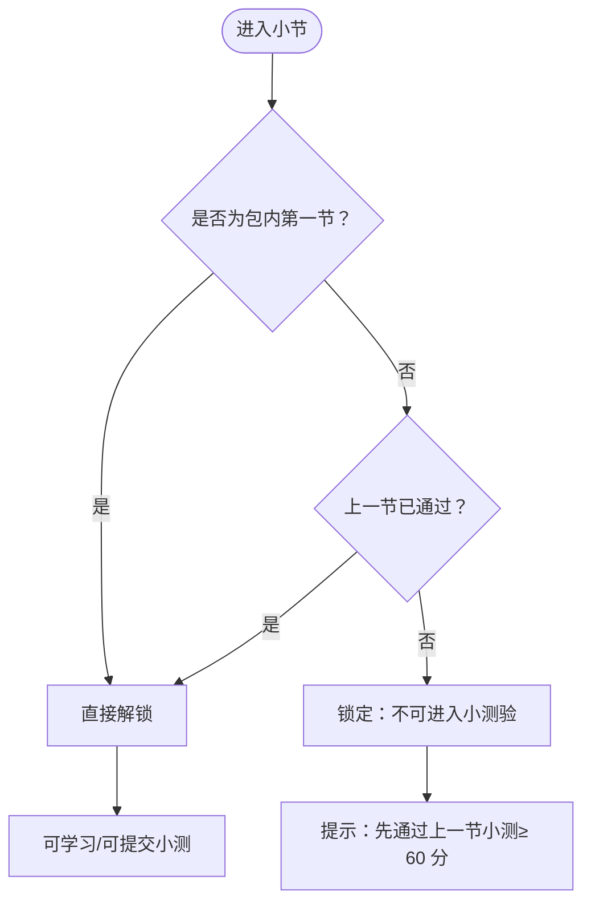
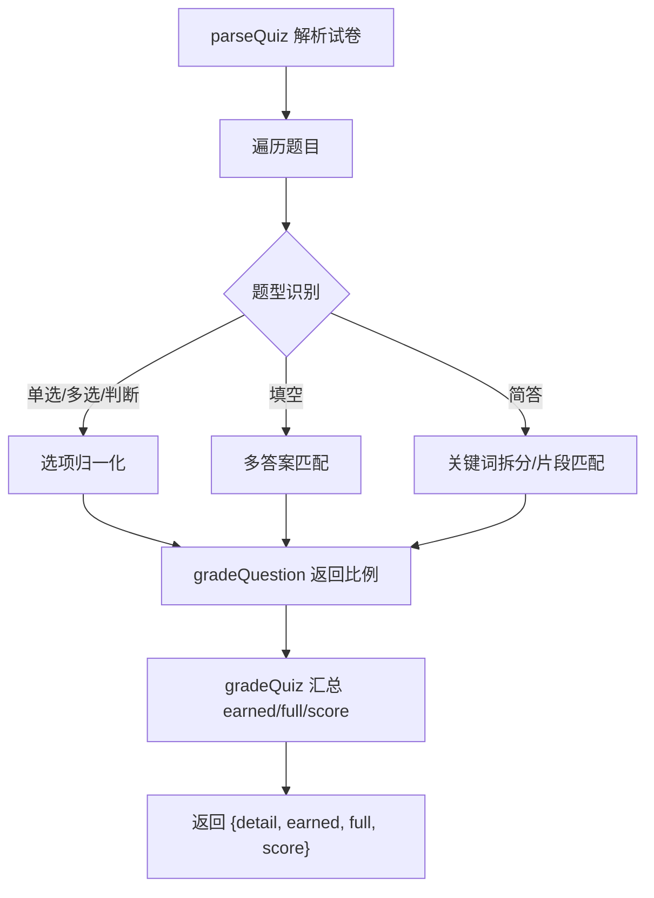
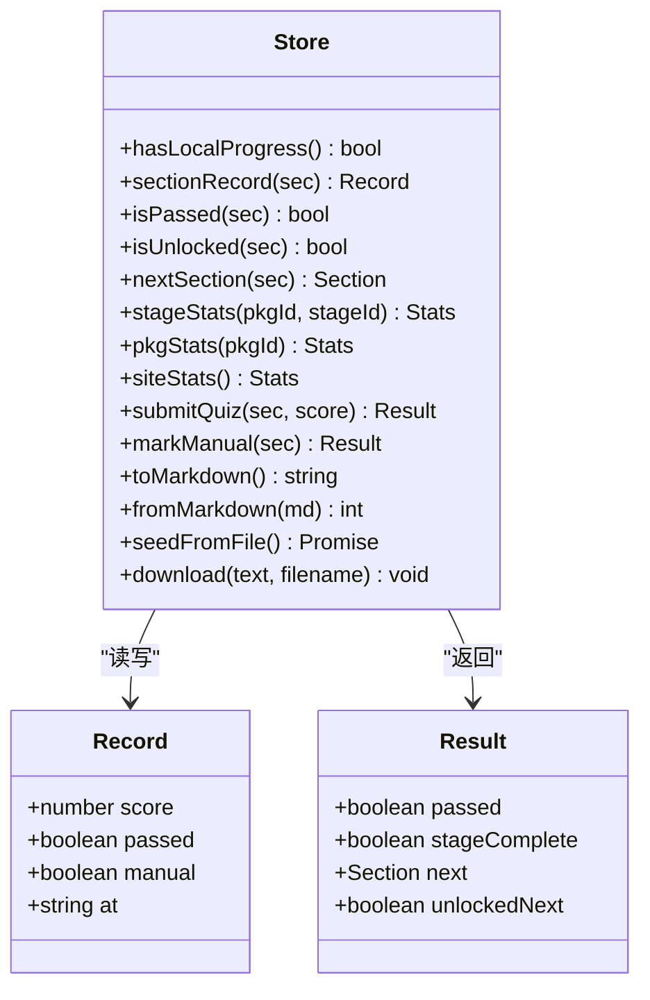
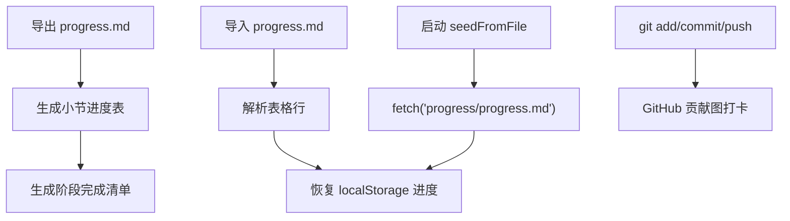
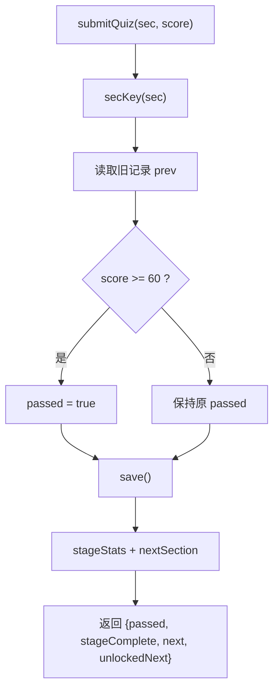
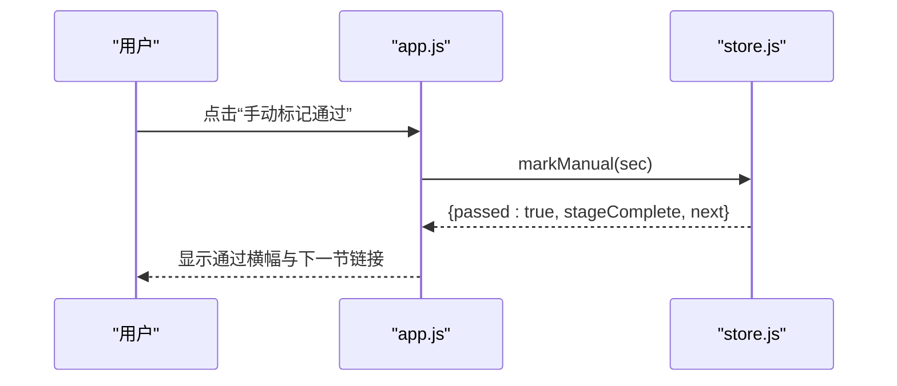
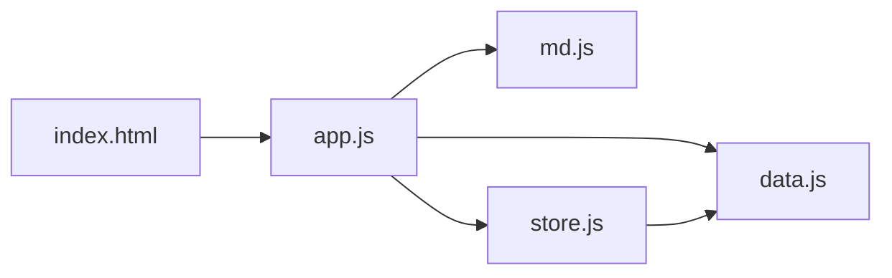

# 过关卡系统详解

<cite>
**本文引用的文件**   
- [README.md](file://README.md)
- [index.html](file://index.html)
- [assets/js/app.js](file://assets/js/app.js)
- [assets/js/store.js](file://assets/js/store.js)
- [assets/js/md.js](file://assets/js/md.js)
- [assets/js/data.js](file://assets/js/data.js)
- [progress/progress.md](file://progress/progress.md)
</cite>

## 目录
1. [引言](#引言)
2. [项目结构](#项目结构)
3. [核心组件](#核心组件)
4. [架构总览](#架构总览)
5. [详细组件分析](#详细组件分析)
6. [依赖关系分析](#依赖关系分析)
7. [性能与扩展性](#性能与扩展性)
8. [故障排除指南](#故障排除指南)
9. [结论](#结论)

## 引言
本文件系统性地解析大 Java 后端学习平台的“过关卡”机制：如何通过小测验成绩自动解锁下一节、同包内顺序解锁与跨包不互锁的设计、进度在浏览器本地存储与 Markdown 文件的导入导出、以及 GitHub 打卡集成的实现方式。文档同时为初学者解释“过关制学习”的价值，并为开发者提供可落地的状态管理逻辑、关键算法路径和扩展建议。

## 项目结构
平台采用纯前端静态站点架构：路由、渲染、进度、Markdown 解析全部由原生 ES Module 完成；课程内容以 Markdown 组织，骨架数据唯一来源于 `assets/js/data.js`。

**图示来源**
- [index.html:35-45](file://index.html#L35-L45)
- [assets/js/app.js:1-6](file://assets/js/app.js#L1-L6)
- [assets/js/store.js:1-6](file://assets/js/store.js#L1-L6)
- [assets/js/md.js:1-6](file://assets/js/md.js#L1-L6)
- [assets/js/data.js:1-8](file://assets/js/data.js#L1-L8)
- [progress/progress.md:1-8](file://progress/progress.md#L1-L8)

**章节来源**
- [README.md:13-37](file://README.md#L13-L37)
- [README.md:130-143](file://README.md#L130-L143)
- [README.md:145-170](file://README.md#L145-L170)

## 核心组件
- 路由与视图层（app.js）：负责首页、课程包、小节、小测验、作业题、面试题、学习地图与进度页的渲染；处理点击事件、导航与提示。
- 进度与状态层（store.js）：维护 localStorage 主存储、解锁判定、阶段/包统计、提交小测得分、手动标记通过、主题、Markdown 进度导入导出与启动时播种。
- 内容解析层（md.js）：自写 Markdown 渲染器与小测验解析器，支持单选、多选、判断、填空、简答等题型，并输出百分制分数。
- 骨架数据层（data.js）：定义分区 → 课程包 → 阶段 → 小节的全局树，驱动首页卡片、地图与解锁链路。
- 进度种子（progress/progress.md）：仓库自带 Markdown 进度文件，首次访问且无本地进度时自动恢复。

**章节来源**
- [assets/js/app.js:1-6](file://assets/js/app.js#L1-L6)
- [assets/js/store.js:1-6](file://assets/js/store.js#L1-L6)
- [assets/js/md.js:1-6](file://assets/js/md.js#L1-L6)
- [assets/js/data.js:1-8](file://assets/js/data.js#L1-L8)
- [progress/progress.md:1-8](file://progress/progress.md#L1-L8)

## 架构总览
过关卡系统的核心流程如下：用户进入小节小测验 → 解析试卷 → 收集作答 → 判分 → 根据是否 ≥ 60 分更新通过状态 → 若通过则解锁下一节 → 同步阶段完成度 → 持久化到 localStorage → 可选导出为 Markdown 并提交至 Git 形成打卡记录。

**图示来源**
- [assets/js/app.js:248-294](file://assets/js/app.js#L248-L294)
- [assets/js/app.js:320-390](file://assets/js/app.js#L320-L390)
- [assets/js/md.js:193-284](file://assets/js/md.js#L193-L284)
- [assets/js/md.js:328-337](file://assets/js/md.js#L328-L337)
- [assets/js/store.js:71-86](file://assets/js/store.js#L71-L86)
- [assets/js/store.js:110-183](file://assets/js/store.js#L110-L183)

## 详细组件分析

### 解锁规则与顺序控制
- 同包顺序解锁：同一课程包内的阶段和小节按固定顺序排列；只有前一节已通过，当前节才解锁。
- 跨包不互锁：不同课程包之间完全独立，互不影响。
- 首节默认解锁：每包第一个小节无需前置条件即可学习。
- 未通过时的行为：小测验 < 60 分时不会解锁下一节，但允许重做。

**图示来源**
- [assets/js/store.js:28-39](file://assets/js/store.js#L28-L39)
- [assets/js/app.js:133-150](file://assets/js/app.js#L133-L150)
- [assets/js/app.js:185-192](file://assets/js/app.js#L185-L192)

**章节来源**
- [assets/js/store.js:28-45](file://assets/js/store.js#L28-L45)
- [assets/js/app.js:133-150](file://assets/js/app.js#L133-L150)
- [assets/js/app.js:185-192](file://assets/js/app.js#L185-L192)

### 小测验解析与判分
- 题型支持：单选、多选、判断、填空、简答。
- 分值策略：题干可标注分值；未标注则全卷平均分摊 100 分。
- 主观题评分：简答题按参考答案要点主干命中计满分，否则按片段命中率给部分分；填空题允许多个可接受答案。
- 百分制折算：逐题精确得分累加后折算为百分制，避免多次四舍五入导致溢出。

**图示来源**
- [assets/js/md.js:193-284](file://assets/js/md.js#L193-L284)
- [assets/js/md.js:301-337](file://assets/js/md.js#L301-L337)

**章节来源**
- [assets/js/md.js:168-284](file://assets/js/md.js#L168-L284)
- [assets/js/md.js:301-337](file://assets/js/md.js#L301-L337)

### 进度追踪与状态管理
- 主存储键：`bjb.progress.v1`，JSON 对象，键为小节键，值为 `{score, passed, manual, at}`。
- 主题键：`bjb.theme`，用于深色/护眼/藏青/纸白主题切换。
- 通关阈值：PASS_LINE = 60。
- 时间戳：ISO 字符串前 16 位（不含 T），便于人类阅读。
- 阶段完成：当包内某阶段所有小节均通过时，阶段标记为完成。
- 包/全站统计：基于已通过的记录与骨架索引计算。

**图示来源**
- [assets/js/store.js:4-18](file://assets/js/store.js#L4-L18)
- [assets/js/store.js:20-67](file://assets/js/store.js#L20-L67)
- [assets/js/store.js:71-99](file://assets/js/store.js#L71-L99)
- [assets/js/store.js:108-183](file://assets/js/store.js#L108-L183)

**章节来源**
- [assets/js/store.js:4-18](file://assets/js/store.js#L4-L18)
- [assets/js/store.js:20-67](file://assets/js/store.js#L20-L67)
- [assets/js/store.js:71-99](file://assets/js/store.js#L71-L99)
- [assets/js/store.js:108-183](file://assets/js/store.js#L108-L183)

### Markdown 进度文件导入导出与 GitHub 打卡
- 导出：生成可读 Markdown 表格，包含小节键、标题、最高分、状态、最后提交时间，以及阶段完成情况清单。
- 导入：解析 Markdown 表格行，兼容手写大小写差异，恢复进度到 localStorage。
- 启动播种：首次访问且无本地进度时，尝试从 `progress/progress.md` 恢复。
- GitHub 打卡：将导出的 `progress.md` 提交回仓库并 push，GitHub 贡献图即呈现逐日打卡。

**图示来源**
- [assets/js/store.js:110-183](file://assets/js/store.js#L110-L183)
- [assets/js/app.js:454-470](file://assets/js/app.js#L454-L470)
- [assets/js/app.js:515-521](file://assets/js/app.js#L515-L521)
- [README.md:80-87](file://README.md#L80-L87)

**章节来源**
- [assets/js/store.js:110-183](file://assets/js/store.js#L110-L183)
- [assets/js/app.js:454-470](file://assets/js/app.js#L454-L470)
- [assets/js/app.js:515-521](file://assets/js/app.js#L515-L521)
- [README.md:80-87](file://README.md#L80-L87)

### 关键算法与状态更新逻辑
- 解锁判定：
  - 获取包内有序小节列表。
  - 若当前小节索引 ≤ 0，视为首节，直接解锁。
  - 否则检查前一节是否已通过。
- 下一节查找：
  - 在当前包有序列表中查找当前小节索引，返回其后一个元素。
- 提交小测：
  - 比较 score 与 PASS_LINE，更新最高分与 passed。
  - 更新时间戳 at。
  - 计算阶段完成度与下一节，返回结果供 UI 展示。

**图示来源**
- [assets/js/store.js:71-86](file://assets/js/store.js#L71-L86)
- [assets/js/store.js:28-45](file://assets/js/store.js#L28-L45)

**章节来源**
- [assets/js/store.js:71-86](file://assets/js/store.js#L71-L86)
- [assets/js/store.js:28-45](file://assets/js/store.js#L28-L45)

### 自定义格式小测的手动通过
- 当小测验无法解析出标准题型时，UI 提供“我已完成本小节自定义测验，标记通过”按钮。
- 调用 `markManual`，设置 `manual=true`，`passed=true`，保留已有最高分或置空。
- 同样触发阶段完成检测与下一节解锁。

**图示来源**
- [assets/js/app.js:255-263](file://assets/js/app.js#L255-L263)
- [assets/js/app.js:345-351](file://assets/js/app.js#L345-L351)
- [assets/js/store.js:90-99](file://assets/js/store.js#L90-L99)

**章节来源**
- [assets/js/app.js:255-263](file://assets/js/app.js#L255-L263)
- [assets/js/app.js:345-351](file://assets/js/app.js#L345-L351)
- [assets/js/store.js:90-99](file://assets/js/store.js#L90-L99)

## 依赖关系分析
- app.js 依赖 data.js（骨架）、md.js（渲染与判分）、store.js（进度）。
- store.js 依赖 data.js（索引与统计）。
- md.js 独立于其他模块，仅暴露解析与判分 API。
- index.html 作为唯一页面外壳加载 app.js。

**图示来源**
- [index.html:45-45](file://index.html#L45-L45)
- [assets/js/app.js:1-6](file://assets/js/app.js#L1-L6)
- [assets/js/store.js:1-3](file://assets/js/store.js#L1-L3)

**章节来源**
- [index.html:35-45](file://index.html#L35-L45)
- [assets/js/app.js:1-6](file://assets/js/app.js#L1-L6)
- [assets/js/store.js:1-3](file://assets/js/store.js#L1-L3)

## 性能与扩展性
- 性能特性：
  - 进度读写为轻量 JSON，localStorage 操作开销极低。
  - Markdown 渲染与判分为纯函数，复杂度与题目数量线性相关。
  - 构建产物为纯静态资源，部署简单，无后端瓶颈。
- 扩展建议：
  - 新增课程：仅在 data.js 中补充骨架，运行脚手架脚本补齐占位文件。
  - 新增题型：在 md.js 的 parseQuiz/gradeQuestion 中扩展识别与评分逻辑。
  - 扩展进度字段：在 store.js 的 Record 结构与 toMarkdown/fromMarkdown 中同步扩展。
  - 引入服务端：如需跨设备同步，可将 progress.md 替换为后端 API，但需保持现有 Markdown 契约以便迁移。

[本节为通用指导，不直接分析具体文件]

## 故障排除指南
- 小节始终未解锁：
  - 检查前一节是否已通过（≥ 60 分或手动标记通过）。
  - 确认当前小节在同包中的顺序位置。
  - 查看 localStorage 中对应小节记录的 passed 与 score。
- 小测验无法判分：
  - 确认 Quiz.md 是否符合约定格式（题干带分值或全卷平均分配，选项/答案/解析存在）。
  - 若为自定义格式，使用“手动标记通过”。
- 进度丢失：
  - 检查浏览器是否清除了 localStorage。
  - 使用进度页导入之前导出的 progress.md。
- 导入进度无效：
  - 检查 Markdown 表格列序与小节键是否与 data.js 一致。
  - 注意小节键大小写兼容逻辑。
- 主题不生效：
  - 检查 localStorage 中 bjb.theme 值是否正确。
  - 确认页面初始化时应用了 getTheme/setTheme。

**章节来源**
- [assets/js/store.js:20-39](file://assets/js/store.js#L20-L39)
- [assets/js/store.js:71-99](file://assets/js/store.js#L71-L99)
- [assets/js/store.js:110-183](file://assets/js/store.js#L110-L183)
- [assets/js/app.js:185-192](file://assets/js/app.js#L185-L192)
- [assets/js/app.js:255-263](file://assets/js/app.js#L255-L263)

## 结论
过关卡系统以“小测验 ≥ 60 分解锁下一节”为核心规则，结合“同包顺序解锁、跨包不互锁”的结构设计，既保证学习路径的循序渐进，又赋予学习者灵活选择课程包的自由。进度以 localStorage 为主、Markdown 为辅，兼顾本地体验与跨设备恢复；配合 GitHub 提交即可形成可视化打卡记录。对开发者而言，该体系职责清晰、扩展点明确，可在不改动框架的前提下持续扩充课程内容与题型能力。

[本节为总结性内容，不直接分析具体文件]