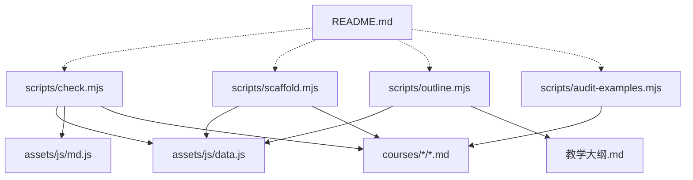
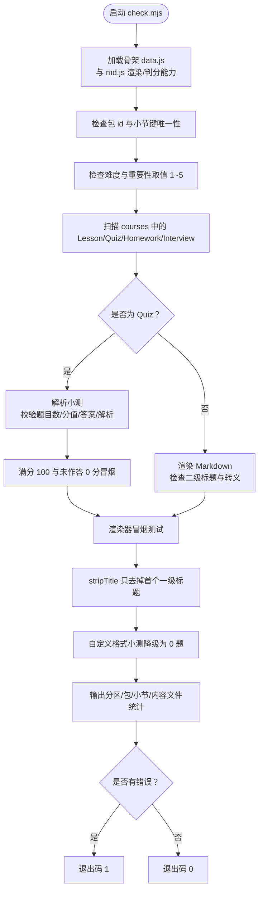
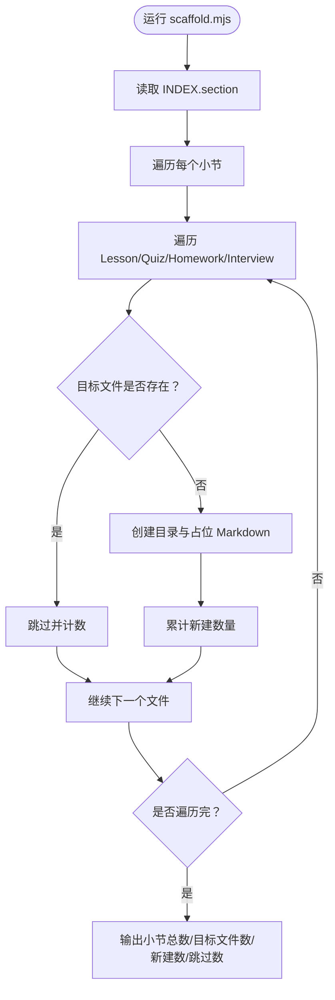
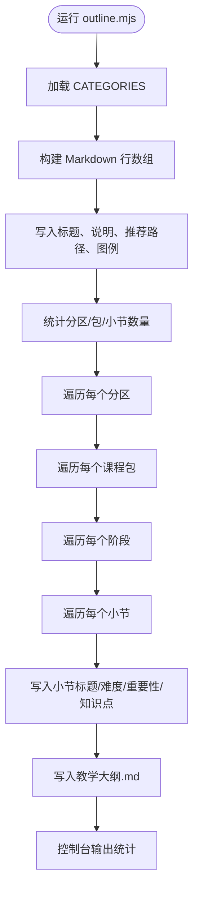
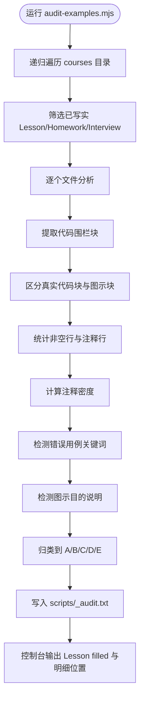
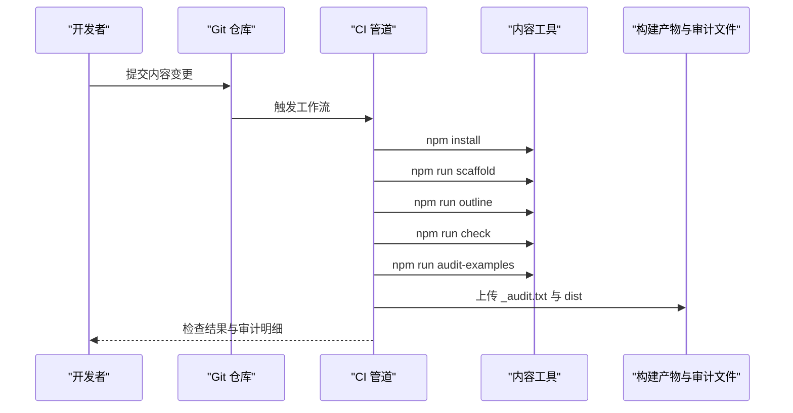
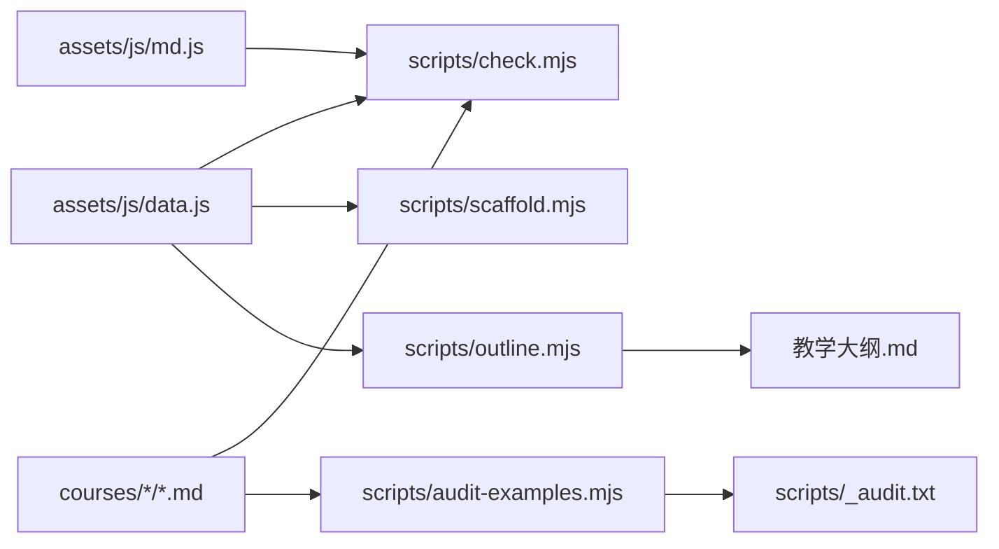

# 内容工具

<cite>
**本文引用的文件**   
- [scripts/check.mjs](file://scripts/check.mjs)
- [scripts/scaffold.mjs](file://scripts/scaffold.mjs)
- [scripts/outline.mjs](file://scripts/outline.mjs)
- [scripts/audit-examples.mjs](file://scripts/audit-examples.mjs)
- [README.md](file://README.md)
</cite>

## 目录
1. [引言](#引言)
2. [项目结构与工具总览](#项目结构与工具总览)
3. [核心工具清单与定位](#核心工具清单与定位)
4. [check.mjs：结构与内容自检](#checkmjs结构与内容自检)
5. [scaffold.mjs：课程骨架脚手架](#scaffolddotmjs课程骨架脚手架)
6. [outline.mjs：教学大纲生成器](#outlinemjs教学大纲生成器)
7. [audit-examples.mjs：例子程序审计工具](#audit-examplesmjs例子程序审计工具)
8. [命令行参数、输出格式与退出码](#命令行参数输出格式与退出码)
9. [错误处理与故障排除指南](#错误处理与故障排除指南)
10. [自动化工作流与 CI/CD 集成建议](#自动化工作流与-cicd-集成建议)
11. [依赖关系与架构视图](#依赖关系与架构视图)
12. [结论](#结论)

## 引言
本仓库是一个以“可运行、可打卡、可扩展”为目标的 Java 后端学习平台。其内容体系由唯一骨架事实源 `assets/js/data.js` 驱动，课程内容以 Markdown 形式组织在 `courses/` 下，每个小节包含课文、小测、作业和面试题四件套。

本文聚焦 `scripts/` 目录中的四个核心内容工具：
- `check.mjs`：结构与内容自检，保障骨架一致性、小节 ID 唯一性、难度与重要性取值合法、小测可解析判分、Markdown 渲染冒烟测试通过。
- `scaffold.mjs`：根据骨架数据批量生成缺失的 Lesson / Quiz / Homework / Interview 占位文件。
- `outline.mjs`：从骨架数据自动生成《教学大纲.md》，作为全站内容结构总纲。
- `audit-examples.mjs`：审计已写实课文、作业、面试题中的例子程序，检查注释密度、错误用例覆盖和图示说明。

这些工具共同构成内容生产、校验与质量门禁的基础设施。

## 项目结构与工具总览
仓库中与内容工具直接相关的结构如下：
- `scripts/`：Node ESM 脚本集合，提供脚手架、大纲生成、内容自检与例子审计能力。
- `assets/js/data.js`：站点骨架事实源，定义分区、课程包、阶段与小节元组。
- `assets/js/md.js`：自写 Markdown 渲染器与小测解析、判分逻辑，被 `check.mjs` 复用。
- `courses/`：真实课程内容，按 `<包id>/<阶段id>/Sx-y-{Lesson,Quiz,Homework,Interview}.md` 组织。
- `README.md`：说明 npm 脚本入口、开发构建流程、内容扩展方式与例子程序规范。

**图表来源**
- [scripts/check.mjs:1-119](file://scripts/check.mjs#L1-L119)
- [scripts/scaffold.mjs:1-55](file://scripts/scaffold.mjs#L1-L55)
- [scripts/outline.mjs:1-69](file://scripts/outline.mjs#L1-L69)
- [scripts/audit-examples.mjs:1-71](file://scripts/audit-examples.mjs#L1-L71)
- [README.md:145-170](file://README.md#L145-L170)

**章节来源**
- [README.md:145-170](file://README.md#L145-L170)

## 核心工具清单与定位
| 工具 | 主要职责 | 输入 | 输出 | 典型使用场景 |
|---|---|---|---|---|
| `check.mjs` | 骨架完整性、ID 唯一性、难度与重要性取值、小测解析与判分、Markdown 渲染冒烟 | `assets/js/data.js`、`courses/**/*.md` | 控制台统计与失败信息；退出码 0 或 1 | 提交前自检、CI 质量门禁 |
| `scaffold.mjs` | 为所有小节补齐缺失的四件套 Markdown 占位 | `assets/js/data.js` | 新建 `courses/<包>/<阶段>/Sx-y-{Lesson,Quiz,Homework,Interview}.md` | 新增骨架后批量补文件 |
| `outline.mjs` | 从骨架生成《教学大纲.md》 | `assets/js/data.js` | `教学大纲.md` | 维护课程结构总纲、对齐重要级详略 |
| `audit-examples.mjs` | 审计已写实课文、作业、面试题中的例子程序 | `courses/**/*-Lesson.md`、`-Homework.md`、`-Interview.md` | 控制台摘要 + `scripts/_audit.txt` | 回填例子程序注释、错误用例、图示目的 |

**章节来源**
- [scripts/check.mjs:1-119](file://scripts/check.mjs#L1-L119)
- [scripts/scaffold.mjs:1-55](file://scripts/scaffold.mjs#L1-L55)
- [scripts/outline.mjs:1-69](file://scripts/outline.mjs#L1-L69)
- [scripts/audit-examples.mjs:1-71](file://scripts/audit-examples.mjs#L1-L71)

## check.mjs：结构与内容自检
`check.mjs` 是内容质量的核心守门员。它同时做两件事：
1. 校验骨架与目录结构：包 ID 唯一、小节键唯一、难度与重要性取值在 1~5。
2. 校验内容文件：小测可解析、分值合计为 100、答案格式合法、未作答得 0 分、满分可得 100；非小测 Markdown 必须能渲染出二级标题且不被转义；渲染器本身做冒烟测试。

### 关键检查项
- **包和小节 ID 唯一性**：遍历 `CATEGORIES` 中所有包与阶段小节，记录并检测重复 ID。
- **难度与重要性取值验证**：包的小节维度均要求 `difficulty` 与 `importance` 在 1~5。
- **小测可解析性与判分契约**：
  - 标准题数量应与 Markdown 中 `### N.` 声明一致。
  - 全卷分值合计应为 100。
  - 单选、多选、判断题答案必须是 A~H 字母串，且类型与选项数量匹配。
  - 简答题与填空题需要参考答案或要点。
  - 满分场景应得 100，未作答应得 0。
  - 简答部分命中关键词时应得到介于 0 与 1 之间的部分分。
- **Markdown 渲染冒烟测试**：
  - 表格、代码块、标题抽取、加粗内嵌反引号等边界情况需正确渲染。
  - 自定义格式小测应降级为文档展示，不阻断解锁链。

**图表来源**
- [scripts/check.mjs:14-32](file://scripts/check.mjs#L14-L32)
- [scripts/check.mjs:34-91](file://scripts/check.mjs#L34-L91)
- [scripts/check.mjs:93-112](file://scripts/check.mjs#L93-L112)
- [scripts/check.mjs:114-118](file://scripts/check.mjs#L114-L118)

**章节来源**
- [scripts/check.mjs:14-32](file://scripts/check.mjs#L14-L32)
- [scripts/check.mjs:34-91](file://scripts/check.mjs#L34-L91)
- [scripts/check.mjs:93-112](file://scripts/check.mjs#L93-L112)
- [scripts/check.mjs:114-118](file://scripts/check.mjs#L114-L118)

## scaffold.mjs：课程骨架脚手架
`scaffold.mjs` 的职责非常明确：根据 `data.js` 中的小节元组，为每个小节批量创建 Lesson、Quiz、Homework、Interview 四个 Markdown 占位文件。它遵循以下原则：
- **幂等安全**：如果文件已存在则跳过，绝不覆盖已有内容。
- **占位内容合规**：
  - 非小测文件带二级标题，满足 `check.mjs` 对“至少一个二级标题”的要求。
  - Quiz 占位不含标准题 `### N.`，因此会被 `check.mjs` 与前端一起视为自定义格式，进入“手动过关”模式，不阻断解锁链。
- **提示语引导**：不同文件类型给出不同的待补充提示，帮助作者快速理解该小节应写什么。

**图表来源**
- [scripts/scaffold.mjs:16-39](file://scripts/scaffold.mjs#L16-L39)
- [scripts/scaffold.mjs:41-54](file://scripts/scaffold.mjs#L41-L54)

**章节来源**
- [scripts/scaffold.mjs:1-55](file://scripts/scaffold.mjs#L1-L55)

## outline.mjs：教学大纲生成器
`outline.mjs` 从 `assets/js/data.js` 的 `CATEGORIES` 出发，生成一份结构化、可读的教学大纲文件 `教学大纲.md`。它的作用是把骨架数据镜像成人类可读的课程总纲，便于作者对照知识点清单填写内容。

关键特性：
- **详略分档映射**：将包的 `importance` 映射到讲解深度，如“核心精讲”“重点标准”“标准概览”“简明速览”“了解即可”。
- **星级可视化**：用 `★` 与 `☆` 表示难度与重要性等级。
- **分层输出**：分区 → 课程包 → 阶段 → 小节，逐层展开知识点摘要。
- **自动写入**：最终写入根目录 `教学大纲.md`，并在控制台输出统计信息。

**图表来源**
- [scripts/outline.mjs:10-19](file://scripts/outline.mjs#L10-L19)
- [scripts/outline.mjs:21-39](file://scripts/outline.mjs#L21-L39)
- [scripts/outline.mjs:41-67](file://scripts/outline.mjs#L41-L67)

**章节来源**
- [scripts/outline.mjs:10-19](file://scripts/outline.mjs#L10-L19)
- [scripts/outline.mjs:21-39](file://scripts/outline.mjs#L21-L39)
- [scripts/outline.mjs:41-67](file://scripts/outline.mjs#L41-L67)

## audit-examples.mjs：例子程序审计工具
`audit-examples.mjs` 用于审计 `courses/` 中已写实的 Lesson、Homework、Interview 文件中的例子程序是否符合仓库硬性规范。它不修改文件，而是输出统计明细到 `scripts/_audit.txt`。

核心规则来自 README 的例子程序规范：
1. 例子必带目的注释。
2. 行注释要说明影响、结果、输出或异常。
3. 定义必须配应用。
4. 每个知识点要有正确使用案例。
5. 必须给出错误用例并注释后果或异常。

审计逻辑包括：
- 过滤真实代码块：排除无语言标记或流程图类代码块（如 flow、mermaid、text、ascii）。
- 计算注释密度：统计非空行中被识别为注释的行占比。
- 检测错误用例：通过关键词判断是否包含错误、反例、异常等语义。
- 检测图示目的：无语言标记的图示块需要包含“目的”说明。
- 分类输出：A 无例子程序、B 有例子但缺错误用例、C 注释密度低于阈值、E 图示块缺目的、D 合规。

**图表来源**
- [scripts/audit-examples.mjs:8-15](file://scripts/audit-examples.mjs#L8-L15)
- [scripts/audit-examples.mjs:17-24](file://scripts/audit-examples.mjs#L17-L24)
- [scripts/audit-examples.mjs:26-55](file://scripts/audit-examples.mjs#L26-L55)
- [scripts/audit-examples.mjs:68-70](file://scripts/audit-examples.mjs#L68-L70)

**章节来源**
- [scripts/audit-examples.mjs:8-15](file://scripts/audit-examples.mjs#L8-L15)
- [scripts/audit-examples.mjs:17-24](file://scripts/audit-examples.mjs#L17-L24)
- [scripts/audit-examples.mjs:26-55](file://scripts/audit-examples.mjs#L26-L55)
- [scripts/audit-examples.mjs:68-70](file://scripts/audit-examples.mjs#L68-L70)

## 命令行参数、输出格式与退出码
当前四个脚本均为 Node ESM 脚本，设计为简单命令式工具，没有复杂的命令行参数解析。它们的行为主要由脚本内部逻辑决定，并通过控制台输出与文件写入反馈结果。

| 工具 | 调用方式 | 主要输出 | 退出码 |
|---|---|---|---|
| `check.mjs` | `node scripts/check.mjs` 或通过 `npm run check` | 控制台打印问题列表与统计信息；成功时输出“全部检查通过”，失败时输出“发现 N 个问题” | 0 表示通过，1 表示存在错误 |
| `scaffold.mjs` | `node scripts/scaffold.mjs` 或通过 `npm run scaffold` | 控制台输出小节总数、目标文件数、新建数量、跳过数量 | 通常 0；若文件系统权限不足可能抛出异常 |
| `outline.mjs` | `node scripts/outline.mjs` 或通过 `npm run outline` | 控制台输出统计信息；写入 `教学大纲.md` | 通常 0；若写入失败可能抛出异常 |
| `audit-examples.mjs` | `node scripts/audit-examples.mjs` 或通过 `npm run audit-examples` | 控制台输出 Lesson filled 数量；明细写入 `scripts/_audit.txt` | 通常 0；若文件读写失败可能抛出异常 |

注意：
- `check.mjs` 是唯一显式使用 `process.exit(err ? 1 : 0)` 控制退出码的工具，适合直接接入 CI。
- 其他工具主要通过控制台日志与产物文件表达状态，建议在 CI 中结合日志关键字或文件存在性判断。

**章节来源**
- [scripts/check.mjs:114-118](file://scripts/check.mjs#L114-L118)
- [scripts/scaffold.mjs:41-54](file://scripts/scaffold.mjs#L41-L54)
- [scripts/outline.mjs:67-68](file://scripts/outline.mjs#L67-L68)
- [scripts/audit-examples.mjs:68-70](file://scripts/audit-examples.mjs#L68-L70)
- [README.md:76-99](file://README.md#L76-L99)

## 错误处理与故障排除指南
### check.mjs 常见问题
- **包 ID 重复或小节键重复**：检查 `assets/js/data.js` 中是否有重复的包标识或重复的小节键。
- **难度或重要性越界**：确保所有 `difficulty` 与 `importance` 取值在 1~5。
- **小测题目解析数量不一致**：检查 Markdown 中 `### N.` 的数量是否与解析出的题目数一致。
- **分值合计不为 100**：调整各题 `maxScore`，使总分等于 100。
- **客观题答案异常**：单选、多选、判断题的答案必须是 A~H 字母串，且类型与选项数量匹配。
- **简答题缺少要点**：简答题需要提供得分关键词。
- **未作答应得 0 分但实际不是 0**：检查判分逻辑与答案格式，尤其是选择题预期答案是否为字母串。
- **Markdown 未渲染出二级标题**：非小测文件必须包含二级标题，否则会被判定为渲染异常。
- **渲染器冒烟失败**：检查表格、代码块、标题抽取、加粗内嵌反引号等边界语法是否正确。

### scaffold.mjs 常见问题
- **文件未生成**：确认 `data.js` 中小节元组有效，且 `courses/` 对应目录有写入权限。
- **已有文件被覆盖**：脚本不会覆盖已有文件；如需重建，应先备份或删除目标文件。
- **占位 Quiz 无法自动判分**：这是预期行为；Quiz 占位不含标准题，会进入手动过关模式。

### outline.mjs 常见问题
- **教学大纲未生成**：检查 `data.js` 是否可正常导入，以及根目录是否有写入权限。
- **大纲内容与骨架不一致**：重新运行 `npm run outline`，确保以最新 `data.js` 为准。

### audit-examples.mjs 常见问题
- **_audit.txt 未生成**：检查 `scripts/` 目录是否可写。
- **大量【A】无例子程序**：需要在 Lesson/Homework/Interview 中补充真实代码块。
- **大量【B】缺错误用例**：为例子补充错误用例注释，包含异常或负面结果说明。
- **大量【C】注释密度低**：增加行注释，解释语句的影响、输出或状态变化。
- **大量【E】图示块缺目的**：为无语言标记的图示块添加“目的”说明。

**章节来源**
- [scripts/check.mjs:14-32](file://scripts/check.mjs#L14-L32)
- [scripts/check.mjs:34-91](file://scripts/check.mjs#L34-L91)
- [scripts/check.mjs:93-112](file://scripts/check.mjs#L93-L112)
- [scripts/scaffold.mjs:16-39](file://scripts/scaffold.mjs#L16-L39)
- [scripts/outline.mjs:41-67](file://scripts/outline.mjs#L41-L67)
- [scripts/audit-examples.mjs:26-55](file://scripts/audit-examples.mjs#L26-L55)

## 自动化工作流与 CI/CD 集成建议
这四个工具非常适合纳入持续集成流程，形成内容质量门禁。

### 推荐 CI 步骤
1. **环境准备**：安装 Node.js 与 npm。
2. **依赖安装**：执行 `npm install`。
3. **骨架同步**：执行 `npm run scaffold`，确保所有小节都有四件套占位。
4. **大纲生成**：执行 `npm run outline`，确保 `教学大纲.md` 与骨架一致。
5. **内容自检**：执行 `npm run check`，作为硬性质量门禁。
6. **例子审计**：执行 `npm run audit-examples`，检查 `scripts/_audit.txt` 中违规项。
7. **构建预览**：执行 `npm run build` 或 `npm run prod`，确保静态产物可构建。

### GitHub Actions 示例思路
- 在 `main` 或 `develop` 分支触发 PR 检查。
- 使用 Node.js 矩阵版本，优先覆盖 LTS。
- 缓存 `node_modules` 提升速度。
- 将 `scripts/_audit.txt` 作为工件上传，便于查看审计明细。
- 若 `check.mjs` 返回非零退出码，则 CI 失败。

**图表来源**
- [README.md:76-99](file://README.md#L76-L99)
- [scripts/check.mjs:114-118](file://scripts/check.mjs#L114-L118)
- [scripts/audit-examples.mjs:68-70](file://scripts/audit-examples.mjs#L68-L70)

**章节来源**
- [README.md:76-99](file://README.md#L76-L99)

## 依赖关系与架构视图
四个工具都围绕 `assets/js/data.js` 这一骨架事实源展开，其中 `check.mjs` 还依赖 `assets/js/md.js` 的 Markdown 渲染与小测判分能力。

**图表来源**
- [scripts/check.mjs:4-8](file://scripts/check.mjs#L4-L8)
- [scripts/scaffold.mjs:6-9](file://scripts/scaffold.mjs#L6-L9)
- [scripts/outline.mjs:3-6](file://scripts/outline.mjs#L3-L6)
- [scripts/audit-examples.mjs:5-15](file://scripts/audit-examples.mjs#L5-L15)

**章节来源**
- [scripts/check.mjs:4-8](file://scripts/check.mjs#L4-L8)
- [scripts/scaffold.mjs:6-9](file://scripts/scaffold.mjs#L6-L9)
- [scripts/outline.mjs:3-6](file://scripts/outline.mjs#L3-L6)
- [scripts/audit-examples.mjs:5-15](file://scripts/audit-examples.mjs#L5-L15)

## 结论
这四个内容工具构成了 Big Java Backend 的内容基础设施：
- `scaffold.mjs` 负责“从无到有”地补齐骨架文件。
- `outline.mjs` 负责“从骨架到文档”地生成教学大纲。
- `check.mjs` 负责“从结构到内容”的质量自检，是小测判分与 Markdown 渲染的关键保障。
- `audit-examples.mjs` 负责“从代码到注释”的例子程序规范审计。

在实际工程中，建议将它们组合为固定流水线：先脚手架、再生大纲、再自检、再审计、最后构建。这样既能保证骨架一致性，又能逐步提升内容质量，并为 CI/CD 提供稳定可复用的质量门禁。