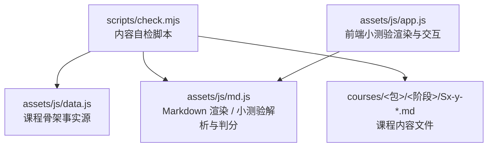
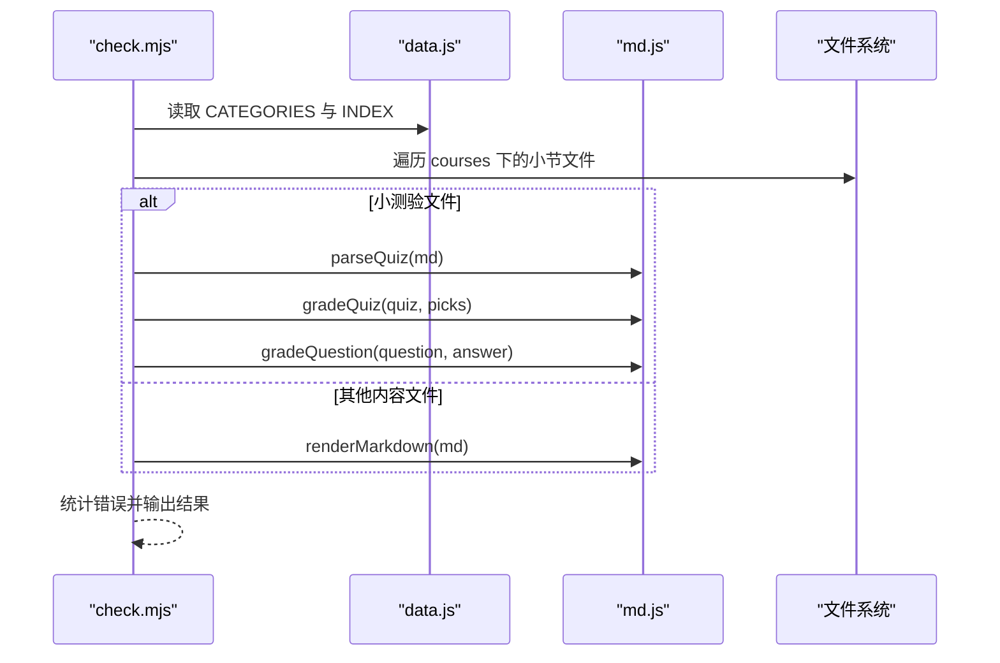
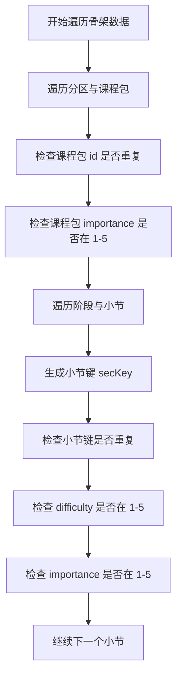
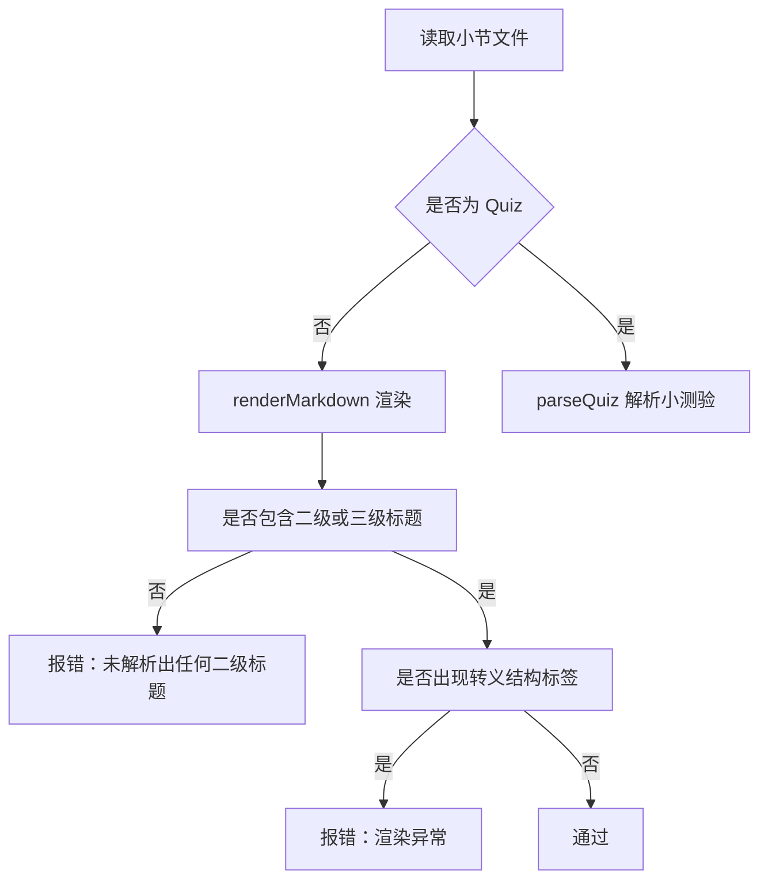
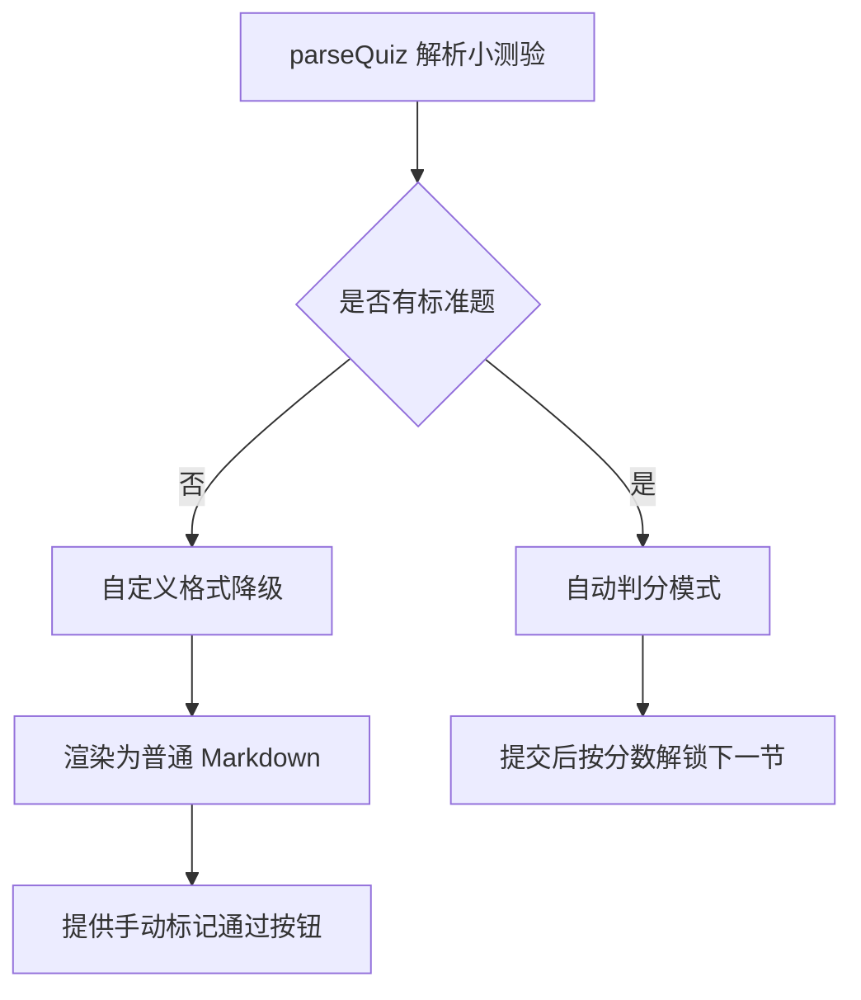
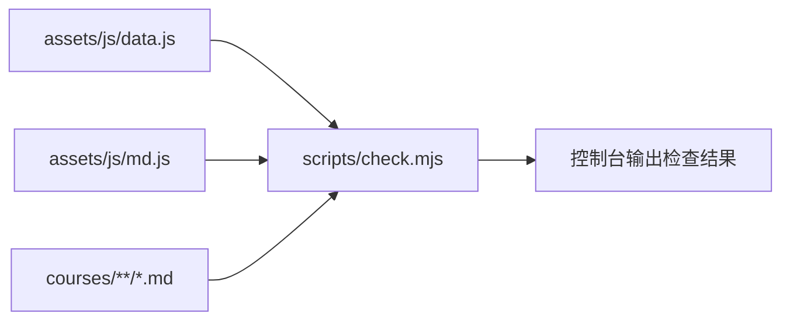

# 内容自检脚本

<cite>
**本文引用的文件**   
- [scripts/check.mjs](file://scripts/check.mjs)
- [assets/js/md.js](file://assets/js/md.js)
- [assets/js/data.js](file://assets/js/data.js)
- [assets/js/app.js](file://assets/js/app.js)
- [README.md](file://README.md)
</cite>

## 目录
1. [引言](#引言)
2. [项目结构与脚本定位](#项目结构与脚本定位)
3. [核心检查能力总览](#核心检查能力总览)
4. [架构与调用关系](#架构与调用关系)
5. [详细检查项分析](#详细检查项分析)
6. [小测验自动判分测试](#小测验自动判分测试)
7. [渲染器冒烟测试](#渲染器冒烟测试)
8. [自定义格式小测的降级机制](#自定义格式小测的降级机制)
9. [依赖关系分析](#依赖关系分析)
10. [常见错误诊断与修复建议](#常见错误诊断与修复建议)
11. [性能与可维护性建议](#性能与可维护性建议)
12. [结论](#结论)

## 引言
本文件围绕 `scripts/check.mjs` 展开，系统性说明该内容自检脚本如何保障课程内容的结构正确性、Markdown 渲染质量与小测验判分契约。文档重点覆盖：
- 目录结构唯一性与取值范围校验；
- Lesson、Quiz、Homework、Interview 四类内容文件的完整性与渲染验证；
- 小测验题目解析、分值合计、答案格式、选项匹配、满分/零分场景回归；
- Markdown 渲染器冒烟测试；
- 自定义格式小测的降级展示逻辑；
- 常见检查错误的诊断方法与修复建议。

## 项目结构与脚本定位
`check.mjs` 是 Node 环境下的内容自检入口，负责读取骨架数据源 `assets/js/data.js` 中的课程目录，并遍历实际 Markdown 内容文件进行校验。它同时复用前端渲染与判分工具 `assets/js/md.js`，从而保证“构建前检查”和“运行时行为”的一致性。



**图表来源**
- [scripts/check.mjs:1-118](file://scripts/check.mjs#L1-L118)
- [assets/js/data.js:1-8](file://assets/js/data.js#L1-L8)
- [assets/js/md.js:1-10](file://assets/js/md.js#L1-L10)
- [assets/js/app.js:242-294](file://assets/js/app.js#L242-L294)

**章节来源**
- [scripts/check.mjs:1-12](file://scripts/check.mjs#L1-L12)
- [README.md:145-170](file://README.md#L145-L170)

## 核心检查能力总览
`check.mjs` 的检查流程可以概括为五个层次：

| 检查层次 | 主要目标 | 关键断言 |
|---|---|---|
| 目录结构唯一性 | 防止课程包 id、小节键重复，确保难度与重要性取值合法 | 课程包 id 唯一；小节键唯一；难度、重要性在 1-5 之间；课程包 importance 合法 |
| 内容文件检查 | 对已存在的 Lesson、Quiz、Homework、Interview 文件进行解析与基础渲染校验 | 非 Quiz 文件至少包含二级标题；HTML 中不出现被转义的 h2/table/ul |
| 小测验解析校验 | 标准题数量、题型、答案、选项、解析、分值必须自洽 | 题目总数与声明一致；客观题答案为 A-H；多选至少两个字母；判断题只有两个对立选项 |
| 判分冒烟测试 | 满分应得 100，未作答应得 0，主观题部分命中应得部分分 | 全对应答满分；空答案零分；简答题部分要点得分在 0~1 之间 |
| 渲染器冒烟测试 | 表格、代码块、标题、行内语法等基础 Markdown 元素能正确渲染 | HTML 包含 table、code；目录抽取条数正确；加粗与行内代码共存时不被破坏 |

**章节来源**
- [scripts/check.mjs:14-32](file://scripts/check.mjs#L14-L32)
- [scripts/check.mjs:34-91](file://scripts/check.mjs#L34-L91)
- [scripts/check.mjs:93-112](file://scripts/check.mjs#L93-L112)

## 架构与调用关系
`check.mjs` 本身不直接实现 Markdown 解析或小测验判分，而是通过导入 `assets/js/md.js` 暴露的函数完成：

- `renderMarkdown`：将 Markdown 转为 HTML，并抽取二级、三级标题用于目录生成；
- `parseQuiz`：从 Markdown 中解析出题目、选项、参考答案、关键词、分值；
- `gradeQuiz`：整卷评分，返回总分、卷面满分、各题得分明细；
- `gradeQuestion`：单题评分，返回 0~1 的比例；
- `stripTitle`：去掉正文首级一级标题，避免页面重复标题。



**图表来源**
- [scripts/check.mjs:4-8](file://scripts/check.mjs#L4-L8)
- [scripts/check.mjs:34-91](file://scripts/check.mjs#L34-L91)
- [assets/js/md.js:51-150](file://assets/js/md.js#L51-L150)
- [assets/js/md.js:193-337](file://assets/js/md.js#L193-L337)

**章节来源**
- [scripts/check.mjs:4-8](file://scripts/check.mjs#L4-L8)
- [assets/js/md.js:1-10](file://assets/js/md.js#L1-L10)

## 详细检查项分析

### 目录结构唯一性检查
脚本首先遍历 `CATEGORIES`，收集所有课程包和小节，并执行以下约束：

1. **课程包 id 重复检测**  
   使用集合记录已出现的课程包 id，若重复则报错。
2. **课程包重要性取值范围校验**  
   要求 `pkg.importance` 存在且位于 1 到 5 之间。
3. **小节键唯一性验证**  
   通过 `secKey(sec)` 生成小节键，并用集合去重；重复则报错。
4. **小节难度与重要性取值范围校验**  
   每个小节的 `difficulty` 与 `importance` 都必须位于 1 到 5 之间。



**图表来源**
- [scripts/check.mjs:14-32](file://scripts/check.mjs#L14-L32)
- [assets/js/data.js:1-8](file://assets/js/data.js#L1-L8)

**章节来源**
- [scripts/check.mjs:14-32](file://scripts/check.mjs#L14-L32)
- [assets/js/data.js:10-45](file://assets/js/data.js#L10-L45)

### 内容文件检查机制
脚本会遍历 `INDEX.section` 中的所有小节，并按四件套规则查找对应文件：

| 文件类型 | 后缀 | 检查重点 |
|---|---|---|
| Lesson | `Lesson.md` | 非 Quiz 文件需能被 Markdown 渲染，且至少包含二级标题 |
| Quiz | `Quiz.md` | 走完整的小测验解析与判分流程 |
| Homework | `Homework.md` | 同 Lesson，作为普通内容文件检查 |
| Interview | `Interview.md` | 同 Lesson，作为普通内容文件检查 |

对于非 Quiz 文件，脚本调用 `renderMarkdown`，并断言：
- HTML 中包含 `<h2>` 或 `<h3>`；
- HTML 中不出现被转义的结构标签，例如 `&lt;h2&gt;`、`&lt;table&gt;`、`&lt;ul&gt;`。



**图表来源**
- [scripts/check.mjs:34-91](file://scripts/check.mjs#L34-L91)
- [assets/js/md.js:61-150](file://assets/js/md.js#L61-L150)

**章节来源**
- [scripts/check.mjs:34-91](file://scripts/check.mjs#L34-L91)
- [assets/js/md.js:61-150](file://assets/js/md.js#L61-L150)

## 小测验自动判分测试
小测验检查是 `check.mjs` 中最复杂的部分，涵盖解析、格式、分值、判分回归等多个维度。

### 题目解析验证
脚本先调用 `parseQuiz` 解析 Markdown，再统计文件中以 `### 数字.` 开头的题干数量。如果存在声明题干但解析出的题目数量不一致，则判定为“答案或题型格式不符”。

关键点：
- 题干必须以三级标题开头；
- 题干可带分值，如“（5分）”；
- 无标准题时，`total` 为 0，进入自定义格式降级逻辑。

**章节来源**
- [scripts/check.mjs:43-47](file://scripts/check.mjs#L43-L47)
- [assets/js/md.js:193-284](file://assets/js/md.js#L193-L284)

### 分值合计检查
脚本计算所有题目的 `maxScore` 之和，要求接近 100（允许浮点误差）。这意味着：
- 如果每道题都显式标注分值，则总和应为 100；
- 如果没有标注分值，则按题目数量平均分配，总和仍应接近 100。

**章节来源**
- [scripts/check.mjs:48-49](file://scripts/check.mjs#L48-L49)
- [assets/js/md.js:268-283](file://assets/js/md.js#L268-L283)

### 答案格式校验
针对选择题类题型，脚本执行严格校验：

| 题型 | 校验规则 |
|---|---|
| 单选 | 答案必须是单个 A-H 字母 |
| 多选 | 答案必须是至少两个 A-H 字母 |
| 判断 | 答案必须是单个 A-H 字母，且选项只有两个对立项 |
| 填空 | 答案可以是多个可接受值，用分隔符拆分 |
| 简答 | 答案拆分为关键词列表，用于部分打分 |

此外，每个客观题的答案字母必须在选项中存在；缺少解析也会报错。

**章节来源**
- [scripts/check.mjs:50-63](file://scripts/check.mjs#L50-L63)
- [assets/js/md.js:232-264](file://assets/js/md.js#L232-L264)

### 选项匹配验证
脚本会遍历答案中的每个字母，检查是否存在对应选项的 key。如果答案字母不在选项中，则直接报错。这保证了“答案语义”和“选项定义”一致。

**章节来源**
- [scripts/check.mjs:57](file://scripts/check.mjs#L57)
- [assets/js/md.js:232-234](file://assets/js/md.js#L232-L234)

### 满分和零分场景测试
脚本构造两种极端作答情况：
1. **满分场景**：每道题都给出正确答案，填空题使用第一个可接受答案，简答题拼接全部关键词；
2. **零分场景**：传入空对象，表示未作答。

断言包括：
- 满分卷面得分必须等于 100；
- 卷面得分不能超过满分；
- 未作答卷面得分必须为 0。

**章节来源**
- [scripts/check.mjs:64-73](file://scripts/check.mjs#L64-L73)
- [assets/js/md.js:328-337](file://assets/js/md.js#L328-L337)

### 简答题部分命中测试
如果存在简答题且关键词数量不少于 4，脚本只传入前两个关键词，模拟“写了一半要点”的情况。此时得分应在 0 到 1 之间，不能归零也不能满分。

**章节来源**
- [scripts/check.mjs:77-82](file://scripts/check.mjs#L77-L82)
- [assets/js/md.js:286-324](file://assets/js/md.js#L286-L324)

## 渲染器冒烟测试
除了逐文件检查，`check.mjs` 还运行一组固定样本，验证 Markdown 渲染器的基础能力：

| 元素 | 输入片段 | 期望输出 |
|---|---|---|
| 标题 | `# T`、`## A`、`### 子标题` | 目录抽取条数正确 |
| 列表 | `- 一`、`- 二` | 无序列表正常渲染 |
| 表格 | 三行表格 | HTML 包含 `<table>` |
| 代码块 | ```java 代码 | HTML 包含 `<code>` |
| 引用 | `> 说明` | 引用块正常处理 |
| 行内语法 | 加粗内含反引号与星号 | 不被破坏，无残留星号 |

这些断言确保渲染器不会因为某个特殊 Markdown 写法而崩溃或输出错误 HTML。

**章节来源**
- [scripts/check.mjs:93-108](file://scripts/check.mjs#L93-L108)
- [assets/js/md.js:61-166](file://assets/js/md.js#L61-L166)

## 自定义格式小测的降级机制
当小测验 Markdown 无法解析出标准题时，`parseQuiz` 返回 `total === 0`。此时 `check.mjs` 不会报错，而是认为这是“自定义格式的小测”，允许其降级为纯文档展示。

前端 `app.js` 中也有对应逻辑：
- 如果解析不出可自动判分的题目，则渲染为普通 Markdown 内容；
- 提供“我已完成本小节自定义测验，标记通过”按钮；
- 显示提示，说明当前小测不计分、不判分，仅记录完成。



**图表来源**
- [scripts/check.mjs:47](file://scripts/check.mjs#L47)
- [scripts/check.mjs:110-112](file://scripts/check.mjs#L110-L112)
- [assets/js/app.js:248-263](file://assets/js/app.js#L248-L263)

**章节来源**
- [scripts/check.mjs:47](file://scripts/check.mjs#L47)
- [scripts/check.mjs:110-112](file://scripts/check.mjs#L110-L112)
- [assets/js/app.js:248-263](file://assets/js/app.js#L248-L263)

## 依赖关系分析
`check.mjs` 的依赖关系清晰且低耦合：

- 对 `assets/js/data.js` 的依赖集中在骨架数据读取；
- 对 `assets/js/md.js` 的依赖集中在渲染与判分；
- 对文件系统的依赖仅限于读取 `courses` 下的 Markdown；
- 不直接依赖前端路由或 UI 组件，但通过复用同一套解析与判分逻辑，保证前后端一致性。



**图表来源**
- [scripts/check.mjs:4-12](file://scripts/check.mjs#L4-L12)
- [scripts/check.mjs:114-118](file://scripts/check.mjs#L114-L118)

**章节来源**
- [scripts/check.mjs:4-12](file://scripts/check.mjs#L4-L12)
- [scripts/check.mjs:114-118](file://scripts/check.mjs#L114-L118)

## 常见错误诊断与修复建议

### 课程包 id 重复
**现象**：脚本输出“课程包 id 重复”。  
**原因**：`assets/js/data.js` 中不同课程包使用了相同 id。  
**修复**：检查并修改重复的课程包 id，保持全局唯一。

**章节来源**
- [scripts/check.mjs:17-19](file://scripts/check.mjs#L17-L19)
- [assets/js/data.js:10-45](file://assets/js/data.js#L10-L45)

### 小节键重复
**现象**：脚本输出“小节键重复”。  
**原因**：多个小节生成相同的 `secKey`，通常是小节编号冲突。  
**修复**：调整小节编号，确保每个小节键唯一。

**章节来源**
- [scripts/check.mjs:22-25](file://scripts/check.mjs#L22-L25)

### 难度或重要性越界
**现象**：脚本输出“难度越界”或“重要性越界”。  
**原因**：小节或课程包的难度、重要性不在 1 到 5 范围内。  
**修复**：将数值调整为 1 到 5 之间的整数。

**章节来源**
- [scripts/check.mjs:20](file://scripts/check.mjs#L20)
- [scripts/check.mjs:26-28](file://scripts/check.mjs#L26-L28)

### 题目解析数量不一致
**现象**：脚本输出“题目解析 X/Y”。  
**原因**：Markdown 中有 `### 数字.` 题干，但 `parseQuiz` 没有解析出对应题目。  
**修复**：检查题干格式、选项格式、答案格式是否符合约定。

**章节来源**
- [scripts/check.mjs:44-46](file://scripts/check.mjs#L44-L46)
- [assets/js/md.js:211-264](file://assets/js/md.js#L211-L264)

### 分值合计不为 100
**现象**：脚本输出“分值合计 X，应为 100”。  
**原因**：显式标注的分值总和不是 100，或未标注分值时题目数量为 0。  
**修复**：调整每题分值，使总和为 100；或补充缺失题目。

**章节来源**
- [scripts/check.mjs:48-49](file://scripts/check.mjs#L48-L49)
- [assets/js/md.js:268-283](file://assets/js/md.js#L268-L283)

### 客观题答案异常
**现象**：脚本输出“客观题答案异常”或“答案不在选项中”。  
**原因**：答案包含非 A-H 字符，或答案字母不在选项 key 中。  
**修复**：修正答案字母，并确保选项 key 与答案一致。

**章节来源**
- [scripts/check.mjs:52-58](file://scripts/check.mjs#L52-L58)
- [assets/js/md.js:232-252](file://assets/js/md.js#L232-L252)

### 多选题答案唯一
**现象**：脚本输出“多选但答案唯一”。  
**原因**：题型为多选，但答案只有一个字母。  
**修复**：补充至少两个正确选项字母。

**章节来源**
- [scripts/check.mjs:55](file://scripts/check.mjs#L55)

### 判断题选项数量不对
**现象**：脚本输出“判断题应只有两个对立选项”。  
**原因**：判断题的选项不是两个对立项。  
**修复**：改为两个对立选项，例如“正确/错误”。

**章节来源**
- [scripts/check.mjs:56](file://scripts/check.mjs#L56)

### 缺少解析或缺少参考答案
**现象**：脚本输出“缺少解析”或“缺少参考答案或要点”。  
**原因**：客观题没有解析文本，主观题没有 keywords。  
**修复**：补充解析或参考答案要点。

**章节来源**
- [scripts/check.mjs:58-61](file://scripts/check.mjs#L58-L61)

### 满分为 0 或分值未设置
**现象**：脚本输出“分值为 0”。  
**原因**：题目 `maxScore` 不存在或为 0。  
**修复**：为题目设置有效分值。

**章节来源**
- [scripts/check.mjs:62](file://scripts/check.mjs#L62)

### 满分校验失败或未作答应得 0 分失败
**现象**：脚本输出“满分校验失败”或“未作答应得 0 分”。  
**原因**：判分逻辑与实际答案不一致，或主观题关键词配置异常。  
**修复**：检查答案、关键词、分值配置，以及 `gradeQuiz` 与 `gradeQuestion` 的行为。

**章节来源**
- [scripts/check.mjs:70-73](file://scripts/check.mjs#L70-L73)
- [assets/js/md.js:301-337](file://assets/js/md.js#L301-L337)

### 未解析出二级标题
**现象**：脚本输出“未解析出任何二级标题”。  
**原因**：Lesson、Homework、Interview 文件没有有效的二级标题。  
**修复**：添加二级标题，或使用脚手架生成占位内容。

**章节来源**
- [scripts/check.mjs:86-88](file://scripts/check.mjs#L86-L88)
- [assets/js/md.js:81-89](file://assets/js/md.js#L81-L89)

### 渲染结构被转义
**现象**：脚本输出“结构被转义，渲染异常”。  
**原因**：Markdown 中的结构标签被当作普通文本转义。  
**修复**：检查 Markdown 源码，避免误写 HTML 或转义符号。

**章节来源**
- [scripts/check.mjs:88](file://scripts/check.mjs#L88)
- [assets/js/md.js:3](file://assets/js/md.js#L3)

### 表格或代码块未渲染
**现象**：冒烟测试输出“表格未渲染”或“代码块未渲染”。  
**原因**：渲染器未能识别表格或代码块语法。  
**修复**：检查 Markdown 表格与代码块语法是否正确。

**章节来源**
- [scripts/check.mjs:94-97](file://scripts/check.mjs#L94-L97)
- [assets/js/md.js:71-117](file://assets/js/md.js#L71-L117)

### 自定义格式小测解析异常
**现象**：脚本输出“自定义格式应解析为 0 题”。  
**原因**：自定义小测被误解析为标准题，或解析逻辑发生变化。  
**修复**：确认小测确实为非标准格式，并检查 `parseQuiz` 的解析边界。

**章节来源**
- [scripts/check.mjs:110-112](file://scripts/check.mjs#L110-L112)
- [assets/js/md.js:193-284](file://assets/js/md.js#L193-L284)

## 性能与可维护性建议
- **批量文件读取**：当前脚本使用同步 API 读取 Markdown 文件，适合本地自检；若课程规模进一步扩大，可考虑异步并发读取以提升性能。
- **错误聚合输出**：目前每次错误都会增加计数器并打印一行，建议在最后统一汇总错误分类，便于快速定位问题类型。
- **可配置检查开关**：可将“渲染器冒烟测试”“自定义格式小测”“主观题部分命中测试”等设为可选检查项，方便在不同阶段启用不同严格度。
- **测试用例沉淀**：将常见错误样例沉淀为单元测试，使 `check.mjs` 不仅具备自检能力，还能作为回归测试入口。

[本节为通用建议，不直接分析具体文件]

## 结论
`scripts/check.mjs` 是一个面向课程内容的“前置质量门”。它通过骨架数据源驱动目录校验，通过 Markdown 渲染器保障内容可读性，并通过小测验解析与判分逻辑保障学习闭环的正确性。配合 `assets/js/md.js` 的渲染与判分实现，以及 `assets/js/app.js` 的前端降级展示，整个系统形成了“骨架事实源 → 内容文件 → 自检脚本 → 前端渲染”的一致链路。

在实际使用中，建议：
- 新增课程时优先维护 `assets/js/data.js`；
- 使用脚手架补齐四件套占位；
- 编写小测验时遵循题干、选项、答案、解析、分值约定；
- 遇到检查失败时，优先根据脚本输出的文件路径与错误信息定位 Markdown 或骨架数据问题；
- 对自定义格式小测，明确其降级为手动通过模式，不影响解锁链。