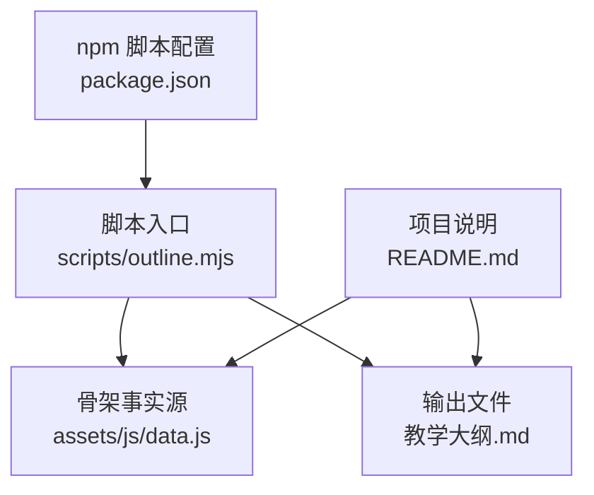
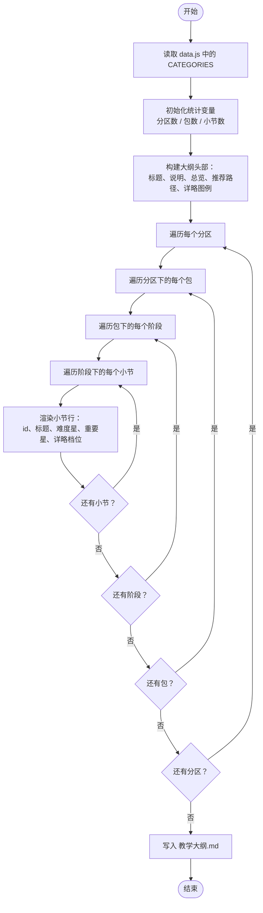
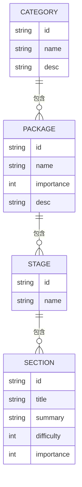
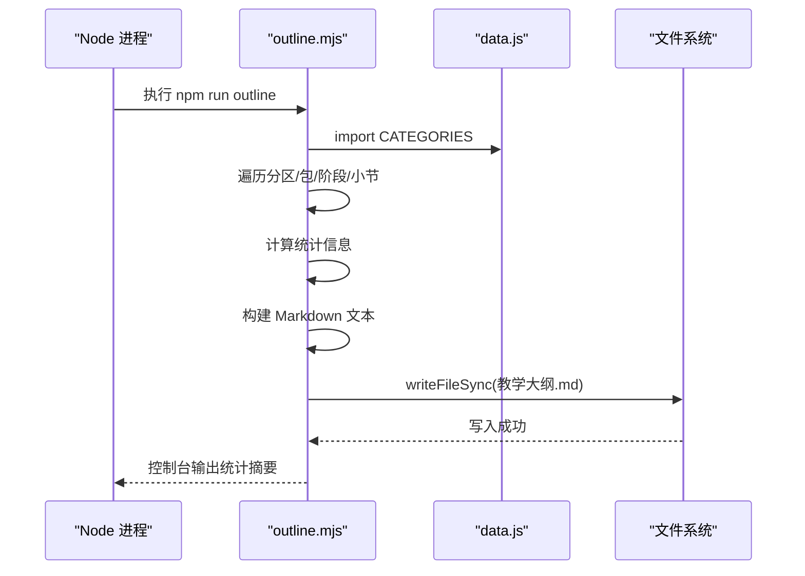
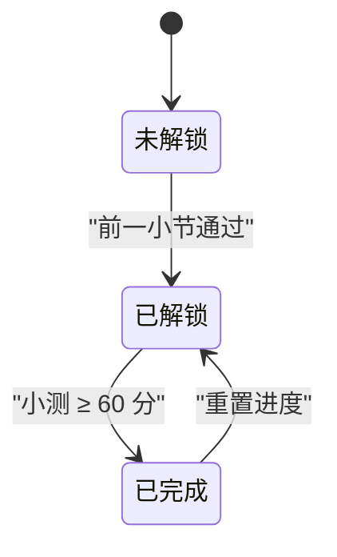
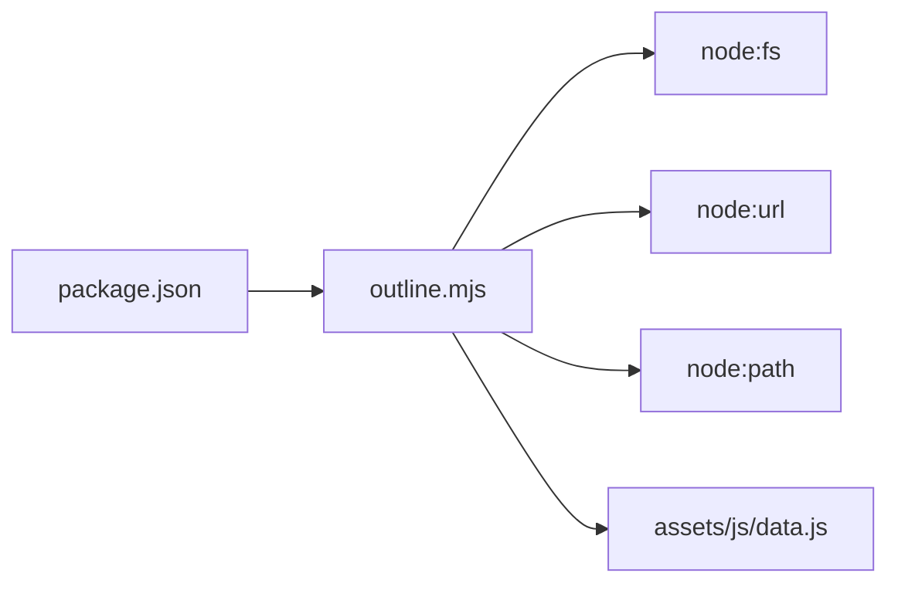
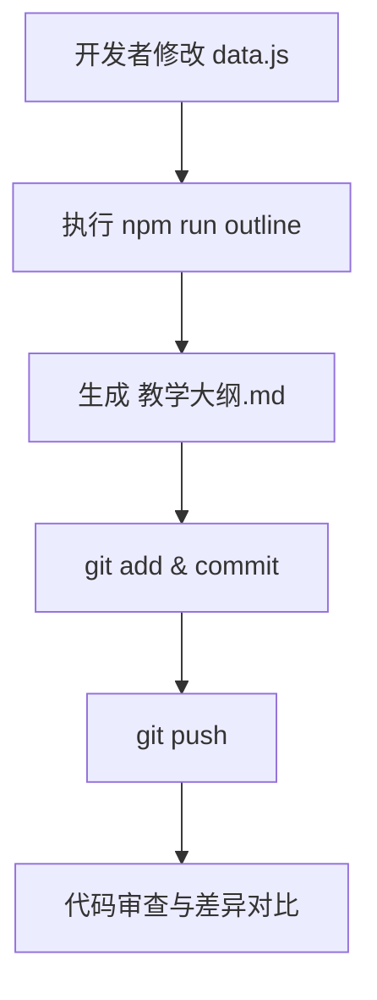

# 大纲生成器

<cite>
**本文引用的文件**   
- [scripts/outline.mjs](file://scripts/outline.mjs)
- [assets/js/data.js](file://assets/js/data.js)
- [package.json](file://package.json)
- [README.md](file://README.md)
- [教学大纲.md](file://教学大纲.md)
</cite>

## 目录
1. [引言](#引言)
2. [项目结构](#项目结构)
3. [核心组件](#核心组件)
4. [架构总览](#架构总览)
5. [详细组件分析](#详细组件分析)
6. [依赖关系分析](#依赖关系分析)
7. [性能与可扩展性](#性能与可扩展性)
8. [自定义输出选项](#自定义输出选项)
9. [进度标记与学习路径](#进度标记与学习路径)
10. [统计信息说明](#统计信息说明)
11. [实际应用示例](#实际应用示例)
12. [版本控制集成](#版本控制集成)
13. [故障排查指南](#故障排查指南)
14. [结论](#结论)

## 引言
本文件面向“大纲生成器”，聚焦 `scripts/outline.mjs` 如何从唯一骨架事实源 `assets/js/data.js` 读取课程结构，并生成 Markdown 格式的《教学大纲.md》。文档覆盖数据源模型、层级关系、难度与重要性评级、输出格式、缩进与链接规则、进度与解锁语义、统计指标、自定义输出能力、实际使用场景，以及与 Git 等版本控制的协作方式。

## 项目结构
大纲生成器属于仓库的“内容工具”层，位于 `scripts/` 目录；它不直接操作 `courses/` 下的课文文件，而是以 `data.js` 为唯一事实源，生成顶层的《教学大纲.md》。

**图表来源**
- [scripts/outline.mjs:1-69](file://scripts/outline.mjs#L1-L69)
- [assets/js/data.js:1-8](file://assets/js/data.js#L1-L8)
- [package.json:7-15](file://package.json#L7-L15)
- [README.md:13-34](file://README.md#L13-L34)

**章节来源**
- [scripts/outline.mjs:1-69](file://scripts/outline.mjs#L1-L69)
- [package.json:7-15](file://package.json#L7-L15)
- [README.md:13-34](file://README.md#L13-L34)

## 核心组件
- **数据源：`assets/js/data.js`**  
  导出 `CATEGORIES`，定义“分区 → 包 → 阶段 → 小节”四层结构。每个小节元组包含：小节 id、标题、一句话知识点、难度（1-5）、重要性（1-5）。
- **生成器：`scripts/outline.mjs`**  
  导入 `CATEGORIES`，遍历分区、包、阶段、小节，计算统计信息，渲染 Markdown 文本，写入 `教学大纲.md`。
- **运行入口：`package.json`**  
  提供 `npm run outline` 命令，等价于执行 `node scripts/outline.mjs`。
- **产物：`教学大纲.md`**  
  由生成器输出的 Markdown 大纲，作为首页各技术大方块的内容结构总纲。

**章节来源**
- [assets/js/data.js:1-8](file://assets/js/data.js#L1-L8)
- [scripts/outline.mjs:1-69](file://scripts/outline.mjs#L1-L69)
- [package.json:7-15](file://package.json#L7-L15)
- [README.md:13-34](file://README.md#L13-L34)

## 架构总览
大纲生成器的处理流程可抽象为“读取骨架 → 遍历层级 → 计算统计 → 渲染 Markdown → 落盘”。

**图表来源**
- [scripts/outline.mjs:21-67](file://scripts/outline.mjs#L21-L67)
- [assets/js/data.js:10-200](file://assets/js/data.js#L10-L200)

**章节来源**
- [scripts/outline.mjs:21-67](file://scripts/outline.mjs#L21-L67)

## 详细组件分析

### 数据源读取与数据结构
`data.js` 导出的 `CATEGORIES` 是全站唯一骨架事实源，其结构如下：
- 分区：包含 `id`、`name`、`desc`、`packages`。
- 包：包含 `id`、`name`、`importance`、`desc`、`stages`。
- 阶段：包含 `id`、`name`、`sections`。
- 小节：以元组形式存在，顺序为 `[id, title, summary, difficulty, importance]`。

生成器在遍历过程中直接解构小节元组，提取 `id`、`title`、`summary`、`difficulty`、`importance`，用于渲染和统计。

**图表来源**
- [assets/js/data.js:1-8](file://assets/js/data.js#L1-L8)
- [assets/js/data.js:10-200](file://assets/js/data.js#L10-L200)

**章节来源**
- [assets/js/data.js:1-8](file://assets/js/data.js#L1-L8)
- [assets/js/data.js:10-200](file://assets/js/data.js#L10-L200)

### 生成器主逻辑
`outline.mjs` 的核心职责包括：
- 导入 `CATEGORIES`。
- 定义详略分档映射，将重要性数值映射为讲解深度描述。
- 遍历分区、包、阶段、小节，累计统计信息。
- 构建 Markdown 头部：标题、说明、总览、推荐学习路径、详略图例。
- 按层级输出分区标题、包信息、阶段标题、小节条目。
- 将结果写入 `教学大纲.md`。

**图表来源**
- [scripts/outline.mjs:1-69](file://scripts/outline.mjs#L1-L69)
- [package.json:7-15](file://package.json#L7-L15)

**章节来源**
- [scripts/outline.mjs:1-69](file://scripts/outline.mjs#L1-L69)

### 输出格式规范
生成的《教学大纲.md》采用标准 Markdown 层次化结构：
- 一级标题：课程总标题。
- 引用段落：说明自动生成来源与作用。
- 总览段：分区数、包数、小节数。
- 推荐学习路径：按分区顺序列出。
- 详略图例：展示重要性对应的讲解深度。
- 分区二级标题：如“计算机与算法基础”。
- 包三级标题：如“数据结构与算法”，附带包 id。
- 包元信息：重要性星级、讲解详略、简介。
- 阶段四级标题：如“阶段一 · 复杂度与线性结构”。
- 小节条目：以列表项呈现，包含小节 id、标题、难度星级、重要性星级、详略档位、知识点摘要。

缩进表示法：
- 小节知识点使用两级缩进，体现“小节 → 知识点”的层级关系。
- 所有层级通过 Markdown 标题与列表缩进表达，无需额外样式。

链接生成规则：
- 当前生成器未直接生成站内跳转链接。
- 小节 id 以小写形式出现，便于与路由或文件名约定对齐。
- 如需链接，可在后续扩展中基于小节 id 拼接相对路径，例如 `courses/<包id>/<阶段id>/Sx-y-Lesson.md`。

**章节来源**
- [scripts/outline.mjs:21-67](file://scripts/outline.mjs#L21-L67)
- [教学大纲.md:1-12](file://教学大纲.md#L1-L12)
- [README.md:22-34](file://README.md#L22-L34)

### 难度与重要性评级
- 难度：1-5，表示小节的学习难度。
- 重要性：1-5，决定讲解详略档位。
- 生成器将重要性映射为五档讲解深度：
  - 5：核心精讲
  - 4：重点标准
  - 3：标准概览
  - 2：简明速览
  - 1：了解即可

星级显示：
- 使用“★”和“☆”组合，直观展示难度与重要性。

**章节来源**
- [scripts/outline.mjs:10-19](file://scripts/outline.mjs#L10-L19)
- [assets/js/data.js:1-8](file://assets/js/data.js#L1-L8)

### 进度标记与学习路径
大纲生成器本身不读取进度数据，也不直接渲染进度标记。但项目整体具备以下机制：
- 进度主存储为浏览器 `localStorage`，键名为 `bjb.progress.v1`。
- 进度文件支持导出/导入 `progress/progress.md`。
- 通关规则：小测得分 ≥ 60 即通过该小节，并解锁下一小节。
- 同一课程包内阶段、小节按固定顺序逐关解锁；跨包互不锁定。
- 推荐学习路径由分区顺序决定，生成器会输出该顺序。

因此，《教学大纲.md》可作为静态结构总纲；个人学习进度则通过进度页与 `progress.md` 管理。

**图表来源**
- [README.md:35-37](file://README.md#L35-L37)
- [README.md:80-87](file://README.md#L80-L87)

**章节来源**
- [README.md:35-37](file://README.md#L35-L37)
- [README.md:80-87](file://README.md#L80-L87)

### 统计信息计算与展示
生成器在遍历过程中累计：
- 分区数量：`CATEGORIES.length`
- 包数量：遍历所有分区的所有包的长度之和
- 小节数量：遍历所有分区、包、阶段的小节数组长度之和

这些统计信息用于：
- 总览段显示“分区数 · 包数 · 小节数”
- 控制台输出“已生成 教学大纲.md：X 分区 · Y 包 · Z 小节”

注意：当前实现未输出“各分区的小节数量分布”“难度分布直方图”“重要性统计表格”等更细粒度统计。若需要，可在生成器中增加分组聚合逻辑。

**章节来源**
- [scripts/outline.mjs:29-33](file://scripts/outline.mjs#L29-L33)
- [scripts/outline.mjs:67-68](file://scripts/outline.mjs#L67-L68)

## 依赖关系分析
大纲生成器仅依赖 Node 内置模块与 `data.js`，无第三方运行时依赖。

**图表来源**
- [scripts/outline.mjs:3-6](file://scripts/outline.mjs#L3-L6)
- [package.json:7-15](file://package.json#L7-L15)

**章节来源**
- [scripts/outline.mjs:3-6](file://scripts/outline.mjs#L3-L6)
- [package.json:7-15](file://package.json#L7-L15)

## 性能与可扩展性
- 时间复杂度：O(N)，其中 N 为小节总数。生成器对每个小节执行常数次字符串拼接与数组访问。
- 空间复杂度：O(M)，M 为最终 Markdown 文本大小。
- I/O 开销：单次写入 `教学大纲.md`。
- 可扩展点：
  - 增加过滤条件：按包 id、阶段 id、难度范围、重要性范围筛选小节。
  - 增加排序规则：按难度降序、重要性升序、小节 id 字母序等。
  - 增加统计维度：分区小节数、难度分布、重要性分布、完成率（需结合进度数据）。
  - 增加链接生成：根据小节 id 与包/阶段 id 拼接课程文件路径。

[本节为通用指导，不直接分析具体代码文件]

## 自定义输出选项
当前 `outline.mjs` 未暴露命令行参数或配置文件，所有行为硬编码在脚本中。可通过以下方式扩展：

- 格式化方式：
  - 修改 Markdown 标题层级。
  - 调整列表缩进与分隔符。
  - 增加表格形式的统计输出。
- 过滤条件：
  - 在遍历前对 `CATEGORIES` 进行过滤，例如只保留重要性 ≥ 4 的包。
  - 按阶段 id 白名单/黑名单过滤。
- 排序规则：
  - 对 `sections` 数组按难度或重要性排序后再渲染。
  - 对包或分区按名称或 id 排序。

建议扩展方案：
- 引入配置对象，集中管理输出模板、过滤函数、排序函数。
- 支持多输出目标：除 `教学大纲.md` 外，还可输出 JSON 结构供前端或其他工具消费。

**章节来源**
- [scripts/outline.mjs:21-67](file://scripts/outline.mjs#L21-L67)

## 进度标记与学习路径
虽然大纲生成器不直接渲染进度，但项目整体提供以下能力：
- 推荐学习路径：由分区顺序决定，生成器会输出该顺序。
- 进度状态：通过 `localStorage` 与 `progress.md` 维护。
- 解锁规则：同包顺序解锁，跨包不互锁。
- 完成标志：小测 ≥ 60 分即通过。

在实际使用中，可将《教学大纲.md》作为课程总览，同时配合进度页查看个人学习状态。

**章节来源**
- [scripts/outline.mjs:29-35](file://scripts/outline.mjs#L29-L35)
- [README.md:35-37](file://README.md#L35-L37)
- [README.md:80-87](file://README.md#L80-L87)

## 统计信息说明
当前生成器提供的统计信息包括：
- 总览：分区数、包数、小节数。
- 控制台输出：生成后的分区、包、小节计数。

未提供的统计信息包括：
- 各分区的小节数量分布。
- 难度分布统计。
- 重要性分布统计。
- 完成率统计。

若需要更丰富的统计，可在生成器中增加聚合逻辑，例如：
- 按分区统计小节数。
- 按难度等级统计小节数。
- 按重要性等级统计小节数。
- 结合进度数据计算完成率。

**章节来源**
- [scripts/outline.mjs:29-33](file://scripts/outline.mjs#L29-L33)
- [scripts/outline.mjs:67-68](file://scripts/outline.mjs#L67-L68)

## 实际应用示例

### 生成课程总览
适用场景：
- 新成员入职时快速了解课程结构。
- 讲师备课时对照大纲检查知识点覆盖。
- 管理者评估课程规模与难度分布。

操作步骤：
1. 确保 `assets/js/data.js` 已更新。
2. 执行 `npm run outline`。
3. 打开 `教学大纲.md` 查看总览。

**章节来源**
- [package.json:7-15](file://package.json#L7-L15)
- [scripts/outline.mjs:67-68](file://scripts/outline.mjs#L67-L68)
- [README.md:93-99](file://README.md#L93-L99)

### 个人学习进度报告
适用场景：
- 学习者导出 `progress.md` 作为打卡记录。
- 团队复盘时对比大纲与进度。

操作步骤：
1. 在进度页导出 `progress.md`。
2. 将 `progress.md` 提交到 Git。
3. 结合《教学大纲.md》查看已完成小节与待学小节。

**章节来源**
- [README.md:80-87](file://README.md#L80-L87)

### 教学计划文档
适用场景：
- 教师制定学期教学计划。
- 培训机构编排课程表。

操作步骤：
1. 根据《教学大纲.md》确定分区与包的教学顺序。
2. 按阶段划分课时。
3. 根据难度与重要性安排重点课时。

**章节来源**
- [scripts/outline.mjs:29-35](file://scripts/outline.mjs#L29-L35)
- [教学大纲.md:1-12](file://教学大纲.md#L1-L12)

## 版本控制集成
大纲生成器与版本控制的协作方式如下：
- 骨架变更：修改 `assets/js/data.js` 后，重新运行 `npm run outline` 生成最新大纲。
- 变更跟踪：将 `教学大纲.md` 纳入 Git 提交，便于查看历史差异。
- 自动化建议：可在 CI 中自动执行 `npm run outline`，并在文件变化时报错或生成 PR。
- 差异对比：使用 `git diff` 对比大纲变更，确认新增/删除/调整的知识点。

**图表来源**
- [README.md:93-99](file://README.md#L93-L99)
- [README.md:118-128](file://README.md#L118-L128)

**章节来源**
- [README.md:93-99](file://README.md#L93-L99)
- [README.md:118-128](file://README.md#L118-L128)

## 故障排查指南
常见问题与解决思路：
- 无法找到 `data.js`：确认 `assets/js/data.js` 是否存在且导出 `CATEGORIES`。
- 生成内容为空：检查 `CATEGORIES` 是否为空数组。
- 统计数字异常：检查小节元组是否完整，确保每个小节包含 5 个字段。
- 权限问题：确认对根目录有写入权限，以便生成 `教学大纲.md`。
- Node 版本过低：确保 Node.js ≥ 18，以支持 ES Module 与 `import.meta.url`。

**章节来源**
- [scripts/outline.mjs:3-6](file://scripts/outline.mjs#L3-L6)
- [scripts/outline.mjs:21-67](file://scripts/outline.mjs#L21-L67)
- [README.md:39-46](file://README.md#L39-L46)

## 结论
大纲生成器以 `data.js` 为唯一事实源，稳定地生成 Markdown 格式的《教学大纲.md》。它提供了清晰的课程结构总览、难度与重要性评级、推荐学习路径，并与项目的进度机制和版本控制流程良好协作。未来可在过滤、排序、统计、链接生成等方面进一步扩展，以满足更多定制化需求。