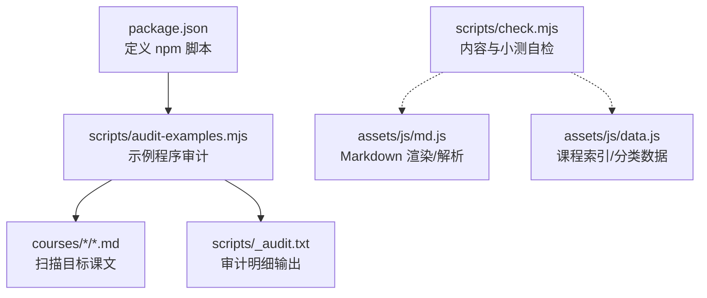
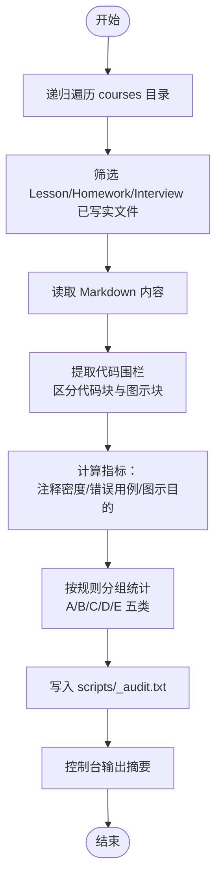
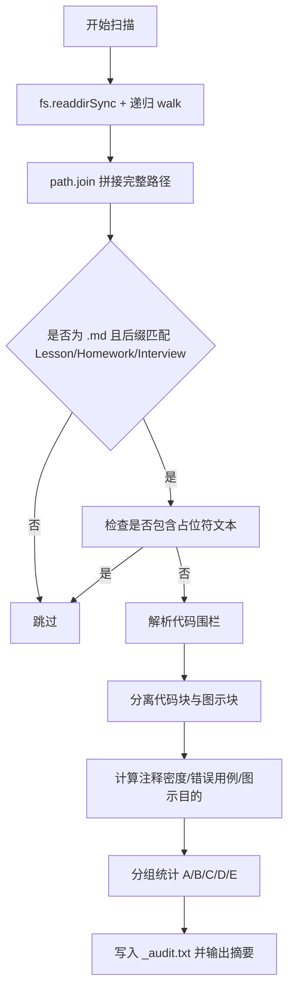
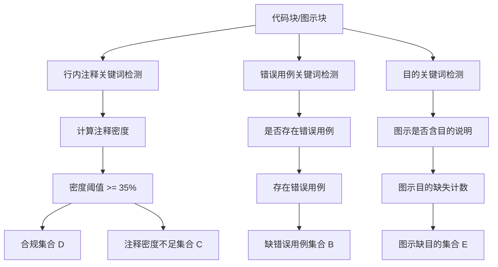
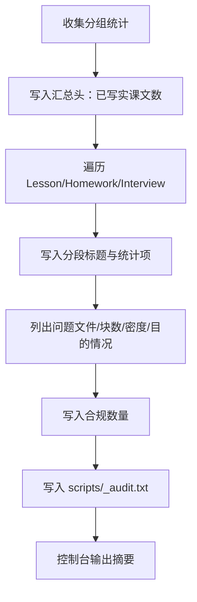
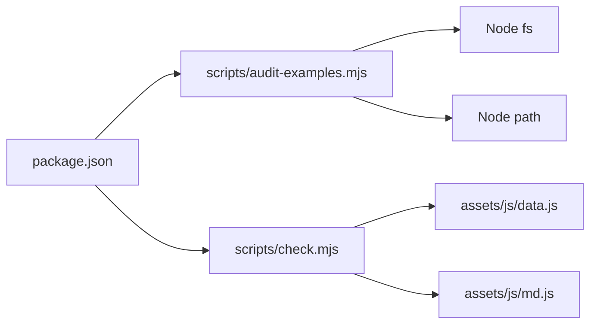

# 审计工具

<cite>
**本文引用的文件**   
- [scripts/audit-examples.mjs](file://scripts/audit-examples.mjs)
- [package.json](file://package.json)
- [scripts/check.mjs](file://scripts/check.mjs)
- [README.md](file://README.md)
- [README.en.md](file://README.en.md)
</cite>

## 目录
1. [简介](#简介)
2. [项目结构](#项目结构)
3. [核心组件](#核心组件)
4. [架构总览](#架构总览)
5. [详细组件分析](#详细组件分析)
6. [依赖关系分析](#依赖关系分析)
7. [性能考量](#性能考量)
8. [故障排查指南](#故障排查指南)
9. [结论](#结论)
10. [附录：使用案例与集成建议](#附录使用案例与集成建议)

## 简介
本文件面向“BigJavaBackend”仓库中的示例程序审计工具，重点说明 `scripts/audit-examples.mjs` 的扫描机制、质量检查规则、报告生成方式，并给出在 CI/CD 中集成的思路、配置扩展点以及与 ESLint、SonarQube 等工具的协作方案。该脚本的目标是确保课程正文中的“例子程序”具备足够的可读性、可验证性与教学价值，包括目的注释、错误用例、注释密度和图示说明等要求。

## 项目结构
与审计工具直接相关的工程结构如下：
- `scripts/audit-examples.mjs`：示例程序审计主脚本
- `scripts/_audit.txt`：审计明细输出文件（由脚本写入）
- `package.json`：定义 `npm run audit-examples` 入口
- `scripts/check.mjs`：内容解析与小测验判分自检脚本（与审计互补）
- `README.md` / `README.en.md`：文档中对审计命令的使用说明

图表来源
- [package.json:7-15](file://package.json#L7-L15)
- [scripts/audit-examples.mjs:1-71](file://scripts/audit-examples.mjs#L1-L71)
- [scripts/check.mjs:1-119](file://scripts/check.mjs#L1-L119)

章节来源
- [package.json:1-21](file://package.json#L1-L21)
- [scripts/audit-examples.mjs:1-71](file://scripts/audit-examples.mjs#L1-L71)
- [scripts/check.mjs:1-119](file://scripts/check.mjs#L1-L119)

## 核心组件
- 示例程序审计脚本 `scripts/audit-examples.mjs`
  - 递归遍历 `courses` 目录，识别 Lesson/Homework/Interview 三类已写实课文
  - 从 Markdown 中提取代码块与图示块，分别统计与分析
  - 按规则对每个文件进行分组统计，输出到控制台与 `scripts/_audit.txt`
- 包脚本入口 `package.json`
  - 提供 `npm run audit-examples` 命令，便于一键执行审计
- 辅助自检脚本 `scripts/check.mjs`
  - 校验课程结构、小节键唯一性、小测验解析与判分正确性
  - 与示例程序审计形成互补：前者关注“代码块质量”，后者关注“结构与判分正确性”

章节来源
- [scripts/audit-examples.mjs:1-71](file://scripts/audit-examples.mjs#L1-L71)
- [package.json:7-15](file://package.json#L7-L15)
- [scripts/check.mjs:1-119](file://scripts/check.mjs#L1-L119)

## 架构总览
审计流程整体分为“扫描—提取—评估—报告”四个阶段：
1. 扫描：递归读取 `courses` 下所有 `.md` 文件
2. 提取：正则匹配代码围栏，区分“语言标记的代码块”和“图示类代码块”
3. 评估：计算注释密度、是否存在错误用例、图示是否包含目的说明等
4. 报告：汇总统计结果，写入 `scripts/_audit.txt`，并在控制台打印摘要

图表来源
- [scripts/audit-examples.mjs:17-26](file://scripts/audit-examples.mjs#L17-L26)
- [scripts/audit-examples.mjs:30-50](file://scripts/audit-examples.mjs#L30-L50)
- [scripts/audit-examples.mjs:68-70](file://scripts/audit-examples.mjs#L68-L70)

## 详细组件分析

### 扫描机制
- 递归遍历
  - 通过同步读取目录并递归进入子目录，收集所有文件路径
  - 起点为 `courses` 目录
- 文件筛选
  - 仅处理以 `-Lesson.md`、`-Homework.md`、`-Interview.md` 结尾的文件
  - 排除内容为占位符的课程正文（用于判断“已写实”）
- 代码块与图示块分离
  - 使用正则匹配 Markdown 代码围栏
  - 将无语言标记或特定图示类型（如 flow、mermaid、text、ascii、图）视为“图示块”
  - 其余带语言标记的块视为“真正的例子程序代码块”

图表来源
- [scripts/audit-examples.mjs:17-24](file://scripts/audit-examples.mjs#L17-L24)
- [scripts/audit-examples.mjs:30-36](file://scripts/audit-examples.mjs#L30-L36)
- [scripts/audit-examples.mjs:13-15](file://scripts/audit-examples.mjs#L13-L15)

章节来源
- [scripts/audit-examples.mjs:17-26](file://scripts/audit-examples.mjs#L17-L26)
- [scripts/audit-examples.mjs:30-36](file://scripts/audit-examples.mjs#L30-L36)
- [scripts/audit-examples.mjs:13-15](file://scripts/audit-examples.mjs#L13-L15)

### 质量检查规则
- 代码语法验证
  - 当前脚本未调用外部编译器或 Linter，不进行严格语法校验
  - 可通过后续集成 ESLint 或语言服务器完成
- 依赖关系检查
  - 当前脚本不解析 import/require 语句，不做依赖图构建
  - 可在后续扩展 AST 解析器实现
- 安全性扫描
  - 当前脚本不包含安全规则引擎
  - 建议结合 SonarQube 或静态安全扫描工具
- 性能分析指标
  - 当前脚本不采集运行时性能指标
  - 可在后续引入基准测试或采样分析
- 教学规范检查（脚本实际实现）
  - 目的注释：代码块需包含“例子目的/图目的/目的”等关键词
  - 影响/结果说明：行内注释需包含“目的/结果/输出/抛/错误/反例/说明/示例/例子”等关键词
  - 定义必配应用：鼓励在代码中体现用法与上下文
  - 知识点正误用例：每个知识点应包含正确使用案例与错误用例（含异常/后果）
  - 图示目的：图示块需在内容中包含“目的”说明

图表来源
- [scripts/audit-examples.mjs:37-49](file://scripts/audit-examples.mjs#L37-L49)
- [scripts/audit-examples.mjs:51-65](file://scripts/audit-examples.mjs#L51-L65)

章节来源
- [scripts/audit-examples.mjs:37-49](file://scripts/audit-examples.mjs#L37-L49)
- [scripts/audit-examples.mjs:51-65](file://scripts/audit-examples.mjs#L51-L65)

### 报告生成
- 输出位置
  - 控制台：打印“已写实课文数”与简要统计
  - 文件：`scripts/_audit.txt`，包含每类文件的详细分组统计
- 报告结构
  - 顶部汇总：已写实课文数量
  - 按类别（Lesson/Homework/Interview）分段输出
  - 每组统计项：
    - 【A】无例子程序代码块的文件列表
    - 【B】有例子但缺少“错误用例”标注的文件及块数、目的情况
    - 【C】注释密度低于阈值的文件及密度值、块数
    - 【D】合规文件数量
    - 【E】图示块缺少“目的”说明的文件及缺失处数
- 严重性分级
  - 当前脚本未内置严重等级字段，但分组本身可作为优先级参考：
    - A：完全无代码块，优先补充
    - B：缺少错误用例，需补充反例/异常
    - C：注释密度不足，需增强说明
    - E：图示缺目的，需补充解释
    - D：合规，作为基准

图表来源
- [scripts/audit-examples.mjs:56-66](file://scripts/audit-examples.mjs#L56-L66)
- [scripts/audit-examples.mjs:68-70](file://scripts/audit-examples.mjs#L68-L70)

章节来源
- [scripts/audit-examples.mjs:56-70](file://scripts/audit-examples.mjs#L56-L70)

### 自动化集成
- 本地开发
  - 使用 `npm run audit-examples` 执行审计
  - 查看控制台输出与 `scripts/_audit.txt` 明细
- CI/CD 流水线
  - 在 GitHub Actions/GitLab CI 中添加步骤执行 `npm run audit-examples`
  - 将 `scripts/_audit.txt` 作为工件上传，便于审查
  - 可将审计失败作为门禁条件（例如存在【A】【B】【C】【E】组非空时阻断合并）
- 定时任务
  - 使用 cron 或平台调度器定期执行审计，产出历史趋势
- 通知机制
  - 当审计失败时，通过邮件/Slack/钉钉等渠道发送告警
  - 结合 PR 评论机器人自动反馈问题清单

章节来源
- [package.json:7-15](file://package.json#L7-L15)
- [README.md](file://README.md)
- [README.en.md](file://README.en.md)

### 配置选项
- 检查规则的自定义
  - 可扩展正则表达式以支持更多注释关键词或错误用例标识
  - 可调整注释密度阈值（当前为 35%）
  - 可增加新的分组维度（如按模块/主题分类）
- 忽略列表的配置
  - 当前未实现忽略列表；可在 walk 函数中增加白名单/黑名单过滤
  - 可按目录或文件名模式排除特定文件
- 输出格式的多样化选择
  - 当前仅支持控制台与纯文本文件
  - 可扩展 JSON/HTML/CSV 输出，便于对接报表系统

章节来源
- [scripts/audit-examples.mjs:13-15](file://scripts/audit-examples.mjs#L13-L15)
- [scripts/audit-examples.mjs:37-49](file://scripts/audit-examples.mjs#L37-L49)
- [scripts/audit-examples.mjs:51-65](file://scripts/audit-examples.mjs#L51-L65)

### 与其他工具的协作
- 与 ESLint 的集成
  - 在 CI 中先执行 ESLint，再执行 `npm run audit-examples`
  - 将 ESLint 报告与审计明细合并展示
- 与 SonarQube 的集成
  - 在 MR 触发 Sonar 扫描，设置 Quality Gate
  - 将审计结果作为额外质量维度纳入评审
- 与前端渲染器的联动
  - `scripts/check.mjs` 负责 Markdown 渲染与小测验判分冒烟测试
  - 与示例程序审计共同保障内容质量与可解析性

章节来源
- [scripts/check.mjs:1-119](file://scripts/check.mjs#L1-L119)
- [README.md](file://README.md)
- [README.en.md](file://README.en.md)

## 依赖关系分析
- 内部依赖
  - `scripts/audit-examples.mjs` 依赖 Node.js 标准库 `fs` 与 `path`
  - `scripts/check.mjs` 依赖 `assets/js/data.js` 与 `assets/js/md.js`
- 外部依赖
  - 当前脚本无第三方依赖；构建与预览依赖 Vite（与审计无关）

图表来源
- [scripts/audit-examples.mjs:5-6](file://scripts/audit-examples.mjs#L5-L6)
- [scripts/check.mjs:4-8](file://scripts/check.mjs#L4-L8)
- [package.json:17-19](file://package.json#L17-L19)

章节来源
- [scripts/audit-examples.mjs:5-6](file://scripts/audit-examples.mjs#L5-L6)
- [scripts/check.mjs:4-8](file://scripts/check.mjs#L4-L8)
- [package.json:17-19](file://package.json#L17-L19)

## 性能考量
- 扫描性能
  - 使用同步 I/O 与正则匹配，适合中小规模仓库
  - 若课程文件数量增长，可考虑异步遍历与并行处理
- 正则开销
  - 代码围栏匹配与关键词检测为主要 CPU 消耗点
  - 可优化正则表达式以减少回溯
- 输出性能
  - 当前一次性写入文件，I/O 开销较低
  - 如需增量审计，可缓存上次扫描结果并对比变更

[本节为通用指导，无需具体文件引用]

## 故障排查指南
- 常见问题
  - 未找到 `scripts/_audit.txt`：确认已执行 `npm run audit-examples`
  - 控制台无输出：检查 Node.js 版本与模块类型（ESM）
  - 审计结果为空：检查 `courses` 目录下是否存在符合后缀的已写实课文
- 定位方法
  - 查看 `scripts/_audit.txt` 中的分组统计，定位问题文件
  - 对照规则关键词，检查代码块注释与错误用例是否齐全
- 关联自检
  - 运行 `node scripts/check.mjs` 检查 Markdown 解析与小测验判分是否正确
  - 若渲染异常，检查 Markdown 结构是否被转义或缺少二级标题

章节来源
- [scripts/audit-examples.mjs:68-70](file://scripts/audit-examples.mjs#L68-L70)
- [scripts/check.mjs:85-118](file://scripts/check.mjs#L85-L118)

## 结论
`scripts/audit-examples.mjs` 提供了针对课程示例程序的质量审计能力，聚焦于代码块的可读性与教学规范性。它通过递归扫描、代码围栏解析、注释密度与错误用例检测、图示目的校验，输出结构化报告，便于团队统一标准与持续改进。配合 `scripts/check.mjs` 的内容与判分自检，以及 CI/CD 的自动化集成，可形成完整的课程质量保障闭环。未来可扩展语法校验、依赖检查、安全扫描与性能分析，并与 ESLint、SonarQube 等工具深度协作。

[本节为总结性内容，无需具体文件引用]

## 附录：使用案例与集成建议

### 新项目初始化时的代码审计
- 初始化后运行 `npm run audit-examples`
- 根据审计报告补充缺失的代码块、错误用例与图示目的
- 结合 `npm run check` 确保结构与判分正确

### 定期质量检查
- 在 CI 中每日/每周执行审计，归档历史报告
- 对持续增长的问题项建立治理看板

### 发布前的最终验证
- 在发布分支合并前执行审计与自检
- 将 `scripts/_audit.txt` 作为发布附件存档

### 与 ESLint/SonarQube 的协作
- 在 PR 中先跑 ESLint，再跑审计，最后跑 Sonar 扫描
- 将三者结果统一展示，形成多维质量视图

章节来源
- [package.json:7-15](file://package.json#L7-L15)
- [README.md](file://README.md)
- [README.en.md](file://README.en.md)