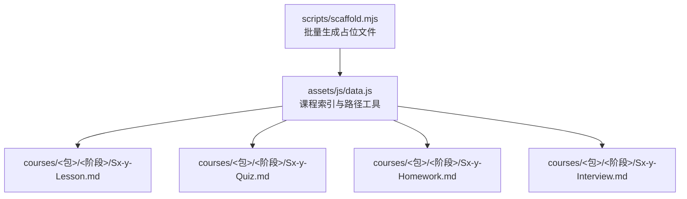
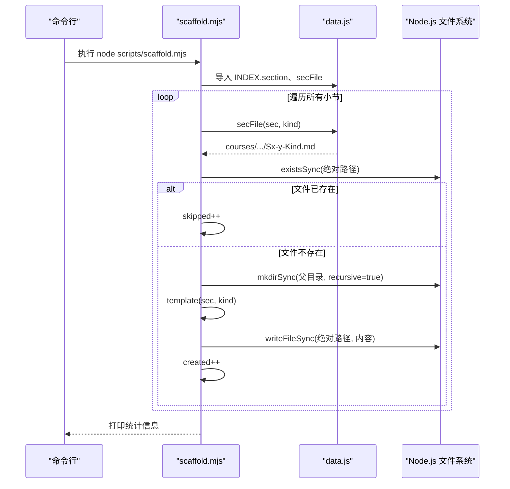
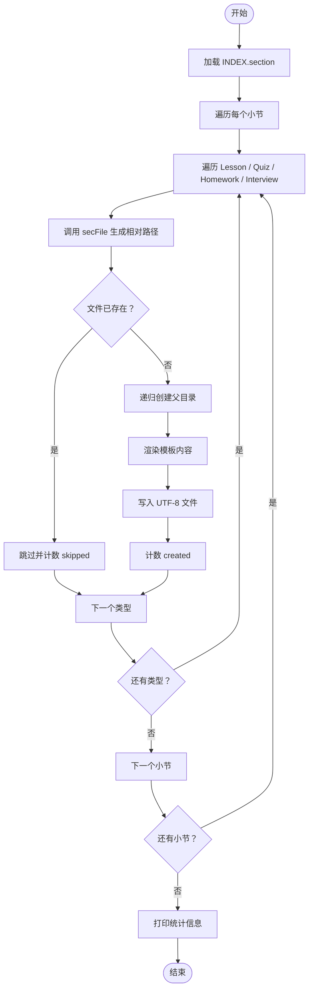
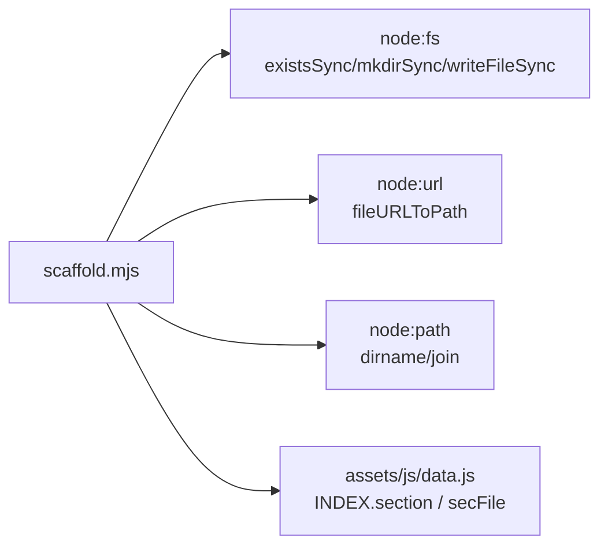

# 脚手架工具

<cite>
**本文引用的文件**   
- [scaffold.mjs](file://scripts/scaffold.mjs)
- [data.js](file://assets/js/data.js)
</cite>

## 目录
1. [简介](#简介)
2. [项目结构](#项目结构)
3. [核心组件](#核心组件)
4. [架构总览](#架构总览)
5. [详细组件分析](#详细组件分析)
6. [依赖关系分析](#依赖关系分析)
7. [性能与行为特征](#性能与行为特征)
8. [故障排查指南](#故障排查指南)
9. [结论](#结论)
10. [附录：使用示例与模板定制](#附录使用示例与模板定制)

## 简介
本脚手架工具 `scripts/scaffold.mjs` 用于根据课程索引数据，批量为每个小节生成四类 Markdown 占位文件：课程、小测验、作业题、面试题。它只创建缺失的文件，不会覆盖已有内容；同时为占位文件注入标题和“待补充”提示，使校验脚本对非小测文件“至少有一个二级标题”的要求通过，并让小测验在未补录题目时以“手动过关”模式运行，不阻断解锁链。

该工具的核心输入是前端课程索引 `assets/js/data.js` 中的 `INDEX.section`，输出位于 `courses/<课程包ID>/<阶段ID>/Sx-y-<类型>.md`。

## 项目结构
脚手架相关代码集中在 `scripts/` 目录，课程骨架事实源在前端资源 `assets/js/data.js` 中。

**图示来源**
- [scaffold.mjs:1-55](file://scripts/scaffold.mjs#L1-L55)
- [data.js:991-1022](file://assets/js/data.js#L991-L1022)

**章节来源**
- [scaffold.mjs:1-55](file://scripts/scaffold.mjs#L1-L55)
- [data.js:991-1022](file://assets/js/data.js#L991-L1022)

## 核心组件
- 批量遍历器：读取 `INDEX.section`，按课程包、阶段、小节维度循环。
- 文件路径生成器：基于 `secDir` 与 `secFile` 计算目标相对路径。
- 模板渲染器：根据小节元数据和文件类型生成不同占位内容。
- 文件系统操作：判断文件是否存在、递归创建目录、写入 UTF-8 文本。
- 统计输出：打印小节总数、目标文件数、新建数量、跳过数量。

**章节来源**
- [scaffold.mjs:1-55](file://scripts/scaffold.mjs#L1-L55)
- [data.js:991-1022](file://assets/js/data.js#L991-L1022)

## 架构总览
脚手架的运行流程如下：

**图示来源**
- [scaffold.mjs:1-55](file://scripts/scaffold.mjs#L1-L55)
- [data.js:1015-1022](file://assets/js/data.js#L1015-L1022)

## 详细组件分析

### 命令行参数与用法
当前脚手架没有解析任何命令行参数。它的行为完全由以下因素决定：
- 工作目录：脚本所在目录的上级作为仓库根。
- 课程索引：从 `assets/js/data.js` 导出的 `INDEX.section`。
- 文件存在性：若目标文件已存在则跳过。

因此，不存在“课程包 ID、名称、阶段编号、小节编号”等显式命令行参数。这些概念在工具内部通过 `INDEX.section` 的小节对象隐式表达。

| 概念 | 含义 | 在脚手架中的体现 |
| --- | --- | --- |
| 课程包 ID | 课程包的唯一标识，如 `java-basics`、`spring-boot` | 小节对象的 `pkg` 字段，用于构建 `courses/<pkg>/...` |
| 名称 | 课程包或阶段的展示名 | 不参与文件名生成，仅用于人类阅读 |
| 阶段编号 | 阶段 ID，如 `s1`、`s2` | 小节对象的 `stage` 字段，用于构建 `courses/<pkg>/<stage>/...` |
| 小节编号 | 小节 ID，如 `s1-1`、`s2-3` | 小节对象的 `id` 字段，最终转为大写 `S1-1` 参与文件名 |

**章节来源**
- [scaffold.mjs:11-13](file://scripts/scaffold.mjs#L11-L13)
- [scaffold.mjs:41-51](file://scripts/scaffold.mjs#L41-L51)
- [data.js:991-1008](file://assets/js/data.js#L991-L1008)
- [data.js:1015-1022](file://assets/js/data.js#L1015-L1022)

### 模板文件结构与占位符替换规则
脚手架为每类文件生成不同的占位内容，但都遵循统一命名约定：`Sx-y-<类型>.md`。

#### 文件命名约定
- 目录路径：`courses/<课程包ID>/<阶段ID>`
- 文件名：`<阶段编号大写>-<小节编号大写>-<类型>.md`
- 类型集合：`Lesson`、`Quiz`、`Homework`、`Interview`

例如：
- `courses/java-basics/s1/S1-1-Lesson.md`
- `courses/spring-boot/s2/S2-3-Quiz.md`

#### 占位内容规则
- **课程 Lesson**：标题包含小节标题；首行附带知识点摘要；正文包含“待补充”二级标题与写作提示。
- **小测验 Quiz**：标题包含“· 小测验”；正文说明占位期间以前端“手动过关”方式处理；给出题型格式约定，包括题干编号、分值、多选标记、答案行、简答题要点列表，并要求全卷总分合计为 100。
- **作业题 Homework**：标题包含“· 作业题”；正文给出作业题写作提示，要求布置可动手验证的应用题，附验收标准与参考解法。
- **面试题 Interview**：标题包含“· 面试题”；正文给出面试追问链与期望答题要点提示。

占位内容中的关键信息来自小节对象：
- `title`：小节标题
- `summary`：知识点摘要（仅用于 Lesson）

**章节来源**
- [scaffold.mjs:13-39](file://scripts/scaffold.mjs#L13-L39)
- [data.js:1015-1022](file://assets/js/data.js#L1015-L1022)

### 批量生成功能
脚手架会遍历 `INDEX.section` 中的所有小节，并为每个小节生成四种类型的文件。其核心逻辑如下：

**图示来源**
- [scaffold.mjs:41-55](file://scripts/scaffold.mjs#L41-L55)

**章节来源**
- [scaffold.mjs:41-55](file://scripts/scaffold.mjs#L41-L55)

### 文件路径组织与 ID 冲突检测机制
- 路径组织：由 `secDir` 和 `secFile` 共同决定，先确定课程包与阶段目录，再拼接大写编号与类型后缀。
- 大小写处理：小节 ID 在文件名中使用大写形式，而索引键与路由使用小写形式；注释明确说明 Windows 文件系统不区分大小写，两者不会冲突。
- 冲突检测：脚手架本身不做显式 ID 冲突检测，而是依赖文件系统存在性检查。如果目标文件已存在，直接跳过；如果同名文件已被其他流程创建，也不会被覆盖。

需要注意：
- 如果希望强制重建某个小节的所有文件，需要先删除对应目录下的旧文件，再重新运行脚手架。
- 如果 `INDEX.section` 中存在重复小节键，后续覆盖前一个；这是索引构建阶段的语义，不是脚手架直接负责的部分。

**章节来源**
- [data.js:1015-1022](file://assets/js/data.js#L1015-L1022)
- [scaffold.mjs:41-51](file://scripts/scaffold.mjs#L41-L51)

### 错误处理与异常情况
脚手架的错误处理策略偏简单：
- 未捕获异常：没有 try-catch 包裹文件读写或模板渲染逻辑，遇到权限不足、磁盘空间不足、路径非法等情况会直接抛出异常。
- 文件存在性：使用 `existsSync` 判断，避免覆盖已有内容。
- 目录创建：使用 `mkdirSync` 并开启 `recursive`，确保父目录自动创建。
- 编码：使用 `utf8` 写入，保证中文内容正确保存。

常见异常场景与建议：
- 权限不足：以管理员或具备写入权限的用户运行 Node。
- 磁盘空间不足：清理磁盘后再运行。
- 路径过长或非法字符：检查课程包 ID、阶段 ID、小节 ID 是否包含系统不允许的字符。
- 文件被占用：关闭可能锁定文件的编辑器或进程后重试。

**章节来源**
- [scaffold.mjs:6-9](file://scripts/scaffold.mjs#L6-L9)
- [scaffold.mjs:41-51](file://scripts/scaffold.mjs#L41-L51)

## 依赖关系分析
脚手架对外部模块的依赖较少，主要依赖 Node.js 内置模块和前端课程索引。

**图示来源**
- [scaffold.mjs:6-9](file://scripts/scaffold.mjs#L6-L9)
- [scaffold.mjs:41-51](file://scripts/scaffold.mjs#L41-L51)
- [data.js:991-1022](file://assets/js/data.js#L991-L1022)

**章节来源**
- [scaffold.mjs:6-9](file://scripts/scaffold.mjs#L6-L9)
- [data.js:991-1022](file://assets/js/data.js#L991-L1022)

## 性能与行为特征
- 时间复杂度：近似 O(N × K)，其中 N 是小节数量，K 是文件类型数量（固定为 4）。
- I/O 行为：对每个目标文件进行一次存在性检查；只对缺失文件进行目录创建和文件写入。
- 幂等性：多次运行不会产生重复文件，已存在文件会被跳过。
- 内存占用：较低，主要存储索引引用和少量临时字符串。

优化建议：
- 如果只需要为特定课程包生成骨架，可在 `INDEX.section` 外部增加过滤逻辑，减少遍历范围。
- 如果需要增量更新，可记录上次生成的哈希或时间戳，避免重复写入相同内容。

[本节为通用性能讨论，不直接分析具体代码片段]

## 故障排查指南
| 现象 | 可能原因 | 处理方法 |
| --- | --- | --- |
| 运行后立即报错 | Node 环境异常、权限不足、路径非法 | 检查 Node 版本、运行用户权限、仓库路径 |
| 部分文件未生成 | 对应小节已在 `INDEX.section` 之外被删除，或路径存在权限问题 | 检查 `data.js` 中小节定义、确认 `courses` 目录可写 |
| 文件内容乱码 | 编码设置错误或编辑器显示编码不一致 | 确认文件以 UTF-8 保存，编辑器设置为 UTF-8 |
| 小测验无法判分 | 未按照 Quiz 模板约定的题型格式填写 | 按模板提示补录题干、答案、要点，并确保总分合计为 100 |
| 校验脚本失败 | 占位文件缺少二级标题或格式不符合规范 | 保留“待补充”二级标题，并按类型提示补充内容 |

**章节来源**
- [scaffold.mjs:1-5](file://scripts/scaffold.mjs#L1-L5)
- [scaffold.mjs:16-39](file://scripts/scaffold.mjs#L16-L39)

## 结论
`scaffold.mjs` 是一个轻量、幂等、面向课程骨架的批量生成工具。它把课程索引作为唯一事实源，自动生成四类 Markdown 占位文件，并通过“待补充”内容满足基础校验要求。对于需要扩展的场景，推荐优先修改模板函数和路径生成逻辑，而不是绕过脚手架直接手写文件。

[本节为总结性内容，不直接分析具体代码片段]

## 附录：使用示例与模板定制

### 从零开始创建新课程的完整流程
1. 在 `assets/js/data.js` 中添加新的课程包、阶段和小节定义。
2. 运行脚手架：`node scripts/scaffold.mjs`。
3. 查看控制台输出，确认新建文件数量和跳过数量。
4. 打开 `courses/<课程包>/<阶段>/Sx-y-Lesson.md` 等文件，按模板提示补充内容。
5. 运行项目的校验脚本（如有），确认格式符合要求。
6. 提交变更并进入后续开发与发布流程。

**章节来源**
- [scaffold.mjs:1-5](file://scripts/scaffold.mjs#L1-L5)
- [data.js:991-1022](file://assets/js/data.js#L991-L1022)

### 模板定制指南
如需调整默认模板：
- 修改 `template` 函数中的标题、引导语、提示文案。
- 为 Quiz 添加更多题型约定或评分规则。
- 为 Lesson/Homework/Interview 调整写作视角和行业案例提示。
- 如需新增文件类型，扩展 `KINDS` 数组并在模板函数中补充对应分支。

注意：
- 保持 Quiz 总分合计为 100 的约定，否则前端判分契约可能不符合预期。
- 保持“待补充”二级标题存在，以避免校验脚本对非小测文件报缺标题错误。
- 保持文件命名与路径生成逻辑一致，避免前端无法定位内容文件。

**章节来源**
- [scaffold.mjs:13-39](file://scripts/scaffold.mjs#L13-L39)