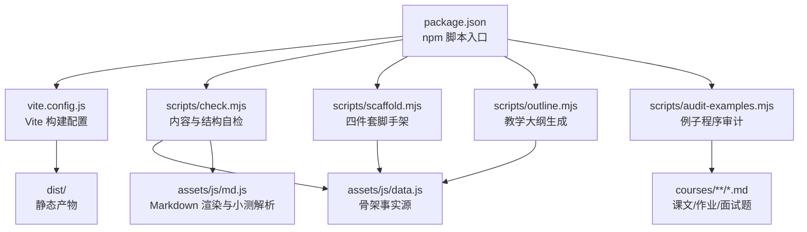
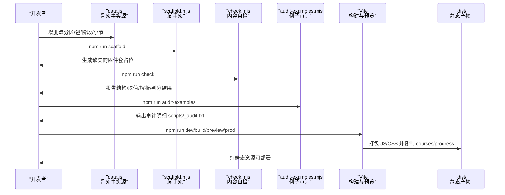
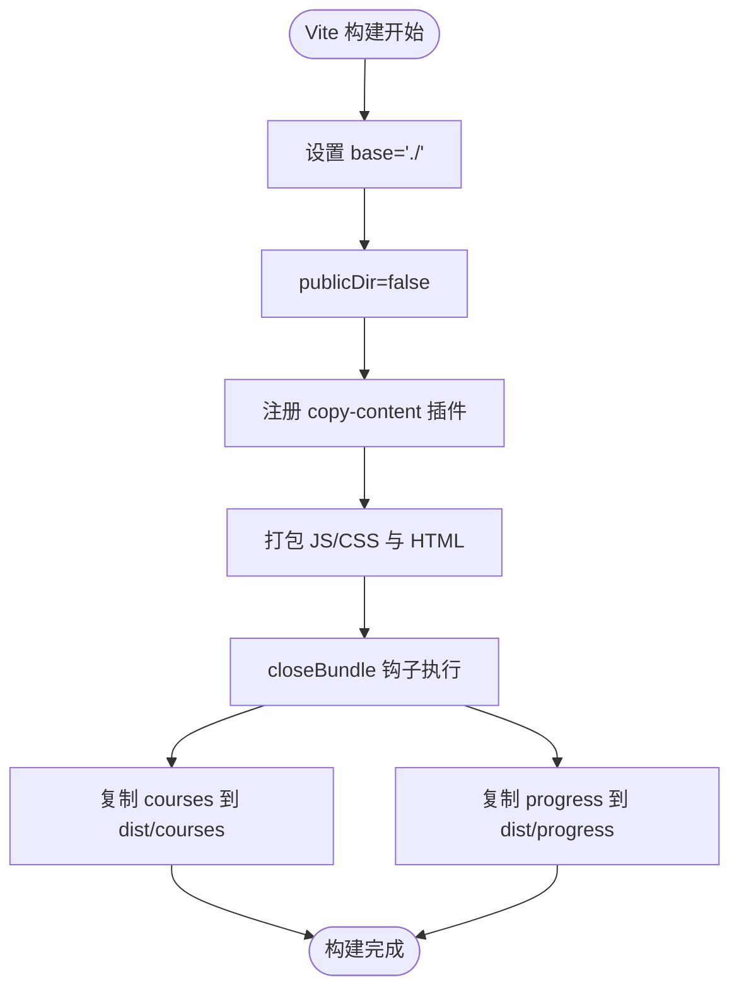
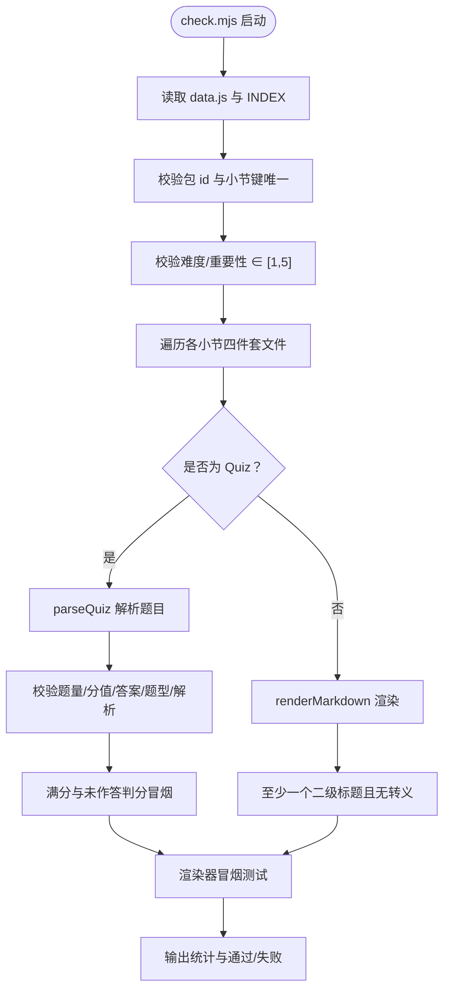
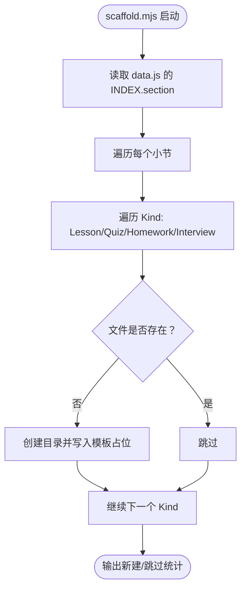
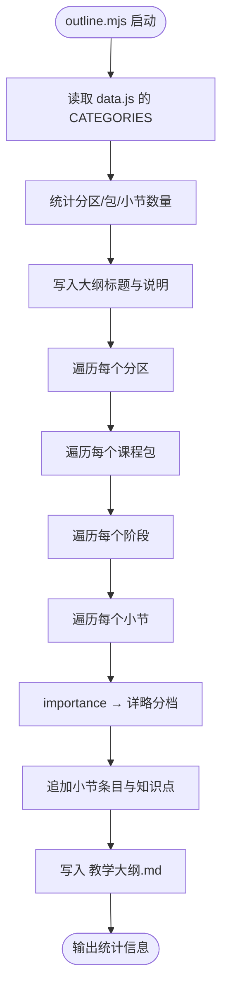
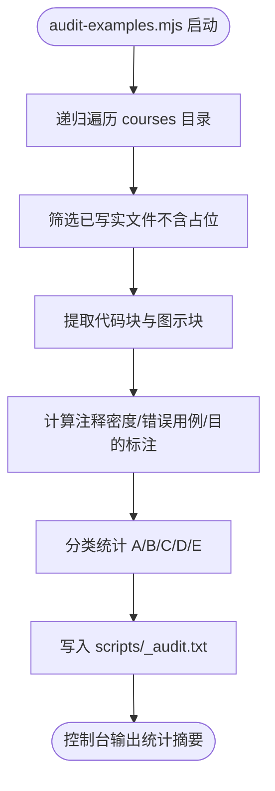
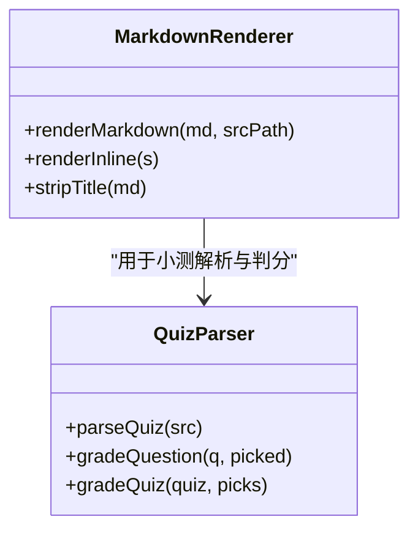
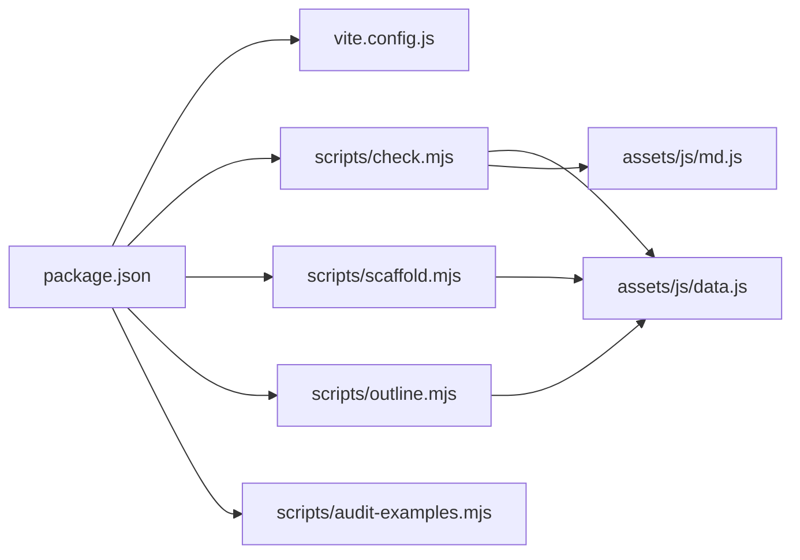
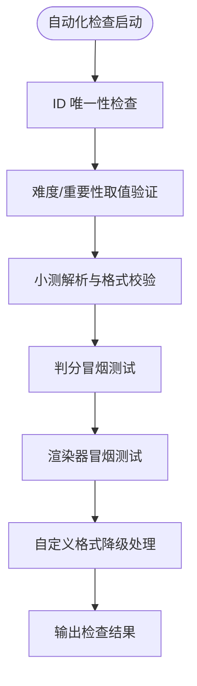

# 开发工具

<cite>
**本文引用的文件**   
- [vite.config.js](file://vite.config.js)
- [package.json](file://package.json)
- [scripts/check.mjs](file://scripts/check.mjs)
- [scripts/scaffold.mjs](file://scripts/scaffold.mjs)
- [scripts/outline.mjs](file://scripts/outline.mjs)
- [scripts/audit-examples.mjs](file://scripts/audit-examples.mjs)
- [assets/js/data.js](file://assets/js/data.js)
- [assets/js/md.js](file://assets/js/md.js)
- [README.md](file://README.md)
</cite>

## 目录
1. [引言](#引言)
2. [项目结构](#项目结构)
3. [核心组件](#核心组件)
4. [架构总览](#架构总览)
5. [详细组件分析](#详细组件分析)
6. [依赖关系分析](#依赖关系分析)
7. [性能优化策略](#性能优化策略)
8. [自动化检查机制](#自动化检查机制)
9. [开发工作流与最佳实践](#开发工作流与最佳实践)
10. [故障排查指南](#故障排查指南)
11. [结论](#结论)

## 引言
本文件面向“大Java后端学习平台”的开发者与维护者，系统性说明构建系统、内容工具链与自动化质量保障机制。文档重点覆盖：
- Vite 构建配置：端口、相对 base、自定义插件 copy-content、构建产物策略。
- 内容工具脚本：check.mjs（结构与内容自检）、scaffold.mjs（脚手架）、outline.mjs（教学大纲生成）、audit-examples.mjs（例子程序审计）。
- 开发工作流：如何高效添加课程、进行内容质量检查、生成和维护教学大纲。
- 自动化检查：包与小节 ID 唯一性、难度和重要性取值验证、小测可解析性与判分冒烟测试等。
- 性能优化：文件哈希命名、缓存机制、按需加载等实现方式。
- 开发最佳实践：代码规范、提交流程、调试技巧。

## 项目结构
仓库采用“骨架事实源 + Markdown 内容 + Vite 构建 + Node 工具脚本”的组织方式：
- `assets/js/data.js` 是全站唯一的骨架事实源，定义分区、课程包、阶段、小节及其元数据。
- `courses/` 下按“包 / 阶段 / 小节四件套”组织 Markdown 内容。
- `scripts/` 提供脚手架、大纲生成、内容自检、例子程序审计等工具。
- `vite.config.js` 与 `package.json` 负责开发、构建、预览与脚本入口。
- `README.md` 提供整体说明、运行方式与扩展流程。

**图表来源**
- [package.json:7-15](file://package.json#L7-L15)
- [vite.config.js:27-34](file://vite.config.js#L27-L34)
- [scripts/check.mjs:1-119](file://scripts/check.mjs#L1-L119)
- [scripts/scaffold.mjs:1-55](file://scripts/scaffold.mjs#L1-L55)
- [scripts/outline.mjs:1-69](file://scripts/outline.mjs#L1-L69)
- [scripts/audit-examples.mjs:1-71](file://scripts/audit-examples.mjs#L1-L71)
- [assets/js/data.js:1-8](file://assets/js/data.js#L1-L8)
- [assets/js/md.js:1-10](file://assets/js/md.js#L1-L10)

**章节来源**
- [README.md:13-34](file://README.md#L13-L34)
- [README.md:145-170](file://README.md#L145-L170)

## 核心组件
本节聚焦构建系统与内容工具的核心职责与交互关系。

- Vite 构建配置
  - 使用相对 base 路径，便于部署到任意子路径或静态托管。
  - 关闭默认 publicDir，改用自定义插件将 courses 与 progress 复制到 dist。
  - 开发服务器端口 5180，生产预览端口 8080。
  - 构建输出到 dist，清空旧目录，目标 ES2020。

- 内容工具脚本
  - check.mjs：校验目录结构完整性、ID 唯一性、难度/重要性取值、小测解析与判分冒烟、渲染器冒烟测试。
  - scaffold.mjs：根据 data.js 为每个小节批量创建 Lesson/Quiz/Homework/Interview 占位文件，幂等不覆盖已有内容。
  - outline.mjs：从 data.js 生成《教学大纲.md》，同步分区、包、阶段、小节与详略分档。
  - audit-examples.mjs：扫描已写实课文/作业/面试题中的例子程序，统计注释密度、错误用例标注、图示目的说明等。

- 骨架事实源与渲染器
  - data.js：定义 CATEGORIES → packages → stages → sections，驱动首页、地图、解锁链路、大纲与脚手架。
  - md.js：自写 Markdown 渲染器，支持标题、列表、表格、代码块、引用、链接；内置小测解析 parseQuiz 与判分 gradeQuiz。

**章节来源**
- [vite.config.js:8-34](file://vite.config.js#L8-L34)
- [scripts/check.mjs:1-119](file://scripts/check.mjs#L1-L119)
- [scripts/scaffold.mjs:1-55](file://scripts/scaffold.mjs#L1-L55)
- [scripts/outline.mjs:1-69](file://scripts/outline.mjs#L1-L69)
- [scripts/audit-examples.mjs:1-71](file://scripts/audit-examples.mjs#L1-L71)
- [assets/js/data.js:1-8](file://assets/js/data.js#L1-L8)
- [assets/js/md.js:1-10](file://assets/js/md.js#L1-L10)

## 架构总览
下图展示开发到产物的完整流程：开发者在 data.js 中维护骨架，通过脚手架补齐内容骨架，用 Markdown 编写正文与小测；check.mjs 与 audit-examples.mjs 做质量门禁；Vite 构建后由 copy-content 插件复制运行时需要的 Markdown 目录到 dist。

**图表来源**
- [package.json:7-15](file://package.json#L7-L15)
- [scripts/scaffold.mjs:1-55](file://scripts/scaffold.mjs#L1-L55)
- [scripts/check.mjs:1-119](file://scripts/check.mjs#L1-L119)
- [scripts/audit-examples.mjs:1-71](file://scripts/audit-examples.mjs#L1-L71)
- [vite.config.js:27-34](file://vite.config.js#L27-L34)

## 详细组件分析

### Vite 构建配置与 copy-content 插件
- 相对 base 路径：使产物可部署到任意子路径，配合 hash 路由与静态托管。
- 关闭 publicDir：避免 courses/ 与 progress/ 被当作静态资源直接暴露，改为构建末尾手动复制。
- 自定义插件 copy-content：
  - 名称：copy-content
  - 应用时机：仅在 build 阶段生效
  - 行为：closeBundle 钩子中将 courses 与 progress 递归复制到 dist 对应位置
- 开发/预览端口：开发 5180，预览 8080，host 开启以局域网访问。
- 构建选项：outDir=dist，emptyOutDir=true，target=es2020。

**图表来源**
- [vite.config.js:8-34](file://vite.config.js#L8-L34)

**章节来源**
- [vite.config.js:8-34](file://vite.config.js#L8-L34)

### 内容工具脚本：check.mjs
功能要点：
- 目录结构唯一性检查：遍历 data.js 的 CATEGORIES，校验课程包 id 唯一、小节键唯一。
- 难度与重要性取值验证：确保 1~5 范围内。
- 内容文件检查与解析：
  - 对 Quiz 文件：解析题目数量、分值合计应为 100、客观题答案格式、判断题选项数、简答题关键词、满分与未作答得分回归。
  - 对非 Quiz 文件：确保至少有一个二级标题，且无结构转义异常。
- 渲染器冒烟测试：表格、代码块、目录抽取、行内语法边界、stripTitle 行为。
- 自定义格式小测降级：无法解析标准题时 total=0，前端降级为文档展示。

**图表来源**
- [scripts/check.mjs:1-119](file://scripts/check.mjs#L1-L119)
- [assets/js/md.js:168-338](file://assets/js/md.js#L168-L338)

**章节来源**
- [scripts/check.mjs:1-119](file://scripts/check.mjs#L1-L119)
- [assets/js/md.js:168-338](file://assets/js/md.js#L168-L338)

### 内容工具脚本：scaffold.mjs
功能要点：
- 依据 data.js 的 INDEX.section，为每个小节生成 Lesson/Quiz/Homework/Interview 四个 Markdown 占位文件。
- 幂等：若文件已存在则跳过，绝不覆盖已有内容。
- 占位模板：
  - Quiz 占位不含标准题（### N.），会被 check.mjs 与前端一起降级为“手动过关”模式，不影响后续小节解锁。
  - Lesson/Homework/Interview 占位包含提示语与待补充说明，保证 check.mjs 对非小测文件“至少有一个二级标题”的要求通过。

**图表来源**
- [scripts/scaffold.mjs:1-55](file://scripts/scaffold.mjs#L1-L55)
- [assets/js/data.js:1-8](file://assets/js/data.js#L1-L8)

**章节来源**
- [scripts/scaffold.mjs:1-55](file://scripts/scaffold.mjs#L1-L55)

### 内容工具脚本：outline.mjs
功能要点：
- 从 data.js 的 CATEGORIES 生成《教学大纲.md》。
- 详略分档映射 importance 到讲解深度（核心精讲/重点标准/标准概览/简明速览/了解即可）。
- 输出总览、推荐学习路径、详略图例，并按分区/包/阶段/小节列出知识点清单。

**图表来源**
- [scripts/outline.mjs:1-69](file://scripts/outline.mjs#L1-L69)
- [assets/js/data.js:1-8](file://assets/js/data.js#L1-L8)

**章节来源**
- [scripts/outline.mjs:1-69](file://scripts/outline.mjs#L1-L69)

### 内容工具脚本：audit-examples.mjs
功能要点：
- 扫描 courses 下的 Lesson/Homework/Interview 已写实文件（不含占位）。
- 提取带语言标记的代码块（排除流程图、Mermaid、文本图等）。
- 统计：
  - 是否包含错误用例标注（如“错误/反例/违规/异常/Exception/❌/✗/不合法”）。
  - 注释密度（含中文说明关键词的行占比）。
  - 图示块是否缺少“目的”说明。
- 输出分类统计（A/B/C/D/E）并写入 scripts/_audit.txt。

**图表来源**
- [scripts/audit-examples.mjs:1-71](file://scripts/audit-examples.mjs#L1-L71)

**章节来源**
- [scripts/audit-examples.mjs:1-71](file://scripts/audit-examples.mjs#L1-L71)

### Markdown 渲染与小测解析（assets/js/md.js）
- 渲染器能力：标题、段落、列表、表格、代码块、引用、粗斜体、行内代码、链接、分隔线。
- 站内链接处理：将相对 .md 链接转换为 hash 路由，跨课程互链打开渲染后的课程页。
- stripTitle：去掉正文首部的一级标题，避免页面头部重复 h1。
- 小测解析 parseQuiz：
  - 支持多种题型：单选、多选、判断、填空、简答。
  - 题干可显式标注分值，否则全卷平均分配。
  - 答案与解析支持行内与末尾统一答案段。
- 判分逻辑 gradeQuestion/gradeQuiz：
  - 客观题精确匹配字母串。
  - 填空题多答案匹配。
  - 简答题按要点主干与片段命中率给部分分。
  - 整卷评分保留精确值，仅展示层取整，避免溢出 100。

**图表来源**
- [assets/js/md.js:1-166](file://assets/js/md.js#L1-L166)
- [assets/js/md.js:168-338](file://assets/js/md.js#L168-L338)

**章节来源**
- [assets/js/md.js:1-166](file://assets/js/md.js#L1-L166)
- [assets/js/md.js:168-338](file://assets/js/md.js#L168-L338)

## 依赖关系分析
- package.json 暴露 npm 脚本：dev/build/preview/prod/check/scaffold/outline/audit-examples。
- vite.config.js 依赖 Node fs/url/path 模块，并在构建阶段复制 courses/progress。
- check.mjs 依赖 assets/js/data.js 与 assets/js/md.js，用于骨架遍历与渲染/判分。
- scaffold.mjs 依赖 assets/js/data.js，用于生成占位文件。
- outline.mjs 依赖 assets/js/data.js，用于生成教学大纲。
- audit-examples.mjs 独立扫描 courses 目录，不依赖前端模块。

**图表来源**
- [package.json:7-15](file://package.json#L7-L15)
- [vite.config.js:1-4](file://vite.config.js#L1-L4)
- [scripts/check.mjs:4-8](file://scripts/check.mjs#L4-L8)
- [scripts/scaffold.mjs:6-9](file://scripts/scaffold.mjs#L6-L9)
- [scripts/outline.mjs:3-6](file://scripts/outline.mjs#L3-L6)

**章节来源**
- [package.json:1-21](file://package.json#L1-L21)
- [vite.config.js:1-34](file://vite.config.js#L1-L34)
- [scripts/check.mjs:1-119](file://scripts/check.mjs#L1-L119)
- [scripts/scaffold.mjs:1-55](file://scripts/scaffold.mjs#L1-L55)
- [scripts/outline.mjs:1-69](file://scripts/outline.mjs#L1-L69)
- [scripts/audit-examples.mjs:1-71](file://scripts/audit-examples.mjs#L1-L71)

## 性能优化策略
- 文件哈希命名：Vite 构建时对 JS/CSS 等资源按内容生成哈希文件名，浏览器缓存自动失效，无需手动维护版本号。
- 缓存机制：
  - 开发期 dev server 不强缓存，修改即时生效。
  - 生产构建产物交给静态服务器（Nginx/CDN）缓存，结合哈希名提升命中效率。
- 按需加载：
  - 课程内容以 Markdown 形式存在 courses/ 目录，运行时按需 fetch，减少首屏体积。
  - copy-content 插件仅在构建末尾复制 courses/progress 到 dist，避免不必要的打包开销。
- 构建目标：target=es2020，兼顾现代浏览器兼容性与压缩效果。

**章节来源**
- [README.md:64-67](file://README.md#L64-L67)
- [README.md:100-103](file://README.md#L100-L103)
- [vite.config.js:27-34](file://vite.config.js#L27-L34)

## 自动化检查机制
- 包与小节 ID 唯一性：遍历 CATEGORIES，记录 pkgIds 与 secIds，重复即报错。
- 难度与重要性取值验证：确保 1~5 范围。
- 小测可解析性测试：
  - 题目数量与声明一致。
  - 分值合计为 100。
  - 客观题答案格式校验（A-H 字母串）。
  - 判断题选项数为 2。
  - 简答题关键词不为空。
  - 满分与未作答得分回归（满分 100，未作答 0）。
  - 选择题预期答案必须为字母串，防止重做场景归零。
  - 简答部分命中应得部分分（0~1 之间）。
- 渲染器冒烟测试：表格、代码块、目录抽取、行内语法边界、stripTitle 行为。
- 自定义格式小测降级：无法解析标准题时 total=0，前端降级为文档展示，不阻断解锁链。

**图表来源**
- [scripts/check.mjs:14-119](file://scripts/check.mjs#L14-L119)
- [assets/js/md.js:168-338](file://assets/js/md.js#L168-L338)

**章节来源**
- [scripts/check.mjs:14-119](file://scripts/check.mjs#L14-L119)
- [assets/js/md.js:168-338](file://assets/js/md.js#L168-L338)

## 开发工作流与最佳实践
- 添加新课程：
  - 在 assets/js/data.js 中新增分区/包/阶段/小节。
  - 运行 npm run scaffold 补齐四件套占位。
  - 运行 npm run outline 重新生成《教学大纲.md》。
  - 运行 npm run check 进行结构与内容自检。
- 内容质量检查：
  - 使用 npm run check 确保 ID 唯一、取值合法、小测可解析与判分正确。
  - 使用 npm run audit-examples 审计例子程序注释密度、错误用例标注、图示目的说明。
- 教学大纲维护：
  - 每次修改 data.js 后运行 npm run outline，保持大纲与骨架一致。
- 开发与调试：
  - 开发模式：npm run dev（http://localhost:5180），热更新即时生效。
  - 生产预览：npm run prod（先 check → build → preview，http://localhost:8080）。
  - 局域网访问：Vite host 已开启，使用本机局域网 IP 访问。
- 提交流程：
  - git add -A → git commit -m “day: 学了 xxx” → git push。
  - 提交前建议先运行 npm run check 与 npm run audit-examples。
- 最佳实践：
  - 只改 data.js 一处骨架，其他内容由工具派生。
  - 小测遵循约定格式，确保自动判分可用。
  - 例子程序五条硬性规范：必带注释、行注释讲影响与结果、定义必配应用、逐知识点正确用例、必备错误用例。

**章节来源**
- [README.md:89-117](file://README.md#L89-L117)
- [README.md:118-143](file://README.md#L118-L143)

## 故障排查指南
- 小测解析失败：
  - 检查题干是否以“### N.”开头，选项是否以“A./B./...”格式。
  - 确认答案与解析格式符合约定（行内或末尾统一答案段）。
  - 查看 check.mjs 输出的具体错误信息，定位题号与问题类型。
- 分值合计不为 100：
  - 若显式标注分值，确保总和为 100；否则自动平均分配。
- 渲染异常：
  - 检查是否出现结构转义（如 <h2> 被转义），确保二级标题存在。
  - 行内语法边界：加粗内含星号、下划线、链接时需特别注意。
- 例子程序审计不通过：
  - 确保每个例子有目的注释、行注释说明影响与结果。
  - 包含错误用例并注释后果/异常。
  - 提高注释密度（≥35%），图示块需包含“目的”说明。

**章节来源**
- [scripts/check.mjs:43-119](file://scripts/check.mjs#L43-L119)
- [scripts/audit-examples.mjs:30-71](file://scripts/audit-examples.mjs#L30-L71)

## 结论
本开发工具文档系统梳理了“大Java后端学习平台”的构建系统与辅助工具链。通过 Vite 构建配置与自定义插件，实现了高效的开发与部署流程；通过内容工具脚本与自动化检查机制，保障了内容质量与一致性；通过性能优化策略与最佳实践，提升了开发效率与代码质量。开发者可据此快速上手，高效扩展课程、维护内容质量，并持续改进平台体验。