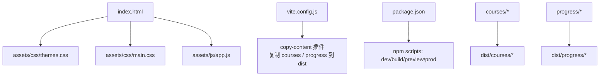
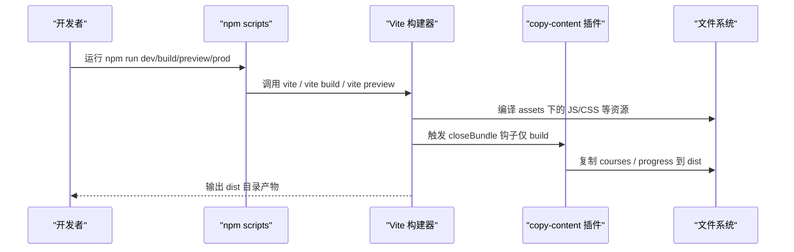
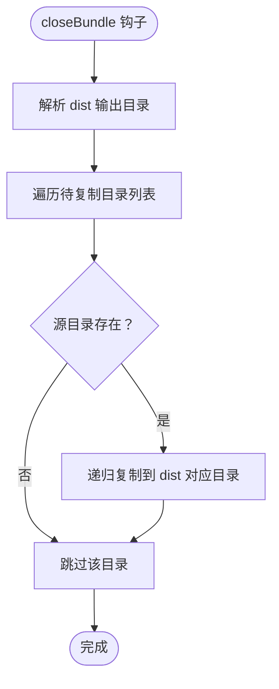
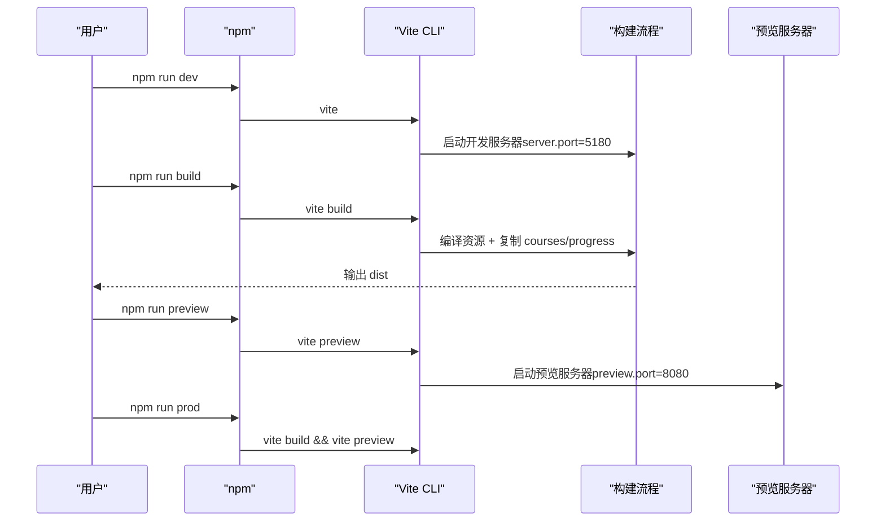
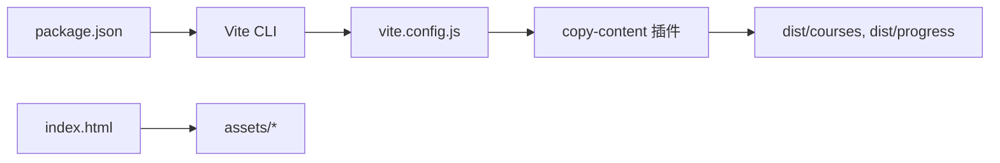

# 构建系统

<cite>
**本文引用的文件**   
- [vite.config.js](file://vite.config.js)
- [package.json](file://package.json)
- [index.html](file://index.html)
</cite>

## 目录
1. [简介](#简介)
2. [项目结构](#项目结构)
3. [核心组件](#核心组件)
4. [架构总览](#架构总览)
5. [详细组件分析](#详细组件分析)
6. [依赖关系分析](#依赖关系分析)
7. [性能与优化策略](#性能与优化策略)
8. [常见问题排查](#常见问题排查)
9. [结论](#结论)

## 简介
本构建系统基于 Vite，用于构建一个纯静态前端站点。站点内容包含课程 Markdown 文档与学习进度数据，这些内容在运行时通过 fetch 按需加载。构建配置重点包括：
- 开发服务器端口、预览端口与 host 设置
- 相对 base 路径，便于部署到任意子路径或静态托管服务
- 自定义插件 copy-content，将 courses 与 progress 目录复制到 dist
- npm scripts 提供 dev/build/preview/prod 等常用命令
- 构建产物采用现代 ES 目标，配合哈希命名与资源压缩等默认优化

## 项目结构
本项目是一个以 Vite 驱动的纯静态站点：
- index.html 为入口页面，引入 CSS 与 JS 模块
- assets 目录存放样式与脚本
- courses 与 progress 目录为运行时按需加载的 Markdown 与进度数据
- vite.config.js 定义构建行为与自定义插件
- package.json 定义 npm scripts 与依赖

图表来源
- [index.html:1-48](file://index.html#L1-L48)
- [vite.config.js:1-35](file://vite.config.js#L1-L35)
- [package.json:1-21](file://package.json#L1-L21)

章节来源
- [index.html:1-48](file://index.html#L1-L48)
- [vite.config.js:1-35](file://vite.config.js#L1-L35)
- [package.json:1-21](file://package.json#L1-L21)

## 核心组件
- Vite 配置（vite.config.js）
  - base 设置为相对路径，使应用可部署到任意子路径
  - publicDir 关闭，避免与手动复制的内容冲突
  - plugins 注册 copy-content 插件，仅在 build 阶段执行
  - server 与 preview 分别配置开发与预览端口
  - build.outDir 指定输出目录，并清空旧产物；target 设为 es2020
- NPM Scripts（package.json）
  - dev：启动 Vite 开发服务器
  - build：执行生产构建
  - preview：预览构建产物
  - prod：先构建再预览
- 入口页面（index.html）
  - 引入主题与主样式、JS 模块
  - 使用 hash 路由（如 #/map、#/progress），与 base 相对路径配合

章节来源
- [vite.config.js:1-35](file://vite.config.js#L1-L35)
- [package.json:1-21](file://package.json#L1-L21)
- [index.html:1-48](file://index.html#L1-L48)

## 架构总览
下图展示了从 npm 脚本到 Vite 构建再到最终产物的流程，以及 copy-content 插件在构建末尾将运行时内容复制到 dist 的过程。

图表来源
- [package.json:7-15](file://package.json#L7-L15)
- [vite.config.js:13-25](file://vite.config.js#L13-L25)

## 详细组件分析

### Vite 配置与端口设置
- 开发服务器端口
  - 当前配置中 server.port 为 5180，并非 3000。若需改为 3000，可在 server.port 中调整。
- 预览端口
  - preview.port 为 8080，用于预览构建产物。
- host 与 strictPort
  - host 为 true，允许局域网访问；strictPort 为 false，端口被占用时自动尝试其他端口。
- base 路径
  - base 设置为 './'，即相对路径，适合部署到任意子路径或静态托管环境。
- 构建输出
  - outDir 为 'dist'，emptyOutDir 为 true，确保每次构建前清空旧产物；target 为 'es2020'，生成现代浏览器兼容的代码。

章节来源
- [vite.config.js:27-34](file://vite.config.js#L27-L34)

### 自定义插件 copy-content 的实现原理
该插件用于在构建结束时，将 courses 与 progress 目录复制到 dist 对应位置。其关键点如下：
- 生命周期钩子
  - apply: 'build'，仅在构建阶段生效，不影响开发服务器。
  - closeBundle()，在打包完成后执行复制逻辑。
- 路径解析
  - 使用 fileURLToPath 与 path.resolve 解析绝对路径，确保跨平台一致性。
- 复制逻辑
  - 遍历传入的目录列表，检查源目录是否存在，存在则递归复制到 dist 下同名目录。
- 与 publicDir 的关系
  - publicDir 设置为 false，避免 Vite 默认处理 static 资源，从而由插件统一接管 courses 与 progress 的复制。

图表来源
- [vite.config.js:13-25](file://vite.config.js#L13-L25)

章节来源
- [vite.config.js:1-35](file://vite.config.js#L1-L35)

### npm scripts 的作用与执行流程
- dev
  - 启动 Vite 开发服务器，监听配置的 server.port（默认 5180）。
- build
  - 执行生产构建，输出到 dist 目录，并在构建末尾触发 copy-content 插件复制 courses 与 progress。
- preview
  - 启动本地预览服务器，默认端口为 8080，用于验证构建产物。
- prod
  - 先执行 build，再执行 preview，常用于快速验证生产构建结果。

图表来源
- [package.json:7-15](file://package.json#L7-L15)
- [vite.config.js:27-34](file://vite.config.js#L27-L34)

章节来源
- [package.json:1-21](file://package.json#L1-L21)
- [vite.config.js:27-34](file://vite.config.js#L27-L34)

### 入口页面与路由
- index.html 引入主题与主样式，并通过 script type="module" 引入 app.js。
- 导航链接使用 hash 路由（如 #/map、#/progress），与 base 相对路径配合，保证在不同子路径下均可正确工作。
- 首屏主题切换通过内联脚本在 DOM 渲染前设置 data-theme，避免闪烁。

章节来源
- [index.html:1-48](file://index.html#L1-L48)

## 依赖关系分析
- 外部依赖
  - 仅依赖 vite（开发依赖），无其他第三方构建工具。
- 内部依赖
  - index.html 依赖 assets 下的 CSS 与 JS。
  - vite.config.js 中的 copy-content 插件依赖 Node.js 的 fs 与 path 模块进行文件操作。
  - npm scripts 通过 Vite CLI 驱动整个构建与预览流程。

图表来源
- [package.json:17-19](file://package.json#L17-L19)
- [vite.config.js:1-5](file://vite.config.js#L1-L5)
- [index.html:1-48](file://index.html#L1-L48)

章节来源
- [package.json:1-21](file://package.json#L1-L21)
- [vite.config.js:1-35](file://vite.config.js#L1-L35)
- [index.html:1-48](file://index.html#L1-L48)

## 性能与优化策略
- 文件哈希命名
  - Vite 在生产构建中默认对 JS/CSS 等静态资源添加内容哈希文件名，利于浏览器缓存与增量更新。
- 静态资源处理
  - 通过关闭 publicDir 并由 copy-content 插件统一复制 courses 与 progress，避免重复处理与路径不一致问题。
- 按需加载机制
  - 课程 Markdown 与进度数据在运行时通过 fetch 按需加载，减少首屏体积，提升加载速度。
- 代码分割
  - 使用 ES Module（script type="module"）天然支持动态导入与代码分割，可按需拆分业务逻辑。
- 资源压缩
  - Vite 在生产模式下默认启用压缩（如 Terser 压缩 JS、CSS 压缩），减小传输体积。
- 构建目标
  - target 设为 es2020，针对现代浏览器生成更高效的代码，减少 polyfill 体积。
- 缓存策略建议
  - 利用哈希文件名开启长期缓存；对 HTML 与入口资源设置较短缓存时间，确保及时更新。
- 代码分割建议
  - 将大体积功能模块拆分为独立 chunk，结合懒加载降低首屏压力。
- 资源压缩建议
  - 保持 Vite 默认压缩；如需进一步优化，可考虑图片转 WebP/AVIF、字体子集化等。

[本节为通用优化建议，不直接分析具体文件]

## 常见问题排查
- 端口冲突
  - 现象：dev 或 preview 启动失败，提示端口被占用。
  - 原因：strictPort 为 false，Vite 会尝试其他端口；若希望固定端口，可将 strictPort 设为 true。
  - 解决：修改 server.port 或 preview.port，或释放占用端口。
- 运行时内容缺失
  - 现象：构建后 courses 或 progress 目录不存在。
  - 原因：未执行 build 或未触发 copy-content 插件。
  - 解决：运行 npm run build，确认 dist 目录下已复制相应目录。
- 部署路径错误
  - 现象：部署到子路径后资源 404。
  - 原因：base 非相对路径或部署路径与预期不符。
  - 解决：保持 base 为 './'，并确保部署到正确的子路径。
- 预览端口异常
  - 现象：npm run preview 无法访问。
  - 原因：preview.port 被占用或防火墙限制。
  - 解决：更换 preview.port 或开放端口访问权限。

章节来源
- [vite.config.js:27-34](file://vite.config.js#L27-L34)
- [package.json:7-15](file://package.json#L7-L15)

## 结论
本构建系统以 Vite 为核心，通过简洁的配置与自定义插件实现了：
- 灵活的端口与 host 控制
- 相对 base 路径适配多场景部署
- 运行时内容的可靠复制与按需加载
- 现代化的构建目标与默认优化策略

建议在后续迭代中继续利用 Vite 的默认优化能力，并结合项目的实际规模与访问模式，进一步优化缓存策略、代码分割与资源压缩，以获得更好的用户体验与构建性能。