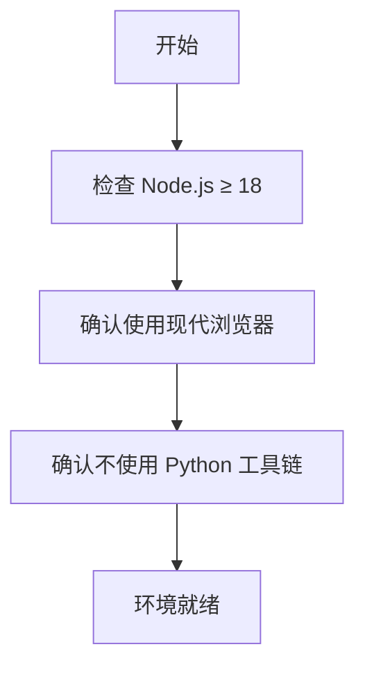
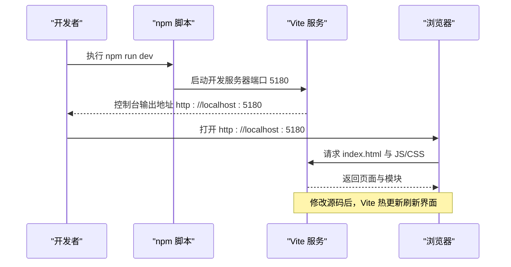
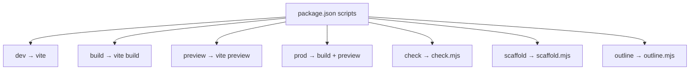
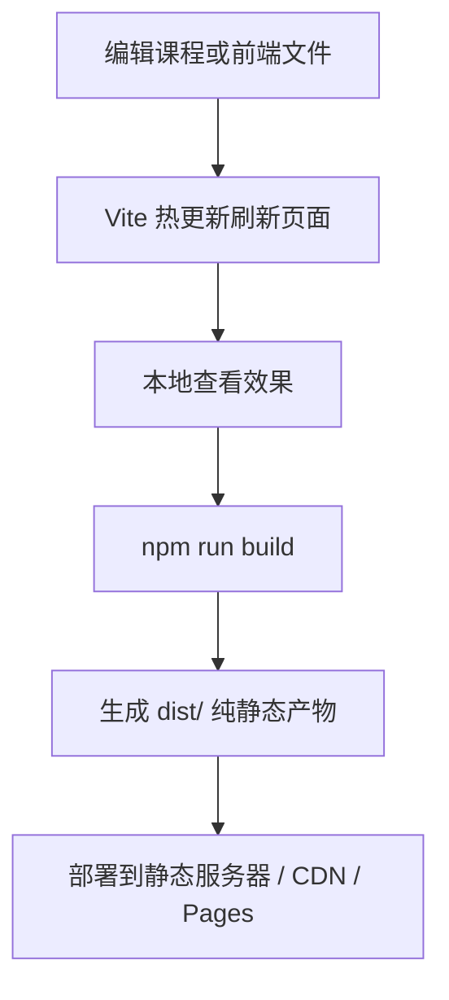
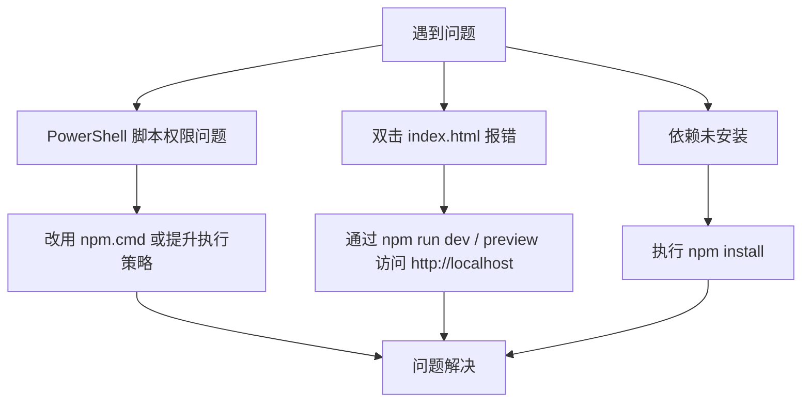
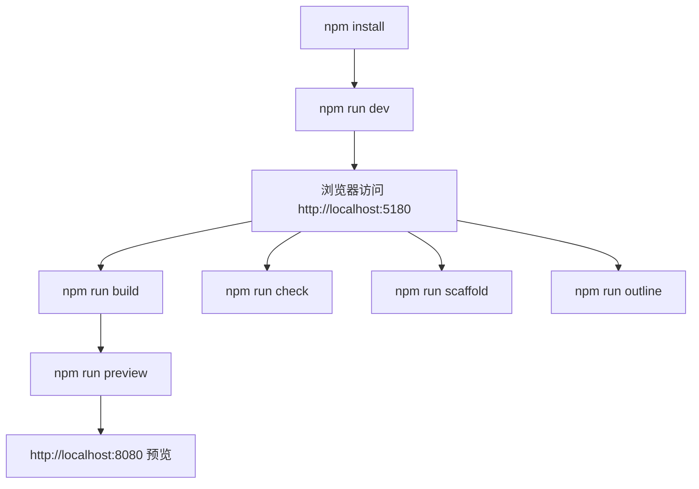

# 快速开始

<cite>
**本文引用的文件**   
- [package.json](file://package.json)
- [README.md](file://README.md)
- [vite.config.js](file://vite.config.js)
- [index.html](file://index.html)
- [run-dev.bat](file://run-dev.bat)
- [run-prod.bat](file://run-prod.bat)
- [scripts/check.mjs](file://scripts/check.mjs)
- [scripts/scaffold.mjs](file://scripts/scaffold.mjs)
- [scripts/outline.mjs](file://scripts/outline.mjs)
</cite>

## 目录
1. [简介](#简介)
2. [环境准备](#环境准备)
3. [安装与运行](#安装与运行)
4. [npm 脚本速查](#npm-脚本速查)
5. [开发工作流](#开发工作流)
6. [常见问题排查](#常见问题排查)
7. [从零到第一次运行：完整示例](#从零到第一次运行完整示例)
8. [总结](#总结)

## 简介
大Java后端是一个“可运行、可打卡、可扩展”的 Java 后端学习平台。它采用原生 ES Module + 自写 Markdown 渲染器，运行时零第三方依赖；开发与构建走 Vite，产物为纯静态资源，完全脱离 Python。你可以按资深架构师的标准系统刷完 Java 后端技术栈，并在本地边学边往 GitHub 提交进度。

本快速开始指南聚焦“环境准备 → 安装 → 启动 → 构建 → 预览 → 部署”，帮助你用最少步骤完成首次运行。

## 环境准备
- Node.js ≥ 18（推荐 20+；本机 v24 直接满足）与随附 npm。
- 现代浏览器（支持 ES Modules：近两年的 Chrome / Edge / Firefox 皆可）。
- 完全脱离 Python：开发、构建、本地预览、部署全流程走 npm + Vite。
- 无论开发还是预览，都经 `http://` 访问；不要直接双击 `index.html`（`file://` 协议下 ES Module 的 `import` 与运行时 `fetch` 会被同源策略拦截）。



**章节来源**
- [README.md:39-51](file://README.md#L39-L51)

## 安装与运行
在项目根目录执行以下命令：

| 命令 | 作用 | 说明 |
| --- | --- | --- |
| `npm install` | 安装开发依赖 | 仅安装 Vite 等开发依赖，约十几个包 |
| `npm run dev` | 启动开发服务器 | 默认端口 `http://localhost:5180`，支持热更新 |
| `npm run build` | 构建生产版本 | 输出纯静态产物到 `dist/` |
| `npm run preview` | 预览构建产物 | 默认端口 `http://localhost:8080` |
| `npm run prod` | 一键构建并预览 | 等价先 `build` 再 `preview` |

Windows 用户可直接双击脚本：
- `run-dev.bat`：自动检测依赖并启动开发模式（`:5180`）。
- `run-prod.bat`：自检 → 构建 → 预览（`:8080`）。



**图表来源**
- [package.json:7-15](file://package.json#L7-L15)
- [vite.config.js:27-34](file://vite.config.js#L27-L34)

**章节来源**
- [README.md:53-78](file://README.md#L53-L78)
- [package.json:7-15](file://package.json#L7-L15)
- [vite.config.js:27-34](file://vite.config.js#L27-L34)

## npm 脚本速查
项目通过 `package.json` 暴露常用命令，核心如下：

| 脚本 | 实际命令 | 用途 |
| --- | --- | --- |
| `dev` | `vite` | 启动开发服务器，支持热更新 |
| `build` | `vite build` | 构建生产版本，输出到 `dist/` |
| `preview` | `vite preview` | 本地预览构建产物 |
| `prod` | `vite build && vite preview` | 一键构建并预览 |
| `check` | `node scripts/check.mjs` | 内容结构与小测解析自检 |
| `scaffold` | `node scripts/scaffold.mjs` | 为小节补齐 Lesson/Quiz/Homework/Interview 占位 |
| `outline` | `node scripts/outline.mjs` | 从骨架数据生成《教学大纲.md》 |



**图表来源**
- [package.json:7-15](file://package.json#L7-L15)

**章节来源**
- [package.json:7-15](file://package.json#L7-L15)

## 开发工作流
- 热更新：开发模式下修改任意源文件，浏览器即时刷新，无需手动操作。
- 本地预览：构建完成后通过 `npm run preview` 或 `npm run prod` 在 `http://localhost:8080` 预览。
- 多设备预览：Vite 已开启 `host`，局域网内可用 `http://<你的局域网IP>:5180` 访问。
- 部署流程：`npm run build` 后把 `dist/` 整目录交给 Nginx / 对象存储 / GitHub Pages / 任意 CDN；因 `base` 为相对路径，可放置于任意子路径。



**图表来源**
- [README.md:64-78](file://README.md#L64-L78)
- [vite.config.js:27-34](file://vite.config.js#L27-L34)

**章节来源**
- [README.md:64-78](file://README.md#L64-L78)
- [vite.config.js:27-34](file://vite.config.js#L27-L34)

## 常见问题排查
- Windows PowerShell 报“禁止运行脚本”：
  - 优先使用 `npm.cmd`（项目 BAT 脚本已内置调用 `npm.cmd`）。
  - 或以管理员权限执行 `Set-ExecutionPolicy RemoteSigned` 解锁脚本执行。
- 直接双击 `index.html` 无法加载：
  - 必须通过 `http://` 访问（`npm run dev` 或 `npm run preview`），不要使用 `file://` 协议。
- 依赖缺失导致脚本失败：
  - 首次运行前执行 `npm install`；Windows 脚本会在检测到缺少 `node_modules/vite` 时自动尝试安装。
- 端口占用：
  - 开发默认端口 `5180`，预览默认端口 `8080`；若被占用，可在终端提示中关闭其他进程或调整配置。



**章节来源**
- [README.md:47-51](file://README.md#L47-L51)
- [run-dev.bat:13-22](file://run-dev.bat#L13-L22)
- [run-prod.bat:14-22](file://run-prod.bat#L14-L22)

## 从零到第一次运行：完整示例
以下为典型命令行输出示例，帮助你对齐预期结果。

1. 安装依赖
```bash
cd 
npm install
```
预期要点：
- 安装 Vite 等开发依赖。
- 成功后可继续执行后续命令。

2. 启动开发服务器
```bash
npm run dev
```
预期要点：
- 控制台输出类似：`VITE v5.x ready in xxx ms`。
- 浏览器自动或手动打开 `http://localhost:5180`。
- 修改任意文件后，页面热更新刷新。

3. 构建生产版本
```bash
npm run build
```
预期要点：
- 构建产物输出到 `dist/`。
- 构建末尾会复制 `courses/` 与 `progress/` 到 `dist/`，确保运行时按需 `fetch` 的内容可用。

4. 预览构建产物
```bash
npm run preview
```
预期要点：
- 本地预览服务启动在 `http://localhost:8080`。
- 行为接近生产环境，适合上线前验证。

5. 一键构建并预览
```bash
npm run prod
```
预期要点：
- 先执行 `vite build`，再执行 `vite preview`。
- 最终在 `http://localhost:8080` 预览。

6. 内容自检
```bash
npm run check
```
预期要点：
- 校验课程包与小节 id 唯一性、重要级与难度取值合法。
- 校验小测可解析判分，总分应为 100，未作答得 0 分。
- 输出分区、课程包、小节数量与检查结果。

7. 脚手架生成占位文件
```bash
npm run scaffold
```
预期要点：
- 为每个小节补齐 Lesson/Quiz/Homework/Interview 四个 Markdown 占位。
- 只创建缺失文件，不覆盖已有内容。

8. 生成教学大纲
```bash
npm run outline
```
预期要点：
- 从骨架数据生成《教学大纲.md》，包含分区、课程包、阶段、小节与详略分档。



**图表来源**
- [package.json:7-15](file://package.json#L7-L15)
- [README.md:53-78](file://README.md#L53-L78)

**章节来源**
- [README.md:53-78](file://README.md#L53-L78)
- [package.json:7-15](file://package.json#L7-L15)
- [scripts/check.mjs:1-119](file://scripts/check.mjs#L1-L119)
- [scripts/scaffold.mjs:1-55](file://scripts/scaffold.mjs#L1-L55)
- [scripts/outline.mjs:1-69](file://scripts/outline.mjs#L1-L69)

## 总结
- 环境要求简单：Node.js ≥ 18、现代浏览器、完全脱离 Python。
- 常用命令清晰：`npm install` → `npm run dev` → `npm run build` → `npm run preview` → `npm run prod`。
- 开发体验友好：热更新、本地预览、局域网共享、一键脚本。
- 内容工具完善：自检、脚手架、大纲生成，保证结构与质量。
- 部署简单：`dist/` 为纯静态产物，可交付任意静态服务器或 CDN。

按照本指南完成环境搭建与首次运行后，即可进入课程内容学习与扩展。