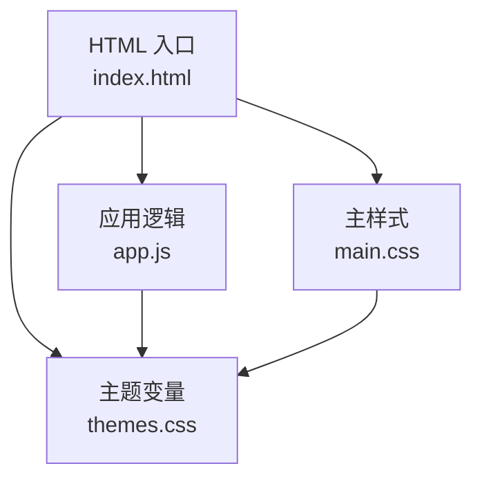
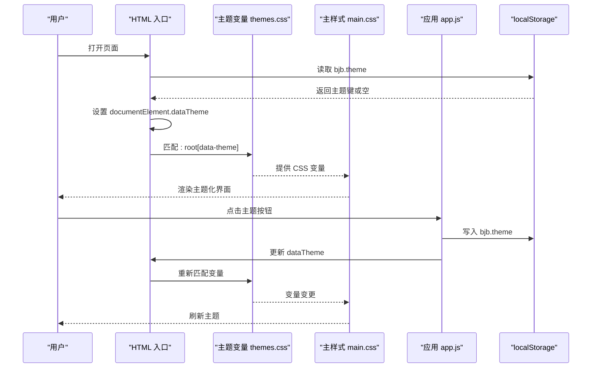
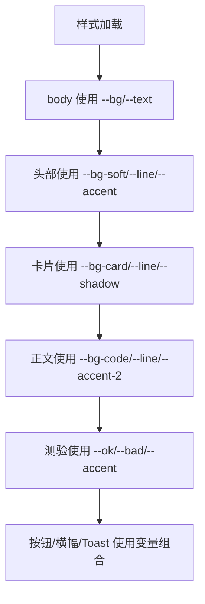
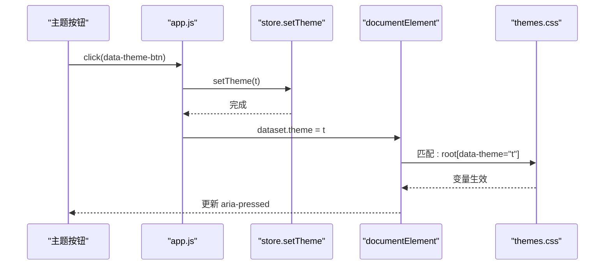
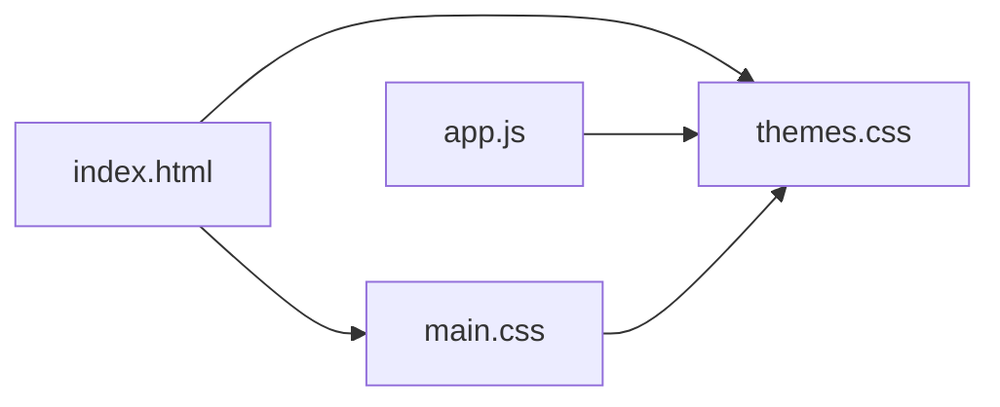

# 主题定制

<cite>
**本文引用的文件**   
- [index.html](file://index.html)
- [assets/css/themes.css](file://assets/css/themes.css)
- [assets/css/main.css](file://assets/css/main.css)
- [assets/js/app.js](file://assets/js/app.js)
</cite>

## 目录
1. [引言](#引言)
2. [项目结构](#项目结构)
3. [核心组件](#核心组件)
4. [架构总览](#架构总览)
5. [详细组件分析](#详细组件分析)
6. [依赖关系分析](#依赖关系分析)
7. [性能与可访问性](#性能与可访问性)
8. [故障排查](#故障排查)
9. [结论](#结论)
10. [附录：主题开发清单](#附录主题开发清单)

## 引言
本指南面向设计师与前端开发者，目标是帮助你理解并扩大大 Java 后端学习平台的视觉主题系统。平台采用“CSS 变量驱动”的主题方案，内置四套预设主题：深色、护眼、藏青、纸白。你将学会如何定义新主题、覆盖现有样式、实现动态切换，并在移动端与可访问性方面保持一致体验。

## 项目结构
主题相关代码集中在以下位置：
- HTML 入口：设置默认主题、引入主题 CSS 与主样式、提供主题切换按钮
- 主题变量：通过 data-theme 选择器集中声明 CSS 变量
- 主样式：所有 UI 组件使用 CSS 变量渲染颜色、背景、边框、阴影等
- JavaScript：负责读取/写入 localStorage、应用主题、更新按钮状态



**图表来源**
- [index.html:1-48](file://index.html#L1-L48)
- [assets/css/themes.css:1-69](file://assets/css/themes.css#L1-L69)
- [assets/css/main.css:1-241](file://assets/css/main.css#L1-L241)
- [assets/js/app.js:502-521](file://assets/js/app.js#L502-L521)

**章节来源**
- [index.html:1-48](file://index.html#L1-L48)
- [assets/css/themes.css:1-69](file://assets/css/themes.css#L1-L69)
- [assets/css/main.css:1-241](file://assets/css/main.css#L1-L241)
- [assets/js/app.js:502-521](file://assets/js/app.js#L502-L521)

## 核心组件
- 主题变量集合：在 :root[data-theme="..."] 下定义一组语义化变量，如 --bg、--text、--accent、--ok、--bad、--shadow 等
- 主样式层：所有组件（头部、卡片、正文、测验、按钮、提示条等）只引用变量，不写死颜色值
- 主题切换机制：JS 将当前主题名写入 document.documentElement.dataset.theme，并通过 localStorage 持久化
- 页面入口：在首帧前同步设置 data-theme，避免闪烁；提供四个主题按钮

关键要点：
- 新增主题只需新增一个 :root[data-theme="xxx"] 块，无需改动业务样式
- 所有颜色、边框、阴影都通过变量注入，保证一致性
- JS 仅负责状态管理，不直接操作具体样式

**章节来源**
- [assets/css/themes.css:1-69](file://assets/css/themes.css#L1-L69)
- [assets/css/main.css:1-241](file://assets/css/main.css#L1-L241)
- [assets/js/app.js:502-521](file://assets/js/app.js#L502-L521)
- [index.html:1-48](file://index.html#L1-L48)

## 架构总览
主题系统遵循“数据（变量）—视图（样式）—控制（JS）”的清晰分层：



**图表来源**
- [index.html:11-14](file://index.html#L11-L14)
- [assets/js/app.js:502-521](file://assets/js/app.js#L502-L521)
- [assets/css/themes.css:1-69](file://assets/css/themes.css#L1-L69)
- [assets/css/main.css:1-241](file://assets/css/main.css#L1-L241)

## 详细组件分析

### 主题变量体系与四套预设主题
- 变量命名语义化：
  - 背景类：--bg、--bg-soft、--bg-card、--bg-code
  - 文本类：--text、--text-soft、--text-dim
  - 强调色：--accent、--accent-2
  - 状态色：--ok、--bad、--lock
  - 装饰：--line、--shadow
- 四套主题：
  - dark：深色背景、暖金强调、高对比文本
  - eye：护眼绿调、低饱和背景、柔和强调
  - navy：藏青底色、蓝金强调、深阴影
  - paper：纸白底、暖棕强调、浅阴影
- 浅色主题下的深度标签颜色增强：通过特定 data-theme 选择器加深文字色，确保可读性

```mermaid
classDiagram
class ThemeVariables {
"+background : --bg, --bg-soft, --bg-card, --bg-code"
"+text : --text, --text-soft, --text-dim"
"+accent : --accent, --accent-2"
"+status : --ok, --bad, --lock"
"+decoration : --line, --shadow"
}
class DarkTheme
class EyeTheme
class NavyTheme
class PaperTheme
ThemeVariables <|-- DarkTheme
ThemeVariables <|-- EyeTheme
ThemeVariables <|-- NavyTheme
ThemeVariables <|-- PaperTheme
```

**图表来源**
- [assets/css/themes.css:1-69](file://assets/css/themes.css#L1-L69)

**章节来源**
- [assets/css/themes.css:1-69](file://assets/css/themes.css#L1-L69)

### 主样式对变量的消费方式
- 全局基础：body 背景与文本颜色来自 --bg 与 --text
- 头部导航：背景、边框、活跃态均使用变量
- 课程卡与区块：背景、边框、悬停强调、阴影统一由变量控制
- 正文排版：代码块、引用、表格、分割线、折叠面板等全部基于变量
- 测验与反馈：正确/错误/部分命中状态使用 --ok、--bad、--accent
- 按钮与提示条：主按钮、幽灵按钮、成功/失败横幅、Toast 均使用变量



**图表来源**
- [assets/css/main.css:1-241](file://assets/css/main.css#L1-L241)

**章节来源**
- [assets/css/main.css:1-241](file://assets/css/main.css#L1-L241)

### 动态主题切换机制
- 存储键：bjb.theme
- 初始化流程：
  - index.html 在首帧前尝试从 localStorage 读取主题键并设置 dataTheme，避免闪烁
  - app.js 启动时再次应用已保存主题，并更新按钮 aria-pressed 状态
- 切换流程：
  - 点击主题按钮触发事件
  - app.js 调用 store.setTheme(t) 写入 localStorage
  - 更新 documentElement.dataTheme
  - 浏览器自动匹配新的 :root[data-theme="t"] 变量集
  - 主样式立即生效



**图表来源**
- [index.html:11-14](file://index.html#L11-L14)
- [assets/js/app.js:502-521](file://assets/js/app.js#L502-L521)

**章节来源**
- [index.html:11-14](file://index.html#L11-L14)
- [assets/js/app.js:502-521](file://assets/js/app.js#L502-L521)

### 如何创建新主题
步骤建议：
1. 在 themes.css 中新增一个 :root[data-theme="your-theme"] 块
2. 完整定义所有必要变量：--bg、--bg-soft、--bg-card、--bg-code、--line、--text、--text-soft、--text-dim、--accent、--accent-2、--ok、--bad、--lock、--shadow
3. 如需针对浅色主题增强可读性，参考现有 depth-tag 的选择器写法，为浅色主题追加更深的强调色
4. 在 index.html 的主题按钮区域添加对应按钮，data-theme-btn 设为你的主题键
5. 测试各组件在不同主题下的表现，尤其是代码块、引用、表格、测验反馈、Toast

注意事项：
- 保持变量语义一致，不要混用硬编码颜色
- 浅色主题需特别注意对比度，必要时增加额外选择器加深强调色
- 按钮 aria-pressed 状态由 JS 自动维护，无需手动处理

**章节来源**
- [assets/css/themes.css:1-69](file://assets/css/themes.css#L1-L69)
- [index.html:27-32](file://index.html#L27-L32)
- [assets/css/main.css:94-112](file://assets/css/main.css#L94-L112)

### 如何覆盖现有样式
优先级策略：
- 优先使用变量覆盖：在自定义 CSS 中重写 :root[data-theme="your-theme"] 中的变量，避免直接覆盖组件类
- 局部覆盖：仅在必要时使用更高优先级选择器覆盖特定组件样式
- 响应式适配：复用 main.css 中的 @media 断点，扩展或调整布局

组件定制建议：
- 卡片悬停：通过 --accent 与 --shadow 控制
- 正文排版：通过 --bg-code、--line、--accent-2 控制
- 测验反馈：通过 --ok、--bad、--accent 控制
- 按钮与横幅：通过 --accent、--bg、--line 控制

**章节来源**
- [assets/css/main.css:17-226](file://assets/css/main.css#L17-L226)
- [assets/css/main.css:234-240](file://assets/css/main.css#L234-L240)

### 响应式适配
- 小屏下课程详情侧边栏收起，正文全宽
- 小节区块在小屏改为纵向排列
- 头部导航在小屏换行显示
- 主题切换按钮在小屏保持可用

这些行为由 main.css 中的媒体查询控制，新增主题无需重复适配。

**章节来源**
- [assets/css/main.css:234-240](file://assets/css/main.css#L234-L240)

## 依赖关系分析
- index.html 依赖 themes.css 与 main.css，并在首帧前设置 dataTheme
- app.js 依赖 store（主题持久化）、DOM API（dataset、querySelectorAll）
- main.css 依赖 themes.css 提供的变量
- themes.css 独立于业务样式，仅定义变量



**图表来源**
- [index.html:9-14](file://index.html#L9-L14)
- [assets/js/app.js:502-521](file://assets/js/app.js#L502-L521)
- [assets/css/themes.css:1-69](file://assets/css/themes.css#L1-L69)
- [assets/css/main.css:1-241](file://assets/css/main.css#L1-L241)

**章节来源**
- [index.html:9-14](file://index.html#L9-L14)
- [assets/js/app.js:502-521](file://assets/js/app.js#L502-L521)
- [assets/css/themes.css:1-69](file://assets/css/themes.css#L1-L69)
- [assets/css/main.css:1-241](file://assets/css/main.css#L1-L241)

## 性能与可访问性
- 性能
  - 首帧前设置 dataTheme，避免闪烁
  - 主题切换仅改变变量，不重绘复杂样式树
  - 使用 CSS 变量减少重复计算
- 可访问性
  - 主题按钮使用 aria-pressed 表示选中状态
  - 浅色主题下对深度标签进行颜色加深，提升对比度
  - 正文与交互元素的颜色对比度应满足 WCAG 标准

最佳实践：
- 确保文本与背景的对比度至少达到 4.5:1（普通文本）或 3:1（大文本）
- 避免仅靠颜色传达信息，辅以图标或文字说明
- 在暗色主题中谨慎使用高饱和强调色，避免眩光

**章节来源**
- [index.html:11-14](file://index.html#L11-L14)
- [assets/css/main.css:94-112](file://assets/css/main.css#L94-L112)
- [assets/js/app.js:502-506](file://assets/js/app.js#L502-L506)

## 故障排查
常见问题与解决：
- 主题未生效
  - 检查 index.html 是否在首帧前设置了 dataTheme
  - 确认 themes.css 中是否存在对应的 :root[data-theme="xxx"] 块
  - 确认按钮 data-theme-btn 与主题键一致
- 闪烁问题
  - 确保 index.html 中的脚本在样式加载前执行
  - 避免 JS 延迟设置 dataTheme
- 浅色主题可读性不足
  - 为浅色主题追加更深色的强调色选择器
  - 检查 depth-tag 或其他强调元素的对比度
- 按钮状态不同步
  - 检查 app.js 是否正确更新 aria-pressed
  - 确认 store.setTheme 是否被调用

**章节来源**
- [index.html:11-14](file://index.html#L11-L14)
- [assets/css/themes.css:1-69](file://assets/css/themes.css#L1-L69)
- [assets/js/app.js:502-521](file://assets/js/app.js#L502-L521)

## 结论
本主题系统以 CSS 变量为核心，实现了清晰的职责分离与良好的可扩展性。通过新增变量块与按钮即可快速扩展主题，同时保持组件样式的一致性与可维护性。建议在设计与开发过程中始终关注对比度与可访问性，并确保响应式体验在各主题下保持一致。

## 附录：主题开发清单
- 定义变量
  - 背景：--bg、--bg-soft、--bg-card、--bg-code
  - 文本：--text、--text-soft、--text-dim
  - 强调：--accent、--accent-2
  - 状态：--ok、--bad、--lock
  - 装饰：--line、--shadow
- 新增主题块
  - 在 themes.css 中添加 :root[data-theme="your-theme"]
  - 完整定义上述变量
- 添加按钮
  - 在 index.html 的主题按钮区域添加按钮，data-theme-btn 设为 your-theme
- 测试与优化
  - 验证所有组件在不同主题下的表现
  - 针对浅色主题增强可读性
  - 检查对比度与可访问性
  - 验证响应式布局

**章节来源**
- [assets/css/themes.css:1-69](file://assets/css/themes.css#L1-L69)
- [index.html:27-32](file://index.html#L27-L32)
- [assets/css/main.css:17-226](file://assets/css/main.css#L17-L226)