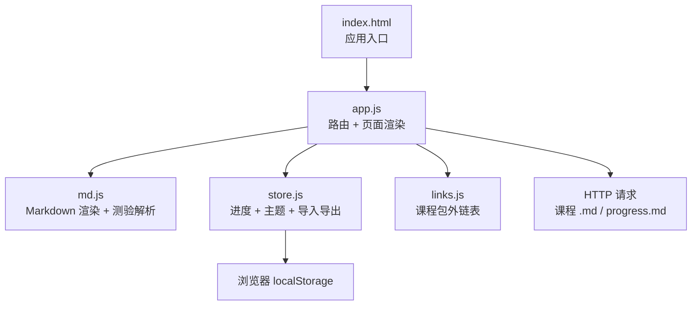
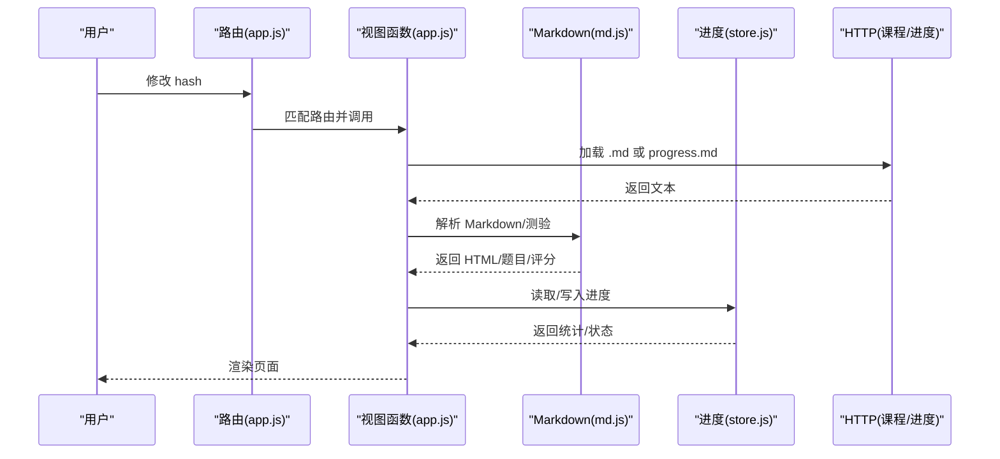
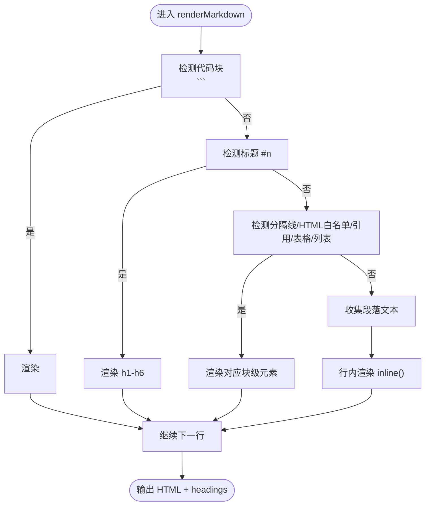
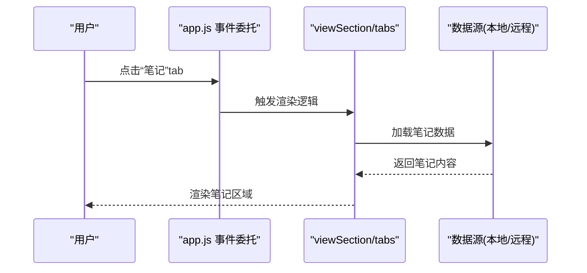
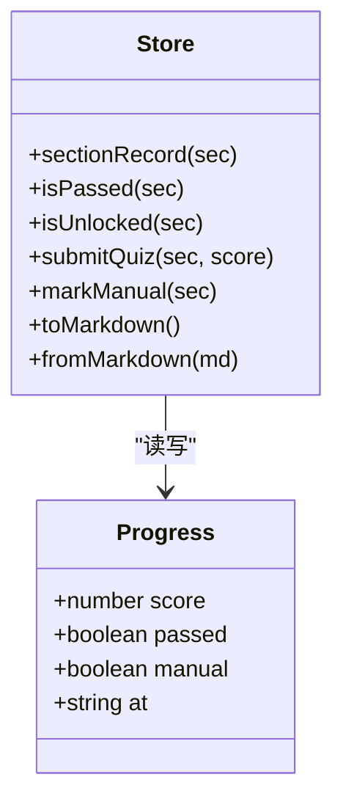
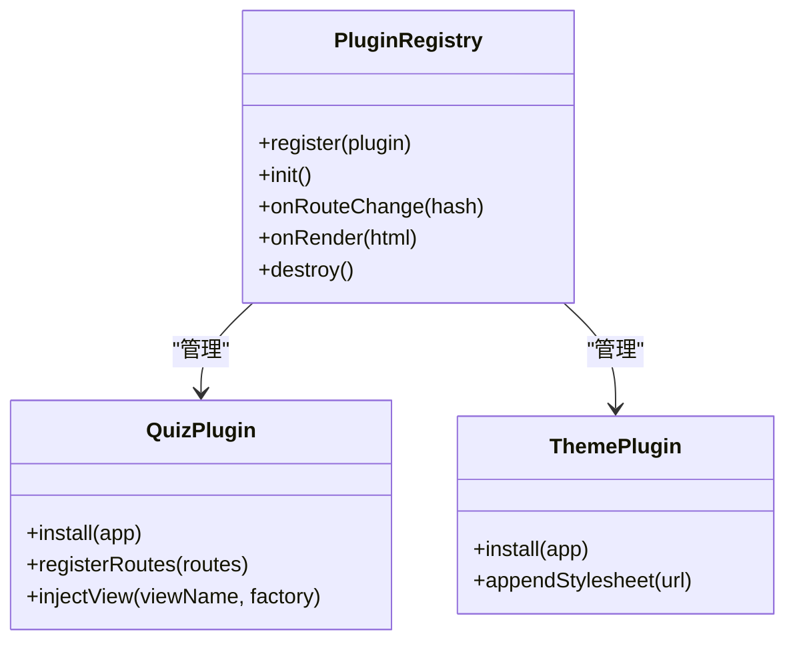
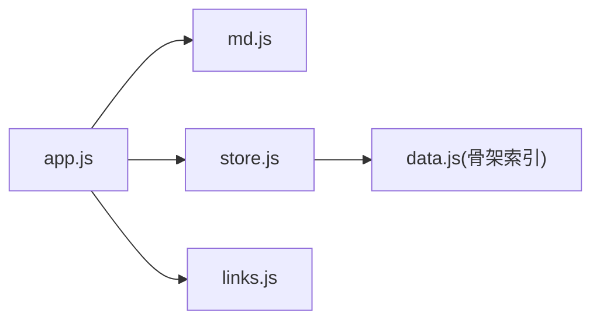

# 功能扩展

<cite>
**本文引用的文件**   
- [assets/js/md.js](file://assets/js/md.js)
- [assets/js/store.js](file://assets/js/store.js)
- [assets/js/app.js](file://assets/js/app.js)
- [assets/js/links.js](file://assets/js/links.js)
- [index.html](file://index.html)
</cite>

## 目录
1. [引言](#引言)
2. [项目结构](#项目结构)
3. [核心组件](#核心组件)
4. [架构总览](#架构总览)
5. [详细组件分析](#详细组件分析)
6. [依赖关系分析](#依赖关系分析)
7. [性能优化建议](#性能优化建议)
8. [故障排查指南](#故障排查指南)
9. [结论](#结论)
10. [附录：扩展示例清单](#附录扩展示例清单)

## 引言
本指南面向希望扩大大 Java 后端学习平台功能的开发者，围绕以下目标展开：
- 扩展 Markdown 解析器：新增语法、自定义渲染规则、扩展测验题型。
- 添加新的 UI 组件：基于现有字符串模板渲染模式，保持与路由系统一致。
- 扩展进度管理系统：新增状态类型、解锁规则、导入导出格式。
- 集成第三方服务：封装 API 调用、设计数据存储方案、外部资源加载策略。
- 插件开发模式：设计可扩展架构、定义插件接口、实现插件注册机制。
- 性能优化：代码分割、懒加载、缓存策略。
- 提供从简单到复杂的实际扩展示例，确保稳定性与可维护性。

## 项目结构
本项目是纯前端静态站点，核心逻辑集中在 assets/js 下的几个模块：
- md.js：零依赖 Markdown 渲染器、小测验解析与评分。
- store.js：进度存储（localStorage）、Markdown 进度导入导出、主题管理。
- app.js：路由、页面渲染、事件委托、测验交互、地图与进度页。
- links.js：课程包官方/中文资源链接表。
- index.html：应用入口，挂载根容器与顶部导航。

**图表来源**
- [index.html:1-48](file://index.html#L1-L48)
- [assets/js/app.js:1-522](file://assets/js/app.js#L1-L522)
- [assets/js/md.js:1-338](file://assets/js/md.js#L1-L338)
- [assets/js/store.js:1-183](file://assets/js/store.js#L1-L183)
- [assets/js/links.js:1-109](file://assets/js/links.js#L1-L109)

**章节来源**
- [index.html:1-48](file://index.html#L1-L48)
- [assets/js/app.js:1-522](file://assets/js/app.js#L1-L522)

## 核心组件
- Markdown 渲染器（md.js）
  - 支持标题、段落、列表、表格、代码块、引用、粗斜体、行内代码、图片、站内相对链接转路由。
  - 提供 renderInline、renderMarkdown、stripTitle、parseQuiz、gradeQuestion、gradeQuiz 等能力。
- 进度存储（store.js）
  - 以 localStorage 为主，支持 Markdown 进度文件的导入/导出；提供小节记录、过关判定、阶段统计、全站统计、主题切换。
- 应用路由与渲染（app.js）
  - 基于 hash 的路由分发；首页、课程包、小节内容/作业/面试/测验、学习地图、进度页。
  - 事件委托处理目录跳转、测验提交、手动通过、进度导入导出等。
- 课程包外链（links.js）
  - 为课程包补充官方/中文资源链接，供课程包页展示。

**章节来源**
- [assets/js/md.js:1-338](file://assets/js/md.js#L1-L338)
- [assets/js/store.js:1-183](file://assets/js/store.js#L1-L183)
- [assets/js/app.js:1-522](file://assets/js/app.js#L1-L522)
- [assets/js/links.js:1-109](file://assets/js/links.js#L1-L109)

## 架构总览
整体采用“路由驱动 + 字符串模板渲染”的轻量 SPA 架构：
- 路由层：根据 location.hash 匹配 ROUTES，调用对应视图函数生成 HTML 字符串并注入 #app。
- 数据层：md.js 负责文本解析与评分；store.js 负责持久化与统计；links.js 提供元数据。
- 视图层：app.js 使用模板字符串拼装页面，结合 CSS 主题完成呈现。
- 外部资源：按需 fetch 课程 .md 与 progress.md，配合内存缓存减少重复请求。

**图表来源**
- [assets/js/app.js:472-522](file://assets/js/app.js#L472-L522)
- [assets/js/md.js:62-149](file://assets/js/md.js#L62-L149)
- [assets/js/store.js:106-183](file://assets/js/store.js#L106-L183)

## 详细组件分析

### Markdown 解析器扩展指南（md.js）
当前解析器已覆盖常见 Markdown 元素，并提供测验解析与评分。扩展点包括：
- 新增语法支持
  - 在 renderMarkdown 中增加新的块级识别分支（如流程图、数学公式、Mermaid 等），遵循“先识别块级，再处理行内”的顺序。
  - 对行内语法扩展 inline 函数，注意先摘出代码片段避免二次替换。
- 自定义渲染规则
  - 白名单块级 HTML 已允许 details/summary/div/section 等，可在 app.js 的 paintFlows 中扩展特定 data-lang 的代码块渲染（例如 flow）。
  - 如需引入第三方渲染库，建议在 app.js 中统一后处理 DOM，而非侵入 md.js 正则链。
- 扩展测验题型
  - parseQuiz 目前支持单选、多选、判断、填空、简答。新增题型需：
    - 在 parseQuiz 中识别题干/选项/答案/解析的新约定。
    - 在 app.js 的 renderQuiz 中为新题型渲染输入控件。
    - 在 gradeQuestion 中实现新题型的评分逻辑。
    - 在 KIND_LABEL 中补充题型标签。

**图表来源**
- [assets/js/md.js:62-149](file://assets/js/md.js#L62-L149)
- [assets/js/md.js:28-42](file://assets/js/md.js#L28-L42)

**章节来源**
- [assets/js/md.js:1-338](file://assets/js/md.js#L1-L338)
- [assets/js/app.js:44-59](file://assets/js/app.js#L44-L59)

### UI 组件扩展指南（app.js）
- 字符串模板渲染模式
  - 所有页面均由模板字符串拼接而成，便于快速迭代。新增组件时，应遵循：
    - 将可复用部分抽取为函数（如 crumb、stars、secStatusTag）。
    - 使用 esc 进行 XSS 防护。
    - 通过事件委托集中处理交互，避免过多分散监听。
- 与路由系统集成
  - 在 ROUTES 数组中添加新路由，并在对应视图函数中返回 HTML。
  - 若需要异步加载数据，视图函数应为 async，并在渲染前等待数据就绪。
- 示例：新增“笔记”页签
  - 在小节页增加“笔记”tab，点击后加载本地草稿或远程笔记。
  - 在 viewSection 中增加 tab 分支，在 tabs 函数中追加按钮。
  - 在 app.js 的事件委托中处理保存/清空操作。

**图表来源**
- [assets/js/app.js:183-239](file://assets/js/app.js#L183-L239)
- [assets/js/app.js:472-522](file://assets/js/app.js#L472-L522)

**章节来源**
- [assets/js/app.js:1-522](file://assets/js/app.js#L1-L522)

### 进度管理系统扩展指南（store.js）
- 新增状态类型
  - 当前进度对象包含 score、passed、manual、at。如需新增字段（如 streak、lastReviewAt），请在 sectionRecord、submitQuiz、markManual、toMarkdown、fromMarkdown 等处同步更新。
- 解锁规则
  - isUnlocked 基于同包顺序的前一节是否通过。如需更复杂规则（如前置知识点、跨包解锁），请扩展 orderedSections 与 isUnlocked 的逻辑。
- 导入导出格式
  - toMarkdown/fromMarkdown 定义了 Markdown 进度文件格式。新增字段需在表格列与解析逻辑中保持一致。
- 示例：新增“复习次数”字段
  - 在进度对象中新增 reviewCount。
  - 在 submitQuiz/markManual 中初始化或递增。
  - 在 toMarkdown/fromMarkdown 中序列化/反序列化。
  - 在进度页展示该字段。

**图表来源**
- [assets/js/store.js:23-99](file://assets/js/store.js#L23-L99)
- [assets/js/store.js:110-164](file://assets/js/store.js#L110-L164)

**章节来源**
- [assets/js/store.js:1-183](file://assets/js/store.js#L1-L183)

### 第三方服务集成指南
- API 调用封装
  - 建议在 app.js 中新增统一的 fetchWrapper，封装错误处理、重试、超时、鉴权头。
  - 对于课程 .md 与 progress.md，可复用现有 loadMd 与 seedFromFile，但建议抽象为 service 层。
- 数据存储方案
  - 本地优先：localStorage 用于进度与主题。
  - 远端可选：新增 syncToRemote/syncFromRemote 方法，将进度同步至服务器或对象存储。
- 外部资源加载策略
  - 按需加载：仅在需要时加载第三方脚本（如 Mermaid、代码高亮库）。
  - 安全策略：外链 target="_blank" rel="noopener"，避免同源风险。
  - 降级策略：当外部资源不可用时，回退到基础渲染。

**章节来源**
- [assets/js/app.js:33-42](file://assets/js/app.js#L33-L42)
- [assets/js/store.js:166-173](file://assets/js/store.js#L166-L173)

### 插件开发模式
- 可扩展架构设计
  - 在 app.js 中定义 PluginRegistry，支持插件生命周期：init、onRouteChange、onRender、onDestroy。
  - 每个插件暴露一个 install(app) 方法，由主应用注册。
- 插件接口定义
  - 路由扩展：registerRoutes(routes)
  - 视图扩展：injectView(viewName, htmlFactory)
  - 数据扩展：extendStore(store)
  - 样式扩展：appendStylesheet(url)
- 插件注册机制
  - 在主启动流程中遍历插件列表，依次调用 install。
  - 插件可动态启用/禁用，通过配置开关控制。

**图表来源**
- [assets/js/app.js:472-522](file://assets/js/app.js#L472-L522)

**章节来源**
- [assets/js/app.js:1-522](file://assets/js/app.js#L1-L522)

## 依赖关系分析
- app.js 依赖 md.js（渲染与评分）、store.js（进度与主题）、links.js（外链表）。
- store.js 依赖 data.js（骨架索引，虽未在本仓库中直接列出，但在 import 中出现）。
- md.js 无内部依赖，仅依赖浏览器原生 API。
- links.js 为纯数据模块，被 app.js 消费。

**图表来源**
- [assets/js/app.js:1-6](file://assets/js/app.js#L1-L6)
- [assets/js/store.js:1-2](file://assets/js/store.js#L1-L2)

**章节来源**
- [assets/js/app.js:1-6](file://assets/js/app.js#L1-L6)
- [assets/js/store.js:1-2](file://assets/js/store.js#L1-L2)

## 性能优化建议
- 代码分割
  - 将大型第三方库（如 Mermaid、代码高亮）按路由或功能模块动态 import，减少首屏体积。
- 懒加载
  - 对小节内容、测验、地图等按需加载，避免一次性渲染全部页面。
- 缓存策略
  - 复用现有 mdCache 对 .md 内容进行内存缓存。
  - 对静态资源（CSS/JS）利用构建工具的内容哈希与浏览器缓存。
  - 对进度数据可考虑 IndexedDB 替代 localStorage，提升容量与性能。
- 渲染优化
  - 使用 DocumentFragment 批量插入 DOM，减少重排重绘。
  - 对长列表（如课程包卡片）使用虚拟滚动。

[本节为通用指导，不直接分析具体文件]

## 故障排查指南
- Markdown 渲染异常
  - 检查 renderMarkdown 中的正则分支是否匹配预期。
  - 确认 stripTitle 是否正确移除一级标题。
  - 验证 internalRoute 是否能正确解析站内相对链接。
- 测验评分异常
  - 检查 parseQuiz 是否正确识别题型与答案。
  - 确认 gradeQuestion 对新题型的评分逻辑。
  - 查看 app.js 中 collectPicks 是否正确收集用户输入。
- 进度丢失或不同步
  - 检查 localStorage 是否可用（隐私模式可能受限）。
  - 验证 fromMarkdown 解析逻辑是否与 toMarkdown 输出格式一致。
  - 确认 seedFromFile 是否能成功拉取 progress.md。
- 路由跳转异常
  - 检查 ROUTES 正则表达式是否匹配目标 hash。
  - 确认事件委托中是否有冲突的点击处理。

**章节来源**
- [assets/js/md.js:12-42](file://assets/js/md.js#L12-L42)
- [assets/js/md.js:193-284](file://assets/js/md.js#L193-L284)
- [assets/js/app.js:320-390](file://assets/js/app.js#L320-L390)
- [assets/js/store.js:142-173](file://assets/js/store.js#L142-L173)

## 结论
本指南提供了从零开始扩展大 Java 后端学习平台的完整路径：从 Markdown 解析器、UI 组件、进度管理，到第三方服务集成与插件架构。通过模块化设计与清晰的扩展点，开发者可以逐步增强功能，同时保持系统的稳定性与可维护性。建议在实际扩展中遵循现有模式，逐步引入复杂度，并进行充分的测试与回归验证。

[本节为总结性内容，不直接分析具体文件]

## 附录：扩展示例清单
- 简单功能
  - 在 md.js 中新增“折叠答案”语法，支持 <!-- collapse --> 包裹内容。
  - 在 app.js 中为课程包页新增“收藏”按钮，使用 localStorage 存储。
- 中等功能
  - 在 store.js 中新增“学习时长”字段，记录每次会话时长。
  - 在 app.js 中新增“搜索”功能，支持按标题/关键词过滤小节。
- 复杂功能
  - 在 md.js 中新增“流程图”语法，调用第三方库渲染。
  - 在 store.js 中实现进度云端同步，支持多设备恢复。
  - 在 app.js 中实现插件系统，允许社区贡献扩展。

[本节为概念性示例，不直接分析具体文件]