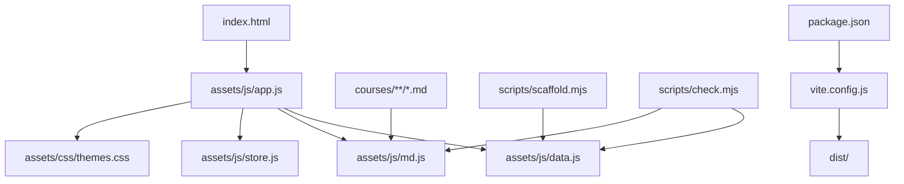
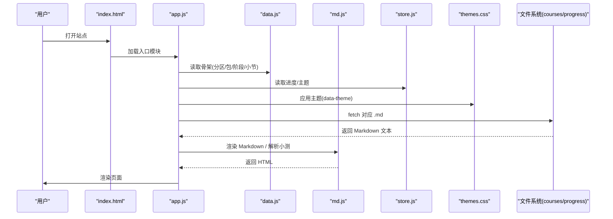
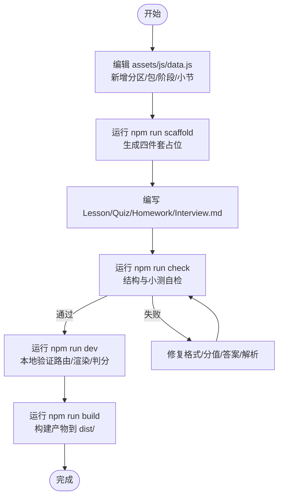
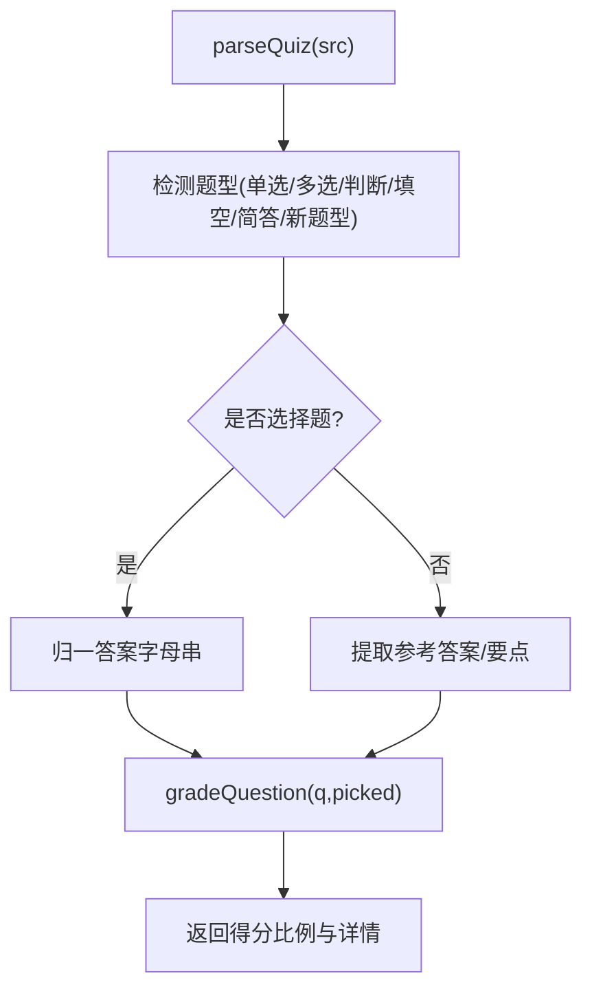
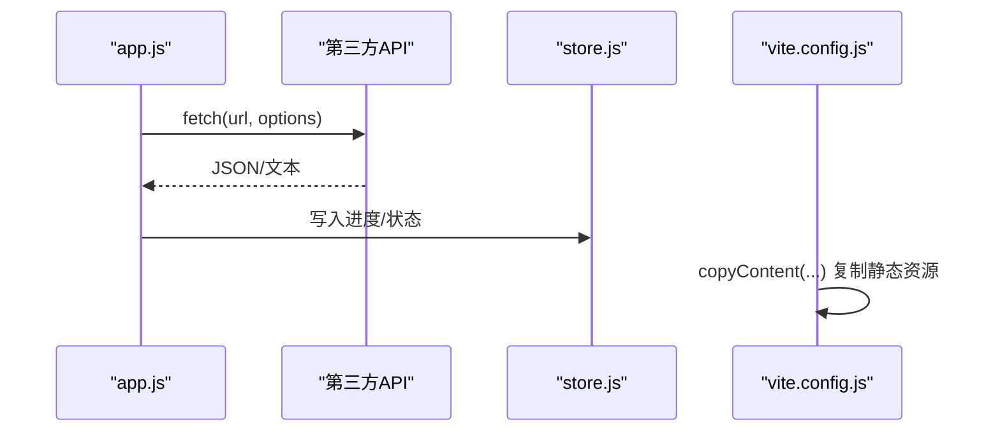
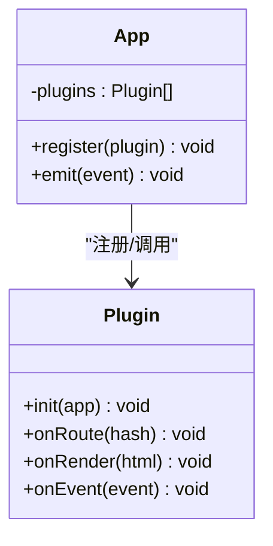
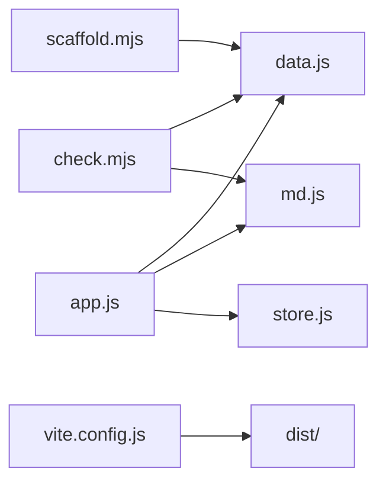

# 扩展指南

<cite>
**本文引用的文件**   
- [README.md](file://README.md)
- [package.json](file://package.json)
- [vite.config.js](file://vite.config.js)
- [assets/js/data.js](file://assets/js/data.js)
- [assets/js/app.js](file://assets/js/app.js)
- [assets/js/md.js](file://assets/js/md.js)
- [assets/js/store.js](file://assets/js/store.js)
- [assets/css/themes.css](file://assets/css/themes.css)
- [scripts/scaffold.mjs](file://scripts/scaffold.mjs)
- [scripts/check.mjs](file://scripts/check.mjs)
</cite>

## 目录
1. [引言](#引言)
2. [项目结构](#项目结构)
3. [核心组件](#核心组件)
4. [架构总览](#架构总览)
5. [详细扩展示例](#详细扩展示例)
6. [依赖关系分析](#依赖关系分析)
7. [性能优化建议](#性能优化建议)
8. [故障排查指南](#故障排查指南)
9. [结论](#结论)

## 引言
本指南面向希望定制和扩大大 Java 后端学习平台的开发者。平台以“唯一骨架事实源” `data.js` 驱动首页、课程包、阶段、小节与四件套 Markdown，运行时零第三方依赖，开发构建走 Vite。你可以：
- 添加新课程：改骨架、生成占位、补齐内容、自检通过。
- 扩展主题系统：基于 CSS 变量新增主题、覆盖样式、实现动态切换。
- 扩展 Markdown 解析器：增加语法、自定义渲染规则、扩展测验题型。
- 集成第三方服务：API 调用、数据存储、外部资源加载。
- 设计插件化架构：定义接口、注册机制、可扩展点。
- 优化性能：代码分割、懒加载、缓存策略。

## 项目结构
仓库采用“前端静态站点 + 纯 Markdown 内容 + Node 工具脚本”的轻量架构：
- 入口与路由：`index.html` + `assets/js/app.js`（原生 ES Module）。
- 骨架数据源：`assets/js/data.js`（分区 → 包 → 阶段 → 小节）。
- 渲染层：`assets/js/md.js`（自写 Markdown 渲染器与小测解析/判分）。
- 进度与主题：`assets/js/store.js`（localStorage + Markdown 导入导出 + 主题）。
- 样式与主题：`assets/css/main.css`、`assets/css/themes.css`（CSS 变量驱动多主题）。
- 内容层：`courses/**`（每小节 Lesson/Quiz/Homework/Interview 四个 Markdown）。
- 工具脚本：`scripts/scaffold.mjs`（生成占位）、`scripts/check.mjs`（结构与小测自检）。
- 构建配置：`vite.config.js`（复制 courses/progress 到 dist，端口与 base 设置）。
- 脚本入口：`package.json`（dev/build/preview/prod/check/scaffold/outline）。



**图示来源**
- [assets/js/app.js:1-10](file://assets/js/app.js#L1-L10)
- [assets/js/data.js:1-8](file://assets/js/data.js#L1-L8)
- [assets/js/md.js:1-10](file://assets/js/md.js#L1-L10)
- [assets/js/store.js:1-10](file://assets/js/store.js#L1-L10)
- [assets/css/themes.css:1-10](file://assets/css/themes.css#L1-L10)
- [scripts/scaffold.mjs:1-10](file://scripts/scaffold.mjs#L1-L10)
- [scripts/check.mjs:1-10](file://scripts/check.mjs#L1-L10)
- [vite.config.js:1-12](file://vite.config.js#L1-L12)
- [package.json:7-15](file://package.json#L7-L15)

**章节来源**
- [README.md:13-48](file://README.md#L13-L48)
- [README.md:145-170](file://README.md#L145-L170)

## 核心组件
- 骨架数据源 `data.js`：定义分区、课程包、阶段、小节元组；提供索引与路径工具。
- 应用路由与视图 `app.js`：处理首页、课程包、小节、小测、作业、面试题、地图、进度等页面；负责事件委托、导航、主题切换。
- Markdown 渲染器 `md.js`：支持标题、段落、列表、表格、代码块、引用、链接、行内语法；内置小测解析与判分。
- 进度与主题 `store.js`：localStorage 主存储，Markdown 进度文件导入导出，主题持久化。
- 主题样式 `themes.css`：通过 CSS 变量定义暗色、护眼、藏青、纸白四套主题。
- 脚手架 `scaffold.mjs`：按 data.js 为所有小节批量创建四件套占位文件。
- 自检脚本 `check.mjs`：校验目录结构、小节键唯一性、难度/重要性取值、小测格式与判分冒烟测试。
- 构建配置 `vite.config.js`：相对 base、复制 content、开发预览端口。
- 脚本入口 `package.json`：封装 dev/build/preview/prod/check/scaffold/outline。

**章节来源**
- [assets/js/data.js:1-8](file://assets/js/data.js#L1-L8)
- [assets/js/app.js:1-10](file://assets/js/app.js#L1-L10)
- [assets/js/md.js:1-10](file://assets/js/md.js#L1-L10)
- [assets/js/store.js:1-10](file://assets/js/store.js#L1-L10)
- [assets/css/themes.css:1-10](file://assets/css/themes.css#L1-L10)
- [scripts/scaffold.mjs:1-10](file://scripts/scaffold.mjs#L1-L10)
- [scripts/check.mjs:1-10](file://scripts/check.mjs#L1-L10)
- [vite.config.js:1-12](file://vite.config.js#L1-L12)
- [package.json:7-15](file://package.json#L7-L15)

## 架构总览
平台运行流程：
- 浏览器加载 `index.html`，执行 `app.js`。
- `app.js` 根据 hash 路由渲染不同视图，从 `data.js` 读取骨架，按需 fetch 对应 Markdown。
- `md.js` 将 Markdown 转为 HTML，并处理站内链接、流程图、小测解析与判分。
- `store.js` 管理进度与主题，支持 Markdown 进度文件的导入导出。
- `themes.css` 通过 `data-theme` 属性切换主题变量。
- 构建时 `vite.config.js` 将 `courses/` 与 `progress/` 复制到 `dist/`，确保运行时可访问。



**图示来源**
- [assets/js/app.js:1-10](file://assets/js/app.js#L1-L10)
- [assets/js/data.js:1-8](file://assets/js/data.js#L1-L8)
- [assets/js/md.js:1-10](file://assets/js/md.js#L1-L10)
- [assets/js/store.js:1-10](file://assets/js/store.js#L1-L10)
- [assets/css/themes.css:1-10](file://assets/css/themes.css#L1-L10)
- [vite.config.js:27-34](file://vite.config.js#L27-L34)

## 详细扩展示例

### 添加新课程
目标：在现有分区下新增一个课程包与若干小节，并确保脚手架、内容与自检全部通过。

步骤：
1. 修改骨架 `data.js`
   - 在目标分区 `CATEGORIES` 下的某个 package 中追加 stages 与 sections。
   - 小节元组格式：`[id, title, summary, difficulty(1-5), importance(1-5)]`。
   - 保持 id 唯一、难度与重要性取值合法。
2. 使用脚手架生成占位
   - 运行 `npm run scaffold`，为每个小节生成 Lesson/Quiz/Homework/Interview 四个 Markdown 占位文件。
   - 占位文件包含标题与“待补充”说明，小测占位会降级为手动过关模式，不影响解锁链。
3. 编写内容
   - 课文：讲透原理、给出落地代码/配置、结合行业场景说明取舍。
   - 小测：按约定格式书写题干、选项、答案与解析；主观题用要点列表或关键词。
   - 作业与面试题：布置可验证的应用题与高频追问链。
4. 自检与验证
   - 运行 `npm run check`，检查包/小节 id 唯一、难度/重要性合法、小测可解析判分。
   - 本地开发 `npm run dev`，确认路由、渲染、小测判分与解锁链正常。
   - 生产构建 `npm run build`，确认 `courses/` 与 `progress/` 被复制到 `dist/`。



**图示来源**
- [assets/js/data.js:1-8](file://assets/js/data.js#L1-L8)
- [scripts/scaffold.mjs:1-10](file://scripts/scaffold.mjs#L1-L10)
- [scripts/check.mjs:1-10](file://scripts/check.mjs#L1-L10)
- [README.md:89-104](file://README.md#L89-L104)

**章节来源**
- [README.md:89-104](file://README.md#L89-L104)
- [scripts/scaffold.mjs:16-39](file://scripts/scaffold.mjs#L16-L39)
- [scripts/check.mjs:14-32](file://scripts/check.mjs#L14-L32)

### 扩展主题系统
目标：新增一套主题，覆盖现有样式，实现动态切换。

步骤：
1. 在 `themes.css` 中新增主题选择器，例如 `:root[data-theme="your-theme"]`，定义一组 CSS 变量（背景、文字、强调色等）。
2. 在 UI 中添加主题按钮，绑定点击事件，调用 `store.setTheme('your-theme')` 并更新 `document.documentElement.dataset.theme`。
3. 在 `app.js` 的主题切换逻辑中，确保新主题能被应用与持久化。
4. 验证：刷新页面后主题仍生效；切换其他主题后样式正确覆盖。

```mermaid
classDiagram
class Store {
+getTheme() string
+setTheme(t) void
}
class App {
+applyTheme(t) void
+themeSwitchHandler(e) void
}
class ThemesCSS {
" : root[data-theme=...]"
"--bg, --text, --accent, ..."
}
App --> Store : "读写主题"
App --> ThemesCSS : "应用 CSS 变量"
```

**图示来源**
- [assets/js/store.js:101-105](file://assets/js/store.js#L101-L105)
- [assets/js/app.js:502-511](file://assets/js/app.js#L502-L511)
- [assets/css/themes.css:1-69](file://assets/css/themes.css#L1-L69)

**章节来源**
- [assets/css/themes.css:1-69](file://assets/css/themes.css#L1-L69)
- [assets/js/app.js:502-511](file://assets/js/app.js#L502-L511)
- [assets/js/store.js:101-105](file://assets/js/store.js#L101-L105)

### 扩展 Markdown 解析器
目标：新增语法支持、自定义渲染规则、扩展测验题型。

步骤：
1. 新增语法
   - 在 `md.js` 的 `renderMarkdown` 中插入新的块级或行内规则（如流程图、任务列表、数学公式）。
   - 注意转义与顺序，避免与其他规则冲突。
2. 自定义渲染规则
   - 对特定语言代码块进行高亮或转换（如 `data-lang="flow"` 已支持流程图）。
   - 在 `app.js` 的 `paintFlows` 中扩展更多可视化类型。
3. 扩展测验题型
   - 在 `parseQuiz` 中识别新题型（如排序题、拖拽题），并在 `gradeQuestion` 中实现评分逻辑。
   - 在 `app.js` 的 `renderQuiz` 中为新题型渲染输入控件与结果反馈。
4. 自检与回归
   - 在 `check.mjs` 中增加对新题型的断言与冒烟测试。
   - 运行 `npm run check` 确保解析与判分正确。



**图示来源**
- [assets/js/md.js:193-284](file://assets/js/md.js#L193-L284)
- [assets/js/md.js:301-337](file://assets/js/md.js#L301-L337)
- [assets/js/app.js:248-294](file://assets/js/app.js#L248-L294)
- [scripts/check.mjs:43-84](file://scripts/check.mjs#L43-L84)

**章节来源**
- [assets/js/md.js:1-10](file://assets/js/md.js#L1-L10)
- [assets/js/md.js:193-284](file://assets/js/md.js#L193-L284)
- [assets/js/md.js:301-337](file://assets/js/md.js#L301-L337)
- [assets/js/app.js:248-294](file://assets/js/app.js#L248-L294)
- [scripts/check.mjs:43-84](file://scripts/check.mjs#L43-L84)

### 集成第三方服务
目标：在站点中调用 API、存储数据、加载外部资源。

建议方案：
- API 调用
  - 在 `app.js` 或独立模块中使用 `fetch` 调用后端 API，处理响应与错误。
  - 使用 `cache: 'no-store'` 避免缓存干扰，或在需要时使用 `Cache API` 做客户端缓存。
- 数据存储
  - 继续使用 `store.js` 的 localStorage 作为主存储，必要时扩展为 IndexedDB 或后端同步。
  - 导出/导入 Markdown 进度文件，保持“进度文件必须是 Markdown”的契约。
- 外部资源加载
  - 在 `vite.config.js` 中通过 `copyContent` 插件复制额外静态资源到 `dist/`。
  - 在 `md.js` 中扩展站内链接解析，支持外部资源路径映射。



**图示来源**
- [assets/js/app.js:33-42](file://assets/js/app.js#L33-L42)
- [assets/js/store.js:166-173](file://assets/js/store.js#L166-L173)
- [vite.config.js:13-25](file://vite.config.js#L13-L25)

**章节来源**
- [assets/js/app.js:33-42](file://assets/js/app.js#L33-L42)
- [assets/js/store.js:166-173](file://assets/js/store.js#L166-L173)
- [vite.config.js:13-25](file://vite.config.js#L13-L25)

### 插件开发模式
目标：设计可扩展的架构，定义插件接口，实现插件注册机制。

建议架构：
- 插件接口
  - 定义统一接口：`init(app)`、`onRoute(hash)`、`onRender(html)`、`onEvent(event)`。
  - 插件可注入菜单、扩展渲染、监听事件、注册钩子。
- 注册机制
  - 在 `app.js` 中维护插件列表，启动时加载并初始化。
  - 支持动态加载（ES Module）与静态注册（配置文件）。
- 扩展点
  - 在 Markdown 渲染阶段暴露钩子，允许插件替换或增强渲染规则。
  - 在小测解析阶段暴露钩子，允许插件扩展题型与判分逻辑。
- 生命周期
  - 初始化 → 路由匹配 → 渲染 → 事件分发 → 销毁（可选）。



**图示来源**
- [assets/js/app.js:474-500](file://assets/js/app.js#L474-L500)
- [assets/js/md.js:62-150](file://assets/js/md.js#L62-L150)
- [assets/js/md.js:193-284](file://assets/js/md.js#L193-L284)

**章节来源**
- [assets/js/app.js:474-500](file://assets/js/app.js#L474-L500)
- [assets/js/md.js:62-150](file://assets/js/md.js#L62-L150)
- [assets/js/md.js:193-284](file://assets/js/md.js#L193-L284)

## 依赖关系分析
- `app.js` 依赖 `data.js`（骨架）、`md.js`（渲染/判分）、`store.js`（进度/主题）、`links.js`（官方链接）。
- `md.js` 提供 `renderMarkdown`、`parseQuiz`、`gradeQuiz`、`gradeQuestion` 等能力。
- `store.js` 依赖 `data.js` 的 INDEX 与 secKey 工具。
- `scaffold.mjs` 与 `check.mjs` 均依赖 `data.js` 的 INDEX 与 secFile。
- `vite.config.js` 在构建阶段复制 `courses/` 与 `progress/` 到 `dist/`。



**图示来源**
- [assets/js/app.js:1-10](file://assets/js/app.js#L1-L10)
- [assets/js/md.js:1-10](file://assets/js/md.js#L1-L10)
- [assets/js/store.js:1-10](file://assets/js/store.js#L1-L10)
- [scripts/check.mjs:1-10](file://scripts/check.mjs#L1-L10)
- [scripts/scaffold.mjs:1-10](file://scripts/scaffold.mjs#L1-L10)
- [vite.config.js:27-34](file://vite.config.js#L27-L34)

**章节来源**
- [assets/js/app.js:1-10](file://assets/js/app.js#L1-L10)
- [assets/js/md.js:1-10](file://assets/js/md.js#L1-L10)
- [assets/js/store.js:1-10](file://assets/js/store.js#L1-L10)
- [scripts/check.mjs:1-10](file://scripts/check.mjs#L1-L10)
- [scripts/scaffold.mjs:1-10](file://scripts/scaffold.mjs#L1-L10)
- [vite.config.js:27-34](file://vite.config.js#L27-L34)

## 性能优化建议
- 代码分割
  - 将重型模块（如复杂渲染、第三方库）拆分为独立模块，按需 import。
  - 在 `app.js` 中延迟加载非关键功能（如高级图表、统计面板）。
- 懒加载
  - 对小节内容使用 IntersectionObserver 懒加载，减少首屏压力。
  - 对图片与外部资源使用懒加载与占位图。
- 缓存策略
  - 利用 Vite 的内容哈希自动失效缓存。
  - 对 API 响应使用 `Cache API` 或 `localStorage` 做短期缓存。
  - 对 Markdown 内容使用内存缓存（`app.js` 已有 `mdCache`）。
- 构建优化
  - 在 `vite.config.js` 中启用压缩、Tree Shaking、目标 ES 版本优化。
  - 仅复制必要目录到 `dist/`，减少产物体积。

**章节来源**
- [assets/js/app.js:33-42](file://assets/js/app.js#L33-L42)
- [vite.config.js:27-34](file://vite.config.js#L27-L34)

## 故障排查指南
常见问题与解决：
- 小节未解锁
  - 检查上一节小测是否通过（≥60 分），或是否为自定义格式需手动标记。
  - 查看 `store.js` 中的 `isUnlocked` 与 `submitQuiz` 逻辑。
- 小测无法解析
  - 检查题干格式（`### N. 题干（X分）`）、选项格式（`- A. 选项`）、答案格式（`> 答案：X`）。
  - 运行 `npm run check` 查看具体错误信息。
- 主题不生效
  - 检查 `themes.css` 中是否正确定义 CSS 变量。
  - 确认 `app.js` 中 `applyTheme` 与 `store.setTheme` 调用正确。
- 构建后内容缺失
  - 确认 `vite.config.js` 中 `copyContent` 插件已配置 `courses/` 与 `progress/`。
  - 检查 `dist/` 目录是否包含所需文件。

**章节来源**
- [assets/js/store.js:33-45](file://assets/js/store.js#L33-L45)
- [assets/js/store.js:71-86](file://assets/js/store.js#L71-L86)
- [scripts/check.mjs:43-84](file://scripts/check.mjs#L43-L84)
- [assets/js/app.js:502-511](file://assets/js/app.js#L502-L511)
- [vite.config.js:13-25](file://vite.config.js#L13-L25)

## 结论
通过本指南，你可以：
- 快速添加新课程，确保骨架、占位、内容与自检全部通过。
- 扩展主题系统，基于 CSS 变量实现动态切换。
- 增强 Markdown 解析器，支持新语法与题型。
- 集成第三方服务，实现 API 调用与数据存储。
- 设计插件化架构，定义接口与注册机制。
- 优化性能，提升用户体验与构建效率。

这些扩展点共同构成了一个灵活、可扩展的学习平台，适合个人学习与团队协作，也便于持续演进与交付。