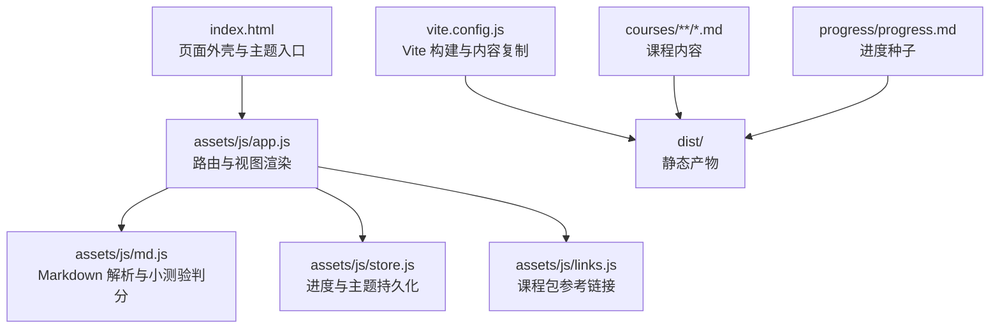
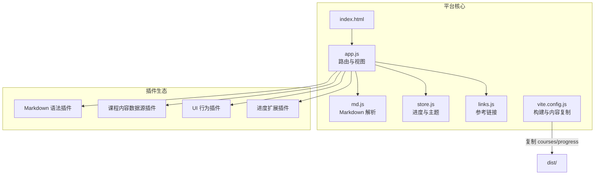
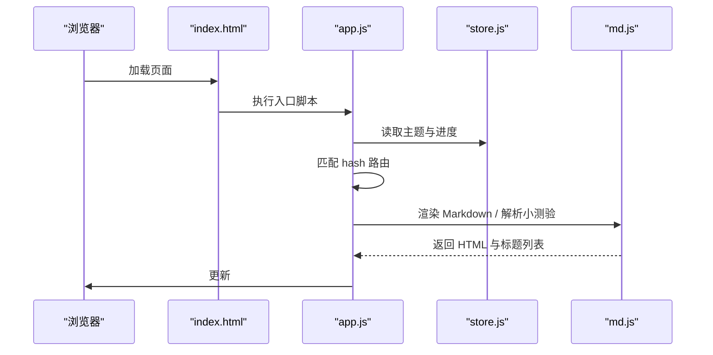
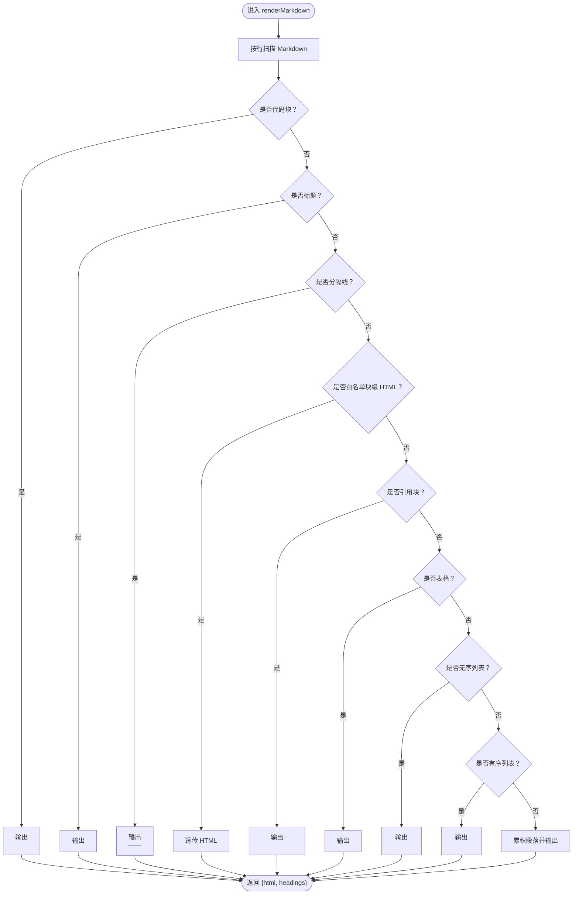
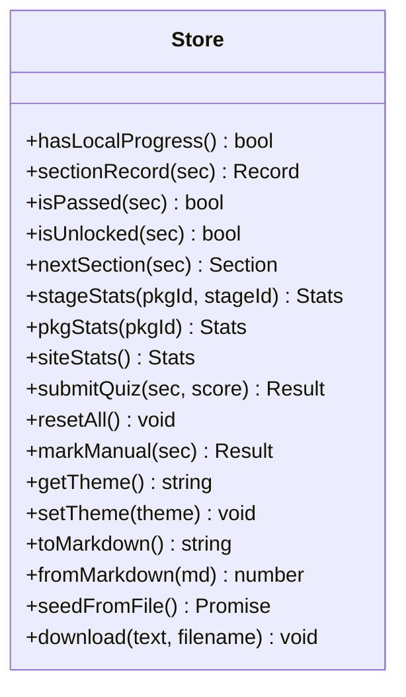
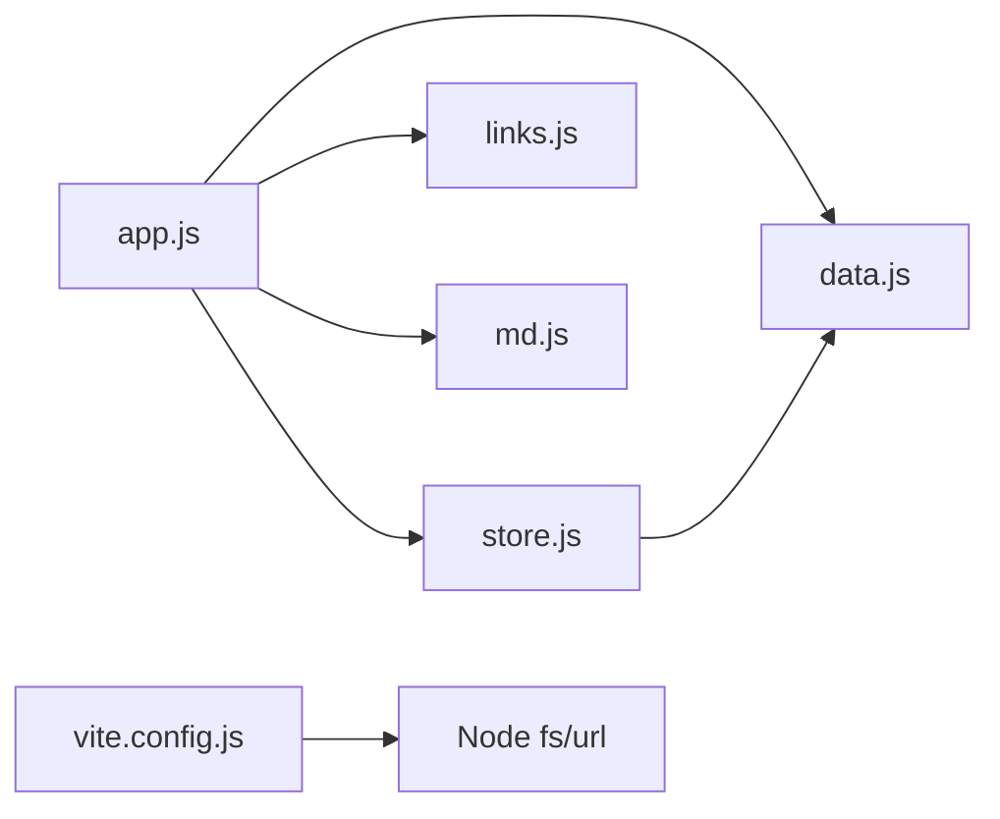
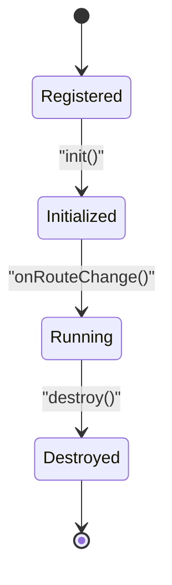
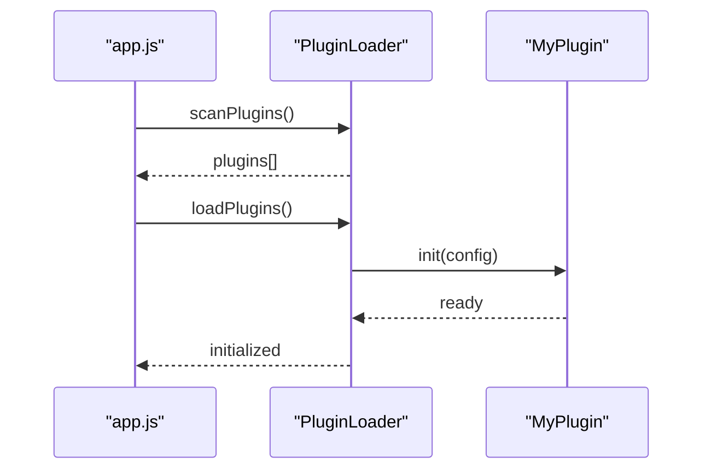

# 插件开发

<cite>
**本文引用的文件**   
- [index.html](file://index.html)
- [app.js](file://assets/js/app.js)
- [md.js](file://assets/js/md.js)
- [store.js](file://assets/js/store.js)
- [links.js](file://assets/js/links.js)
- [vite.config.js](file://vite.config.js)
- [package.json](file://package.json)
- [README.md](file://README.md)
</cite>

## 目录
1. [引言](#引言)
2. [项目结构](#项目结构)
3. [核心组件](#核心组件)
4. [架构总览](#架构总览)
5. [详细组件分析](#详细组件分析)
6. [依赖关系分析](#依赖关系分析)
7. [性能与可扩展性考量](#性能与可扩展性考量)
8. [故障排查指南](#故障排查指南)
9. [结论](#结论)
10. [附录：插件开发规范与示例](#附录插件开发规范与示例)

## 引言
本指南面向希望为大 Java 后端学习平台设计和实现可扩展插件系统的开发者。当前仓库是一个零运行时依赖的纯静态前端站点，由 Vite 驱动开发与构建；课程骨架、路由、渲染、进度存储、Markdown 解析等能力集中在若干原生 ES Module 文件中。

在现有模块化架构基础上，本文提出一套“前端插件系统”的设计方案，重点覆盖：
- 插件接口定义、生命周期管理、依赖注入机制
- 在 `app.js` 中实现插件发现、加载与初始化流程
- 统一的 API、事件系统与配置管理机制
- 通过插件扩展 Markdown 解析器（新增语法与自定义渲染）
- 通过插件动态扩展课程内容数据源
- 调试方法、测试框架与部署流程
- 从简单功能插件到复杂系统集成插件的完整示例

## 项目结构
仓库采用“外壳 + 内容”分层组织：
- 外壳层：`index.html` 提供页面骨架与主题切换入口，`assets/js/*` 提供路由、视图渲染、Markdown 解析、进度存储、资源链接等能力
- 内容层：`courses/**` 下的 Markdown 四件套（课文、小测验、作业题、面试题），以及 `progress/progress.md` 作为进度种子文件
- 构建层：`vite.config.js` 负责将运行时按需 fetch 的 `courses/` 与 `progress/` 复制到构建产物 `dist/`
- 脚本层：`scripts/*` 提供脚手架、大纲生成、自检等 Node ESM 工具

**图表来源**
- [index.html:1-48](file://index.html#L1-L48)
- [app.js:1-522](file://assets/js/app.js#L1-L522)
- [md.js:1-338](file://assets/js/md.js#L1-L338)
- [store.js:1-183](file://assets/js/store.js#L1-L183)
- [links.js:1-109](file://assets/js/links.js#L1-L109)
- [vite.config.js:1-35](file://vite.config.js#L1-L35)

**章节来源**
- [README.md:13-48](file://README.md#L13-L48)
- [README.md:145-170](file://README.md#L145-L170)
- [vite.config.js:8-30](file://vite.config.js#L8-L30)

## 核心组件
围绕插件系统，需要明确以下核心组件及其职责：
- 应用外壳与路由：`index.html` 与 `app.js`
- Markdown 解析与渲染：`md.js`
- 进度与主题存储：`store.js`
- 课程包参考链接：`links.js`
- 构建与内容复制：`vite.config.js`
- 脚本与工具：`scripts/*`（脚手架、大纲、自检）

这些组件共同构成一个可被插件扩展的前端平台。插件可以：
- 扩展 Markdown 解析器（新增语法、自定义渲染）
- 扩展课程内容数据源（动态加载额外课程、支持多种格式）
- 扩展 UI 行为（如新增导航项、侧边栏、统计面板）
- 扩展进度模型（如增加新的状态字段或导出格式）

**章节来源**
- [index.html:1-48](file://index.html#L1-L48)
- [app.js:1-522](file://assets/js/app.js#L1-L522)
- [md.js:1-338](file://assets/js/md.js#L1-L338)
- [store.js:1-183](file://assets/js/store.js#L1-L183)
- [links.js:1-109](file://assets/js/links.js#L1-L109)
- [vite.config.js:1-35](file://vite.config.js#L1-L35)

## 架构总览
下图展示“平台 + 插件”的整体架构。平台提供基础能力，插件通过统一接口接入，不侵入核心逻辑。

**图表来源**
- [index.html:1-48](file://index.html#L1-L48)
- [app.js:1-522](file://assets/js/app.js#L1-L522)
- [md.js:1-338](file://assets/js/md.js#L1-L338)
- [store.js:1-183](file://assets/js/store.js#L1-L183)
- [links.js:1-109](file://assets/js/links.js#L1-L109)
- [vite.config.js:1-35](file://vite.config.js#L1-L35)

## 详细组件分析

### 应用外壳与路由（index.html + app.js）
- `index.html` 提供页面骨架、主题按钮、顶部导航与主容器 `#app`，并在首帧前设置主题，避免闪烁
- `app.js` 实现：
  - 路由匹配与视图渲染（首页、课程包、小节、地图、进度）
  - 课程卡片、阶段地图、小节子页、小测验、作业题、面试题的渲染
  - 流程图绘制（基于 `pre[data-lang="flow"]` 的零依赖流程可视化）
  - 事件委托处理（目录跳转、小测验提交与重置、手动过关、进度导入导出）
  - 主题切换与本地存储交互

插件接入点建议：
- 在路由注册表 `ROUTES` 前后扩展新路由
- 在视图渲染函数（如 `viewHome`、`viewPkg`、`viewSection`）之后注入扩展内容
- 通过事件委托扩展点击行为（例如为特定元素添加钩子）

**图表来源**
- [index.html:11-45](file://index.html#L11-L45)
- [app.js:472-521](file://assets/js/app.js#L472-L521)
- [store.js:100-104](file://assets/js/store.js#L100-L104)
- [md.js:62-149](file://assets/js/md.js#L62-L149)

**章节来源**
- [index.html:1-48](file://index.html#L1-L48)
- [app.js:1-522](file://assets/js/app.js#L1-L522)

### Markdown 解析器（md.js）
`md.js` 是零依赖的 Markdown 解析器，支持：
- 标题、段落、列表、表格、代码块、引用、粗斜体、行内代码、链接、分隔线
- 站内相对 `.md` 链接转换为 hash 路由
- 小测验解析与判分（单选、多选、判断、填空、简答）

插件扩展点：
- 新增语法块：在 `renderMarkdown` 中添加新的正则匹配与 HTML 输出
- 自定义渲染：为特定语言代码块或自定义块（如流程图）提供渲染逻辑
- 小测验扩展：在 `parseQuiz` 与 `gradeQuestion` 中扩展题型与评分规则

**图表来源**
- [md.js:62-149](file://assets/js/md.js#L62-L149)

**章节来源**
- [md.js:1-338](file://assets/js/md.js#L1-L338)

### 进度与主题存储（store.js）
`store.js` 负责：
- 进度主存储：`localStorage` 键 `bjb.progress.v1`
- 主题存储：`localStorage` 键 `bjb.theme`
- 解锁规则：同包顺序解锁，跨包互不限制
- 小测验提交与手动过关
- Markdown 进度文件的导出、导入与种子文件恢复

插件扩展点：
- 扩展进度字段（如新增“学习时长”“难度自评”）
- 扩展导出/导入格式（如 JSON、CSV）
- 扩展解锁策略（如引入时间维度或外部认证）

**图表来源**
- [store.js:1-183](file://assets/js/store.js#L1-L183)

**章节来源**
- [store.js:1-183](file://assets/js/store.js#L1-L183)

### 课程包参考链接（links.js）
`links.js` 提供每个课程包的官方/中文参考网站链接，作为元数据补充。该模块不改变骨架事实源，但增强课程包页面的资源区。

插件扩展点：
- 为特定课程包追加更多权威链接
- 根据环境动态加载链接（如企业内网镜像）

**章节来源**
- [links.js:1-109](file://assets/js/links.js#L1-L109)

### 构建与内容复制（vite.config.js）
`vite.config.js` 使用自定义插件 `copy-content`，在构建后将 `courses/` 与 `progress/` 复制到 `dist/`，确保运行时 `fetch` 能访问这些 Markdown 文件。

插件扩展点：
- 新增内容目录（如 `plugins/courses/`）并复制到 `dist/`
- 在构建前对内容进行预处理（如模板替换、校验）

**章节来源**
- [vite.config.js:1-35](file://vite.config.js#L1-L35)

## 依赖关系分析
当前平台的依赖关系清晰且低耦合：
- `app.js` 依赖 `data.js`（骨架事实源）、`links.js`、`md.js`、`store.js`
- `store.js` 依赖 `data.js`
- `md.js` 独立，无外部依赖
- `links.js` 独立，仅暴露常量
- `vite.config.js` 依赖 Node 文件系统与 URL 工具

**图表来源**
- [app.js:3-6](file://assets/js/app.js#L3-L6)
- [store.js:2-2](file://assets/js/store.js#L2-L2)
- [vite.config.js:1-4](file://vite.config.js#L1-L4)

**章节来源**
- [app.js:1-10](file://assets/js/app.js#L1-L10)
- [store.js:1-5](file://assets/js/store.js#L1-L5)
- [vite.config.js:1-10](file://vite.config.js#L1-L10)

## 性能与可扩展性考量
- 零运行时依赖：减少包体积与运行时开销
- 自写 Markdown 解析器：避免引入重型库，提升解析速度
- 缓存策略：`loadMd` 使用内存缓存，避免重复请求
- 构建优化：Vite 内容哈希自动失效缓存，开发期热更新
- 可扩展性：通过插件机制在不修改核心代码的前提下扩展功能

建议：
- 插件应遵循最小权限原则，仅访问必要 API
- 插件应避免阻塞主线程，异步操作需考虑错误处理
- 插件配置应集中管理，便于调试与版本控制

[本节为通用指导，不直接分析具体文件]

## 故障排查指南
常见问题与定位方法：
- 路由不生效：检查 `location.hash` 是否与 `ROUTES` 正则匹配
- Markdown 未渲染：确认 `renderMarkdown` 是否正确返回 `html` 与 `headings`
- 小测验无法判分：检查 `parseQuiz` 是否解析出题目，`gradeQuiz` 评分逻辑是否符合预期
- 进度未保存：检查 `localStorage` 是否可用，`store.submitQuiz` 是否被调用
- 内容无法访问：确认 `vite.config.js` 是否正确复制 `courses/` 与 `progress/` 到 `dist/`

**章节来源**
- [app.js:472-521](file://assets/js/app.js#L472-L521)
- [md.js:193-284](file://assets/js/md.js#L193-L284)
- [store.js:72-99](file://assets/js/store.js#L72-L99)
- [vite.config.js:13-24](file://vite.config.js#L13-L24)

## 结论
本平台以极简架构提供强大的学习体验，并通过模块化设计为插件扩展奠定基础。未来可通过插件系统进一步丰富功能，包括 Markdown 语法扩展、课程内容动态加载、UI 行为增强与进度模型扩展。插件开发者应遵循统一接口、事件系统与配置管理机制，确保生态系统的稳定与繁荣。

[本节为总结性内容，不直接分析具体文件]

## 附录：插件开发规范与示例

### 插件接口定义
建议定义如下插件接口：
- `init(config)`: 初始化插件，接收配置对象
- `onRouteChange(route)`: 路由变化时触发，用于更新插件状态
- `onRender(viewName, context)`: 视图渲染后触发，用于注入扩展内容
- `onEvent(event, data)`: 事件总线回调，用于响应平台事件
- `destroy()`: 插件销毁时清理资源

示例（伪代码路径）：
- [插件接口定义](file://assets/js/plugins/api.js)
- [插件基类](file://assets/js/plugins/base.js)

### 生命周期管理
插件生命周期包括：
- 注册：在 `app.js` 启动时扫描并注册插件
- 初始化：调用 `init(config)`
- 运行：监听路由变化与事件
- 销毁：页面卸载时清理资源

**图表来源**
- [app.js:515-521](file://assets/js/app.js#L515-L521)

### 依赖注入机制
平台应提供依赖注入容器，插件可声明依赖并获取实例：
- 核心服务：路由、存储、Markdown 解析器
- 第三方库：可选依赖，按需加载

示例（伪代码路径）：
- [依赖注入容器](file://assets/js/plugins/di.js)

### 插件注册机制
在 `app.js` 中实现插件发现、加载与初始化：
- 插件发现：扫描 `assets/js/plugins/` 目录
- 插件加载：动态 import 插件模块
- 插件初始化：调用 `init(config)` 并注册事件监听

**图表来源**
- [app.js:515-521](file://assets/js/app.js#L515-L521)

### 插件开发规范
- 统一 API：所有插件必须实现标准接口
- 事件系统：通过事件总线进行通信，避免直接耦合
- 配置管理：插件配置集中存放，支持环境变量
- 错误处理：插件内部异常不应影响平台稳定性

### 扩展 Markdown 解析器
通过插件新增语法支持：
- 注册新语法块：在 `renderMarkdown` 中插入自定义逻辑
- 自定义渲染：为特定语言或块类型提供渲染函数

示例（伪代码路径）：
- [Markdown 语法插件](file://assets/js/plugins/markdown-syntax.js)

### 扩展课程内容数据源
通过插件动态加载额外课程：
- 数据源适配器：支持 JSON、API、Git 等多种格式
- 课程合并：与现有骨架数据合并，保持唯一性

示例（伪代码路径）：
- [课程内容数据源插件](file://assets/js/plugins/course-data-source.js)

### 调试方法
- 控制台日志：插件应提供调试开关
- 断点调试：利用浏览器开发者工具
- 单元测试：使用 Jest 或 Vitest 测试插件逻辑

### 测试框架
- 单元测试：测试插件接口与核心逻辑
- 集成测试：测试插件与平台交互
- 端到端测试：使用 Playwright 或 Cypress 模拟用户操作

### 部署流程
- 开发：`npm run dev`
- 构建：`npm run build`
- 预览：`npm run preview`
- 生产：`npm run prod`

**章节来源**
- [package.json:7-15](file://package.json#L7-L15)
- [vite.config.js:27-34](file://vite.config.js#L27-L34)