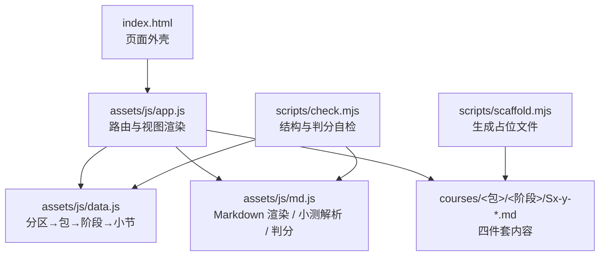
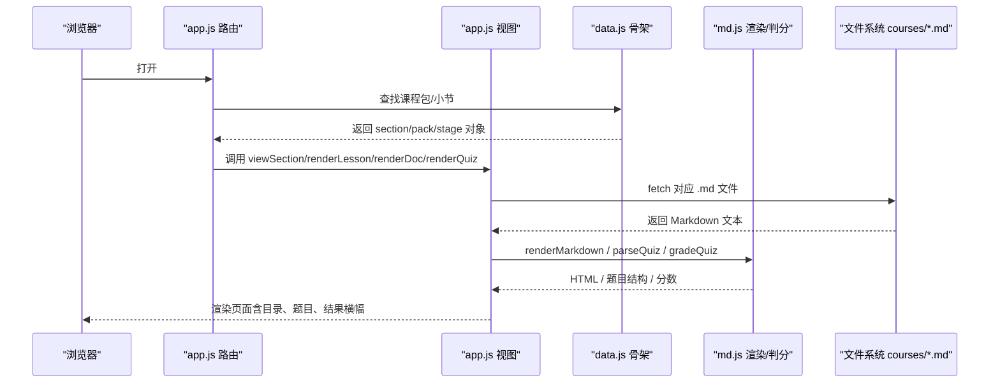
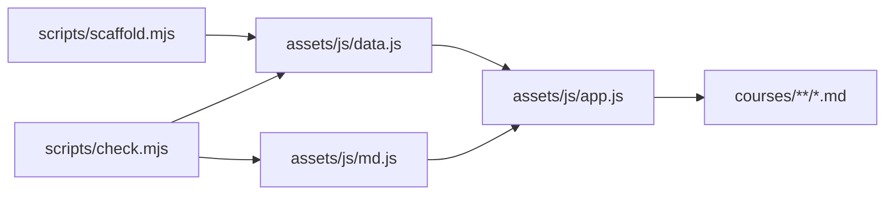

# 课程扩展

<cite>
**本文引用的文件**   
- [README.md](file://README.md)
- [data.js](file://assets/js/data.js)
- [app.js](file://assets/js/app.js)
- [md.js](file://assets/js/md.js)
- [scaffold.mjs](file://scripts/scaffold.mjs)
- [check.mjs](file://scripts/check.mjs)
</cite>

## 目录
1. [引言](#引言)
2. [项目结构](#项目结构)
3. [核心组件](#核心组件)
4. [架构总览](#架构总览)
5. [详细扩展示例](#详细扩展示例)
6. [数据源规范：CATEGORIES 与小节元组](#数据源规范categories-与小节元组)
7. [Markdown 内容组织与编写标准](#markdown-内容组织与编写标准)
8. [脚手架与自检工具](#脚手架与自检工具)
9. [依赖关系分析](#依赖关系分析)
10. [性能与可维护性建议](#性能与可维护性建议)
11. [故障排查指南](#故障排查指南)
12. [结论](#结论)

## 引言
本指南面向希望向大 Java 后端学习平台添加新课程的开发者。目标包括：
- 在唯一骨架事实源 `assets/js/data.js` 中新增技术分区、课程包、阶段和小节。
- 按约定创建 `courses/<包id>/<阶段id>/Sx-y-{Lesson,Quiz,Homework,Interview}.md` 四件套。
- 掌握知识点描述、难度与重要性评级、测验题型语法。
- 使用脚手架 `scripts/scaffold.mjs` 自动生成占位文件。
- 通过 `npm run check` 验证渲染、判分与进度解锁逻辑。

## 项目结构
平台采用“单一骨架事实源 + 纯 Markdown 内容”的架构：
- 骨架由 `assets/js/data.js` 提供，驱动首页卡片、课程包页、小节路由、地图与进度。
- 课程内容位于 `courses/`，每个小节固定四件套：课文、小测、作业、面试题。
- 前端渲染由原生 ES Module 完成，无 UI 框架；Markdown 解析与测验判分由自写模块处理。
- Node 脚本提供脚手架、大纲生成与内容自检。



**图表来源**
- [app.js:1-10](file://assets/js/app.js#L1-L10)
- [data.js:1-8](file://assets/js/data.js#L1-L8)
- [md.js:1-10](file://assets/js/md.js#L1-L10)
- [scaffold.mjs:1-10](file://scripts/scaffold.mjs#L1-L10)
- [check.mjs:1-10](file://scripts/check.mjs#L1-L10)

**章节来源**
- [README.md:13-37](file://README.md#L13-L37)
- [README.md:89-104](file://README.md#L89-L104)
- [README.md:145-170](file://README.md#L145-L170)

## 核心组件
- **骨架数据源**：`assets/js/data.js` 导出 `CATEGORIES` 与派生索引 `INDEX`，是全站唯一事实源。
- **应用路由与视图**：`assets/js/app.js` 负责首页、课程包、小节、小测、作业、面试题、地图、进度的渲染与交互。
- **Markdown 与测验引擎**：`assets/js/md.js` 实现轻量 Markdown 渲染、站内链接转换、小测解析与评分。
- **脚手架**：`scripts/scaffold.mjs` 根据 `data.js` 为缺失小节批量创建四件套占位文件。
- **自检脚本**：`scripts/check.mjs` 校验 id 唯一性、取值范围、文件存在性、小测格式与判分正确性。

**章节来源**
- [data.js:1-8](file://assets/js/data.js#L1-L8)
- [app.js:1-6](file://assets/js/app.js#L1-L6)
- [md.js:1-10](file://assets/js/md.js#L1-L10)
- [scaffold.mjs:1-10](file://scripts/scaffold.mjs#L1-L10)
- [check.mjs:1-10](file://scripts/check.mjs#L1-L10)

## 架构总览
从用户访问到内容渲染的关键链路如下：



**图表来源**
- [app.js:183-233](file://assets/js/app.js#L183-L233)
- [app.js:241-390](file://assets/js/app.js#L241-L390)
- [md.js:168-337](file://assets/js/md.js#L168-L337)

## 详细扩展示例
以下以“新增一个课程包并补充一节完整内容”为例，说明从数据源到内容文件的完整流程。

### 步骤一：在 data.js 中添加课程包与一节
1. 打开 `assets/js/data.js`，找到目标大技术分区（例如“相关框架”）。
2. 在该分区的 `packages` 数组末尾追加新的课程包对象，包含：
   - `id`：小写短横线标识，如 `my-new-package`。
   - `name`：课程包名称。
   - `importance`：1-5 的重要性评级。
   - `desc`：一句话说明该包的学习目标。
   - `stages`：至少一个阶段对象，包含 `id`（如 `s1`）、`name`、`sections`。
3. 在 `sections` 数组中追加一个小节元组：
   - `[小节id, 标题, 一句话知识点, 难度(1-5), 重要性(1-5)]`。
   - 小节 id 建议使用小写短横线，如 `s1-1`。

示例路径参考：
- [data.js:184-272](file://assets/js/data.js#L184-L272)

完成后，站点首页会多出一张课程包卡片；进入课程包页后，能看到阶段与小节列表。

**章节来源**
- [data.js:1-8](file://assets/js/data.js#L1-L8)
- [data.js:184-272](file://assets/js/data.js#L184-L272)

### 步骤二：运行脚手架生成四件套占位文件
在终端执行：
```bash
npm run scaffold
```
该命令会：
- 遍历 `data.js` 中的所有小节。
- 为每个小节生成 `Lesson.md`、`Quiz.md`、`Homework.md`、`Interview.md`。
- 若文件已存在则跳过，不会覆盖已有内容。
- 为小测占位文件加入“手动过关”降级提示，避免阻塞解锁链。

输出示例会显示新建数量与跳过数量。

**章节来源**
- [scaffold.mjs:1-55](file://scripts/scaffold.mjs#L1-L55)

### 步骤三：编写 Lesson.md
- 正文应围绕小节元组的“一句话知识点”展开。
- 重要级越高，越需要源码、场景与行业实践。
- 可使用二级/三级标题组织目录，便于左侧目录跳转。
- 例子程序需满足仓库硬性规范：目的注释、行注释影响、定义必配应用、正确用例、错误用例。

示例路径参考：
- [README.md:106-116](file://README.md#L106-L116)

**章节来源**
- [README.md:106-116](file://README.md#L106-L116)

### 步骤四：编写 Quiz.md
小测支持多种题型，同一份卷子可混用：
- 单选：题干不含“多选”，选项 ≥2。
- 多选：题干含“多选”。
- 判断：两个对立选项（如“正确/错误”）。
- 填空：题干含“填空/填写/补全”或带下划线。
- 简答：其他主观题。

每题语法要点：
- 题干以 `### 序号. 题干（分值）` 开头。
- 选项以 `- A. 选项文本` 形式列出。
- 答案写在题干内或末尾统一“## 答案”段：
  - 客观题：`> 答案：B` 或 `> 参考答案：ABD`。
  - 主观题：`> 参考答案：关键词`，可用要点列表给出得分关键词。
- 可选解析：`> 解析：...`。

示例路径参考：
- [md.js:168-284](file://assets/js/md.js#L168-L284)

**章节来源**
- [md.js:168-284](file://assets/js/md.js#L168-L284)

### 步骤五：编写 Homework.md 与 Interview.md
- Homework：布置 2-4 道能动手验证的应用题，附验收标准与参考解法。
- Interview：给出高频追问链与期望答题要点，覆盖“是什么/为什么/怎么落地/踩过什么坑”。

示例路径参考：
- [scaffold.mjs:27-38](file://scripts/scaffold.mjs#L27-L38)

**章节来源**
- [scaffold.mjs:27-38](file://scripts/scaffold.mjs#L27-L38)

### 步骤六：运行自检
```bash
npm run check
```
该脚本会检查：
- 课程包 id 唯一性与重要性取值。
- 小节键唯一性与难度/重要性取值。
- 四件套文件是否存在。
- 小测是否可解析、总分是否为 100、答案合法性、解析完整性。
- 非小测文件是否至少有一个二级标题。
- 渲染器冒烟测试与边界语法。

**章节来源**
- [check.mjs:14-118](file://scripts/check.mjs#L14-L118)

### 步骤七：本地预览与验证
- 开发模式：`npm run dev`，访问 `http://localhost:5180`。
- 生产预览：`npm run prod`，访问 `http://localhost:8080`。
- 验证项：
  - 首页出现新课程包卡片。
  - 课程包页显示阶段与小节。
  - 小节课文、作业、面试题正常渲染。
  - 小测可作答、提交后显示得分与解析。
  - 得分 ≥60 自动通关并解锁下一节。
  - 进度页可导出/导入 `progress.md`。

**章节来源**
- [README.md:53-78](file://README.md#L53-L78)
- [README.md:80-88](file://README.md#L80-L88)

## 数据源规范：CATEGORIES 与小节元组
### 大技术分区 category
- `id`：英文短横线标识，作为分组键。
- `name`：中文名称。
- `desc`：一句话说明该分区的学习价值。
- `packages`：课程包数组。

### 课程包 package
- `id`：小写短横线标识，用于路由与文件映射。
- `name`：课程包名称。
- `importance`：1-5，决定首页卡片标签颜色与讲解详略。
- `desc`：一句话说明该包的目标与定位。
- `stages`：阶段数组。

### 阶段 stage
- `id`：小写短横线，如 `s1`、`s2`。
- `name`：阶段名称，如“阶段一 · 复杂度与线性结构”。
- `sections`：小节数组。

### 小节 section
小节以元组形式定义：
- `[id, title, summary, difficulty, importance]`
- `id`：小节 id，建议小写短横线，如 `s1-1`。
- `title`：小节标题。
- `summary`：一句话知识点，用于卡片摘要与占位模板。
- `difficulty`：1-5，表示学习难度。
- `importance`：1-5，表示重要性与讲解深度。

### 重要性与详略映射
- 5：核心精讲，源码 + 场景 + 行业实践。
- 4：重点标准，讲透原理并配实战与权衡。
- 3：标准概览，够用机制 + 典型示例。
- 2：简明速览，定位、用法与取舍。
- 1：了解即可，知道是什么、何时需要。

**章节来源**
- [data.js:1-8](file://assets/js/data.js#L1-L8)
- [app.js:16-24](file://assets/js/app.js#L16-L24)

## Markdown 内容组织与编写标准
### 目录结构
```
courses/<包id>/<阶段id>/
  Sx-y-Lesson.md
  Sx-y-Quiz.md
  Sx-y-Homework.md
  Sx-y-Interview.md
```
- 包 id 与阶段 id 使用小写短横线。
- 文件名编号使用大写，如 `S1-2-Lesson.md`。
- 小节 id 与路由键使用小写，如 `s1-2`。

### 课文 Lesson.md
- 使用二级/三级标题组织内容。
- 结合原理、代码、配置与行业场景。
- 例子程序遵循五条硬性规范。

### 小测 Quiz.md
- 题干以三级标题开头：`### 1. 题干（5分）`。
- 选项以 `- A. 选项文本` 列出。
- 答案与解析：
  - 客观题：`> 答案：B`。
  - 主观题：`> 参考答案：关键词`，或使用要点列表。
  - 可选：`> 解析：...`。
- 末尾统一答案段可选：`## 答案`，逐行 `1. B` 或 `2. ABD`。

### 作业与面试
- Homework：应用题为主，附验收标准与参考解法。
- Interview：高频追问链与期望要点，覆盖实战与踩坑。

**章节来源**
- [README.md:22-31](file://README.md#L22-L31)
- [README.md:106-116](file://README.md#L106-L116)
- [md.js:168-284](file://assets/js/md.js#L168-L284)

## 脚手架与自检工具
### 脚手架 scaffold.mjs
- 读取 `data.js` 的索引。
- 为每个小节生成四件套占位文件。
- 小测占位文件默认不解析为标准题，走“手动过关”模式。
- 幂等：已存在文件跳过。

**章节来源**
- [scaffold.mjs:1-55](file://scripts/scaffold.mjs#L1-L55)

### 自检 check.mjs
- 校验 id 唯一性、重要性/难度取值。
- 校验四件套文件存在性。
- 校验小测解析、总分、答案合法性、解析完整性。
- 校验非小测文件至少有一个二级标题。
- 渲染器冒烟测试与边界语法。
- 自定义格式小测降级为文档展示。

**章节来源**
- [check.mjs:14-118](file://scripts/check.mjs#L14-L118)

## 依赖关系分析


**图表来源**
- [app.js:1-6](file://assets/js/app.js#L1-L6)
- [data.js:1-8](file://assets/js/data.js#L1-L8)
- [md.js:1-10](file://assets/js/md.js#L1-L10)
- [scaffold.mjs:1-10](file://scripts/scaffold.mjs#L1-L10)
- [check.mjs:1-10](file://scripts/check.mjs#L1-L10)

**章节来源**
- [app.js:1-6](file://assets/js/app.js#L1-L6)
- [data.js:1-8](file://assets/js/data.js#L1-L8)
- [md.js:1-10](file://assets/js/md.js#L1-L10)
- [scaffold.mjs:1-10](file://scripts/scaffold.mjs#L1-L10)
- [check.mjs:1-10](file://scripts/check.mjs#L1-L10)

## 性能与可维护性建议
- 保持骨架事实源唯一：所有课程结构变更只改 `data.js`。
- 控制小节粒度：避免单节过长，合理拆分阶段与小节。
- 重要性分级明确：高重要级小节需提供源码、场景与权衡。
- 小测分值合计为 100：显式标注分值或依赖平均分配。
- 使用脚手架补齐占位：减少重复劳动，保证结构一致。
- 定期运行自检：确保解析、判分与渲染稳定。

[本节为通用建议，不直接分析具体文件]

## 故障排查指南
### 常见问题
- 首页没有新课程包：
  - 检查 `data.js` 中是否新增 package 且 importance 合法。
  - 运行 `npm run scaffold` 生成四件套。
  - 运行 `npm run check` 查看报错。
- 小节无法解锁：
  - 确认上一节小测得分 ≥60。
  - 检查小测是否被解析为标准题；否则需手动标记通过。
- 小测无法判分：
  - 检查题干是否以 `### 序号.` 开头。
  - 检查选项是否以 `- A. ...` 列出。
  - 检查答案是否匹配选项字母。
  - 检查总分是否为 100。
- 课文未渲染目录：
  - 确保至少有一个二级标题。
  - 检查 Markdown 语法未被转义。

**章节来源**
- [app.js:183-233](file://assets/js/app.js#L183-L233)
- [app.js:241-390](file://assets/js/app.js#L241-L390)
- [md.js:168-337](file://assets/js/md.js#L168-L337)
- [check.mjs:43-118](file://scripts/check.mjs#L43-L118)

## 结论
通过修改 `assets/js/data.js` 并配合 `courses/` 下的 Markdown 四件套，你可以快速扩展大 Java 后端学习平台的课程内容。使用脚手架自动生成占位文件，使用自检脚本保障结构与判分质量，最终在本地预览中验证渲染、测验与进度解锁。对于初学者，建议先复制现有课程包结构再逐步深入；对于有经验的开发者，可重点关注重要性分级、小测题型语法与性能调优相关的章节设计。

[本节为总结性内容，不直接分析具体文件]