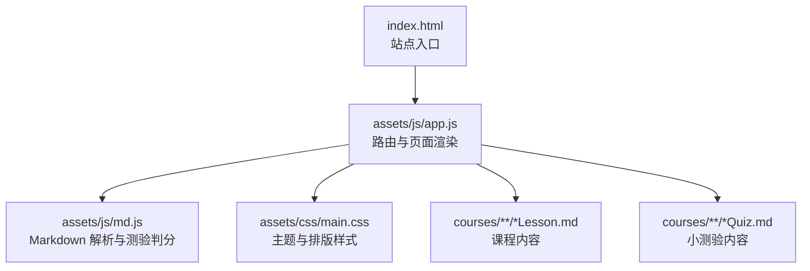
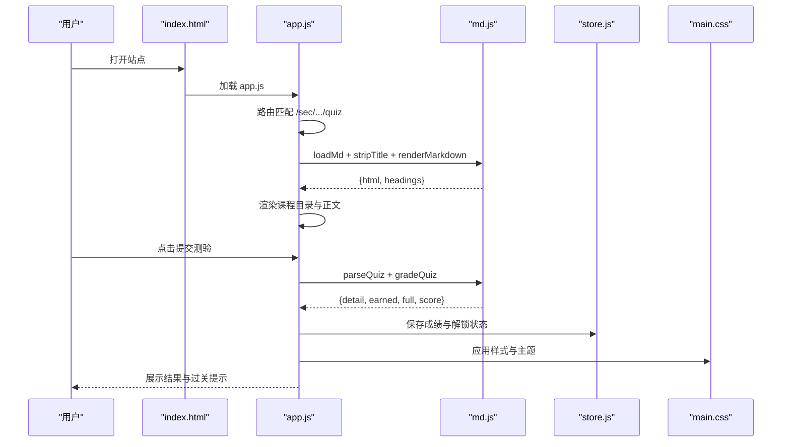
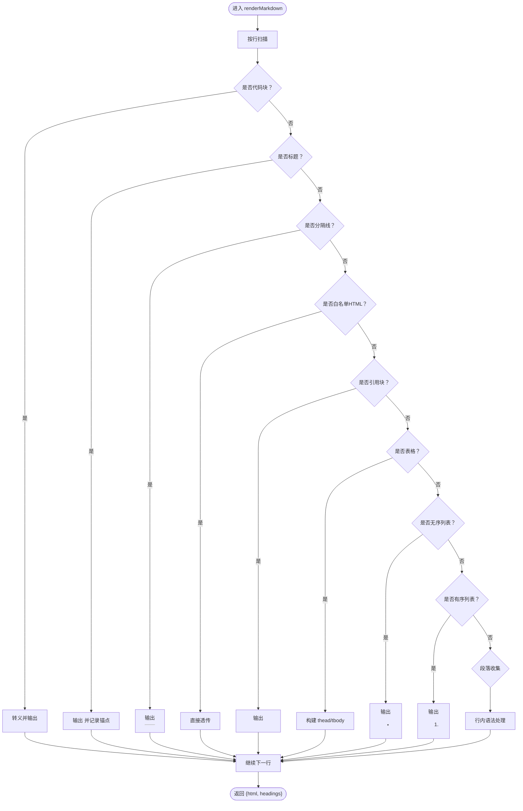
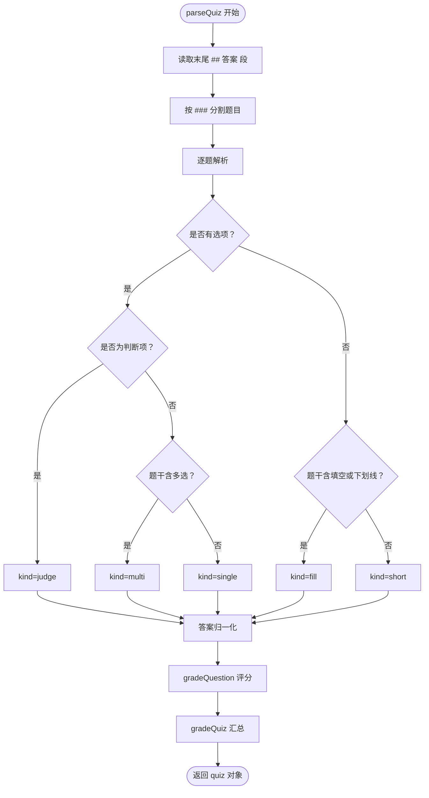
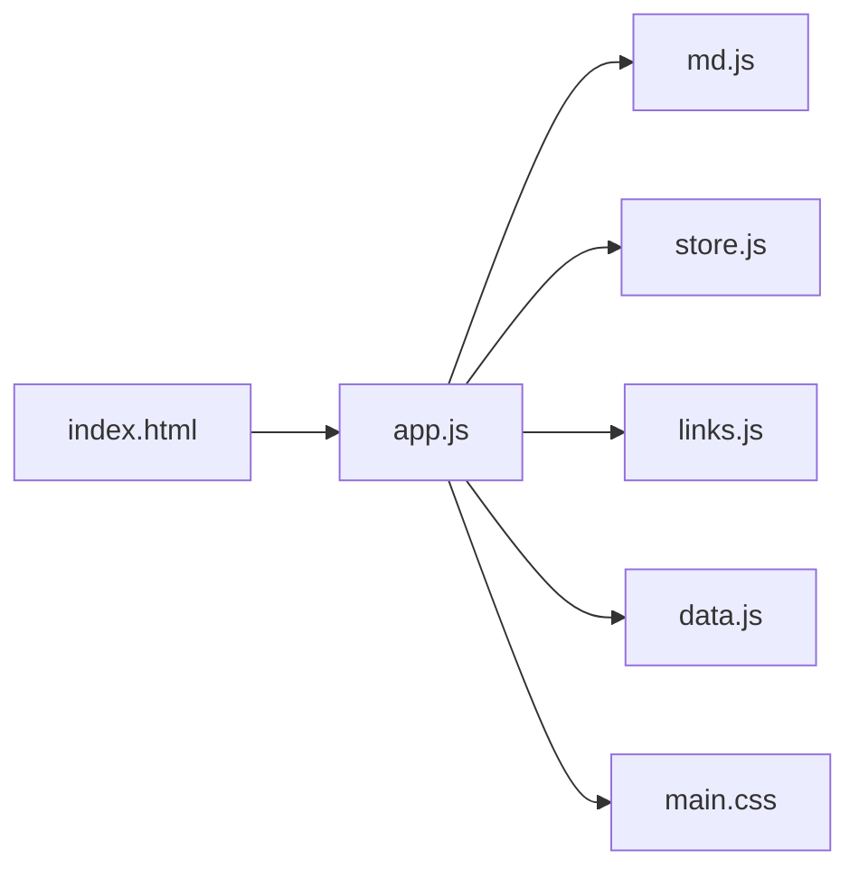

# Markdown 渲染引擎

<cite>
**本文引用的文件**   
- [assets/js/md.js](file://assets/js/md.js)
- [assets/js/app.js](file://assets/js/app.js)
- [assets/css/main.css](file://assets/css/main.css)
- [index.html](file://index.html)
- [courses/java-basics/s1/S1-4-Lesson.md](file://courses/java-basics/s1/S1-4-Lesson.md)
- [courses/java-basics/s1/S1-4-Quiz.md](file://courses/java-basics/s1/S1-4-Quiz.md)
</cite>

## 目录
1. [引言](#引言)
2. [项目结构](#项目结构)
3. [核心组件](#核心组件)
4. [架构总览](#架构总览)
5. [详细组件分析](#详细组件分析)
6. [依赖关系分析](#依赖关系分析)
7. [性能与优化](#性能与优化)
8. [故障排查](#故障排查)
9. [结论](#结论)
10. [附录：语法与示例](#附录语法与示例)

## 引言
本技术文档面向“大Java后端学习平台”的 Markdown 渲染与测验判分系统。文档围绕以下目标展开：
- 解释自研 Markdown 解析器 md.js 的基础语法解析、自定义标签处理与安全过滤机制。
- 深入剖析测验判分系统：题型识别（单选、多选、判断、填空、简答）、答案验证算法、分数计算逻辑。
- 阐述内容安全处理：XSS 防护、脚本过滤、HTML 白名单机制。
- 说明渲染流程：Markdown 文本预处理、正则表达式匹配、HTML 模板生成、样式应用。
- 解释特殊功能：过关卡提示、作业标记、重点内容高亮。
- 为初学者提供 Markdown 语法与解析原理说明，为高级开发者提供扩展点与性能优化建议。

## 项目结构
本项目采用前端静态站点模式，核心渲染逻辑集中在 assets/js/md.js，页面路由与交互在 assets/js/app.js，样式在 assets/css/main.css，入口 HTML 为 index.html。课程内容由 courses 下的 .md 文件组织，按“课程包/阶段/小节编号-种类”命名。



图示来源
- [index.html:1-48](file://index.html#L1-L48)
- [assets/js/app.js:1-522](file://assets/js/app.js#L1-L522)
- [assets/js/md.js:1-338](file://assets/js/md.js#L1-L338)
- [assets/css/main.css:1-241](file://assets/css/main.css#L1-L241)

章节来源
- [index.html:1-48](file://index.html#L1-L48)
- [assets/js/app.js:1-522](file://assets/js/app.js#L1-L522)
- [assets/js/md.js:1-338](file://assets/js/md.js#L1-L338)
- [assets/css/main.css:1-241](file://assets/css/main.css#L1-L241)

## 核心组件
- Markdown 解析器（assets/js/md.js）
  - 基础语法：标题、段落、列表、表格、代码块、引用、分隔线。
  - 行内语法：加粗、斜体、行内代码、图片、链接。
  - 自定义标签：白名单透传 details/summary/div/section/table 等。
  - 站内链接转换：相对路径转 hash 路由。
  - 测验解析：parseQuiz、gradeQuestion、gradeQuiz。
- 页面渲染与交互（assets/js/app.js）
  - 路由分发、课程卡片、小节页、测验页、进度页。
  - 流程图绘制（flow 代码块）。
  - 测验提交、判分、过关解锁、手动通过。
- 样式与主题（assets/css/main.css）
  - 课程正文排版、测验 UI、难度与重要度标签、主题变量。
- 入口与主题初始化（index.html）
  - 首帧前主题注入、导航、主容器、主题切换按钮。

章节来源
- [assets/js/md.js:1-338](file://assets/js/md.js#L1-L338)
- [assets/js/app.js:1-522](file://assets/js/app.js#L1-L522)
- [assets/css/main.css:1-241](file://assets/css/main.css#L1-L241)
- [index.html:1-48](file://index.html#L1-L48)

## 架构总览
整体渲染链路如下：
- 用户访问 index.html，app.js 根据 hash 路由渲染对应页面。
- 课程页调用 renderMarkdown 将 Markdown 转为 HTML，并抽取二级/三级标题生成目录。
- 测验页调用 parseQuiz 解析题目，用户提交后调用 gradeQuiz 计算得分，结合 store 更新进度与解锁状态。
- 所有 HTML 输出均经过 XSS 防护与白名单控制。



图示来源
- [assets/js/app.js:217-233](file://assets/js/app.js#L217-L233)
- [assets/js/app.js:248-294](file://assets/js/app.js#L248-L294)
- [assets/js/app.js:320-390](file://assets/js/app.js#L320-L390)
- [assets/js/md.js:62-150](file://assets/js/md.js#L62-L150)
- [assets/js/md.js:193-284](file://assets/js/md.js#L193-L284)
- [assets/js/md.js:301-337](file://assets/js/md.js#L301-L337)

## 详细组件分析

### Markdown 解析器（md.js）
- 基础语法解析
  - 标题：支持 h1-h6，自动分配 id，用于目录跳转。
  - 段落：合并连续非块级行，包裹 <p>。
  - 列表：无序与有序，逐项包裹 <li>。
  - 表格：表头与数据行，单元格内支持行内语法。
  - 代码块：保留语言标识，转义内容，避免二次解析。
  - 引用块：每行独立展示，支持行内语法。
  - 分隔线：--- 或 ***。
- 行内语法
  - 加粗：**text**，斜体：*text*。
  - 行内代码：`code`，先摘出避免被其他规则误改。
  - 图片：。
  - 链接：[text](href)，站内相对路径转换为 #/sec/... 路由；外链 target="_blank" rel="noopener"。
- 自定义标签与白名单
  - 允许 details/summary/div/section/table/thead/tbody/tfoot/tr/td/th/ul/ol/li/h[1-6]/p/span/figure/figcaption/img 直接透传，便于折叠答案与结构化内容。
- 安全过滤机制
  - 所有用户输入先经 esc 转义 & < > "，再拼接 HTML。
  - 仅白名单 HTML 标签可透传，其余标签将被丢弃。
  - 外链链接添加 rel="noopener" 防止 opener 攻击。
- 站内链接转换
  - internalRoute 基于 srcPath 与 href 做纯词法解析，只处理 ./ 与 ../，并按 courses/<包>/<阶段>/<小节编号-种类>.md 还原为 #/sec/包/阶段/小节[/种类]。
- 测验解析与判分
  - parseQuiz：从 ### 题号 题干 开始，识别选项、答案、解析、参考答案要点；末尾 “## 答案” 段可批量定义答案。
  - 题型识别：
    - 单选：至少两个选项且题干不含“多选”，且不是判断项。
    - 多选：题干含“多选”。
    - 判断：选项均为“正确/错误/对/错/√/×/true/false”。
    - 填空：题干含“填空/填写/补全/每个空/下划线”或包含 ___/＿＿。
    - 简答：无选项且非填空。
  - 关键词拆分：填空题用 / 或 | 分隔多个可接受答案；简答题优先使用要点列表，否则按 | 拆分。
  - 评分：
    - 客观题：精确匹配字母串（排序去重），完全正确得 1，否则 0。
    - 填空题：命中任一可接受答案即满分。
    - 简答题：主干命中计满分，否则按片段命中率给部分分。
    - 整卷：逐题精确累加，最后百分制取整，避免多次四舍五入溢出。



图示来源
- [assets/js/md.js:62-150](file://assets/js/md.js#L62-L150)

章节来源
- [assets/js/md.js:1-338](file://assets/js/md.js#L1-L338)

### 测验判分系统
- 题型识别流程
  - 读取题干分值（可选），提取选项行（- A. ...），提取答案/参考答案/解析行，提取要点列表。
  - 若存在至少两个选项：
    - 若选项均为判断项 → 判断题。
    - 否则若题干含“多选” → 多选题。
    - 否则 → 单选题。
  - 若无选项：
    - 若题干含填空关键词或包含下划线 → 填空题。
    - 否则 → 简答题。
- 答案归一化
  - 选择题答案统一为大写字母串，排序去重（如 ABD）。
  - 填空题与简答题答案拆分为关键词数组。
- 评分算法
  - 客观题：比较排序后的选择串，完全一致得 1，否则 0。
  - 填空题：任一可接受答案命中即满分。
  - 简答题：逐个要点判定，主干命中计满分，否则按片段命中率平均。
  - 整卷：逐题累加 earned，full 为 maxScore 总和，score = min(earned, full)/full * 100，最终百分制取整。



图示来源
- [assets/js/md.js:193-284](file://assets/js/md.js#L193-L284)
- [assets/js/md.js:301-337](file://assets/js/md.js#L301-L337)

章节来源
- [assets/js/md.js:193-284](file://assets/js/md.js#L193-L284)
- [assets/js/md.js:301-337](file://assets/js/md.js#L301-L337)

### 内容安全处理
- XSS 防护
  - 所有用户输入先经 esc 转义 & < > "，再拼接到 HTML。
  - 外链链接添加 rel="noopener"，避免 opener 风险。
- 脚本过滤
  - 不执行任何用户提供的脚本；仅允许白名单标签透传。
- HTML 白名单机制
  - 仅允许 details/summary/div/section/table/thead/tbody/tfoot/tr/td/th/ul/ol/li/h[1-6]/p/span/figure/figcaption/img 等标签。
  - 其他标签会被丢弃，无法注入恶意 DOM。

章节来源
- [assets/js/md.js:3-42](file://assets/js/md.js#L3-L42)
- [assets/js/md.js:93-97](file://assets/js/md.js#L93-L97)

### 渲染流程
- 文本预处理
  - stripTitle 去除首行一级标题，避免与页面头部重复。
  - normalize line endings（\r\n → \n）。
- 正则匹配与 HTML 生成
  - 按行扫描，依次匹配代码块、标题、分隔线、白名单 HTML、引用、表格、列表、段落。
  - 行内语法在 inline 中处理，先保护行内代码，再处理加粗、斜体、图片、链接。
- 样式应用
  - main.css 定义 .md 容器、标题、代码、表格、引用、details/summary 等样式。
  - 流程图 flow 代码块由 app.js 的 paintFlows 转换为 CSS 流程图。

章节来源
- [assets/js/md.js:52-59](file://assets/js/md.js#L52-L59)
- [assets/js/md.js:62-150](file://assets/js/md.js#L62-L150)
- [assets/js/app.js:44-59](file://assets/js/app.js#L44-L59)
- [assets/css/main.css:172-190](file://assets/css/main.css#L172-L190)

### 特殊功能
- 过关卡提示
  - 未解锁小节显示锁图标与不可点击状态；点击给出 toast 提示。
  - 测验 ≥ 60 分通过后，显示横幅并解锁下一节。
- 作业标记
  - 作业题与面试题可直接查看，不受解锁限制。
- 重点内容高亮
  - 课程卡片的 depth-tag 按重要性着色，越红越需深入精讲。
  - 课程正文中的难度与重要度以 stars 展示。

章节来源
- [assets/js/app.js:133-150](file://assets/js/app.js#L133-L150)
- [assets/js/app.js:320-390](file://assets/js/app.js#L320-L390)
- [assets/css/main.css:94-112](file://assets/css/main.css#L94-L112)

## 依赖关系分析
- app.js 依赖 md.js 的 renderMarkdown、parseQuiz、renderInline、gradeQuiz。
- md.js 内部依赖 esc、internalRoute、inline、collectHeadings。
- 样式依赖 main.css 与 themes.css（主题变量）。
- 入口 index.html 引入 app.js 与样式。



图示来源
- [assets/js/app.js:1-6](file://assets/js/app.js#L1-L6)
- [assets/js/md.js:48-49](file://assets/js/md.js#L48-L49)
- [index.html:45-45](file://index.html#L45-L45)

章节来源
- [assets/js/app.js:1-6](file://assets/js/app.js#L1-L6)
- [assets/js/md.js:48-49](file://assets/js/md.js#L48-L49)
- [index.html:45-45](file://index.html#L45-L45)

## 性能与优化
- 解析性能
  - 单行扫描 O(n)，行内语法替换次数有限，整体线性复杂度。
  - 代码块内容先转义再拼接，避免二次解析。
- 缓存策略
  - app.js 使用 mdCache 缓存已加载的 Markdown 文本，减少网络请求。
- 渲染优化
  - 目录抽取 collectHeadings 跳过代码块内的 #，避免误判。
  - 流程图 paintFlows 仅在渲染后执行一次 DOM 操作。
- 可扩展性
  - 如需新增语法，可在 renderMarkdown 的行扫描中添加新分支，或在 inline 中添加行内规则。
  - 白名单标签可扩展现有集合，但需谨慎评估安全风险。

章节来源
- [assets/js/app.js:33-42](file://assets/js/app.js#L33-L42)
- [assets/js/md.js:152-166](file://assets/js/md.js#L152-L166)
- [assets/js/md.js:62-150](file://assets/js/md.js#L62-L150)

## 故障排查
- 常见问题
  - 站内链接未跳转：检查 href 是否符合 courses/<包>/<阶段>/<小节编号-种类>.md 命名规则。
  - 测验未判分：确认题目格式符合 ### 题号 题干（分值） + - A. 选项 + > 答案/参考答案。
  - 主观题不得分：检查参考答案是否使用要点列表或 | 分隔；确保关键词主干命中。
  - 样式异常：确认 .md 容器存在，CSS 正常加载。
- 调试建议
  - 在浏览器控制台查看 fetch 响应与 mdCache 缓存。
  - 使用 parseQuiz 返回的 quiz.questions 检查题型与关键词。
  - 使用 gradeQuestion 单独测试某题评分逻辑。

章节来源
- [assets/js/md.js:12-26](file://assets/js/md.js#L12-L26)
- [assets/js/md.js:193-284](file://assets/js/md.js#L193-L284)
- [assets/js/md.js:301-337](file://assets/js/md.js#L301-L337)

## 结论
本 Markdown 渲染引擎以零依赖、轻量、安全为核心设计原则，实现了基础语法解析、自定义标签白名单、站内链接路由转换与完整的测验判分系统。通过清晰的解析流程与严格的 XSS 防护，既满足教学内容的可读性与美观性，又保障了安全性与可维护性。对于初学者，本文提供了语法与解析原理的渐进式说明；对于高级开发者，提供了扩展点与性能优化建议，便于进一步定制与提升。

## 附录：语法与示例
- 基础语法
  - 标题：# H1 至 ###### H6
  - 段落：连续文本行
  - 列表：- 无序，1. 有序
  - 表格：| 列 | 列 | 换行 | --- | --- | 数据行
  - 代码块：```lang 代码内容 ```
  - 引用：> 引用文本
  - 分隔线：--- 或 ***
- 行内语法
  - 加粗：**文本**
  - 斜体：*文本*
  - 行内代码：`代码`
  - 图片：
  - 链接：[文本](URL)
- 测验格式
  - 题干：### 1. 题干（5分）
  - 选项：- A. 选项文本
  - 答案：> 答案：B 或 > 参考答案：要点1 ｜ 要点2
  - 解析：> 解析：说明文字
- 示例文件
  - 课程内容示例：[courses/java-basics/s1/S1-4-Lesson.md](file://courses/java-basics/s1/S1-4-Lesson.md)
  - 测验内容示例：[courses/java-basics/s1/S1-4-Quiz.md](file://courses/java-basics/s1/S1-4-Quiz.md)

章节来源
- [courses/java-basics/s1/S1-4-Lesson.md:1-103](file://courses/java-basics/s1/S1-4-Lesson.md#L1-L103)
- [courses/java-basics/s1/S1-4-Quiz.md:1-55](file://courses/java-basics/s1/S1-4-Quiz.md#L1-L55)