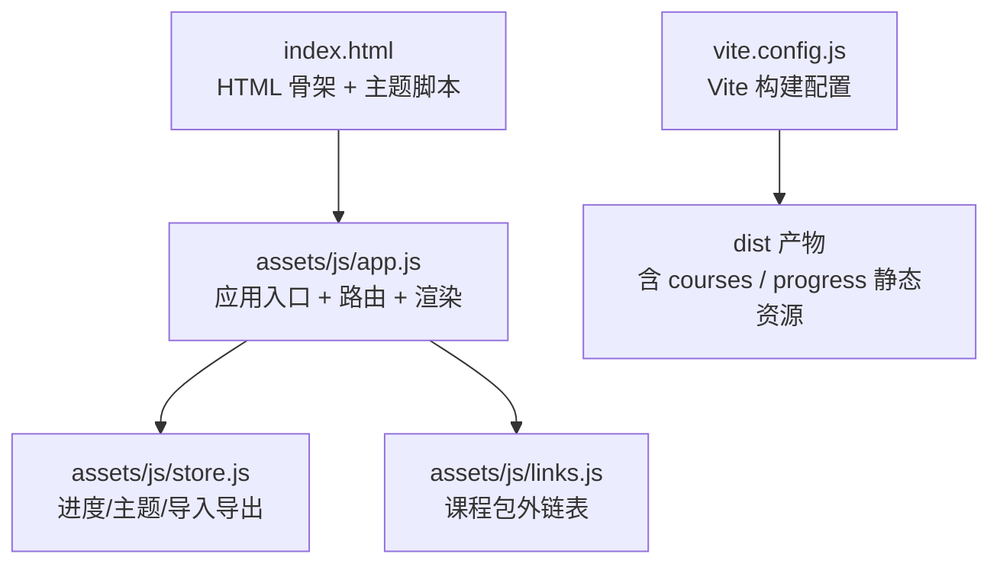
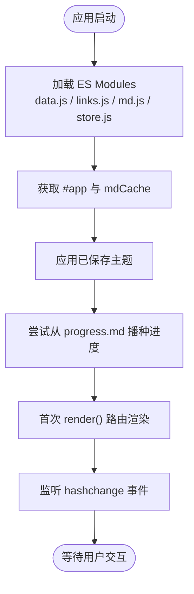
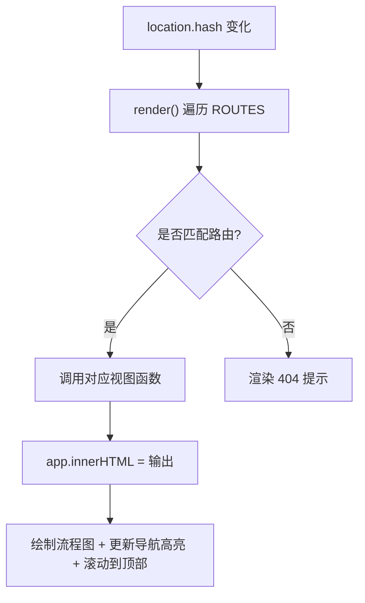
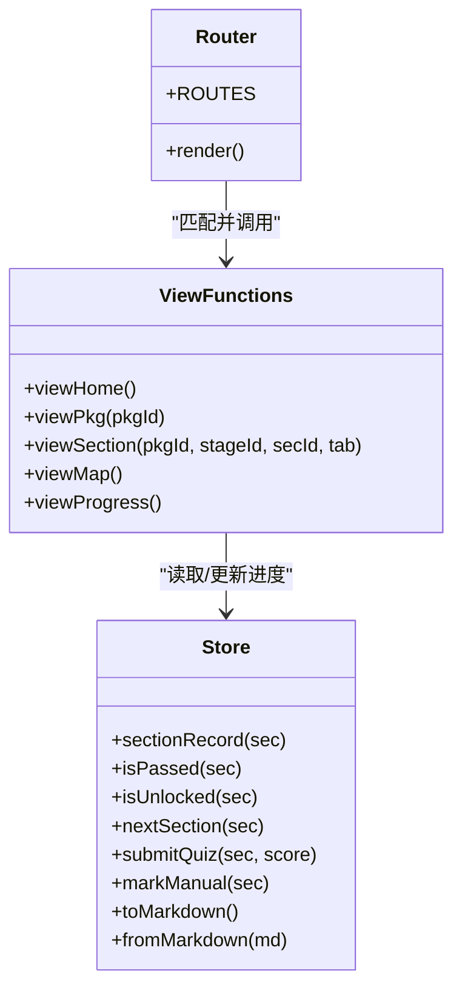
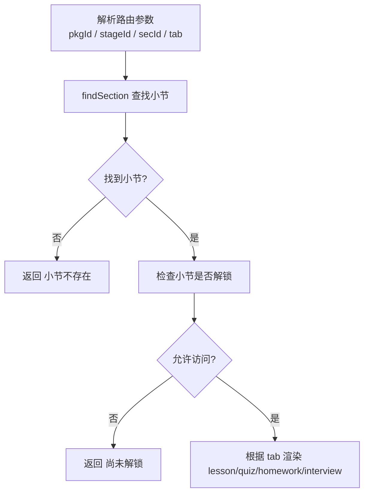
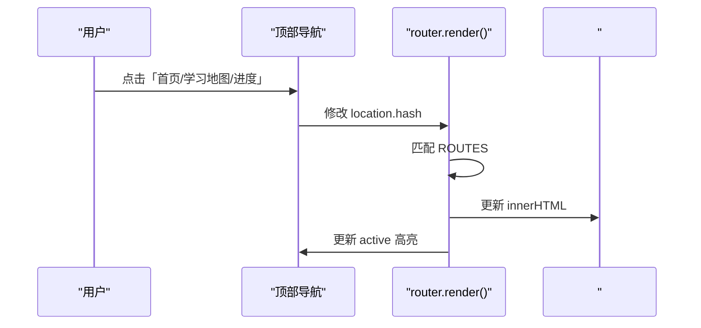
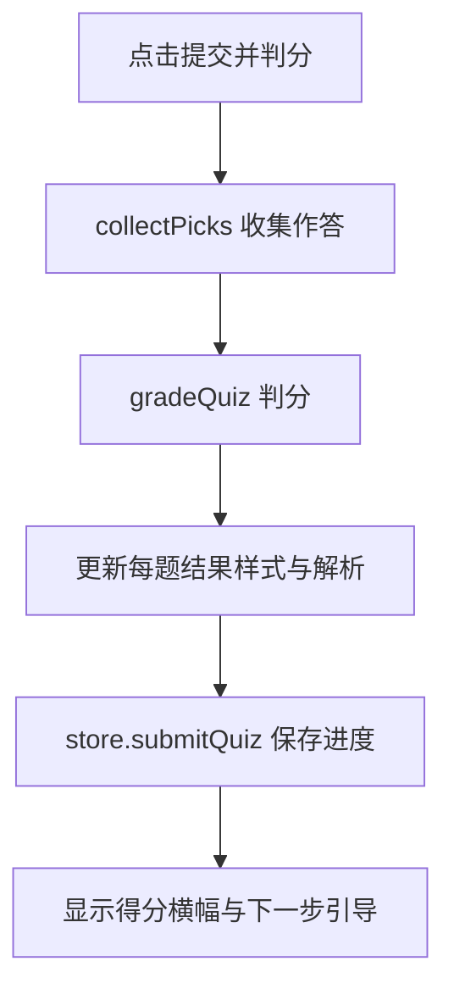
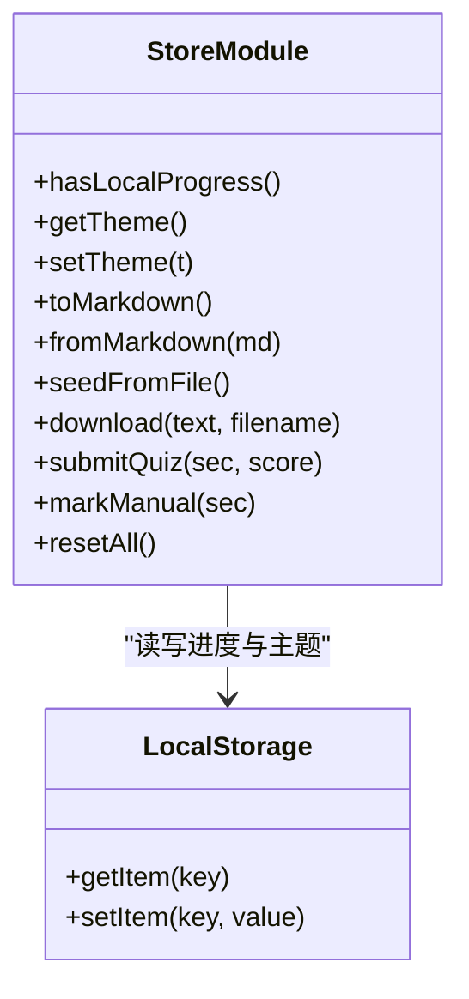
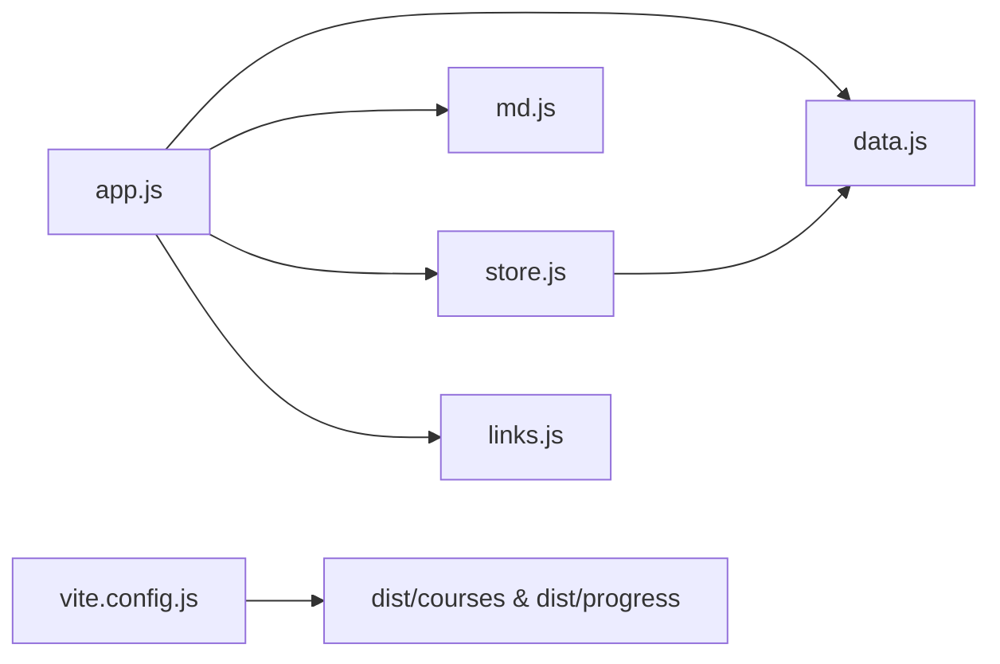

# 应用入口与路由系统

<cite>
**本文引用的文件**   
- [index.html](file://index.html)
- [app.js](file://assets/js/app.js)
- [store.js](file://assets/js/store.js)
- [links.js](file://assets/js/links.js)
- [vite.config.js](file://vite.config.js)
</cite>

## 目录
1. [引言](#引言)
2. [项目结构](#项目结构)
3. [核心组件](#核心组件)
4. [架构总览](#架构总览)
5. [详细组件分析](#详细组件分析)
6. [依赖关系分析](#依赖关系分析)
7. [性能考虑](#性能考虑)
8. [故障排查指南](#故障排查指南)
9. [结论](#结论)

## 引言
本技术文档聚焦于大 Java 后端学习平台的前端单页应用（SPA）入口与路由系统。重点解释以下内容：
- app.js 作为应用主入口的启动流程，包括 ES Module 加载、DOM 初始化、事件监听器注册。
- 基于 hash 的单页应用路由设计：路由规则定义、URL 解析逻辑、视图切换机制。
- 页面渲染架构：模板字符串生成、动态内容注入、状态更新策略。
- 路由参数处理：课程包 ID、阶段编号、小节编号的解析与校验。
- 导航系统实现：前进后退支持、浏览器历史记录管理、URL 同步机制。
- 面向初学者的 SPA 与路由概念说明，以及面向高级开发者的性能优化与调试方法。

## 项目结构
该前端工程采用极简的静态站点结构，核心由 HTML 骨架、ES Module 脚本、Markdown 内容与构建配置组成：
- index.html：应用骨架，包含头部导航、主题切换按钮、主内容容器 #app，以及以 type="module" 引入的 app.js。
- assets/js/app.js：应用主入口，负责路由匹配、视图渲染、事件委托、测验交互、进度联动等。
- assets/js/store.js：本地进度与主题存储模块，封装 localStorage 读写、进度导入导出、过关判定等。
- assets/js/links.js：课程包外部资源链接表，用于在课程包页展示官方或中文参考网站。
- vite.config.js：Vite 构建配置，复制运行时按需 fetch 的 courses 与 progress 目录到 dist，并设置相对路径 base。



**图表来源**
- [index.html:11-45](file://index.html#L11-L45)
- [app.js:1-10](file://assets/js/app.js#L1-L10)
- [store.js:1-10](file://assets/js/store.js#L1-L10)
- [links.js:1-10](file://assets/js/links.js#L1-L10)
- [vite.config.js:27-34](file://vite.config.js#L27-L34)

**章节来源**
- [index.html:1-48](file://index.html#L1-L48)
- [app.js:1-10](file://assets/js/app.js#L1-L10)
- [store.js:1-10](file://assets/js/store.js#L1-L10)
- [links.js:1-10](file://assets/js/links.js#L1-L10)
- [vite.config.js:27-34](file://vite.config.js#L27-L34)

## 核心组件
- 应用入口 app.js：
  - 通过 ES Module 引入数据模型、链接表、Markdown 渲染工具与 store。
  - 获取 DOM 根节点 #app，初始化 Markdown 缓存 Map。
  - 提供通用工具函数（转义、星级、提示 toast、Markdown 异步加载、流程图绘制、面包屑）。
  - 定义各视图函数：首页 viewHome、课程包页 viewPkg、小节页 viewSection、学习地图 viewMap、进度页 viewProgress。
  - 定义路由 ROUTES 数组与 render 函数，监听 hashchange 完成 URL 到视图的映射。
  - 使用事件委托统一处理目录跳转、小测验提交/重置、小节卡片点击、进度页导出/导入/清空等交互。
- 进度与主题 store.js：
  - 封装 localStorage 中进度与主题的读写。
  - 提供解锁判定 isUnlocked、下一节 nextSection、统计 pkgStats/siteStats/stageStats。
  - 提供 submitQuiz/markManual/resetAll 等状态写入接口。
  - 提供 toMarkdown/fromMarkdown/seedFromFile/download 等进度文件导入导出能力。
- 课程包外链 links.js：
  - 以 PKG_LINKS 对象维护每个课程包的官方/中文参考链接列表，供课程包页展示。
- 构建配置 vite.config.js：
  - 将 courses 与 progress 目录复制到 dist，确保运行时 fetch 可访问。
  - 设置 base 为相对路径，适配任意子路径部署；开发端口 5180，预览端口 8080。

**章节来源**
- [app.js:1-10](file://assets/js/app.js#L1-L10)
- [app.js:11-70](file://assets/js/app.js#L11-L70)
- [app.js:71-240](file://assets/js/app.js#L71-L240)
- [app.js:472-521](file://assets/js/app.js#L472-L521)
- [store.js:1-10](file://assets/js/store.js#L1-L10)
- [store.js:23-104](file://assets/js/store.js#L23-L104)
- [store.js:106-183](file://assets/js/store.js#L106-L183)
- [links.js:1-109](file://assets/js/links.js#L1-L109)
- [vite.config.js:27-34](file://vite.config.js#L27-L34)

## 架构总览
下图展示了从 HTML 骨架到 JS 模块、再到视图渲染与状态管理的整体流程：

```mermaid
sequenceDiagram
participant Browser as "浏览器"
participant HTML as "index.html"
participant App as "app.js"
participant Store as "store.js"
participant Links as "links.js"
participant MD as "md.js(外部)"
participant Data as "data.js(外部)"
Browser->>HTML : 加载页面
HTML->>App : <script type="module"> 引入 app.js
App->>Data : 导入 CATEGORIES, INDEX, findSection, secFile, secKey
App->>Links : 导入 PKG_LINKS
App->>MD : 导入 renderMarkdown, parseQuiz, stripTitle, renderInline, gradeQuiz
App->>Store : 导入 store 命名空间
App->>App : 初始化 DOM 根节点 #app 与 mdCache
App->>Store : 读取主题并应用
App->>Store : 尝试从 progress.md 播种进度
App->>App : 调用 render() 进行首次路由渲染
App->>App : 监听 window.hashchange 触发后续渲染
```

**图表来源**
- [index.html:11-45](file://index.html#L11-L45)
- [app.js:1-10](file://assets/js/app.js#L1-L10)
- [app.js:502-521](file://assets/js/app.js#L502-L521)
- [store.js:101-104](file://assets/js/store.js#L101-L104)
- [store.js:166-173](file://assets/js/store.js#L166-L173)

## 详细组件分析

### 应用入口 app.js 启动流程
- ES Module 加载：
  - 从 data.js 导入课程骨架与索引，从 links.js 导入课程包外链表，从 md.js 导入 Markdown 渲染与测验解析工具，从 store.js 导入状态管理。
- DOM 初始化：
  - 获取 #app 作为渲染容器，创建 mdCache 用于缓存已加载的 Markdown 文本。
- 事件监听器注册：
  - 全局 click 事件委托：处理目录跳转、小测验提交/重置、小节卡片点击、自定义格式手动过关。
  - 进度页按钮与文件输入事件：导出 progress.md、导入 Markdown 进度、清空进度。
  - 主题切换按钮事件：根据 data-theme-btn 切换主题并持久化。
  - window.hashchange 监听：URL 变化时重新渲染。
- 启动引导：
  - 应用已保存主题，尝试从 progress.md 播种进度，然后执行首次 render。



**图表来源**
- [app.js:1-10](file://assets/js/app.js#L1-L10)
- [app.js:502-521](file://assets/js/app.js#L502-L521)

**章节来源**
- [app.js:1-10](file://assets/js/app.js#L1-L10)
- [app.js:321-407](file://assets/js/app.js#L321-L407)
- [app.js:454-470](file://assets/js/app.js#L454-L470)
- [app.js:502-521](file://assets/js/app.js#L502-L521)

### 基于 hash 的 SPA 路由系统
- 路由规则定义：
  - ROUTES 数组包含正则表达式与对应视图函数，覆盖首页、学习地图、进度、课程包、小节（含 quiz/homework/interview 可选标签）。
- URL 解析逻辑：
  - render 函数读取 location.hash，按顺序匹配 ROUTES，调用匹配的视图函数并传入捕获组参数。
  - 小节路由支持可选 tab：lesson（默认）、quiz、homework、interview。
- 视图切换机制：
  - 渲染结果直接赋值给 app.innerHTML，随后执行流程图绘制与顶部导航高亮更新，滚动至顶部。
  - 若未匹配任何路由，显示“页面不存在”提示。
- 导航历史与前进后退：
  - 通过 window.addEventListener('hashchange', render) 响应浏览器前进/后退。
  - 内部导航通过修改 location.hash 或 a 标签 href 实现 URL 同步。



**图表来源**
- [app.js:472-500](file://assets/js/app.js#L472-L500)

**章节来源**
- [app.js:472-500](file://assets/js/app.js#L472-L500)

### 页面渲染架构
- 模板字符串生成：
  - 各视图函数返回拼接的 HTML 字符串，包含面包屑、标题、描述、卡片/表格/按钮等结构。
  - 使用 esc 对内容进行转义，避免 XSS。
- 动态内容注入：
  - 通过 app.innerHTML 替换 #app 内容，实现无刷新视图切换。
  - 课程包页结合 PKG_LINKS 展示官方/中文资源链接。
- 状态更新策略：
  - 进度与主题由 store.js 管理，渲染前读取状态，渲染后根据用户操作更新状态并持久化。
  - 小测验提交后根据得分与过关线（≥60）更新小节记录，可能解锁下一节并提示阶段完成。



**图表来源**
- [app.js:71-240](file://assets/js/app.js#L71-L240)
- [app.js:472-500](file://assets/js/app.js#L472-L500)
- [store.js:23-104](file://assets/js/store.js#L23-L104)

**章节来源**
- [app.js:71-240](file://assets/js/app.js#L71-L240)
- [app.js:472-500](file://assets/js/app.js#L472-L500)
- [store.js:23-104](file://assets/js/store.js#L23-L104)

### 路由参数处理：课程包ID、阶段编号、小节编号
- 小节路由模式：#/sec/{pkgId}/{stageId}/{secId}[/tab]
- 参数解析：
  - viewSection 接收 pkgId、stageId、secId 与可选 tab。
  - 通过 findSection 查找小节对象，失败则返回“小节不存在”。
  - 根据小节所在课程包与阶段，构造面包屑与导航。
- 参数验证与解锁控制：
  - 若小节未解锁且非作业/面试页，返回“尚未解锁”提示。
  - 小节卡片点击时，锁定小节给出解锁提示，未锁定则通过 location.hash 进入课程内容。
- 安全处理：
  - 所有用户可见文本通过 esc 转义，避免注入风险。



**图表来源**
- [app.js:183-208](file://assets/js/app.js#L183-L208)
- [app.js:331-340](file://assets/js/app.js#L331-L340)

**章节来源**
- [app.js:183-208](file://assets/js/app.js#L183-L208)
- [app.js:331-340](file://assets/js/app.js#L331-L340)

### 导航系统与浏览器历史记录
- 前进后退支持：
  - 通过 window.addEventListener('hashchange', render) 监听 URL 变化，自动重新渲染。
- 浏览器历史记录管理：
  - 内部导航通过修改 location.hash 或 a 标签 href 实现，不改变页面地址栏以外的历史栈。
- URL 同步机制：
  - 顶部导航高亮根据当前 hash 计算 active 类名。
  - 课程包与小节页的链接均使用 hash 路由，保证 SPA 内一致体验。



**图表来源**
- [index.html:22-32](file://index.html#L22-L32)
- [app.js:494-496](file://assets/js/app.js#L494-L496)
- [app.js:513-513](file://assets/js/app.js#L513-L513)

**章节来源**
- [index.html:22-32](file://index.html#L22-L32)
- [app.js:494-496](file://assets/js/app.js#L494-L496)
- [app.js:513-513](file://assets/js/app.js#L513-L513)

### 小测验与过关机制
- 小测验渲染：
  - 根据 Markdown 中的题目解析出题型、选项、答案、分值等，动态生成表单元素。
  - 支持单选、多选、判断、填空、简答等多种题型。
- 判分与过关：
  - 提交后调用 gradeQuiz 计算得分，按卷面分数折算百分制，≥60 分标记通过。
  - 通过 store.submitQuiz 更新进度，可能解锁下一节并提示阶段完成。
- 自定义格式降级：
  - 若无法解析为标准题型，提供“我已完成本小节自定义测验，标记通过”按钮，仅记录完成不计分。



**图表来源**
- [app.js:241-390](file://assets/js/app.js#L241-L390)
- [store.js:71-86](file://assets/js/store.js#L71-L86)

**章节来源**
- [app.js:241-390](file://assets/js/app.js#L241-L390)
- [store.js:71-86](file://assets/js/store.js#L71-L86)

### 进度与主题管理
- 进度存储：
  - 使用 localStorage 键 bjb.progress.v1 存储 JSON 进度对象。
  - 提供 toMarkdown/fromMarkdown 实现进度文件的导出与导入。
  - 启动时尝试从 progress/progress.md 播种进度，便于跨设备恢复。
- 主题管理：
  - 使用 localStorage 键 bjb.theme 存储主题值，默认 dark。
  - index.html 首帧前即应用主题，避免闪烁。



**图表来源**
- [store.js:1-10](file://assets/js/store.js#L1-L10)
- [store.js:10-18](file://assets/js/store.js#L10-L18)
- [store.js:101-104](file://assets/js/store.js#L101-L104)
- [store.js:106-183](file://assets/js/store.js#L106-L183)
- [index.html:11-14](file://index.html#L11-L14)

**章节来源**
- [store.js:1-10](file://assets/js/store.js#L1-L10)
- [store.js:10-18](file://assets/js/store.js#L10-L18)
- [store.js:101-104](file://assets/js/store.js#L101-L104)
- [store.js:106-183](file://assets/js/store.js#L106-L183)
- [index.html:11-14](file://index.html#L11-L14)

## 依赖关系分析
- 模块耦合：
  - app.js 强依赖 data.js（课程骨架）、md.js（Markdown 渲染与测验解析）、store.js（状态管理）、links.js（外链表）。
  - store.js 依赖 data.js 获取课程索引与小节键生成。
- 外部依赖：
  - md.js 与 data.js 未在本文引用文件中出现，但被 app.js 与 store.js 导入，承担核心数据处理与渲染职责。
- 构建与部署：
  - vite.config.js 将 courses 与 progress 目录复制到 dist，确保运行时 fetch 可访问；base 设置为相对路径，适配任意子路径部署。



**图表来源**
- [app.js:1-6](file://assets/js/app.js#L1-L6)
- [store.js:1-2](file://assets/js/store.js#L1-L2)
- [vite.config.js:27-30](file://vite.config.js#L27-L30)

**章节来源**
- [app.js:1-6](file://assets/js/app.js#L1-L6)
- [store.js:1-2](file://assets/js/store.js#L1-L2)
- [vite.config.js:27-30](file://vite.config.js#L27-L30)

## 性能考虑
- 构建期缓存：
  - 注释指出缓存由 Vite 构建的内容哈希自动管理；开发期 Vite dev server 不强缓存，改完刷新即见。
- 运行时缓存：
  - Markdown 文本通过 mdCache Map 缓存，避免重复 fetch。
  - fetch 使用 { cache: 'no-store' } 确保开发期与生产期行为可控。
- 渲染优化：
  - 使用事件委托减少监听器数量。
  - 模板字符串拼接减少 DOM 操作次数。
- 建议：
  - 对大型 Markdown 内容可考虑分页或懒加载。
  - 对小测验结果渲染可加入防抖/节流，避免频繁重绘。
  - 对进度导入导出可加入错误边界与用户反馈。

[本节为通用性能指导，不直接分析具体文件]

## 故障排查指南
- 路由不生效：
  - 检查 location.hash 是否符合 ROUTES 正则，尤其是小节路由的 tab 可选部分。
  - 确认顶层导航 a 标签 href 是否正确指向 hash 路由。
- 小节未解锁：
  - 检查上一节是否已通过（≥60 分），store.isUnlocked 与 store.isPassed 逻辑。
  - 查看 localStorage 中 bjb.progress.v1 是否存在有效记录。
- 进度导入失败：
  - 检查 progress.md 表格列序与字段是否符合 toMarkdown 输出格式。
  - 确认 fromMarkdown 解析逻辑对大小写与空值的兼容。
- 主题闪烁：
  - 确认 index.html 首帧前主题脚本执行成功，localStorage 可读。
- 构建产物缺失：
  - 检查 vite.config.js 中 copyContent 插件是否已将 courses 与 progress 复制到 dist。

**章节来源**
- [app.js:472-500](file://assets/js/app.js#L472-L500)
- [store.js:33-45](file://assets/js/store.js#L33-L45)
- [store.js:142-164](file://assets/js/store.js#L142-L164)
- [index.html:11-14](file://index.html#L11-L14)
- [vite.config.js:13-25](file://vite.config.js#L13-L25)

## 结论
本项目的 SPA 入口与路由系统以简洁的 ES Module 架构实现，通过 hash 路由驱动视图切换，结合 store.js 管理本地进度与主题，形成完整的过关制学习体验。其优势在于：
- 结构简单清晰，易于理解与维护。
- 使用 Markdown 作为内容源，便于扩展课程与测验。
- 进度可导出/导入，支持跨设备恢复。
对于初学者，建议先掌握 SPA 与 hash 路由的基本概念；对于高级开发者，可进一步优化渲染性能、增强错误边界与测试覆盖率，并考虑引入更强大的状态管理与路由库以提升可扩展性。