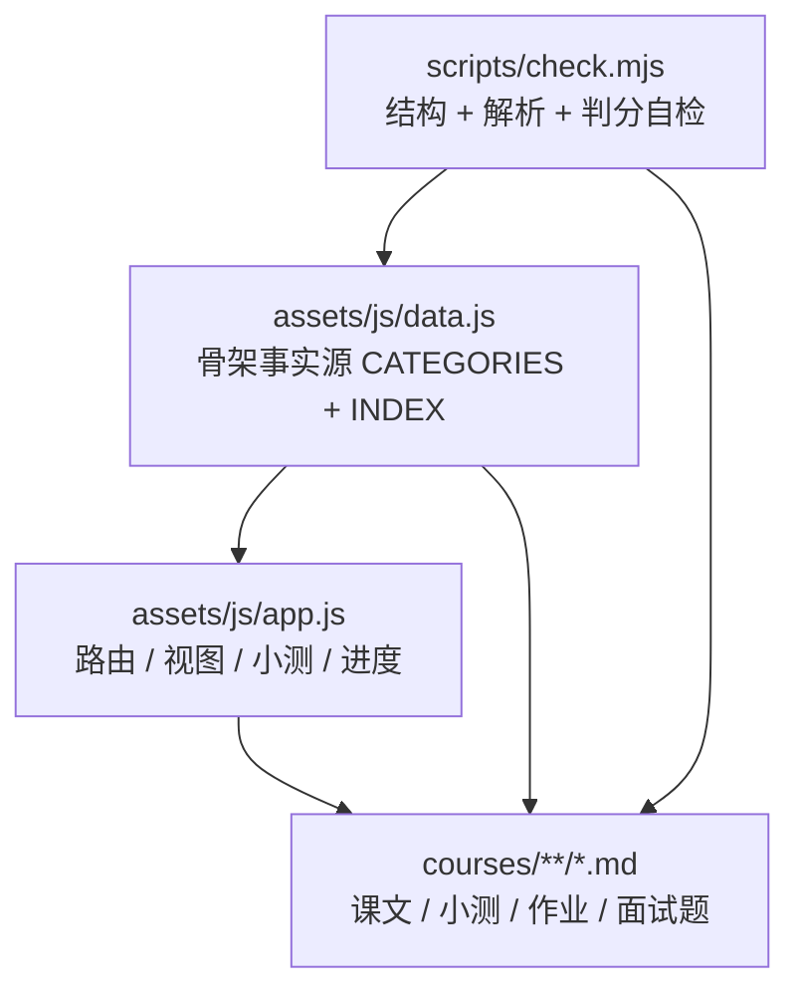
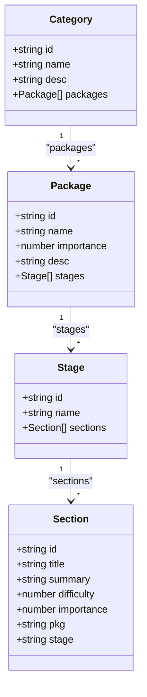
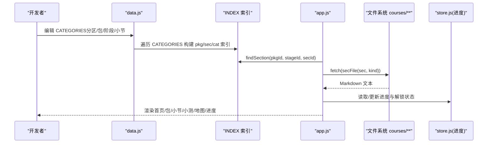
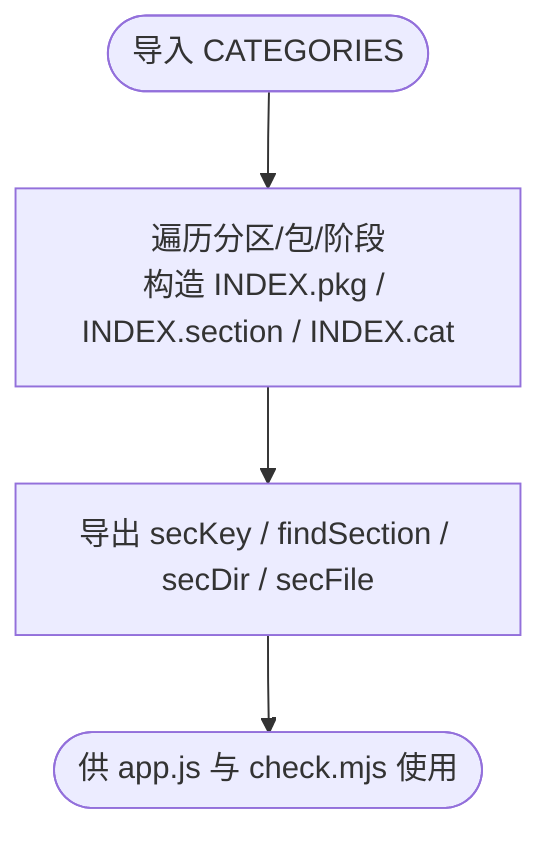
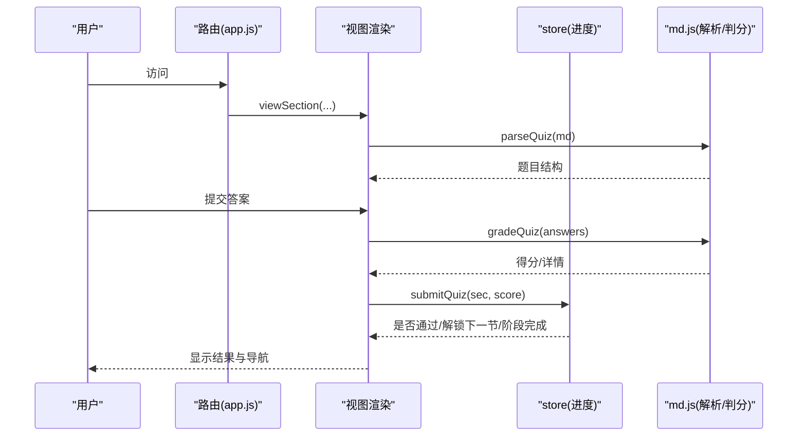
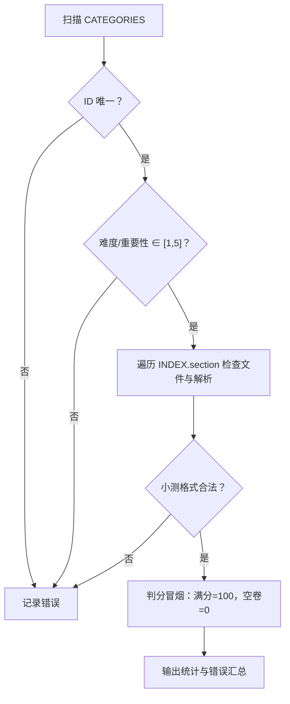
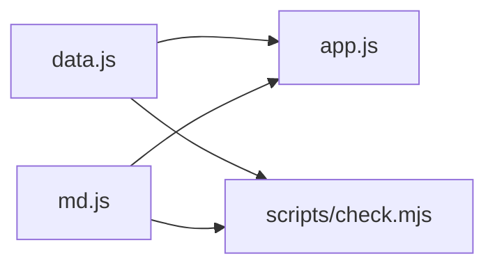

# 数据源与课程结构

<cite>
**本文引用的文件**   
- [assets/js/data.js](file://assets/js/data.js)
- [assets/js/app.js](file://assets/js/app.js)
- [scripts/check.mjs](file://scripts/check.mjs)
- [README.md](file://README.md)
</cite>

## 目录
1. [引言](#引言)
2. [项目结构与骨架事实源](#项目结构与骨架事实源)
3. [核心数据结构](#核心数据结构)
4. [架构总览](#架构总览)
5. [关键组件深度分析](#关键组件深度分析)
6. [依赖关系分析](#依赖关系分析)
7. [性能与扩展性](#性能与扩展性)
8. [排错与自检指南](#排错与自检指南)
9. [结论](#结论)
10. [附录：最佳实践与迁移建议](#附录最佳实践与迁移建议)

## 引言
本技术文档围绕大 Java 后端学习平台的“数据源与课程结构”展开，重点解释 `assets/js/data.js` 作为唯一骨架事实源的设计模式，以及它如何驱动首页、课程包、阶段、小节、索引、路由、解锁链路与内容渲染。文档同时覆盖难度与重要性评级、解锁条件、15 个技术分区到 86 个课程包再到 343 个小节的完整映射关系，并给出添加新课程包、修改现有结构、数据验证规则、数据迁移与版本管理的实操指导。

## 项目结构与骨架事实源
平台采用“数据驱动”的纯前端静态站点架构：  
- 骨架事实源：`assets/js/data.js` 定义 `CATEGORIES` 顶层结构，并派生 `INDEX` 索引对象。  
- 课程内容：`courses/<包id>/<阶段id>/Sx-y-{Lesson,Quiz,Homework,Interview}.md`。  
- 运行时：`assets/js/app.js` 通过路由解析、`data.js` 提供的索引和工具函数加载 Markdown、渲染页面、处理小测判分与进度解锁。  
- 自检脚本：`scripts/check.mjs` 校验 ID 唯一性、难度/重要性取值范围、小测格式与判分冒烟测试。

**图示来源**  
- [assets/js/data.js:1-8](file://assets/js/data.js#L1-L8)  
- [assets/js/app.js:1-6](file://assets/js/app.js#L1-L6)  
- [scripts/check.mjs:1-8](file://scripts/check.mjs#L1-L8)

**章节来源**  
- [README.md:13-34](file://README.md#L13-L34)  
- [assets/js/data.js:1-8](file://assets/js/data.js#L1-L8)

## 核心数据结构
`data.js` 的核心是 `CATEGORIES` 数组，其层级为：  
- 大技术分区（category）：如“计算机与算法基础”“Java 基础语言”等，共 15 个。  
- 课程包（package）：每个分区下包含若干课程包，如 `data-algorithms`、`networks`、`netty`、`java-basics`、`spring-boot` 等，全站共 86 个。  
- 阶段（stage）：每个课程包按学习顺序划分阶段，如 `s1`、`s2`、`s3`、`s4`。  
- 小节（section）：以元组形式定义 `[id, title, summary, difficulty, importance]`，全站共 343 个。

小节元组字段说明：  
- id：小节唯一标识，如 `s1-1`、`s2-3`。  
- title：小节标题。  
- summary：一句话知识点摘要。  
- difficulty：难度评级，1-5 星。  
- importance：重要性评级，1-5 星；决定讲解详略与首页卡片标签颜色。

**图示来源**  
- [assets/js/data.js:10-989](file://assets/js/data.js#L10-L989)

**章节来源**  
- [assets/js/data.js:1-8](file://assets/js/data.js#L1-L8)  
- [assets/js/data.js:10-989](file://assets/js/data.js#L10-L989)

## 架构总览
数据流从骨架事实源出发，经索引构建后由应用层消费：

**图示来源**  
- [assets/js/data.js:991-1022](file://assets/js/data.js#L991-L1022)  
- [assets/js/app.js:185-208](file://assets/js/app.js#L185-L208)  
- [assets/js/app.js:472-500](file://assets/js/app.js#L472-L500)

**章节来源**  
- [assets/js/data.js:991-1022](file://assets/js/data.js#L991-L1022)  
- [assets/js/app.js:185-208](file://assets/js/app.js#L185-L208)

## 关键组件深度分析

### data.js：骨架事实源与索引机制
- `CATEGORIES` 是唯一事实源，定义 15 个分区及其下的课程包、阶段与小节。  
- 构建 `INDEX`：将扁平的小节元组转换为带 `pkg`、`stage`、`difficulty`、`importance` 的对象，并以 `secKey = pkg#stage#id` 作为键存入 `INDEX.section`。  
- 提供工具函数：  
  - `findSection(pkgId, stageId, secId)`：支持大小写归一化查找。  
  - `secDir(sec)`、`secFile(sec, kind)`：生成 `courses/<包>/<阶段>/Sx-y-{Lesson,Quiz,Homework,Interview}.md` 路径。

**图示来源**  
- [assets/js/data.js:991-1022](file://assets/js/data.js#L991-L1022)

**章节来源**  
- [assets/js/data.js:991-1022](file://assets/js/data.js#L991-L1022)

### app.js：路由、渲染与小测判分
- 路由解析：`#/`、`#/map`、`#/progress`、`#/pkg/:id`、`#/sec/:pkg/:stage/:id[/quiz|homework|interview]`。  
- 视图渲染：首页分组展示、课程包阶段与小节列表、小节课文/作业/面试题/小测页。  
- 解锁逻辑：同一课程包内顺序解锁；前一节小测未通过（<60 分），下一节不可进入；自定义格式小测可手动标记完成。  
- 小测判分：解析 Markdown 小测题，自动评分；≥60 分记通过并解锁下一节；阶段内全部小节通过后自动标记阶段完成。

**图示来源**  
- [assets/js/app.js:185-208](file://assets/js/app.js#L185-L208)  
- [assets/js/app.js:248-390](file://assets/js/app.js#L248-L390)

**章节来源**  
- [assets/js/app.js:1-6](file://assets/js/app.js#L1-L6)  
- [assets/js/app.js:185-208](file://assets/js/app.js#L185-L208)  
- [assets/js/app.js:248-390](file://assets/js/app.js#L248-L390)

### scripts/check.mjs：数据一致性校验
- 唯一性检查：课程包 id 不重复；小节键 `pkg#stage#id` 不重复。  
- 取值范围检查：课程包 `importance` 与每小节 `difficulty`、`importance` 必须在 1-5。  
- 内容检查：四件套文件存在性；小测题数量、分值合计、选项合法性、主观题关键词；渲染器冒烟测试；stripTitle 行为。  
- 判分冒烟：全对应答得 100 分；未作答得 0 分；简答部分命中应得部分分。

**图示来源**  
- [scripts/check.mjs:14-32](file://scripts/check.mjs#L14-L32)  
- [scripts/check.mjs:34-91](file://scripts/check.mjs#L34-L91)  
- [scripts/check.mjs:93-112](file://scripts/check.mjs#L93-L112)

**章节来源**  
- [scripts/check.mjs:1-119](file://scripts/check.mjs#L1-L119)

## 依赖关系分析
- `app.js` 依赖 `data.js` 的 `CATEGORIES`、`INDEX`、`findSection`、`secFile`、`secKey`。  
- `check.mjs` 依赖 `data.js` 的 `CATEGORIES`、`INDEX`、`secFile`、`secKey`，以及 `md.js` 的解析与判分能力。  
- `data.js` 不依赖其他模块，是单向事实源。

**图示来源**  
- [assets/js/app.js:1-6](file://assets/js/app.js#L1-L6)  
- [scripts/check.mjs:1-8](file://scripts/check.mjs#L1-L8)

**章节来源**  
- [assets/js/app.js:1-6](file://assets/js/app.js#L1-L6)  
- [scripts/check.mjs:1-8](file://scripts/check.mjs#L1-L8)

## 性能与扩展性
- 索引构建时间复杂度 O(N)，N 为小节总数；查找 O(1)。  
- 内容加载按需 fetch，配合浏览器缓存与 Vite 构建哈希失效。  
- 扩展点集中在 `data.js`：新增分区/包/阶段/小节只需增补结构，无需改动框架代码。  
- 重要级影响讲解详略：5 核心精讲 → 4 重点标准 → 3 标准概览 → ≤2 简明速览/了解即可。

[本节为通用性能与扩展性讨论，不直接分析具体文件]

## 排错与自检指南
常见问题与定位方法：  
- 小节无法打开或提示不存在：检查 `findSection` 传入的 pkg/stage/id 是否与 `INDEX.section` 一致；注意大小写归一化。  
- 小节被锁定：确认同包上一节小测是否 ≥60 分；自定义格式需手动标记完成。  
- 小测判分异常：运行 `npm run check`，查看题目分值合计是否为 100、答案是否在选项中、主观题是否有关键词。  
- 渲染异常：检查 Markdown 二级标题是否存在、结构是否被转义。

**章节来源**  
- [assets/js/app.js:185-208](file://assets/js/app.js#L185-L208)  
- [scripts/check.mjs:34-91](file://scripts/check.mjs#L34-L91)

## 结论
`assets/js/data.js` 作为唯一骨架事实源，通过 `CATEGORIES` 组织 15 个技术分区、86 个课程包、343 个小节，并以 `INDEX` 提供高效索引与工具函数。`app.js` 基于该数据源实现路由、渲染、小测判分与进度解锁；`scripts/check.mjs` 保障数据一致性与内容可解析性。整体架构清晰、扩展性强，适合初学者理解数据驱动理念，也为高级开发者提供了数据迁移与版本管理的基础。

[本节为总结性内容，不直接分析具体文件]

## 附录：最佳实践与迁移建议

### 数据驱动架构概念（面向初学者）
- 骨架事实源：所有课程结构来自 `data.js`，页面渲染、解锁链路、大纲生成均由其派生。  
- 内容与结构分离：Markdown 内容位于 `courses/**`，结构定义位于 `data.js`。  
- 索引与工具：通过 `INDEX` 与 `findSection`、`secFile` 快速定位与生成路径。  
- 解锁与进度：小测成绩驱动解锁，进度保存在浏览器本地并可导出为 Markdown。

[本节为概念性说明，不直接分析具体文件]

### 添加新课程包的步骤
1. 在 `assets/js/data.js` 的对应分区下新增 package，包含 `id`、`name`、`importance`、`desc`、`stages`。  
2. 在阶段下新增 sections，每个小节为 `[id, title, summary, difficulty, importance]`。  
3. 运行脚手架生成占位文件：`npm run scaffold`。  
4. 重新生成教学大纲：`npm run outline`。  
5. 运行自检：`npm run check`，确保 ID 唯一、取值合法、小测可解析判分。

**章节来源**  
- [README.md:89-104](file://README.md#L89-L104)  
- [assets/js/data.js:10-989](file://assets/js/data.js#L10-L989)

### 修改现有结构的注意事项
- 保持 `id` 唯一性：课程包 id 与小节键 `pkg#stage#id` 不得重复。  
- 难度与重要性取值范围：必须为 1-5。  
- 文件命名规范：`Sx-y-{Lesson,Quiz,Homework,Interview}.md`，编号大写。  
- 小测格式：客观题答案应为字母串，分值合计为 100，主观题需提供参考答案或要点。

**章节来源**  
- [scripts/check.mjs:14-32](file://scripts/check.mjs#L14-L32)  
- [scripts/check.mjs:43-76](file://scripts/check.mjs#L43-L76)

### 数据验证规则
- 唯一性：课程包 id、小节键唯一。  
- 取值范围：`importance`、`difficulty` ∈ [1,5]。  
- 小测格式：题型合法、答案在选项中、分值合计 100、主观题有关键词。  
- 渲染器冒烟：表格、代码块、目录抽取正常。

**章节来源**  
- [scripts/check.mjs:14-32](file://scripts/check.mjs#L14-L32)  
- [scripts/check.mjs:93-112](file://scripts/check.mjs#L93-L112)

### 数据迁移与版本管理（面向高级开发者）
- 骨架变更：仅修改 `data.js`，其余由脚本派生。  
- 内容迁移：使用 `npm run scaffold` 补齐缺失的四件套文件。  
- 版本控制：将 `progress.md` 纳入 Git，形成打卡记录；构建产物由 Vite 管理缓存与哈希。  
- 回滚策略：保留历史 `data.js` 与 `courses/**` 快照，必要时回退至稳定版本。

**章节来源**  
- [README.md:89-104](file://README.md#L89-L104)  
- [README.md:101-102](file://README.md#L101-L102)