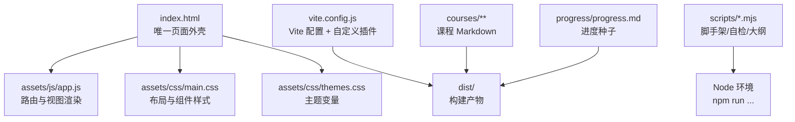
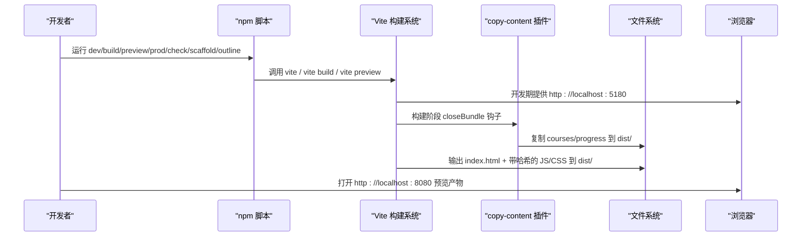
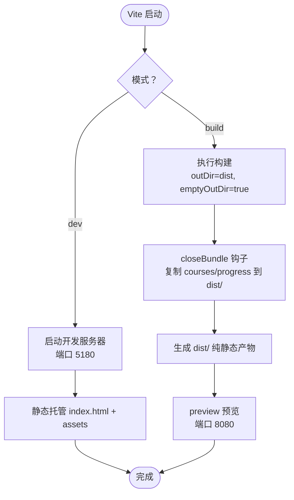
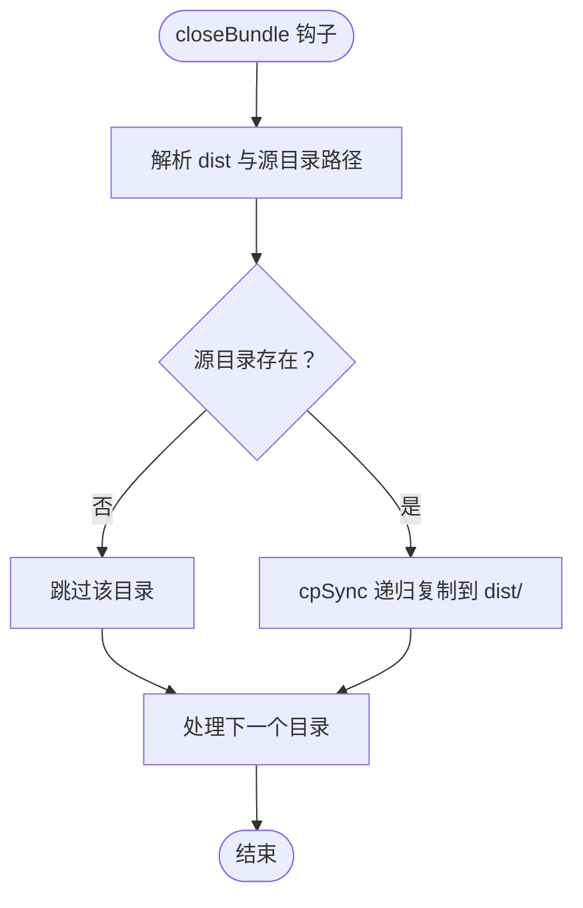
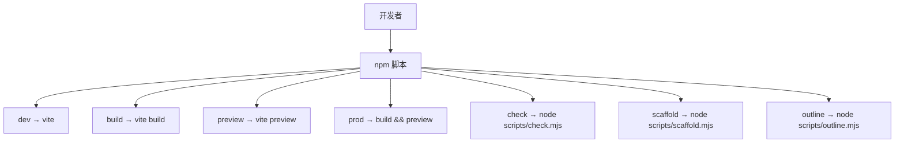
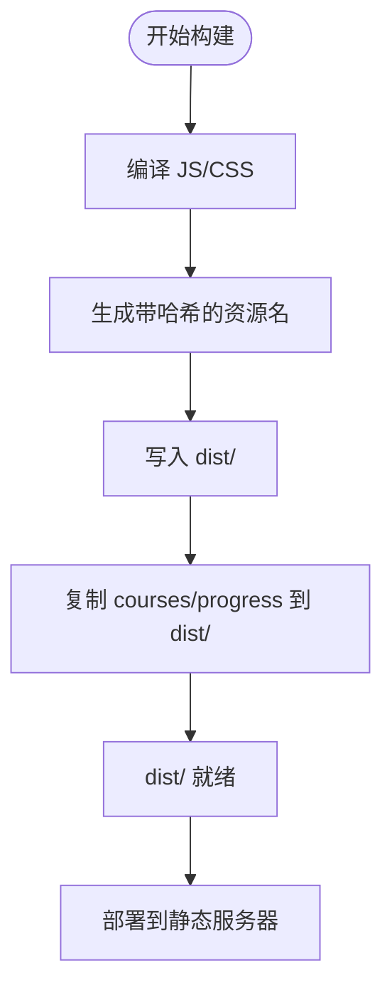
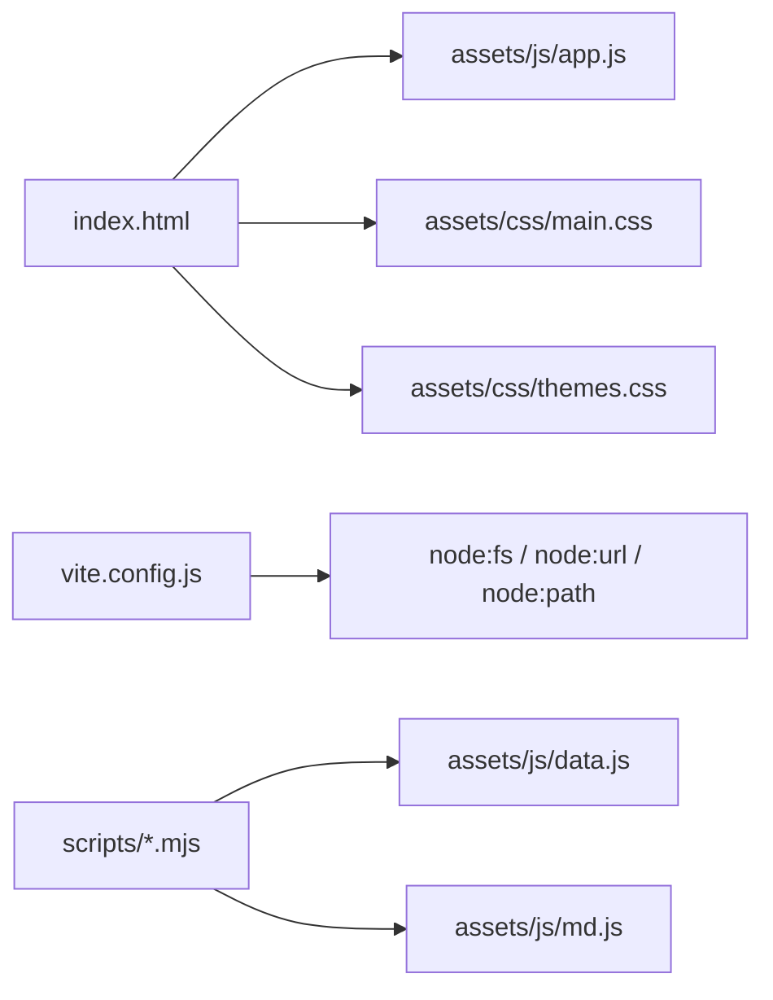

# 构建系统与 Vite 配置

<cite>
**本文引用的文件**   
- [vite.config.js](file://vite.config.js)
- [package.json](file://package.json)
- [index.html](file://index.html)
- [scripts/check.mjs](file://scripts/check.mjs)
- [scripts/scaffold.mjs](file://scripts/scaffold.mjs)
- [scripts/outline.mjs](file://scripts/outline.mjs)
- [README.md](file://README.md)
</cite>

## 目录
1. [引言](#引言)
2. [项目结构](#项目结构)
3. [核心组件](#核心组件)
4. [架构总览](#架构总览)
5. [详细组件分析](#详细组件分析)
6. [依赖关系分析](#依赖关系分析)
7. [性能与体验优化](#性能与体验优化)
8. [故障排查指南](#故障排查指南)
9. [结论](#结论)
10. [附录：脚本使用指南](#附录脚本使用指南)

## 引言
本技术文档面向“大Java后端学习平台”的构建系统与 Vite 配置，目标是帮助初学者理解现代前端构建工具的基本概念与 Vite 的优势，同时为高级开发者提供自定义插件开发、资源处理与构建流程优化的实践参考。

本项目采用纯静态站点模式：运行时零第三方依赖，开发与构建由 Vite 驱动；课程内容以 Markdown 形式组织，通过运行时按需 `fetch` 加载；Vite 负责编译 JS/CSS、生成带内容哈希的资源名，并在构建末尾把课程与进度等静态目录复制到产物目录，最终产出可直接部署到任意静态服务器的 `dist/` 目录。

## 项目结构
从构建视角看，仓库的关键位置如下：
- 入口页面：`index.html`
- 构建配置：`vite.config.js`
- 脚本定义与依赖：`package.json`
- 运行时代码与样式：`assets/js/*`、`assets/css/*`
- 课程内容与进度：`courses/**`、`progress/progress.md`
- Node 工具脚本：`scripts/*.mjs`

图表来源
- [index.html:1-48](file://index.html#L1-L48)
- [vite.config.js:1-35](file://vite.config.js#L1-L35)
- [README.md:145-170](file://README.md#L145-L170)

章节来源
- [index.html:1-48](file://index.html#L1-L48)
- [README.md:145-170](file://README.md#L145-L170)

## 核心组件
本节聚焦构建系统的三个核心组件：Vite 配置、npm 脚本、Node 工具脚本。

- Vite 配置（`vite.config.js`）
  - 开发服务器端口与主机设置
  - 生产预览端口与主机设置
  - 输出目录与清理策略
  - 自定义插件：复制 `courses` 与 `progress` 到构建产物
  - 相对路径部署支持

- npm 脚本（`package.json`）
  - `dev`：启动开发服务器
  - `build`：执行生产构建
  - `preview`：预览构建产物
  - `prod`：一键构建并预览
  - `check`：内容与解析自检
  - `scaffold`：按骨架数据生成占位文件
  - `outline`：从骨架数据生成教学大纲

- Node 工具脚本（`scripts/*.mjs`）
  - `check.mjs`：校验目录结构、小测解析与判分、渲染器冒烟测试
  - `scaffold.mjs`：为每个小节批量创建 Lesson/Quiz/Homework/Interview 占位文件
  - `outline.mjs`：从骨架数据生成《教学大纲.md》

章节来源
- [vite.config.js:1-35](file://vite.config.js#L1-L35)
- [package.json:1-21](file://package.json#L1-L21)
- [scripts/check.mjs:1-119](file://scripts/check.mjs#L1-L119)
- [scripts/scaffold.mjs:1-55](file://scripts/scaffold.mjs#L1-L55)
- [scripts/outline.mjs:1-69](file://scripts/outline.mjs#L1-L69)

## 架构总览
下图展示构建系统整体交互：用户通过 npm 脚本触发 Vite，Vite 在开发期提供热更新服务，在生产构建阶段打包 JS/CSS 并按需复制静态内容到 `dist/`，最终产物可被任意静态服务器托管。

图表来源
- [package.json:7-15](file://package.json#L7-L15)
- [vite.config.js:27-34](file://vite.config.js#L27-L34)

## 详细组件分析

### Vite 配置详解（`vite.config.js`）
- 基础路径与部署
  - 使用相对路径作为 base，便于将产物部署到任意子路径或静态托管根目录。
- 公共目录
  - 关闭默认 publicDir，因为 `courses/` 与 `progress/` 由自定义插件在构建末尾复制，避免重复与冲突。
- 插件
  - 自定义插件 `copyContent('courses', 'progress')`：仅在构建阶段生效，在 `closeBundle` 钩子中将源目录递归复制到 `dist/` 对应位置。
- 开发服务器
  - 端口 5180，host 开启，strictPort 关闭，允许自动选择可用端口。
- 生产预览
  - 端口 8080，host 开启，strictPort 关闭。
- 构建选项
  - outDir 为 `dist`，emptyOutDir 确保每次构建清空旧产物，target 设为 es2020 以匹配现代浏览器能力。

图表来源
- [vite.config.js:8-34](file://vite.config.js#L8-L34)

章节来源
- [vite.config.js:1-35](file://vite.config.js#L1-L35)

### 自定义插件：复制 courses 与 progress 到构建产物
- 插件职责
  - 在构建结束时，将运行时按需 `fetch` 的 Markdown 目录复制到 `dist/`，因为这些文件不是被 import 的模块，Vite 不会自动打包。
- 实现要点
  - 使用 Node 内置 `fs.cpSync` 与 `path.resolve` 进行安全路径解析与递归复制。
  - 仅在生产构建阶段启用（apply: 'build'），避免影响开发体验。
  - 若源目录不存在则跳过，保证健壮性。

图表来源
- [vite.config.js:13-25](file://vite.config.js#L13-L25)

章节来源
- [vite.config.js:8-25](file://vite.config.js#L8-L25)

### 静态资源处理与文件监控机制
- 静态资源
  - CSS 与 JS 由 Vite 处理并输出带内容哈希的文件名，利于缓存失效。
  - HTML 中的 `<script type="module">` 与 `<link rel="stylesheet">` 会被 Vite 注入正确的资源路径。
- 文件监控
  - 开发模式下，Vite 监听源码变更并触发热重载（HMR）。
  - 对于非模块化的 Markdown 内容，开发期直接由 Vite 静态托管根目录读取；构建期由插件复制到 `dist/`。

章节来源
- [index.html:45-46](file://index.html#L45-L46)
- [vite.config.js:27-34](file://vite.config.js#L27-L34)

### package.json 脚本定义与使用
- 开发环境
  - `dev`：启动 Vite 开发服务器，默认端口 5180。
- 生产构建
  - `build`：执行 Vite 构建，输出到 `dist/`。
- 预览
  - `preview`：本地预览构建产物，默认端口 8080。
  - `prod`：先构建再预览，适合快速验证生产行为。
- 自检与工具
  - `check`：运行内容自检脚本，校验目录结构与 Markdown 解析。
  - `scaffold`：根据骨架数据生成占位文件。
  - `outline`：生成教学大纲。

图表来源
- [package.json:7-15](file://package.json#L7-L15)

章节来源
- [package.json:1-21](file://package.json#L1-L21)

### 构建流程：源码编译、资源优化、产物打包、部署准备
- 源码编译
  - Vite 对 ES Module 与 CSS 进行即时编译与转换。
- 资源优化
  - 输出带内容哈希的文件名，提升缓存命中率。
  - 目标环境设置为 es2020，适配现代浏览器。
- 产物打包
  - 生成 `index.html` 与对应的 JS/CSS 资源到 `dist/`。
  - 构建末尾复制 `courses/` 与 `progress/` 到 `dist/`。
- 部署准备
  - `dist/` 为纯静态资源，可部署到 Nginx、对象存储、GitHub Pages 或任意 CDN。
  - 由于 base 为相对路径，产物可放置于任意子路径。

图表来源
- [vite.config.js:27-34](file://vite.config.js#L27-L34)
- [README.md:64-67](file://README.md#L64-L67)

章节来源
- [vite.config.js:27-34](file://vite.config.js#L27-L34)
- [README.md:64-67](file://README.md#L64-L67)

### 开发体验优化：热重载、错误提示、调试支持
- 热重载（HMR）
  - 修改 JS/CSS 后，浏览器即时刷新，无需手动操作。
- 错误提示
  - Vite 控制台输出编译错误与警告；Node 脚本（如 check.mjs）输出结构化检查结果。
- 调试支持
  - 使用现代浏览器的开发者工具调试 ES Module；可在 `app.js` 中设置断点观察路由与渲染逻辑。

章节来源
- [README.md:64-67](file://README.md#L64-L67)
- [scripts/check.mjs:1-119](file://scripts/check.mjs#L1-L119)

## 依赖关系分析
- 外部依赖
  - 仅 Vite 作为开发依赖，运行时零第三方依赖。
- 内部依赖
  - `index.html` 引入 `assets/js/app.js` 与样式文件。
  - `vite.config.js` 依赖 Node 内置模块（fs、url、path）实现路径解析与文件复制。
  - `scripts/*.mjs` 依赖 `assets/js/data.js` 与 `assets/js/md.js` 提供的数据结构与解析能力。

图表来源
- [index.html:9-10](file://index.html#L9-L10)
- [index.html:45-46](file://index.html#L45-L46)
- [vite.config.js:1-4](file://vite.config.js#L1-L4)
- [scripts/check.mjs:7-8](file://scripts/check.mjs#L7-L8)

章节来源
- [index.html:9-10](file://index.html#L9-L10)
- [index.html:45-46](file://index.html#L45-L46)
- [vite.config.js:1-4](file://vite.config.js#L1-L4)
- [scripts/check.mjs:7-8](file://scripts/check.mjs#L7-L8)

## 性能与体验优化
- 构建性能
  - 使用 Vite 的原生 ESM 与增量编译，开发期启动快、热更新快。
  - 构建目标 es2020 减少兼容层开销。
- 缓存策略
  - 资源文件名包含内容哈希，浏览器缓存命中率高。
- 部署效率
  - 产物为纯静态资源，CDN 友好，易于水平扩展。
- 开发体验
  - 开发服务器 host 开启，局域网设备可直接访问。
  - 预览服务器独立端口，避免与开发服务器冲突。

[本节为通用指导，不直接分析具体文件]

## 故障排查指南
- 常见问题
  - 直接双击 `index.html` 导致 ES Module 与 fetch 被同源策略拦截：应通过 `http://localhost:5180` 或 `http://localhost:8080` 访问。
  - 端口占用：Vite 已配置 strictPort 为 false，会自动选择可用端口；如需固定端口，可在配置中调整。
  - 构建后找不到 Markdown 内容：确认 `copy-content` 插件是否执行，检查 `courses/` 与 `progress/` 是否存在。
- 自检与修复
  - 运行 `npm run check` 查看结构与解析问题。
  - 运行 `npm run scaffold` 补齐缺失的占位文件。
  - 运行 `npm run outline` 重新生成教学大纲，确保与骨架数据一致。

章节来源
- [README.md:46-48](file://README.md#L46-L48)
- [scripts/check.mjs:1-119](file://scripts/check.mjs#L1-L119)
- [scripts/scaffold.mjs:1-55](file://scripts/scaffold.mjs#L1-L55)
- [scripts/outline.mjs:1-69](file://scripts/outline.mjs#L1-L69)

## 结论
本项目的构建系统以 Vite 为核心，结合轻量 Node 脚本，实现了从零框架、纯静态的前端学习平台的高效开发与构建。Vite 配置简洁明确，自定义插件解决了运行时按需加载 Markdown 的构建需求；npm 脚本覆盖了开发、构建、预览、自检、脚手架与大纲生成等全生命周期任务。通过相对路径部署与内容哈希缓存，项目在本地开发与线上部署之间保持一致性与高性能。

[本节为总结性内容，不直接分析具体文件]

## 附录：脚本使用指南
- 安装与运行
  - 首次安装依赖：`npm install`
  - 开发：`npm run dev`
  - 构建：`npm run build`
  - 预览：`npm run preview`
  - 一键构建并预览：`npm run prod`
- 内容工具
  - 自检：`npm run check`
  - 脚手架：`npm run scaffold`
  - 大纲生成：`npm run outline`
- 部署
  - 将 `dist/` 整目录交给 Nginx、对象存储、GitHub Pages 或任意 CDN；因 base 为相对路径，可放置于任意子路径。

章节来源
- [README.md:53-78](file://README.md#L53-L78)
- [package.json:7-15](file://package.json#L7-L15)