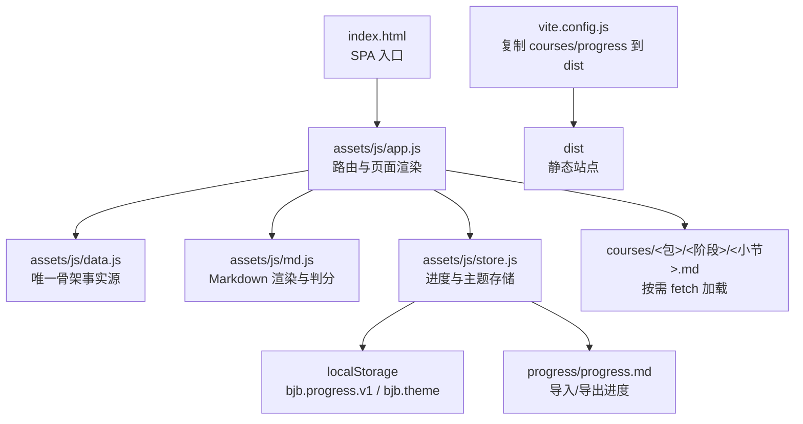
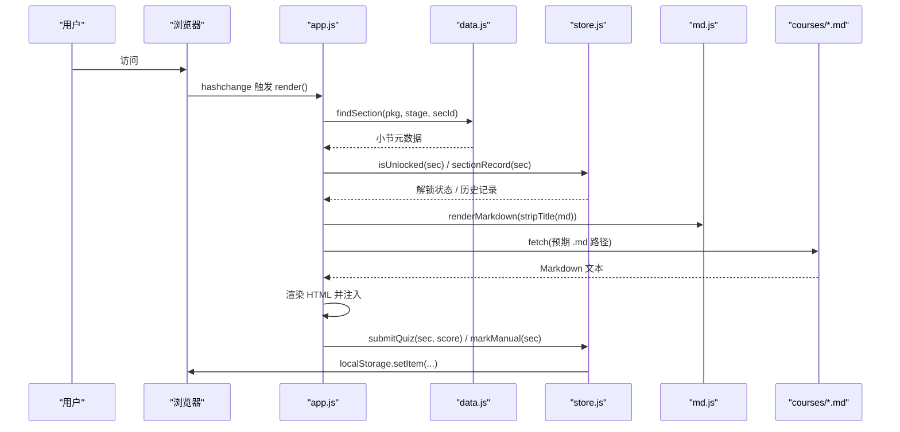
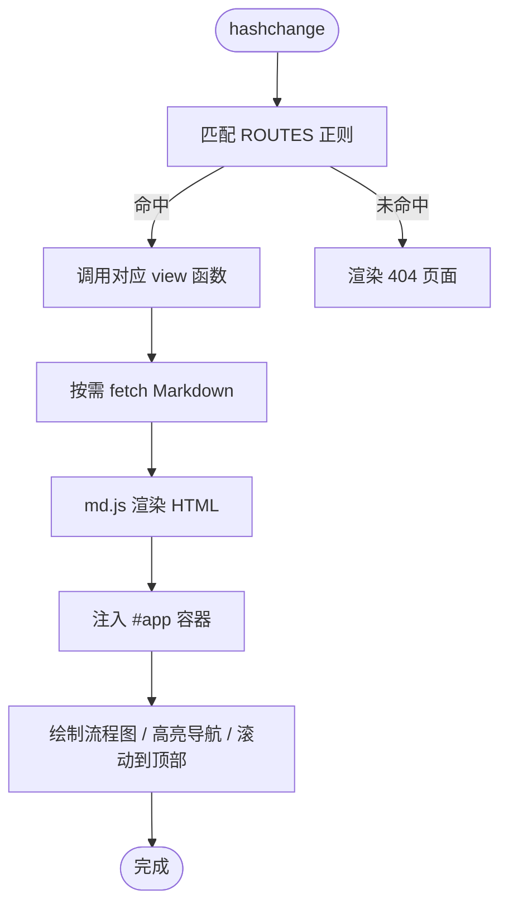
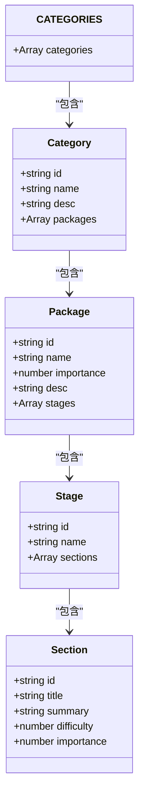
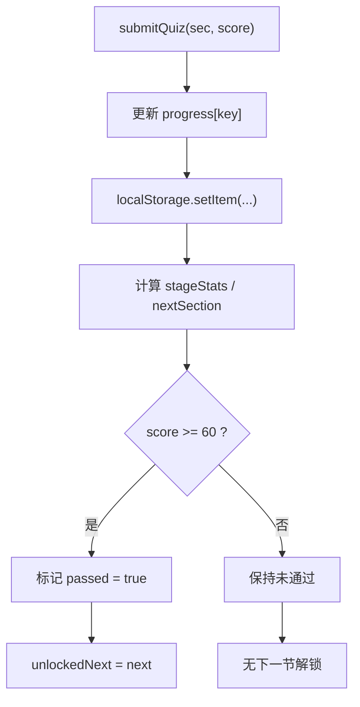
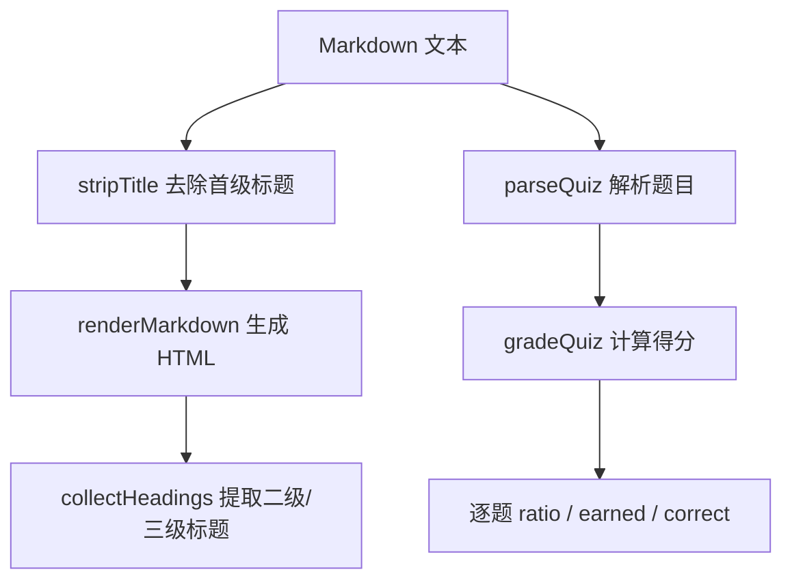
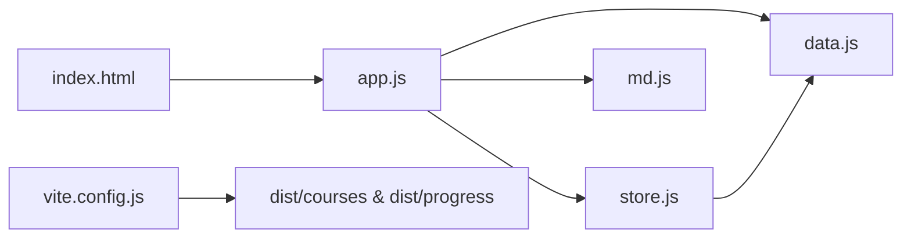

# 架构设计

<cite>
**本文引用的文件**   
- [index.html](file://index.html)
- [app.js](file://assets/js/app.js)
- [data.js](file://assets/js/data.js)
- [store.js](file://assets/js/store.js)
- [md.js](file://assets/js/md.js)
- [vite.config.js](file://vite.config.js)
- [package.json](file://package.json)
</cite>

## 目录
1. [引言](#引言)
2. [项目结构](#项目结构)
3. [核心组件](#核心组件)
4. [架构总览](#架构总览)
5. [详细组件分析](#详细组件分析)
6. [依赖关系分析](#依赖关系分析)
7. [性能与构建特性](#性能与构建特性)
8. [扩展点与最佳实践](#扩展点与最佳实践)
9. [故障排查指南](#故障排查指南)
10. [结论](#结论)

## 引言
本仓库是一个面向 Java 后端学习者的单页应用（SPA）平台。它采用“数据驱动 + 模块化”的极简前端架构：课程骨架由一个纯 JavaScript 数据文件定义，页面通过原生 ES Module 路由渲染，进度保存在浏览器本地，并通过 Markdown 文件承载课程内容、作业、面试与小测验。

该架构的核心目标是：
- 用最少的前端框架实现稳定的学习路径体验。
- 让课程内容由 Markdown 驱动，便于编辑、版本管理与跨设备迁移。
- 通过过关制解锁机制引导循序渐进的学习顺序。
- 使用 Vite 提供开发体验与静态产物部署能力。

## 项目结构
仓库采用“内容即数据”的组织方式：
- `assets/js`：前端运行时模块，包含路由、数据源、进度存储与 Markdown 渲染。
- `courses`：按课程包与阶段划分的 Markdown 内容，被运行时按需加载。
- `progress`：可选的初始进度 Markdown 文件，用于首次播种。
- `index.html`：SPA 入口，挂载主题切换、导航与根容器。
- `vite.config.js`：Vite 构建配置，负责复制 Markdown 内容到构建产物。
- `package.json`：声明项目为 ES Module，并暴露 dev/build/preview 脚本。

**图表来源**
- [index.html:1-48](file://index.html#L1-L48)
- [app.js:1-522](file://assets/js/app.js#L1-L522)
- [data.js:1-800](file://assets/js/data.js#L1-L800)
- [md.js:1-338](file://assets/js/md.js#L1-L338)
- [store.js:1-183](file://assets/js/store.js#L1-L183)
- [vite.config.js:1-35](file://vite.config.js#L1-L35)

**章节来源**
- [index.html:1-48](file://index.html#L1-L48)
- [package.json:1-21](file://package.json#L1-L21)
- [vite.config.js:1-35](file://vite.config.js#L1-L35)

## 核心组件
- app.js：路由系统与页面渲染器。负责首页、课程包、小节、小测验、作业题、面试题、学习地图与进度页的渲染；处理用户交互、事件委托、流程图绘制与主题切换。
- data.js：唯一的骨架事实源。定义大技术分区、课程包、阶段与小节元数据，并提供索引与查找工具函数。
- store.js：进度管理系统。基于 localStorage 保存小节通过状态、分数、时间戳与主题；支持 Markdown 进度文件的导入导出与启动时播种。
- md.js：Markdown 渲染引擎与测验解析器。将 Markdown 转为 HTML，解析小测验题目、选项、答案与解析，并计算得分。

**章节来源**
- [app.js:1-522](file://assets/js/app.js#L1-L522)
- [data.js:1-800](file://assets/js/data.js#L1-L800)
- [store.js:1-183](file://assets/js/store.js#L1-L183)
- [md.js:1-338](file://assets/js/md.js#L1-L338)

## 架构总览
系统采用 SPA + 数据驱动 + 单向数据流的设计：
- 数据层：data.js 提供课程骨架；store.js 管理进度与主题。
- 视图层：app.js 根据 hash 路由渲染不同页面，从 data.js 读取骨架，从 store.js 读取进度，调用 md.js 渲染 Markdown。
- 资源层：courses 下的 Markdown 文件通过 fetch 按需加载，避免一次性打包所有文本。
- 构建层：Vite 仅打包 JS/CSS，并在构建后把 courses 与 progress 复制到 dist，供运行时 fetch。

**图表来源**
- [app.js:472-522](file://assets/js/app.js#L472-L522)
- [app.js:183-239](file://assets/js/app.js#L183-L239)
- [app.js:241-390](file://assets/js/app.js#L241-L390)
- [store.js:71-99](file://assets/js/store.js#L71-L99)
- [md.js:61-149](file://assets/js/md.js#L61-L149)

## 详细组件分析

### 路由系统与页面渲染（app.js）
- 路由匹配：使用正则表达式匹配 hash 路由，包括首页、学习地图、进度、课程包与小节子页面。
- 页面渲染：每个路由对应一个 view 函数，返回 HTML 字符串；渲染完成后执行流程图绘制与滚动定位。
- 事件委托：统一监听点击事件，处理目录跳转、小节框点击、小测验提交与重置、进度导出/导入等。
- 主题切换：通过设置 documentElement 的 data-theme 属性，并持久化到 localStorage。

**图表来源**
- [app.js:472-522](file://assets/js/app.js#L472-L522)
- [app.js:33-42](file://assets/js/app.js#L33-L42)
- [app.js:44-59](file://assets/js/app.js#L44-L59)

**章节来源**
- [app.js:1-522](file://assets/js/app.js#L1-L522)

### 唯一骨架事实源（data.js）
- 数据结构：CATEGORIES 数组描述大技术分区，每个分区包含 packages，每个 package 包含 stages，每个 stage 包含 sections。
- 小节元组：[id, title, summary, difficulty, importance]，difficulty 与 importance 以星级表示。
- 索引工具：INDEX 对象提供 pkg、cat、section 的快速查找；findSection、secFile、secKey 提供小节定位与文件路径生成。
- 设计基线：重要级决定讲解详略，阶段/小节排列即推荐学习顺序。

**图表来源**
- [data.js:10-46](file://assets/js/data.js#L10-L46)
- [data.js:100-181](file://assets/js/data.js#L100-L181)

**章节来源**
- [data.js:1-800](file://assets/js/data.js#L1-L800)

### 进度管理系统（store.js）
- 存储键：`bjb.progress.v1` 存储进度，`bjb.theme` 存储主题。
- 进度记录：每个小节记录最高分、是否通过、是否手动通过、最后提交时间。
- 解锁规则：同一大技术包内必须按顺序过关；不同包之间互不限制。
- 统计接口：pkgStats、stageStats、siteStats 提供包、阶段与全站进度统计。
- Markdown 进度：toMarkdown 导出表格，fromMarkdown 解析恢复，seedFromFile 启动时尝试从服务器加载默认进度。

**图表来源**
- [store.js:71-99](file://assets/js/store.js#L71-L99)
- [store.js:28-45](file://assets/js/store.js#L28-L45)

**章节来源**
- [store.js:1-183](file://assets/js/store.js#L1-L183)

### Markdown 渲染引擎（md.js）
- 渲染器：支持标题、段落、列表、表格、代码块、引用、粗斜体、行内代码、链接与分隔线。
- 站内链接转换：相对 `.md` 链接会被转换为 hash 路由，使跨课文链接打开渲染后的课程页。
- 测验解析：支持单选、多选、判断、填空、简答；支持题干分值标注、参考答案与解析；末尾统一答案段可补充。
- 评分逻辑：客观题精确匹配，主观题按关键词或片段命中率给部分分；整卷分数折算百分制。

**图表来源**
- [md.js:51-59](file://assets/js/md.js#L51-L59)
- [md.js:61-149](file://assets/js/md.js#L61-L149)
- [md.js:193-284](file://assets/js/md.js#L193-L284)
- [md.js:329-337](file://assets/js/md.js#L329-L337)

**章节来源**
- [md.js:1-338](file://assets/js/md.js#L1-L338)

## 依赖关系分析
- app.js 依赖 data.js、store.js、md.js 与 links.js（外部链接表）。
- store.js 依赖 data.js 的 INDEX 与 secKey。
- md.js 是独立渲染与判分模块，不依赖其他业务模块。
- index.html 引入 app.js 作为 ES Module，并加载 CSS 主题。
- vite.config.js 在构建阶段复制 courses 与 progress 到 dist。

**图表来源**
- [app.js:1-6](file://assets/js/app.js#L1-L6)
- [store.js:1-3](file://assets/js/store.js#L1-L3)
- [vite.config.js:27-30](file://vite.config.js#L27-L30)

**章节来源**
- [app.js:1-522](file://assets/js/app.js#L1-L522)
- [store.js:1-183](file://assets/js/store.js#L1-L183)
- [vite.config.js:1-35](file://vite.config.js#L1-L35)

## 性能与构建特性
- 零框架依赖：使用原生 ES Module 与 DOM API，减少运行时开销与依赖维护成本。
- 按需加载：Markdown 内容通过 fetch 异步获取，避免一次性打包大量文本。
- 缓存策略：开发期 Vite dev server 不强缓存，生产构建使用内容哈希自动管理缓存。
- 构建优化：Vite 目标 es2020，输出目录 dist，清空旧产物；publicDir 关闭，改用自定义插件复制内容。
- 主题与进度：localStorage 读写轻量，适合个人学习进度与偏好存储。

**章节来源**
- [package.json:1-21](file://package.json#L1-L21)
- [vite.config.js:1-35](file://vite.config.js#L1-L35)
- [app.js:33-42](file://assets/js/app.js#L33-L42)

## 扩展点与最佳实践

### 添加新课程
- 在 data.js 的 CATEGORIES 中添加新的 category、package、stage 与 sections。
- 在 courses 目录下创建对应的 Markdown 文件，遵循命名约定：`<阶段编号>-<小节编号>-{Lesson,Quiz,Homework,Interview}.md`。
- 如需官方参考链接，可在 links.js 中追加 PKG_LINKS 条目。

**章节来源**
- [data.js:1-800](file://assets/js/data.js#L1-L800)
- [app.js:159-172](file://assets/js/app.js#L159-L172)

### 扩展主题系统
- 在 index.html 的主题按钮区域新增 data-theme-btn 按钮。
- 在 assets/css/themes.css 中新增主题变量与样式。
- store.js 已支持任意主题的 localStorage 存取，无需修改存储逻辑。

**章节来源**
- [index.html:27-32](file://index.html#L27-L32)
- [store.js:101-104](file://assets/js/store.js#L101-L104)
- [app.js:502-511](file://assets/js/app.js#L502-L511)

### 自定义 Markdown 解析规则
- 在 md.js 的 renderMarkdown 中增加新的块级元素识别规则。
- 在 inline 函数中扩展行内语法（如加粗、斜体、链接）。
- 如需支持新的题型，扩展 parseQuiz 与 gradeQuestion 的逻辑。

**章节来源**
- [md.js:61-149](file://assets/js/md.js#L61-L149)
- [md.js:193-284](file://assets/js/md.js#L193-L284)
- [md.js:301-337](file://assets/js/md.js#L301-L337)

## 故障排查指南
- 页面空白或路由无效：检查 hash 路由是否符合 ROUTES 正则；确认 findSection 能返回小节元数据。
- Markdown 无法加载：确认 courses 目录下的文件存在且命名符合约定；检查 fetch 响应状态码。
- 进度未保存：检查 localStorage 是否可用（隐私模式可能不可用）；确认 store.js 的 save 函数未被拦截。
- 主题不生效：检查 index.html 的首帧主题脚本与 store.js 的 getTheme/setTheme 是否一致。
- 构建后内容缺失：确认 vite.config.js 的 copy-content 插件是否正确复制 courses 与 progress。

**章节来源**
- [app.js:472-522](file://assets/js/app.js#L472-L522)
- [store.js:10-18](file://assets/js/store.js#L10-L18)
- [vite.config.js:13-25](file://vite.config.js#L13-L25)

## 结论
Big Java Backend 通过极简的前端架构实现了稳定、可扩展的学习平台。数据驱动的课程骨架、按需加载的 Markdown 内容、本地化的进度存储与 Vite 构建流程共同构成了一个低耦合、易维护的系统。对于初学者，它提供了清晰的学习路径与渐进式挑战；对于高级开发者，它展示了如何在零框架环境下实现 SPA、数据流与扩展点设计。未来可在不破坏现有契约的前提下，继续扩展课程、主题与解析规则，以满足更广泛的学习需求。