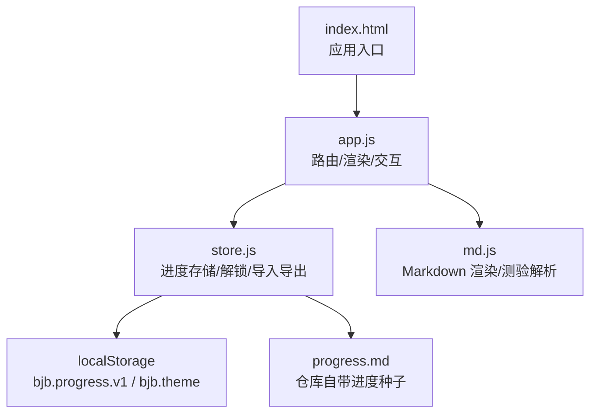
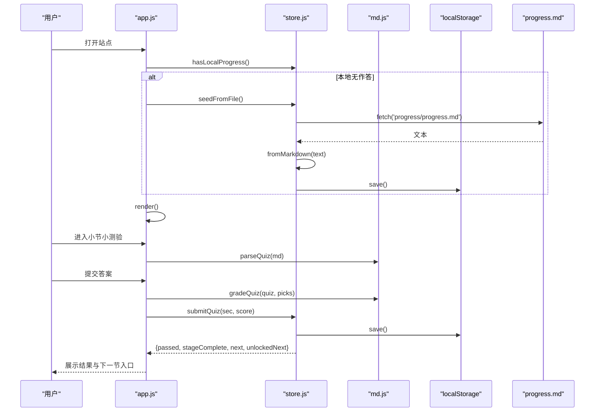
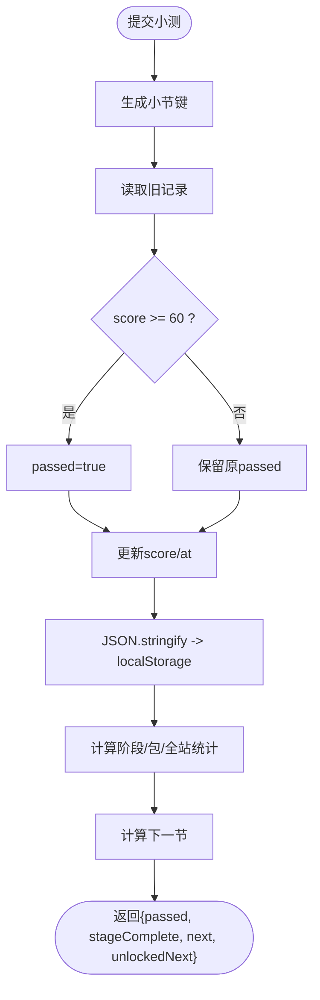
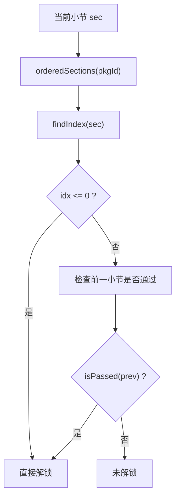
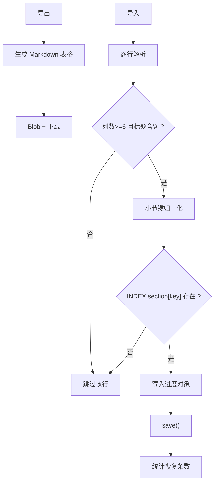
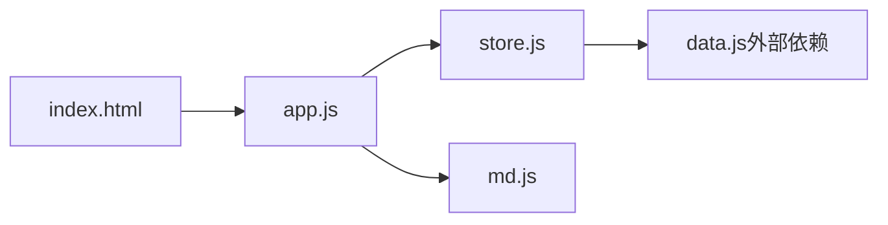

# 进度管理系统

<cite>
**本文引用的文件**   
- [store.js](file://assets/js/store.js)
- [app.js](file://assets/js/app.js)
- [md.js](file://assets/js/md.js)
- [index.html](file://index.html)
</cite>

## 目录
1. [引言](#引言)
2. [项目结构](#项目结构)
3. [核心组件](#核心组件)
4. [架构总览](#架构总览)
5. [详细组件分析](#详细组件分析)
6. [依赖关系分析](#依赖关系分析)
7. [性能与可扩展性](#性能与可扩展性)
8. [故障排查指南](#故障排查指南)
9. [结论](#结论)
10. [附录：数据模型与接口](#附录数据模型与接口)

## 引言
本技术文档聚焦于大 Java 后端学习平台的“进度管理系统”，围绕浏览器端实现，重点解析以下能力：
- 以 localStorage 为主、Markdown 进度文件为辅的持久化方案
- 小测验判分与过关解锁机制（≥ 60 分）
- 同课程包内小节顺序解锁与阶段统计
- Markdown 进度文件的导入/导出规范与容错处理
- 进度状态查询、当前学习位置记录与全站统计
- 面向初学者的本地存储概念说明，以及面向高级开发者的迁移与优化建议

## 项目结构
进度管理相关代码集中在前端静态资源中，采用模块化组织：
- assets/js/store.js：进度存储、状态查询、解锁判断、Markdown 导入导出
- assets/js/app.js：路由、页面渲染、用户交互、调用 store 更新进度
- assets/js/md.js：Markdown 渲染与小测验解析/评分
- index.html：应用入口，挂载主题初始化与模块加载

图表来源
- [index.html:11-14](file://index.html#L11-L14)
- [index.html:45-45](file://index.html#L45-L45)
- [app.js:1-10](file://assets/js/app.js#L1-L10)
- [store.js:1-8](file://assets/js/store.js#L1-L8)
- [md.js:1-10](file://assets/js/md.js#L1-L10)

章节来源
- [index.html:1-48](file://index.html#L1-L48)
- [app.js:1-10](file://assets/js/app.js#L1-L10)
- [store.js:1-10](file://assets/js/store.js#L1-L10)
- [md.js:1-10](file://assets/js/md.js#L1-L10)

## 核心组件
- 进度存储层（store.js）
  - 主存储：localStorage 键 bjb.progress.v1，保存 JSON 序列化后的进度对象
  - 主题存储：localStorage 键 bjb.theme
  - 进度文件：支持从 progress/progress.md 播种，支持导出为 Markdown 并下载
- 应用层（app.js）
  - 路由与页面渲染：首页、课程包、小节、小测验、作业题、面试题、地图、进度页
  - 用户交互：提交小测、手动标记通过、导入/导出进度、清空进度
  - 调用 store 完成状态写入与查询
- 内容层（md.js）
  - Markdown 渲染器：标题、列表、表格、代码块、引用、链接等
  - 小测验解析与评分：单选/多选/判断/填空/简答，自动折算百分制

章节来源
- [store.js:4-8](file://assets/js/store.js#L4-L8)
- [store.js:10-18](file://assets/js/store.js#L10-L18)
- [store.js:110-182](file://assets/js/store.js#L110-L182)
- [app.js:241-390](file://assets/js/app.js#L241-L390)
- [md.js:168-337](file://assets/js/md.js#L168-L337)

## 架构总览
进度管理的整体流程如下：
- 启动时尝试从仓库自带的 progress.md 播种进度（仅当本地无作答记录时）
- 用户进入小节小测验页，系统解析题目、收集作答、计算得分
- 根据得分是否 ≥ 60 判定是否通过；通过后按课程包内顺序解锁下一节
- 进度写入 localStorage，并在进度页提供导入/导出功能

图表来源
- [app.js:515-521](file://assets/js/app.js#L515-L521)
- [store.js:167-173](file://assets/js/store.js#L167-L173)
- [store.js:143-164](file://assets/js/store.js#L143-L164)
- [app.js:320-390](file://assets/js/app.js#L320-L390)
- [md.js:193-284](file://assets/js/md.js#L193-L284)
- [md.js:329-337](file://assets/js/md.js#L329-L337)

## 详细组件分析

### 进度存储与状态管理（store.js）
- 主存储与主题存储
  - 使用两个 localStorage 键：bjb.progress.v1 与 bjb.theme
  - 提供 load/save 封装，统一 JSON 序列化/反序列化
  - 提供 hasLocalProgress 判断是否已有作答记录，避免把主题键误判为进度存在
- 进度数据结构
  - 以“小节键”为 key，值为包含 score、passed、manual、at 的对象
  - 小节键由 secKey 生成，保证大小写归一与稳定索引
- 解锁与导航
  - isUnlocked：同一课程包内按阶段小节顺序解锁，前一节通过则解锁当前节
  - nextSection：返回当前小节在包内的下一节
  - stageStats/pkgStats/siteStats：阶段/课程包/全站统计，用于 UI 展示
- 过关写入
  - submitQuiz：根据分数是否 ≥ 60 判定 passed，保留最高分，更新时间戳
  - markManual：自定义格式小测的人工通过标记，不自动判分但可解锁
- Markdown 进度文件
  - toMarkdown：导出表格形式的进度，含小节键、标题、最高分、状态、最后提交时间
  - fromMarkdown：解析表格行，恢复进度；兼容手写进度文件的大小写差异
  - seedFromFile：启动时从 progress/progress.md 播种
  - download：将文本转为 Blob 并触发下载

图表来源
- [store.js:72-86](file://assets/js/store.js#L72-L86)
- [store.js:47-57](file://assets/js/store.js#L47-L57)
- [store.js:10-18](file://assets/js/store.js#L10-L18)

章节来源
- [store.js:4-8](file://assets/js/store.js#L4-L8)
- [store.js:10-18](file://assets/js/store.js#L10-L18)
- [store.js:20-67](file://assets/js/store.js#L20-L67)
- [store.js:72-99](file://assets/js/store.js#L72-L99)
- [store.js:110-182](file://assets/js/store.js#L110-L182)

### 解锁机制与依赖检查
- 分数门槛：小测验总分折算百分制后，≥ 60 分视为通过
- 顺序解锁：同一大技术包内，小节按 INDEX 定义顺序依次解锁；不同包之间互不影响
- 自动解锁：submitQuiz 返回 unlockedNext，UI 显示“已解锁下一节”并提供跳转
- 依赖检查：isUnlocked 基于 orderedSections 查找前一小节是否通过

图表来源
- [store.js:28-45](file://assets/js/store.js#L28-L45)

章节来源
- [store.js:28-45](file://assets/js/store.js#L28-L45)
- [app.js:185-208](file://assets/js/app.js#L185-L208)

### 进度追踪逻辑
- 已完成小节标记：isPassed(sectionRecord(sec).passed)
- 当前学习位置：通过路由 #/sec/{pkg}/{stage}/{sec}/... 定位
- 学习统计信息：
  - siteStats：全站小节总数、已通过数、仍存在于骨架中的已通过小节数
  - pkgStats：课程包维度统计
  - stageStats：阶段维度统计，complete 表示该阶段全部小节通过

章节来源
- [store.js:47-67](file://assets/js/store.js#L47-L67)
- [app.js:73-110](file://assets/js/app.js#L73-L110)
- [app.js:115-173](file://assets/js/app.js#L115-L173)

### 导入导出功能与数据完整性校验
- 导出（toMarkdown + download）
  - 生成 Markdown 表格，包含小节键、标题、最高分、状态、最后提交时间
  - 附加阶段完成情况摘要
  - 使用 Blob + URL.createObjectURL 触发下载
- 导入（fromMarkdown）
  - 解析表格行，校验列数与标题格式
  - 小节键大小写归一化，匹配 INDEX.section
  - 分数解析：数字或“-”表示空值；状态字段识别“通过/手动通过/未通过”
  - 恢复条数统计，save 后刷新 UI
- 错误处理
  - fromMarkdown 对非法行跳过，不中断整体恢复
  - seedFromFile 捕获网络异常，返回 0 表示播种失败

图表来源
- [store.js:110-182](file://assets/js/store.js#L110-L182)

章节来源
- [store.js:110-182](file://assets/js/store.js#L110-L182)
- [app.js:428-470](file://assets/js/app.js#L428-L470)

### 小测验解析与评分（md.js）
- 题型识别
  - 选项行：- A. 选项 → 客观题；题干含“多选”则为多选；A/B 为正确/错误则为判断题
  - 无选项行：题干含“填空/填写/补全/下划线”记为填空题，否则简答题
- 答案与解析
  - 支持行内 > 答案：/ > 参考答案：，也支持末尾 ## 答案 段落
  - 简答题支持要点列表作为关键词
- 评分规则
  - 客观题：精确匹配字母串（去重、排序、大写）
  - 填空题：多答案用 | / ； 分隔，命中任一即满分
  - 简答题：主干命中计满分，否则按片段命中率给部分分
  - 卷面总分：有标注分值则按标注，否则平均分配 100 分
  - 百分制：Math.round((earned/full)*100)，≥ 60 通过

章节来源
- [md.js:168-337](file://assets/js/md.js#L168-L337)
- [app.js:241-390](file://assets/js/app.js#L241-L390)

### 应用层集成（app.js）
- 路由与渲染
  - viewHome/viewPkg/viewSection/viewMap/viewProgress
  - 根据 store 统计渲染卡片、阶段地图、进度表
- 用户交互
  - 提交小测：collectPicks → gradeQuiz → submitQuiz → 展示横幅与下一节
  - 自定义格式小测：markManual → afterPass
  - 进度页：导出/导入/清空进度
- 主题切换
  - getTheme/setTheme，配合 index.html 首帧主题初始化

章节来源
- [app.js:71-110](file://assets/js/app.js#L71-L110)
- [app.js:115-173](file://assets/js/app.js#L115-L173)
- [app.js:185-239](file://assets/js/app.js#L185-L239)
- [app.js:241-390](file://assets/js/app.js#L241-L390)
- [app.js:409-470](file://assets/js/app.js#L409-L470)
- [app.js:502-521](file://assets/js/app.js#L502-L521)

## 依赖关系分析
- app.js 依赖 store.js 与 md.js
- store.js 依赖 data.js（CATEGORIES、INDEX、secKey），但本仓库未提供该文件源码，仅能依据其用法推断
- index.html 引入 app.js 作为模块入口，并在首帧设置主题

图表来源
- [index.html:45-45](file://index.html#L45-L45)
- [app.js:1-6](file://assets/js/app.js#L1-L6)
- [store.js:1-2](file://assets/js/store.js#L1-L2)

章节来源
- [index.html:45-45](file://index.html#L45-L45)
- [app.js:1-6](file://assets/js/app.js#L1-L6)
- [store.js:1-2](file://assets/js/store.js#L1-L2)

## 性能与可扩展性
- 本地存储限制
  - localStorage 容量通常为 5~10MB，适合轻量进度数据；不适合存放大量二进制或超大文本
  - 同步 API，频繁读写可能阻塞主线程；当前实现仅在关键操作（提交、导入、导出）时写入
- 序列化开销
  - 每次 submitQuiz/markManual 都会 JSON.stringify(progress)；若未来进度规模增长，可考虑增量更新或分片存储
- 导入导出优化
  - 导出为 Markdown 文本，体积较小；导入解析为 O(n) 行扫描，通常可接受
- 扩展建议
  - 增加版本迁移：在 bjb.progress.v1 中增加 version 字段，便于后续 schema 演进
  - 增加校验与审计：导入时对 INDEX.section 进行白名单校验，输出审计日志
  - 异步批量保存：合并多次提交，减少 localStorage 写入频率
  - 离线缓存：结合 Service Worker 缓存 progress.md，提升播种稳定性

[本节为通用指导，不直接分析具体文件]

## 故障排查指南
- 进度无法恢复
  - 检查本地是否有作答记录：hasLocalProgress 返回 false 才会尝试 seedFromFile
  - 检查 progress/progress.md 是否可达：seedFromFile 会 catch 网络异常并返回 0
  - 检查 Markdown 表格列数与标题格式：fromMarkdown 要求至少 6 列且第二列包含“#”
- 解锁异常
  - 确认上一小节是否通过：isUnlocked 依赖前一小节的 passed 状态
  - 确认课程包内小节顺序：orderedSections 基于 INDEX.pkg.stages.sections 顺序
- 小测判分异常
  - 检查题目解析：parseQuiz 需要三级标题与选项行或主观题答案
  - 检查答案格式：客观题字母串需去重、排序、大写；主观题关键词分割符
- 主题闪烁
  - index.html 首帧脚本已设置主题；若仍闪烁，检查 localStorage 是否可用（隐私模式不可用）

章节来源
- [store.js:20-21](file://assets/js/store.js#L20-L21)
- [store.js:167-173](file://assets/js/store.js#L167-L173)
- [store.js:143-164](file://assets/js/store.js#L143-L164)
- [store.js:28-45](file://assets/js/store.js#L28-L45)
- [md.js:193-284](file://assets/js/md.js#L193-L284)
- [index.html:11-14](file://index.html#L11-L14)

## 结论
本进度管理系统以 localStorage 为核心，结合 Markdown 进度文件实现了轻量、可移植的学习进度管理。通过严格的分数门槛与顺序解锁机制，保障学习路径的连贯性；通过导入导出与播种机制，满足跨设备恢复与团队协作场景。对于初学者，建议理解本地存储的基本概念与限制；对于高级开发者，建议在数据迁移、版本控制与性能优化方面进一步扩展。

[本节为总结性内容，不直接分析具体文件]

## 附录：数据模型与接口

### 进度对象结构
- 键：小节键（由 secKey 生成，大小写归一）
- 值：
  - score：最高分（可为 null 表示自定义通过）
  - passed：是否通过（布尔）
  - manual：是否手动通过（布尔）
  - at：最后提交时间（ISO 字符串截取）

章节来源
- [store.js:72-99](file://assets/js/store.js#L72-L99)

### 主要接口
- 状态查询
  - sectionRecord(sec)
  - isPassed(sec)
  - isUnlocked(sec)
  - nextSection(sec)
  - stageStats(pkgId, stageId)
  - pkgStats(pkgId)
  - siteStats()
- 状态写入
  - submitQuiz(sec, score)
  - markManual(sec)
  - resetAll()
- 主题
  - getTheme()
  - setTheme(theme)
- Markdown 进度文件
  - toMarkdown()
  - fromMarkdown(md)
  - seedFromFile()
  - download(text, filename)

章节来源
- [store.js:23-67](file://assets/js/store.js#L23-L67)
- [store.js:72-104](file://assets/js/store.js#L72-L104)
- [store.js:110-182](file://assets/js/store.js#L110-L182)