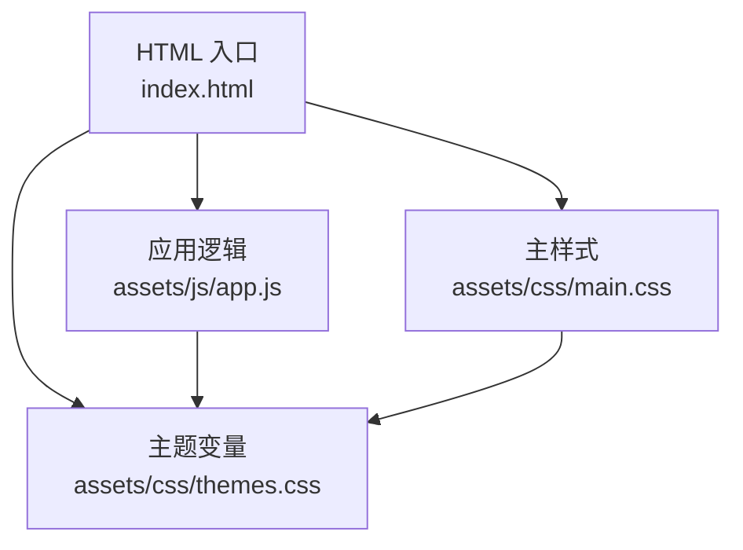
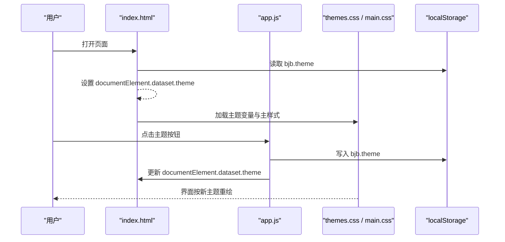
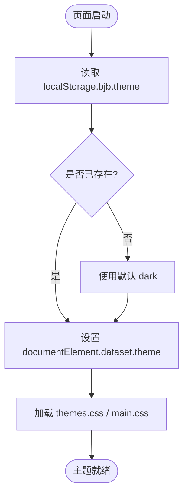
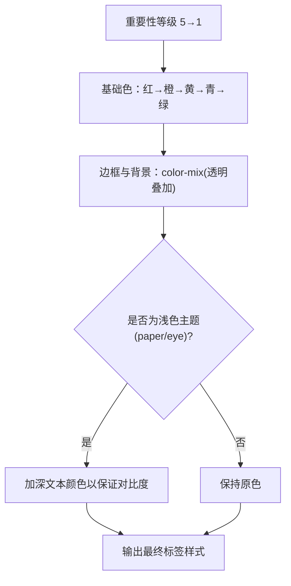
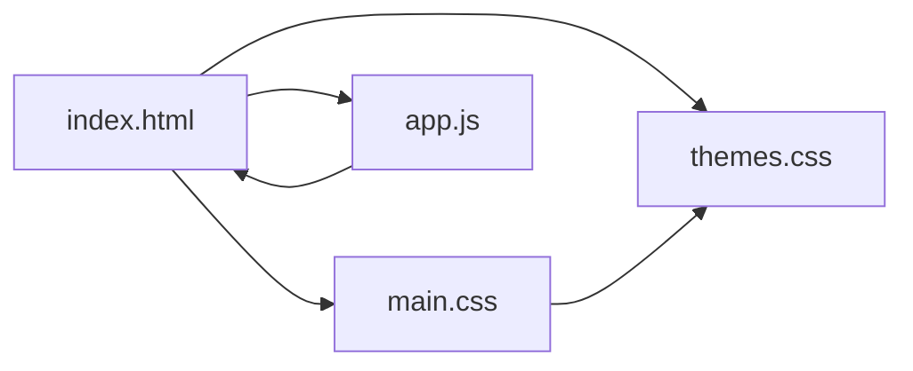

# 主题系统

<cite>
**本文引用的文件**   
- [index.html](file://index.html)
- [assets/css/themes.css](file://assets/css/themes.css)
- [assets/css/main.css](file://assets/css/main.css)
- [assets/js/app.js](file://assets/js/app.js)
</cite>

## 目录
1. [引言](#引言)
2. [项目结构](#项目结构)
3. [核心组件](#核心组件)
4. [架构总览](#架构总览)
5. [详细组件分析](#详细组件分析)
6. [依赖关系分析](#依赖关系分析)
7. [性能与可访问性](#性能与可访问性)
8. [故障排查指南](#故障排查指南)
9. [结论](#结论)
10. [附录：主题定制最佳实践](#附录主题定制最佳实践)

## 引言
本文件面向“大Java后端学习平台”的主题系统，系统性说明基于 CSS 自定义属性的视觉主题架构、四套预设主题的设计意图、主题切换机制、五级详略标签的配色算法，以及扩展新主题的完整指南。文档兼顾技术深度与可读性，帮助前端开发者快速理解并安全扩展主题体系。

## 项目结构
主题相关代码集中在以下位置：
- HTML 入口：定义默认主题、主题按钮容器与资源加载顺序
- CSS 主题变量：按主题名分组声明 CSS 自定义属性
- CSS 主样式：通过变量驱动全局颜色、背景、边框、阴影等视觉表现
- JavaScript 应用逻辑：负责主题持久化、动态切换与页面初始化

图表来源
- [index.html:1-48](file://index.html#L1-L48)
- [assets/css/themes.css:1-69](file://assets/css/themes.css#L1-L69)
- [assets/css/main.css:1-241](file://assets/css/main.css#L1-L241)
- [assets/js/app.js:502-521](file://assets/js/app.js#L502-L521)

章节来源
- [index.html:1-48](file://index.html#L1-L48)

## 核心组件
- 主题变量层（themes.css）：以 data-theme 选择器为根，集中声明一套完整的语义化 CSS 变量，包括背景、文本、强调色、成功/失败状态、锁定态、阴影等。
- 样式消费层（main.css）：所有 UI 元素通过 var(--*) 引用变量，不直接写死颜色值，从而保证主题切换时仅替换变量即可生效。
- 交互控制层（app.js + index.html）：在 HTML 首帧前读取 localStorage 中的主题键，避免闪烁；点击主题按钮后更新 documentElement.dataset.theme 并持久化到 localStorage。

章节来源
- [assets/css/themes.css:1-69](file://assets/css/themes.css#L1-L69)
- [assets/css/main.css:1-241](file://assets/css/main.css#L1-L241)
- [assets/js/app.js:502-521](file://assets/js/app.js#L502-L521)
- [index.html:1-48](file://index.html#L1-L48)

## 架构总览
主题系统采用“变量驱动 + 数据属性选择器”的模式：
- HTML 根节点携带 data-theme 属性，决定当前激活的主题块
- themes.css 中每个 :root[data-theme="xxx"] 提供同一组变量名但不同取值
- main.css 消费这些变量，渲染出一致的布局与层次
- app.js 负责在用户操作或页面加载时设置 data-theme，并写入 localStorage

图表来源
- [index.html:11-14](file://index.html#L11-L14)
- [assets/js/app.js:502-521](file://assets/js/app.js#L502-L521)
- [assets/css/themes.css:1-69](file://assets/css/themes.css#L1-L69)
- [assets/css/main.css:5-11](file://assets/css/main.css#L5-L11)

## 详细组件分析

### CSS 自定义属性设计模式
- 命名规范
  - 基础色板：--bg, --bg-soft, --bg-card, --bg-code
  - 文本色板：--text, --text-soft, --text-dim
  - 强调与辅助：--accent, --accent-2
  - 语义状态：--ok, --bad, --lock
  - 装饰：--line, --shadow
- 作用域策略
  - 所有变量均定义在 :root[data-theme="..."] 下，通过根级选择器覆盖
  - 主样式统一使用 var(--*)，避免硬编码颜色
- 复杂度与可维护性
  - 新增主题只需新增一个 :root[data-theme="new"] 块，无需改动业务样式
  - 变量语义清晰，便于团队协作与后续扩展

章节来源
- [assets/css/themes.css:1-69](file://assets/css/themes.css#L1-L69)
- [assets/css/main.css:5-11](file://assets/css/main.css#L5-L11)

### 四套预设主题与设计意图
- 深色主题（dark）
  - 低亮度背景搭配高对比文本，降低夜间眩光
  - 强调色偏暖金，辅助强调色偏冷蓝，形成层次
  - 阴影较深，增强卡片浮起感
- 护眼主题（eye）
  - 整体偏绿调的低饱和背景，减少蓝光刺激
  - 文本与强调色保持足够对比度，适合长时间阅读
- 藏青主题（navy）
  - 深蓝底色营造专业、沉稳氛围
  - 强调色明亮但不刺眼，适合技术文档场景
- 纸白主题（paper）
  - 接近纸张的暖白背景，提升长文阅读体验
  - 对浅色背景下的五级标签进行加深处理，确保对比度达标

章节来源
- [assets/css/themes.css:1-69](file://assets/css/themes.css#L1-L69)

### 主题切换机制
- 初始化流程
  - HTML 在首帧前尝试从 localStorage 读取 bjb.theme，若不存在则回退到 dark
  - 随后加载 themes.css 与 main.css，确保首次渲染即使用正确主题
- 运行时切换
  - 点击主题按钮后，app.js 调用 applyTheme(t)，将 documentElement.dataset.theme 设置为目标主题
  - 同时更新按钮 aria-pressed 状态，提升无障碍体验
  - 调用 store.setTheme(t) 持久化主题偏好
- 存储键约定
  - 主题键：bjb.theme
  - 其他进度数据由 store.js 管理（不在本文范围）

图表来源
- [index.html:11-14](file://index.html#L11-L14)
- [assets/js/app.js:502-521](file://assets/js/app.js#L502-L521)

章节来源
- [index.html:11-14](file://index.html#L11-L14)
- [assets/js/app.js:502-521](file://assets/js/app.js#L502-L521)

### 五级详略标签配色系统
- 重要性等级
  - depth-5：核心精讲（红色系）
  - depth-4：重点标准（橙红系）
  - depth-3：标准概览（黄色系）
  - depth-2：简明速览（青绿色系）
  - depth-1：了解即可（绿色系）
- 颜色渐变算法
  - 使用 color-mix(in srgb, <base>, transparent) 生成半透明边框与背景
  - 文本颜色使用纯色，保证在不同主题下仍具辨识度
- 浅色主题适配
  - 针对 paper 与 eye 主题，单独加深各等级的文本颜色，以满足对比度要求
- 无障碍考虑
  - 通过加深浅色主题下的文本颜色，保障 WCAG 对比度建议
  - 按钮 aria-pressed 状态用于表达当前选中主题

图表来源
- [assets/css/main.css:94-112](file://assets/css/main.css#L94-L112)

章节来源
- [assets/css/main.css:94-112](file://assets/css/main.css#L94-L112)

### 主题与主样式的耦合点
- 背景与文本
  - body 背景与文本颜色分别引用 --bg 与 --text
- 头部与卡片
  - 头部背景与分隔线使用 --bg-soft 与 --line
  - 卡片背景、边框、阴影使用 --bg-card, --line, --shadow
- 链接与强调
  - 链接颜色使用 --accent-2，悬停与激活态使用 --accent
- 表单与测验
  - 输入框、选项卡、结果提示等使用 --bg-soft, --line, --ok, --bad, --accent

章节来源
- [assets/css/main.css:5-11](file://assets/css/main.css#L5-L11)
- [assets/css/main.css:17-36](file://assets/css/main.css#L17-L36)
- [assets/css/main.css:81-92](file://assets/css/main.css#L81-L92)
- [assets/css/main.css:163-188](file://assets/css/main.css#L163-L188)
- [assets/css/main.css:197-226](file://assets/css/main.css#L197-L226)

## 依赖关系分析
- HTML 依赖
  - 先加载 themes.css，再加载 main.css，确保变量优先可用
  - 在脚本执行前设置 data-theme，避免闪烁
- CSS 依赖
  - main.css 依赖 themes.css 提供的变量
- JS 依赖
  - app.js 通过 DOM API 修改 documentElement.dataset.theme
  - 通过 localStorage 读写 bjb.theme

图表来源
- [index.html:9-14](file://index.html#L9-L14)
- [assets/css/themes.css:1-69](file://assets/css/themes.css#L1-L69)
- [assets/css/main.css:1-241](file://assets/css/main.css#L1-L241)
- [assets/js/app.js:502-521](file://assets/js/app.js#L502-L521)

章节来源
- [index.html:9-14](file://index.html#L9-L14)
- [assets/css/themes.css:1-69](file://assets/css/themes.css#L1-L69)
- [assets/css/main.css:1-241](file://assets/css/main.css#L1-L241)
- [assets/js/app.js:502-521](file://assets/js/app.js#L502-L521)

## 性能与可访问性
- 性能
  - 主题切换仅改变 CSS 变量，浏览器可高效重绘，无额外网络请求
  - 首屏通过内联脚本提前设置 data-theme，避免闪烁
- 可访问性
  - 主题按钮使用 aria-pressed 表达选中状态
  - 浅色主题下对五级标签文本加深，提升对比度
  - 内容区域使用 aria-live 提示动态更新

章节来源
- [index.html:35-35](file://index.html#L35-L35)
- [assets/js/app.js:502-506](file://assets/js/app.js#L502-L506)
- [assets/css/main.css:107-112](file://assets/css/main.css#L107-L112)

## 故障排查指南
- 主题未生效
  - 检查 HTML 根节点是否存在 data-theme 属性
  - 确认 themes.css 与 main.css 加载顺序正确
- 切换后闪烁
  - 确认 index.html 中在脚本执行前设置了 data-theme
- 浅色主题下标签对比度不足
  - 检查是否命中 paper/eye 主题的选择器规则
- 主题偏好丢失
  - 检查 localStorage 是否被禁用或隐私模式限制
  - 确认 app.js 是否正确写入 bjb.theme

章节来源
- [index.html:11-14](file://index.html#L11-L14)
- [assets/css/themes.css:1-69](file://assets/css/themes.css#L1-L69)
- [assets/css/main.css:107-112](file://assets/css/main.css#L107-L112)
- [assets/js/app.js:502-521](file://assets/js/app.js#L502-L521)

## 结论
该主题系统以 CSS 自定义属性为核心，通过 data-theme 选择器实现多主题无缝切换；主样式完全变量化，确保主题扩展成本低、一致性高。四级预设主题覆盖了暗色、护眼、专业与阅读场景，五级详略标签通过颜色渐变与浅色主题加深策略，兼顾信息层级与可访问性。JavaScript 负责主题持久化与初始化，整体架构简洁、可扩展性强。

## 附录：主题定制最佳实践
- 创建新主题
  - 在 themes.css 中新增 :root[data-theme="your-theme"] 块
  - 为所有必需变量赋值：--bg, --bg-soft, --bg-card, --bg-code, --line, --text, --text-soft, --text-dim, --accent, --accent-2, --ok, --bad, --lock, --shadow
  - 如需调整五级标签在浅色主题下的对比度，可在 main.css 中追加对应选择器加深文本颜色
- 覆盖现有样式变量
  - 优先通过新增主题块覆盖变量，而非直接修改 main.css 中的颜色值
  - 若需局部覆盖，建议使用更具体的选择器，避免影响全局
- 扩展视觉效果
  - 新增语义变量（如 --focus-ring, --hover-overlay），并在 main.css 中消费
  - 保持变量命名一致性与语义化，便于团队复用与维护
- 主题按钮与交互
  - 在 index.html 的主题按钮容器中新增 button，并设置 data-theme-btn 为新主题名
  - 确保 app.js 的 applyTheme 能正确更新 aria-pressed 状态
- 测试与验收
  - 验证四套主题下关键区域的对比度与可读性
  - 检查浅色主题下五级标签是否满足 WCAG 对比度建议
  - 验证 localStorage 读写与页面初始化的稳定性

章节来源
- [assets/css/themes.css:1-69](file://assets/css/themes.css#L1-L69)
- [assets/css/main.css:94-112](file://assets/css/main.css#L94-L112)
- [index.html:27-32](file://index.html#L27-L32)
- [assets/js/app.js:502-521](file://assets/js/app.js#L502-L521)