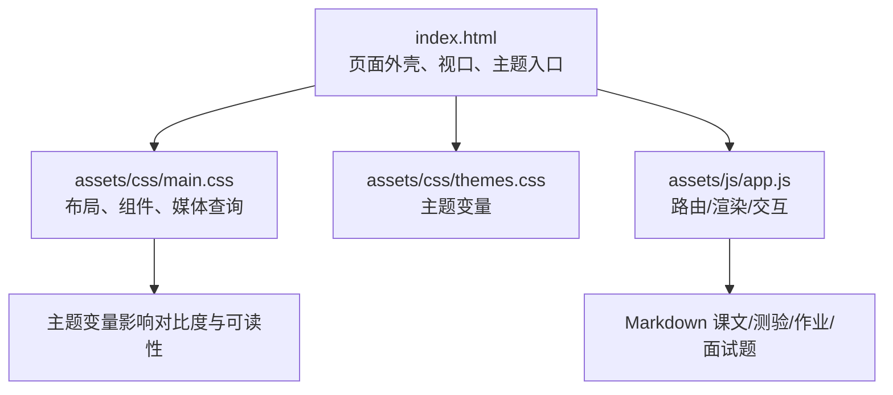
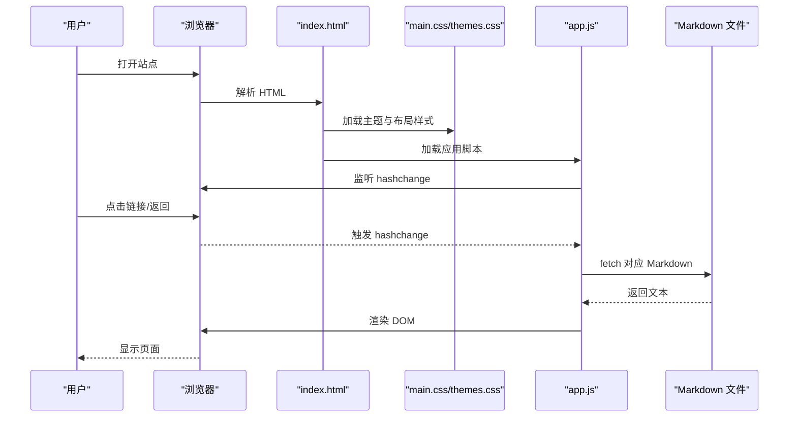
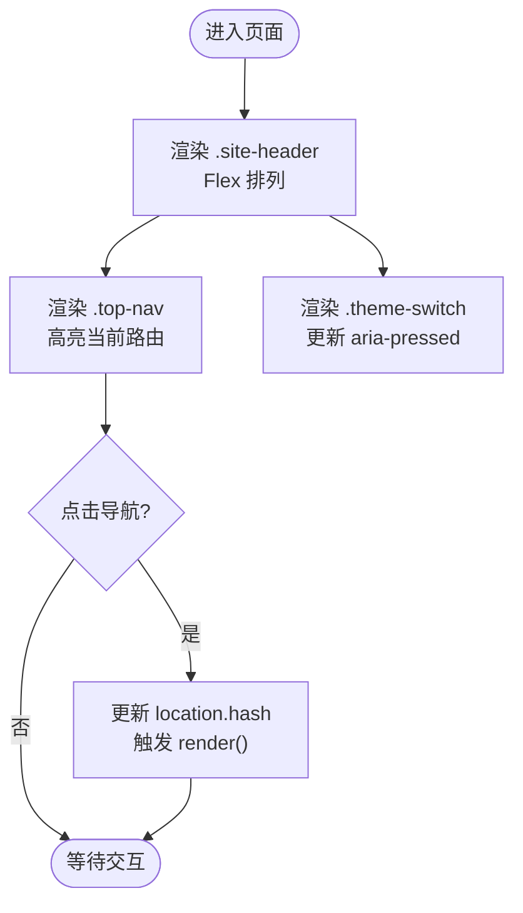
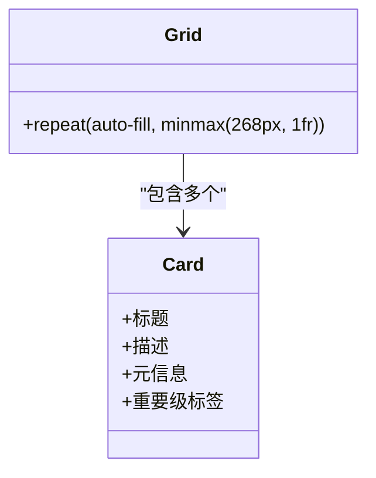
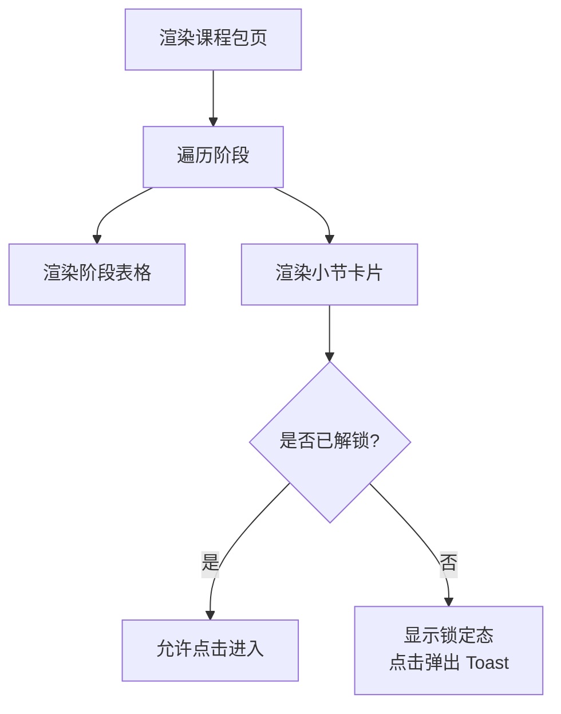
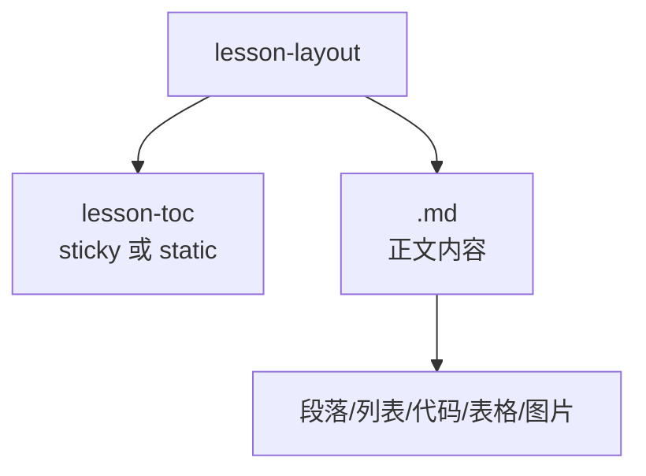
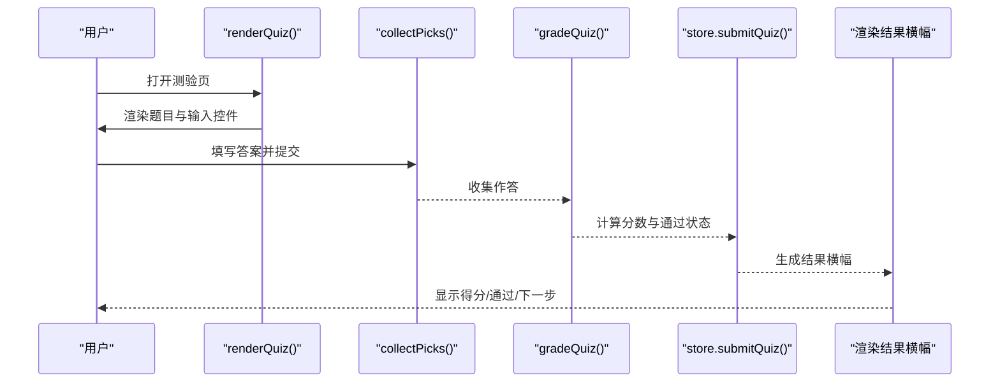
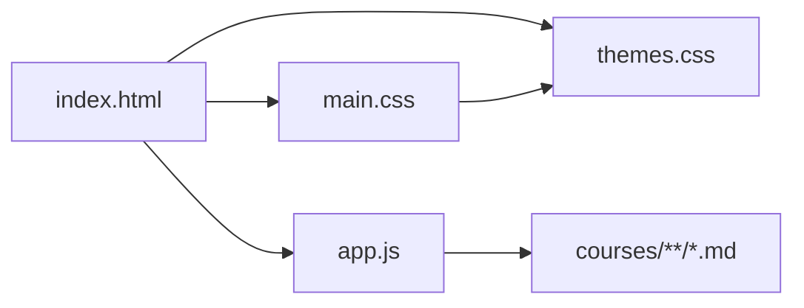
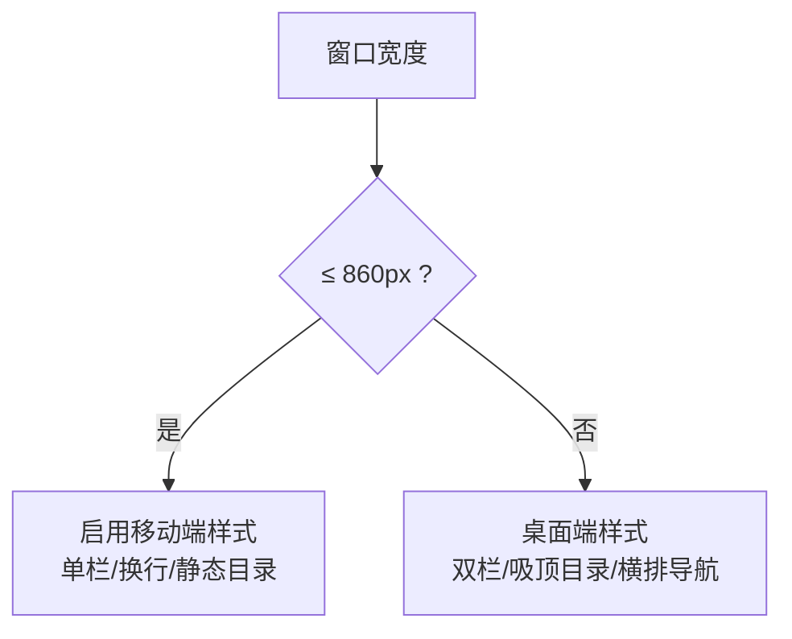
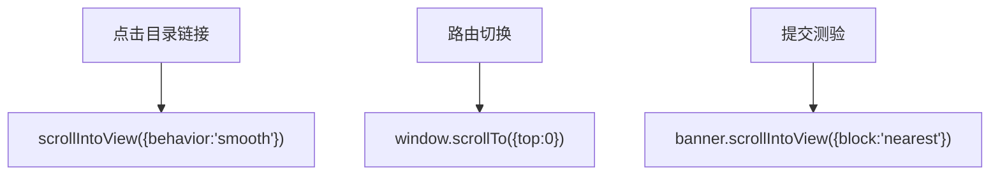

# 响应式设计

<cite>
**本文引用的文件**   
- [index.html](file://index.html)
- [main.css](file://assets/css/main.css)
- [themes.css](file://assets/css/themes.css)
- [app.js](file://assets/js/app.js)
- [README.md](file://README.md)
</cite>

## 目录
1. [引言](#引言)
2. [项目结构](#项目结构)
3. [核心组件](#核心组件)
4. [架构总览](#架构总览)
5. [详细组件分析](#详细组件分析)
6. [依赖关系分析](#依赖关系分析)
7. [性能与加载策略](#性能与加载策略)
8. [无障碍设计](#无障碍设计)
9. [移动端适配与交互优化](#移动端适配与交互优化)
10. [测试与验收方法](#测试与验收方法)
11. [结论](#结论)

## 引言
本文件面向“大Java后端学习平台”的响应式设计与多设备适配，目标是说明：
- 移动端适配策略（媒体查询、触摸友好、性能）
- 布局系统（Flexbox / Grid、流式布局、断点决策）
- 核心组件的响应式行为（首页卡片、课程包详情、小节内容、导航）
- 交互优化（手势、滚动、加载状态、错误提示）
- 无障碍原则（语义化 HTML、键盘导航、屏幕阅读器、色彩对比度）
- 性能建议（图片、资源优先级、缓存）
- 实现示例与测试方法，确保多端一致体验

本项目为纯前端静态站点，运行时零第三方依赖；页面由 `index.html` 外壳 + `assets/js/app.js` 路由渲染 + `assets/css/*` 样式驱动，课程内容以 Markdown 形式组织。

**章节来源**
- [README.md:1-48](file://README.md#L1-L48)

## 项目结构
从响应式视角看，关键文件职责如下：
- `index.html`：页面骨架、主题开关入口、主容器、Toast 容器、视口设置
- `assets/css/main.css`：全局布局、组件样式、唯一一处媒体查询断点
- `assets/css/themes.css`：四套主题变量（深色/护眼/藏青/纸白），影响可读性与对比度
- `assets/js/app.js`：路由、视图渲染、小测验判分、进度与主题切换、事件委托

**图表来源**
- [index.html:1-48](file://index.html#L1-L48)
- [main.css:1-241](file://assets/css/main.css#L1-L241)
- [themes.css:1-69](file://assets/css/themes.css#L1-L69)
- [app.js:1-522](file://assets/js/app.js#L1-L522)

**章节来源**
- [index.html:1-48](file://index.html#L1-L48)
- [main.css:1-241](file://assets/css/main.css#L1-L241)
- [themes.css:1-69](file://assets/css/themes.css#L1-L69)
- [app.js:1-522](file://assets/js/app.js#L1-L522)

## 核心组件
- 头部导航与主题切换：粘性定位、Flex 排列、主题按钮可访问性
- 首页课程卡网格：Grid 自动填充、卡片悬停反馈、重要级标签
- 课程包阶段与小节：Flex 卡片、区块按钮组、锁定态
- 小节正文布局：双栏（目录 + 正文）、侧边目录吸顶
- 小测验表单：单选/多选/判断/填空/简答、提交与结果展示
- Toast 通知：固定右下角、自动消失

这些组件共同构成跨设备一致的阅读与学习体验。

**章节来源**
- [main.css:16-240](file://assets/css/main.css#L16-L240)
- [app.js:71-401](file://assets/js/app.js#L71-L401)

## 架构总览
响应式架构由三层组成：
- 表现层：CSS 变量 + Flex/Grid + 单一断点
- 交互层：原生 ES Module 路由 + 事件委托 + 本地存储
- 数据层：Markdown 文件 + 骨架数据源（data.js，见 README）

**图表来源**
- [index.html:1-48](file://index.html#L1-L48)
- [main.css:1-241](file://assets/css/main.css#L1-L241)
- [themes.css:1-69](file://assets/css/themes.css#L1-L69)
- [app.js:472-522](file://assets/js/app.js#L472-L522)

**章节来源**
- [README.md:13-48](file://README.md#L13-L48)
- [app.js:472-522](file://assets/js/app.js#L472-L522)

## 详细组件分析

### 头部与导航
- 使用 Flex 水平排列品牌、导航、主题切换
- 粘性定位保证长页面中导航始终可见
- 主题按钮通过 `aria-pressed` 表达选中状态，便于辅助技术识别

**图表来源**
- [index.html:17-33](file://index.html#L17-L33)
- [main.css:16-36](file://assets/css/main.css#L16-L36)
- [app.js:494-496](file://assets/js/app.js#L494-L496)
- [app.js:502-511](file://assets/js/app.js#L502-L511)

**章节来源**
- [index.html:17-33](file://index.html#L17-L33)
- [main.css:16-36](file://assets/css/main.css#L16-L36)
- [app.js:494-511](file://assets/js/app.js#L494-L511)

### 首页课程卡网格
- 使用 Grid `auto-fill` + `minmax(268px, 1fr)` 实现流式自适应列数
- 卡片内用 Flex 纵向布局，底部元信息区自动推到底部
- 重要级标签按 1-5 着色，浅色主题下加深以保证对比度

**图表来源**
- [main.css:77-106](file://assets/css/main.css#L77-L106)
- [app.js:73-111](file://assets/js/app.js#L73-L111)

**章节来源**
- [main.css:77-112](file://assets/css/main.css#L77-L112)
- [app.js:73-111](file://assets/js/app.js#L73-L111)

### 课程包详情页
- 阶段表格展示小节、难度、重要性、状态
- 每个小节为 Flex 卡片，左侧标题摘要，右侧三个操作块（测验/作业/面试）
- 未解锁小节虚线边框并禁用点击跳转，点击给出 Toast 提示

**图表来源**
- [app.js:115-173](file://assets/js/app.js#L115-L173)
- [main.css:125-161](file://assets/css/main.css#L125-L161)
- [app.js:321-340](file://assets/js/app.js#L321-L340)

**章节来源**
- [app.js:115-173](file://assets/js/app.js#L115-L173)
- [main.css:125-161](file://assets/css/main.css#L125-L161)
- [app.js:321-340](file://assets/js/app.js#L321-L340)

### 小节内容展示
- 桌面端双栏：左侧目录吸顶，右侧正文
- 移动端单栏：目录变为普通文档流，正文宽度占满
- 正文区域字体较大、代码块横向滚动、表格全宽、图片自适应

**图表来源**
- [main.css:163-190](file://assets/css/main.css#L163-L190)
- [main.css:234-240](file://assets/css/main.css#L234-L240)
- [app.js:217-233](file://assets/js/app.js#L217-L233)

**章节来源**
- [main.css:163-190](file://assets/css/main.css#L163-L190)
- [main.css:234-240](file://assets/css/main.css#L234-L240)
- [app.js:217-233](file://assets/js/app.js#L217-L233)

### 小测验与作业/面试题
- 支持单选、多选、判断、填空、简答
- 提交后逐题判定，显示得分、正确项/参考答案、解析
- 自定义格式的小测提供手动标记通过
- 结果横幅引导返回课程包或进入下一节

**图表来源**
- [app.js:248-390](file://assets/js/app.js#L248-L390)
- [main.css:197-226](file://assets/css/main.css#L197-L226)

**章节来源**
- [app.js:248-390](file://assets/js/app.js#L248-L390)
- [main.css:197-226](file://assets/css/main.css#L197-L226)

## 依赖关系分析
- `index.html` 引入 `themes.css`、`main.css` 与 `app.js`
- `app.js` 负责路由与渲染，调用 Markdown 文件（Lesson/Quiz/Homework/Interview）
- `main.css` 定义布局与组件样式，并通过 CSS 变量受 `themes.css` 控制
- 主题切换通过 `documentElement.dataset.theme` 切换，JS 同步更新按钮 `aria-pressed`

**图表来源**
- [index.html:9-10,45:9-10](file://index.html#L9-L10)
- [index.html:45-46](file://index.html#L45-L46)
- [app.js:1-6](file://assets/js/app.js#L1-L6)
- [main.css:1-11](file://assets/css/main.css#L1-L11)

**章节来源**
- [index.html:9-10,45-46:9-10](file://index.html#L9-L10)
- [app.js:1-6](file://assets/js/app.js#L1-L6)
- [main.css:1-11](file://assets/css/main.css#L1-L11)

## 性能与加载策略
- 构建产物由 Vite 生成，文件名带内容哈希，天然具备强缓存失效能力
- 开发期 dev server 不强缓存，修改即时生效
- 运行时按需 `fetch` Markdown 文件，避免首屏一次性加载全部内容
- 主题在首帧前通过内联脚本设置，减少闪烁
- 图片统一限制最大宽度，避免撑破布局

建议：
- 对大图使用现代格式（WebP/AVIF）与响应式 srcset
- 将非关键资源延迟加载（如 mermaid 流程图等）
- 利用 CDN 缓存静态资源，配合哈希文件名提升命中率

**章节来源**
- [README.md:64-67](file://README.md#L64-L67)
- [index.html:11-14](file://index.html#L11-L14)
- [main.css:187](file://assets/css/main.css#L187)
- [app.js:33-42](file://assets/js/app.js#L33-L42)

## 无障碍设计
- 语义化 HTML：`header`、`nav`、`main`、`footer`、`aside`、`article`、`section`
- 主内容区使用 `aria-live="polite"`，动态更新时告知屏幕阅读器
- 主题按钮维护 `aria-pressed`，表达选中状态
- 所有可点击元素具备明确光标与焦点样式（按钮、链接、小结卡片）
- 颜色对比度：四套主题均提供足够的文本与背景对比度；浅色主题下深度标签加深以保证可读性

建议：
- 为所有交互元素添加 `tabindex` 与键盘事件支持（当前主要基于原生元素，已具备基础键盘可用性）
- 为复杂组件补充 `role` 与 `aria-*`（如测验结果区域增加 `role="status"`）
- 使用工具检查对比度与可访问性（如 axe、Lighthouse Accessibility）

**章节来源**
- [index.html:35](file://index.html#L35)
- [main.css:31-36](file://assets/css/main.css#L31-L36)
- [main.css:107-112](file://assets/css/main.css#L107-L112)
- [app.js:502-511](file://assets/js/app.js#L502-L511)

## 移动端适配与交互优化

### 媒体查询与断点
- 全站仅有一处媒体查询断点：`@media (max-width: 860px)`
- 断点调整：
  - 小节正文布局由双栏变单栏
  - 目录由吸顶改为普通文档流
  - 小节卡片内部由横向转为纵向
  - 顶部导航换行显示

**图表来源**
- [main.css:234-240](file://assets/css/main.css#L234-L240)

**章节来源**
- [main.css:234-240](file://assets/css/main.css#L234-L240)

### 触摸友好的交互设计
- 按钮与链接具有足够内边距与字号，便于手指点击
- 卡片整体可点击（通过事件委托），减少精确点击需求
- 表单控件（单选/多选/填空/简答）具备清晰标签与输入框
- 结果反馈使用横幅与 Toast，避免弹窗阻塞

建议：
- 最小触控目标不小于 44×44px（当前多数按钮满足）
- 避免 hover 作为唯一交互方式（当前已提供 click 路径）
- 为长按/滑动等手势预留扩展点（当前未使用）

**章节来源**
- [main.css:152-161](file://assets/css/main.css#L152-L161)
- [main.css:197-226](file://assets/css/main.css#L197-L226)
- [app.js:321-340](file://assets/js/app.js#L321-L340)

### 滚动优化
- 目录跳转使用平滑滚动
- 每次路由切换滚动到顶部
- 测验结果横幅滚动到可视区域

**图表来源**
- [app.js:321-326](file://assets/js/app.js#L321-L326)
- [app.js:496](file://assets/js/app.js#L496)
- [app.js:388](file://assets/js/app.js#L388)

**章节来源**
- [app.js:321-326](file://assets/js/app.js#L321-L326)
- [app.js:496](file://assets/js/app.js#L496)
- [app.js:388](file://assets/js/app.js#L388)

### 加载状态处理
- Markdown 文件按需 fetch，失败返回 null 并渲染“正在编写中”提示
- 主题在首帧前设置，避免闪烁
- Toast 用于成功/失败/提示类消息

建议：
- 为异步加载增加显式 Loading 骨架屏（当前无）
- 对网络失败进行重试或降级提示

**章节来源**
- [app.js:33-42](file://assets/js/app.js#L33-L42)
- [app.js:67-69](file://assets/js/app.js#L67-L69)
- [index.html:11-14](file://index.html#L11-L14)
- [app.js:26-31](file://assets/js/app.js#L26-L31)

### 错误状态的友好提示
- “页面不存在”、“小节不存在”、“内容正在编写中”等统一使用 notice 样式
- 未解锁小节点击给出 Toast 提示
- 测验未通过给出横幅说明与下一步引导

**章节来源**
- [app.js:67-69](file://assets/js/app.js#L67-L69)
- [app.js:185-208](file://assets/js/app.js#L185-L208)
- [app.js:321-340](file://assets/js/app.js#L321-L340)
- [app.js:378-390](file://assets/js/app.js#L378-L390)

## 测试与验收方法
- 断点验证：在 860px 上下缩放窗口，确认布局切换符合预期
- 触摸验证：在移动设备上验证卡片点击、表单输入、结果横幅滚动
- 无障碍验证：使用屏幕阅读器朗读页面，确认 `aria-live` 与 `aria-pressed` 有效
- 对比度验证：使用对比度检测工具校验四套主题下的文本可读性
- 性能验证：使用 Lighthouse 评估 Performance/Accessibility/Best Practices

建议：
- 自动化测试：使用 Playwright/Cypress 模拟不同视口与交互
- 回归测试：覆盖首页、课程包、小节、测验、地图、进度等关键路径

**章节来源**
- [main.css:234-240](file://assets/css/main.css#L234-L240)
- [index.html:35](file://index.html#L35)
- [main.css:107-112](file://assets/css/main.css#L107-L112)
- [app.js:472-522](file://assets/js/app.js#L472-L522)

## 结论
该平台的响应式设计以简洁的 CSS 变量 + Flex/Grid + 单一断点为核心，结合原生 ES Module 路由与按需加载，实现了多设备一致的学习体验。未来可在以下方面增强：
- 增加更多断点以适配平板与超窄屏
- 引入骨架屏与更丰富的加载反馈
- 完善键盘导航与 ARIA 标注
- 强化图片与资源的响应式加载策略

通过这些改进，可进一步提升移动端体验、可访问性与性能表现。