# 用户界面

<cite>
**本文引用的文件**   
- [index.html](file://index.html)
- [main.css](file://assets/css/main.css)
- [themes.css](file://assets/css/themes.css)
- [app.js](file://assets/js/app.js)
- [store.js](file://assets/js/store.js)
- [md.js](file://assets/js/md.js)
- [links.js](file://assets/js/links.js)
</cite>

## 目录
1. [引言](#引言)
2. [项目结构](#项目结构)
3. [核心组件](#核心组件)
4. [架构总览](#架构总览)
5. [详细组件分析](#详细组件分析)
6. [依赖关系分析](#依赖关系分析)
7. [性能与体验特性](#性能与体验特性)
8. [故障排查指南](#故障排查指南)
9. [结论](#结论)
10. [附录：主题定制指南](#附录主题定制指南)

## 引言
本文件面向设计师与前端开发者，系统化说明“大Java后端学习平台”的用户界面设计、主题系统、响应式策略、核心组件行为、五级详略标签配色、无障碍支持以及主题定制方法。文档以仓库中的 HTML、CSS、JavaScript 源码为依据，提供可追溯的实现路径与可视化图示，帮助读者在不直接阅读代码的情况下理解并扩展界面。

## 项目结构
本项目采用“静态站点 + 轻量前端应用”的结构：HTML 作为入口骨架，CSS 负责视觉样式与主题变量，JavaScript 负责路由渲染、内容解析、进度存储与主题切换。课程内容由 Markdown 文件驱动，通过零依赖的 Markdown 渲染器在浏览器端生成页面。

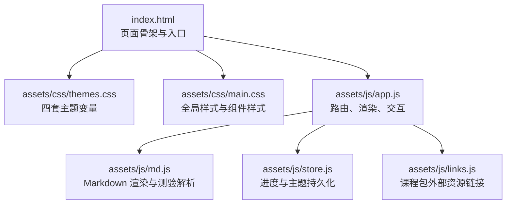

**图表来源**
- [index.html:1-48](file://index.html#L1-L48)
- [themes.css:1-69](file://assets/css/themes.css#L1-L69)
- [main.css:1-241](file://assets/css/main.css#L1-L241)
- [app.js:1-522](file://assets/js/app.js#L1-L522)
- [md.js:1-338](file://assets/js/md.js#L1-L338)
- [store.js:1-183](file://assets/js/store.js#L1-L183)
- [links.js:1-109](file://assets/js/links.js#L1-L109)

**章节来源**
- [index.html:1-48](file://index.html#L1-L48)

## 核心组件
- 主题系统：基于 CSS 自定义属性（CSS Variables）的四套预设主题，通过 `data-theme` 切换，首帧前即注入，避免闪烁。
- 路由与视图：单页应用，使用 hash 路由渲染首页、课程包详情、小节内容、小测验、作业题、面试题、学习地图与进度页。
- 内容渲染：零依赖 Markdown 渲染器，支持标题、段落、列表、表格、代码块、引用、折叠等；内置流程图纯 CSS 渲染。
- 进度与解锁：localStorage 保存小节通过状态，按课程包内顺序过关解锁；支持导出/导入 Markdown 进度文件。
- 导航与交互：顶部导航、面包屑、侧边目录跳转、卡片点击、按钮反馈、Toast 提示。

**章节来源**
- [app.js:1-522](file://assets/js/app.js#L1-L522)
- [md.js:1-338](file://assets/js/md.js#L1-L338)
- [store.js:1-183](file://assets/js/store.js#L1-L183)

## 架构总览
下图展示从用户操作到页面渲染的关键流程：主题切换、路由匹配、内容加载、Markdown 渲染、测验判分与进度更新。

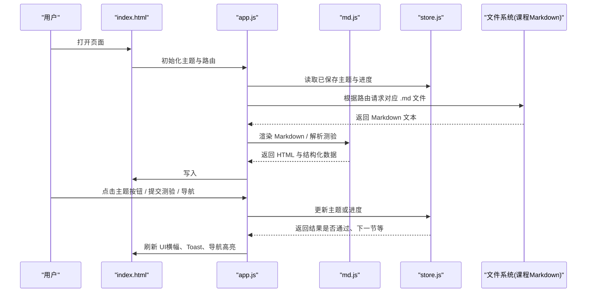

**图表来源**
- [index.html:1-48](file://index.html#L1-L48)
- [app.js:472-522](file://assets/js/app.js#L472-L522)
- [md.js:62-150](file://assets/js/md.js#L62-L150)
- [store.js:101-104](file://assets/js/store.js#L101-L104)

## 详细组件分析

### 主题系统与四套预设主题
- 实现原理：所有颜色、阴影、边框等视觉值均通过 CSS 自定义属性定义，根节点 `:root[data-theme="..."]` 选择器为不同主题提供变量集。
- 四套主题：
  - 深色 dark：深底浅字，强调色偏暖金，适合夜间环境。
  - 护眼 eye：低对比柔和绿调背景，降低长时间阅读疲劳。
  - 藏青 navy：深蓝底色搭配金色强调，科技感强。
  - 纸白 paper：类纸质浅色背景，适合长文阅读。
- 首帧无闪烁：在 `<head>` 中通过脚本立即设置 `documentElement.dataset.theme`，优先于 CSS 渲染，避免首次加载闪动。
- 主题切换交互：顶部主题按钮组，点击后调用 `applyTheme` 更新 `data-theme`，并通过 `aria-pressed` 表达当前选中态，便于辅助技术识别。

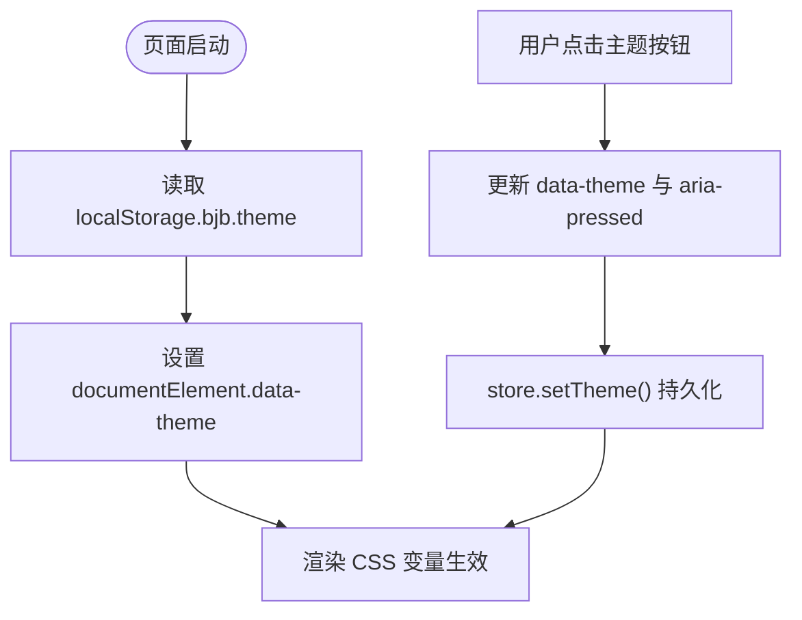

**图表来源**
- [index.html:11-14](file://index.html#L11-L14)
- [app.js:502-511](file://assets/js/app.js#L502-L511)
- [store.js:101-104](file://assets/js/store.js#L101-L104)
- [themes.css:1-69](file://assets/css/themes.css#L1-L69)

**章节来源**
- [themes.css:1-69](file://assets/css/themes.css#L1-L69)
- [index.html:11-14](file://index.html#L11-L14)
- [app.js:502-511](file://assets/js/app.js#L502-L511)
- [store.js:101-104](file://assets/js/store.js#L101-L104)

### 响应式设计策略
- 移动端适配：
  - 课程正文布局在小屏时由双列栅格变为单列，侧边目录取消 sticky 定位。
  - 小节区块在小屏改为纵向排列，按钮行保持横向但允许换行。
  - 头部区域在小屏允许换行，提升紧凑度。
- 布局系统：
  - 使用 CSS Grid 构建课程卡网格，自动填充列宽，最小宽度 268px。
  - 课程正文使用两列栅格（目录 + 正文），自适应主内容区。
- 交互优化：
  - 卡片悬停有轻微上移与边框强调，增强可点击感。
  - 按钮统一圆角与过渡效果，焦点态清晰。
  - Toast 消息固定右下角，限时显示，不打断阅读流。

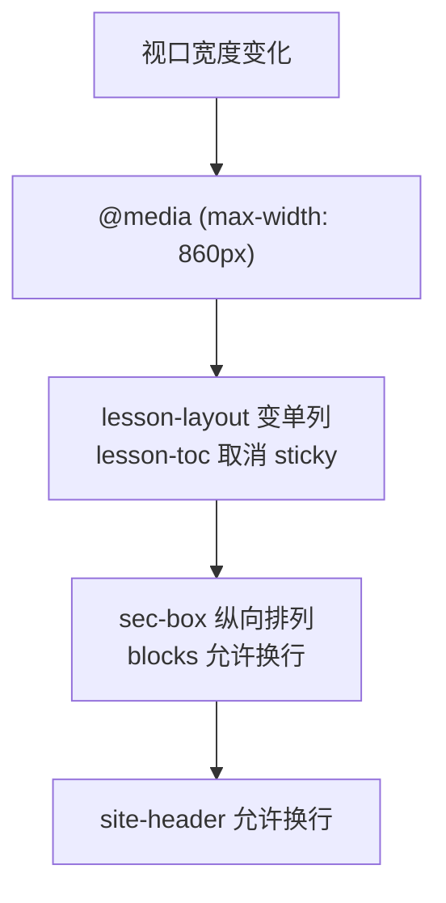

**图表来源**
- [main.css:234-240](file://assets/css/main.css#L234-L240)

**章节来源**
- [main.css:77-92](file://assets/css/main.css#L77-L92)
- [main.css:164-172](file://assets/css/main.css#L164-L172)
- [main.css:234-240](file://assets/css/main.css#L234-L240)

### 界面组件设计

#### 首页卡片展示
- 卡片结构：包含标题、描述、阶段与小节数量、重要性星级、详略标签、已通过数。
- 排序规则：按重要性降序，同重要级保持定义顺序，体现推荐学习路径。
- 状态标签：未开始、进行中、已完成，颜色与边框随状态变化。
- 交互：悬停边框强调与轻微位移，点击进入课程包详情页。

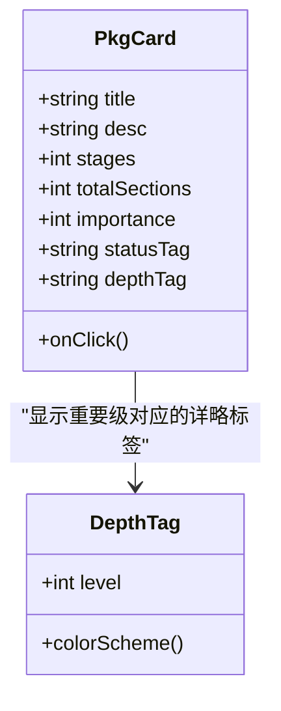

**图表来源**
- [app.js:73-111](file://assets/js/app.js#L73-L111)
- [main.css:77-124](file://assets/css/main.css#L77-L124)

**章节来源**
- [app.js:73-111](file://assets/js/app.js#L73-L111)
- [main.css:77-124](file://assets/css/main.css#L77-L124)

#### 课程包详情页面
- 信息结构：面包屑、标题、简介、官方/参考网站链接区、阶段列表。
- 阶段地图：表格展示小节编号、核心技术点、难度、重要性、状态。
- 小节区块：标题、摘要、难度与重要性星级、状态标签、三个入口按钮（小测验、作业题、面试题）。
- 锁定机制：未解锁的小节显示锁图标与虚线边框，点击给出 Toast 提示。

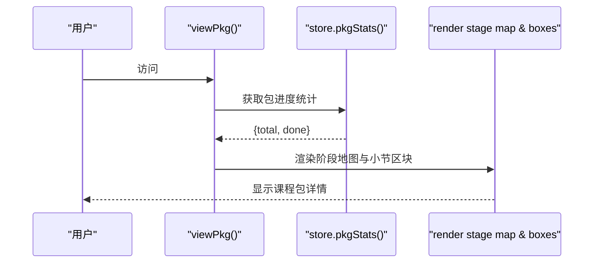

**图表来源**
- [app.js:115-173](file://assets/js/app.js#L115-L173)
- [store.js:54-57](file://assets/js/store.js#L54-L57)

**章节来源**
- [app.js:115-173](file://assets/js/app.js#L115-L173)
- [main.css:125-162](file://assets/css/main.css#L125-L162)

#### 小节内容展示
- 布局：左侧目录（二级/三级标题）、右侧正文（Markdown 渲染）。
- 目录跳转：点击目录项平滑滚动至对应锚点，避免与 hash 路由冲突。
- 正文样式：标题层级、引用块、表格、代码块、图片、分隔线、折叠块等均有明确样式。
- 流程图渲染：将 `pre[data-lang="flow"]` 转换为纯 CSS 流程图，零依赖。

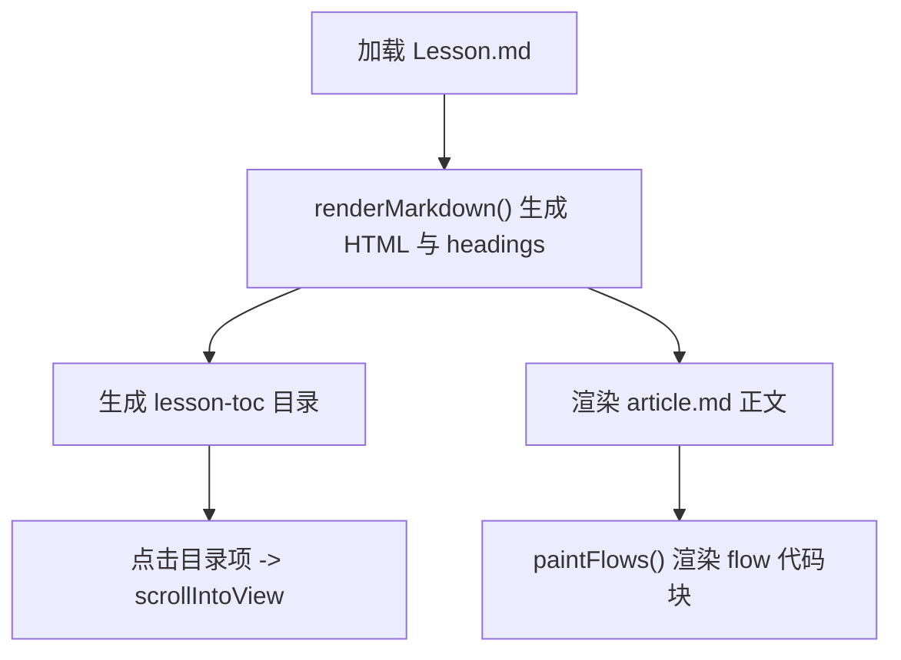

**图表来源**
- [app.js:217-225](file://assets/js/app.js#L217-L225)
- [md.js:62-150](file://assets/js/md.js#L62-L150)
- [app.js:44-59](file://assets/js/app.js#L44-L59)

**章节来源**
- [app.js:217-225](file://assets/js/app.js#L217-L225)
- [md.js:62-150](file://assets/js/md.js#L62-L150)
- [main.css:164-190](file://assets/css/main.css#L164-L190)

#### 导航系统
- 顶部导航：首页、学习地图、进度，当前路由高亮。
- 面包屑：根据当前页面动态生成，支持回链。
- 侧边目录：仅对课程内容页有效，按二级/三级标题生成。
- 底部页脚：说明过关制与进度本地保存、导出功能。

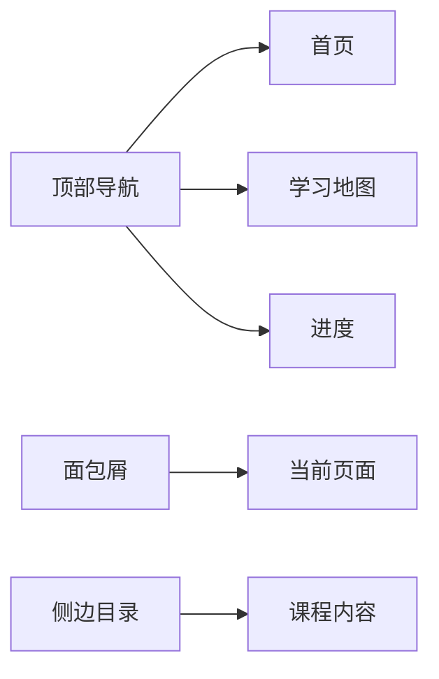

**图表来源**
- [index.html:17-33](file://index.html#L17-L33)
- [app.js:494-496](file://assets/js/app.js#L494-L496)

**章节来源**
- [index.html:17-33](file://index.html#L17-L33)
- [app.js:494-496](file://assets/js/app.js#L494-L496)

### 五级详略标签配色系统
- 设计理念：用红→绿的渐变色表达重要性与讲解深度，越红越需深入精讲，越绿越可速览了解。
- 实现方式：
  - 使用 `.depth-tag.depth-N` 类名区分等级 1~5。
  - 颜色通过 `color-mix(in srgb, ...)` 叠加半透明背景与边框，保证四套主题通用。
  - 在浅色主题（paper/eye）下加深文字颜色，确保对比度。
- 用户体验：
  - 标签尺寸小巧，不干扰正文阅读。
  - 颜色语义明确，配合星级与状态标签形成多维信息层。

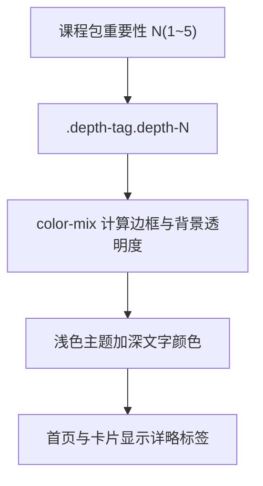

**图表来源**
- [main.css:94-112](file://assets/css/main.css#L94-L112)
- [app.js:16-24](file://assets/js/app.js#L16-L24)

**章节来源**
- [main.css:94-112](file://assets/css/main.css#L94-L112)
- [app.js:16-24](file://assets/js/app.js#L16-L24)

### 无障碍设计
- 可读性优化：
  - 字体栈包含多语言与系统默认字体，字号与行高适中。
  - 引用块、代码块、表格、图片均有明确样式边界。
- 键盘导航支持：
  - 按钮与链接具备清晰的焦点态与悬停态。
  - 目录跳转按钮使用 `type="button"`，避免表单行为。
- 屏幕阅读器兼容：
  - 主题按钮使用 `aria-pressed` 表达选中态。
  - 主内容区使用 `aria-live="polite"`，异步更新时友好播报。
  - 外链使用 `rel="noopener"`，安全且不影响朗读。

**章节来源**
- [index.html:35](file://index.html#L35)
- [index.html:27-32](file://index.html#L27-L32)
- [main.css:31-36](file://assets/css/main.css#L31-L36)
- [md.js:36-40](file://assets/js/md.js#L36-L40)

### 小测验与过关机制
- 题型支持：单选、多选、判断、填空、简答。
- 判分逻辑：客观题精确匹配，主观题关键词命中比例评分；卷面总分折算百分制，≥60 分通过。
- 进度更新：通过后记录最高分与时间戳，标记小节通过，可能解锁下一节。
- 自定义格式：若无法解析为标准测验，提供手动通过按钮，仅记录完成不计分。

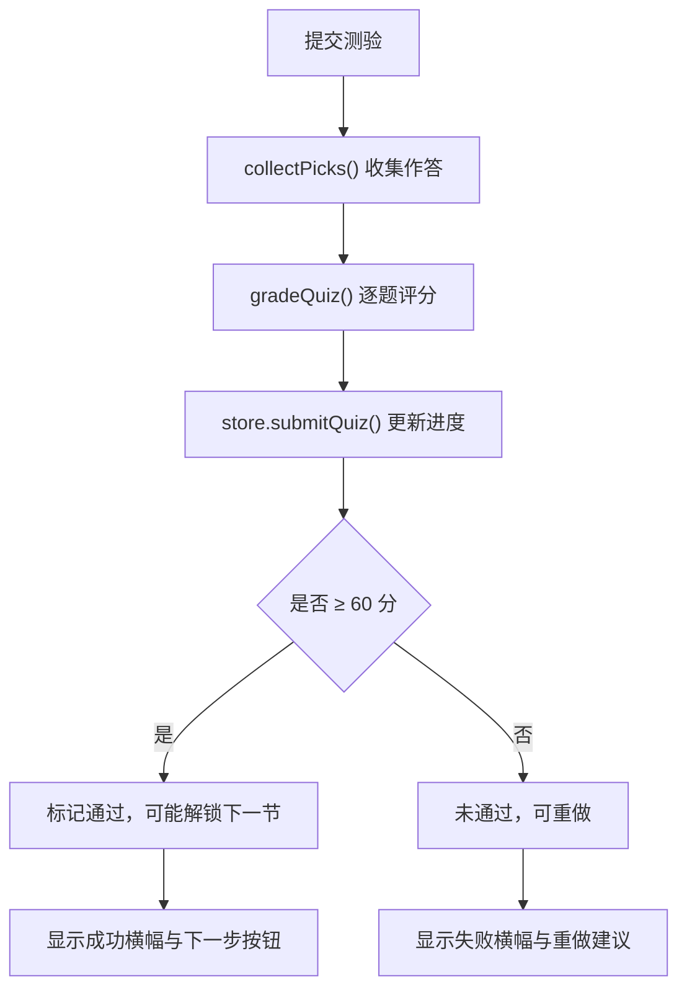

**图表来源**
- [app.js:248-390](file://assets/js/app.js#L248-L390)
- [md.js:297-337](file://assets/js/md.js#L297-L337)
- [store.js:71-86](file://assets/js/store.js#L71-L86)

**章节来源**
- [app.js:248-390](file://assets/js/app.js#L248-L390)
- [md.js:297-337](file://assets/js/md.js#L297-L337)
- [store.js:71-86](file://assets/js/store.js#L71-L86)

## 依赖关系分析
- app.js 依赖 md.js（渲染与测验解析）、store.js（进度与主题）、links.js（课程包外部资源）。
- main.css 与 themes.css 解耦：前者定义结构与组件样式，后者仅提供变量。
- index.html 引入主题与主样式，并在 head 中执行主题初始化脚本。

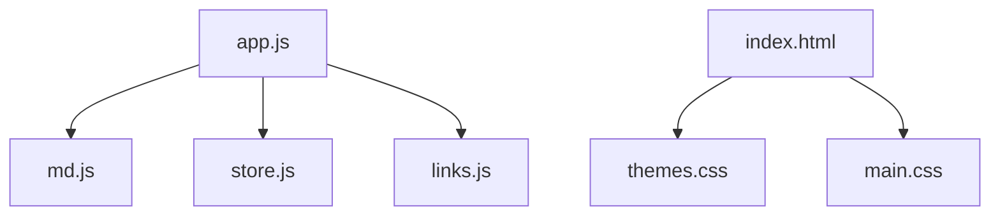

**图表来源**
- [app.js:1-6](file://assets/js/app.js#L1-L6)
- [index.html:9-10](file://index.html#L9-L10)

**章节来源**
- [app.js:1-6](file://assets/js/app.js#L1-L6)
- [index.html:9-10](file://index.html#L9-L10)

## 性能与体验特性
- 首帧主题就位：避免浅色主题用户在首次加载时看到深色闪烁。
- 内容缓存：Markdown 文本通过内存 Map 缓存，减少重复请求。
- 零依赖渲染：Markdown 与流程图渲染均在浏览器端完成，无需额外库。
- 渐进增强：非标准测验格式降级为手动通过，保证可用性。
- 进度持久化：localStorage 为主，Markdown 文件为辅，支持跨设备恢复。

[本节为通用指导，不直接分析具体文件]

## 故障排查指南
- 主题闪烁：检查是否在 `<head>` 中设置了 `documentElement.dataset.theme`，并确保 `localStorage` 可用。
- 路由不生效：确认 hash 路由正则匹配与页面渲染函数注册正确。
- 内容未加载：检查 `.md` 文件路径与命名是否符合约定（Lesson/Quiz/Homework/Interview）。
- 测验无法判分：确认题目格式符合解析规范（题干分值、选项、答案/参考答案）。
- 进度丢失：检查 `localStorage` 权限与隐私模式限制，必要时使用 Markdown 进度文件导入导出。

**章节来源**
- [index.html:11-14](file://index.html#L11-L14)
- [app.js:472-500](file://assets/js/app.js#L472-L500)
- [md.js:193-284](file://assets/js/md.js#L193-L284)
- [store.js:10-18](file://assets/js/store.js#L10-L18)

## 结论
本平台的用户界面以 CSS 自定义属性为核心，构建了灵活的主题系统；通过单页路由与零依赖 Markdown 渲染，实现了轻量、可扩展的学习体验。五级详略标签以红→绿渐变直观表达重要性，结合关卡解锁与进度持久化，形成一致且友好的学习路径。无障碍设计与响应式策略确保了多设备与多用户的可用性与可读性。

[本节为总结性内容，不直接分析具体文件]

## 附录：主题定制指南

### 创建新主题
- 在 `themes.css` 中添加新的 `:root[data-theme="your-theme"]` 块，定义以下变量：
  - 背景色：`--bg`、`--bg-soft`、`--bg-card`、`--bg-code`
  - 线条与边框：`--line`
  - 文字色：`--text`、`--text-soft`、`--text-dim`
  - 强调色：`--accent`、`--accent-2`
  - 状态色：`--ok`、`--bad`、`--lock`
  - 阴影：`--shadow`
- 在 `index.html` 的主题按钮组中添加对应按钮，绑定 `data-theme-btn="your-theme"`。
- 在 `app.js` 中确保主题切换逻辑能处理新主题（当前逻辑已通用，无需修改）。

**章节来源**
- [themes.css:1-69](file://assets/css/themes.css#L1-L69)
- [index.html:27-32](file://index.html#L27-L32)
- [app.js:502-511](file://assets/js/app.js#L502-L511)

### 覆盖现有样式
- 使用更具体的选择器或新增类名覆盖默认样式。
- 注意保持 CSS 变量的一致性，避免硬编码颜色破坏主题一致性。
- 对于组件样式，建议在 `main.css` 中新增类名并复用变量。

**章节来源**
- [main.css:1-241](file://assets/css/main.css#L1-L241)

### 扩展视觉效果
- 利用 `color-mix` 与 CSS 变量组合，实现半透明边框与背景，确保多主题兼容。
- 在浅色主题下调整文字颜色以保证对比度（参考五级详略标签的处理方式）。
- 为交互元素添加过渡与悬停效果，提升反馈感。

**章节来源**
- [main.css:94-112](file://assets/css/main.css#L94-L112)