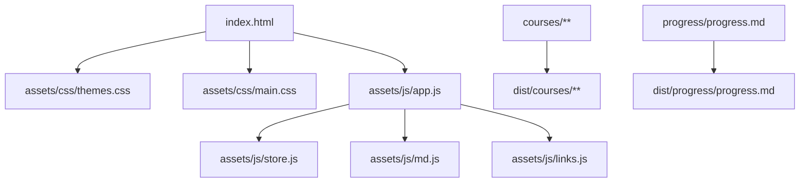
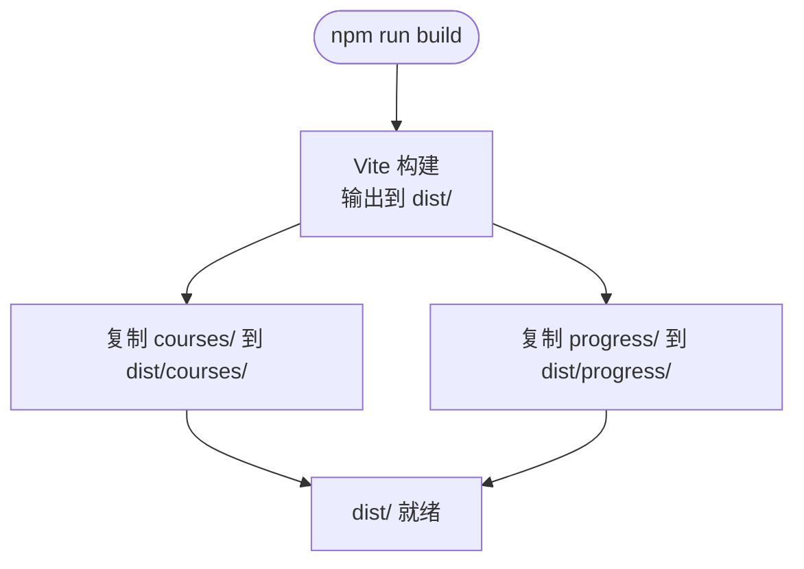
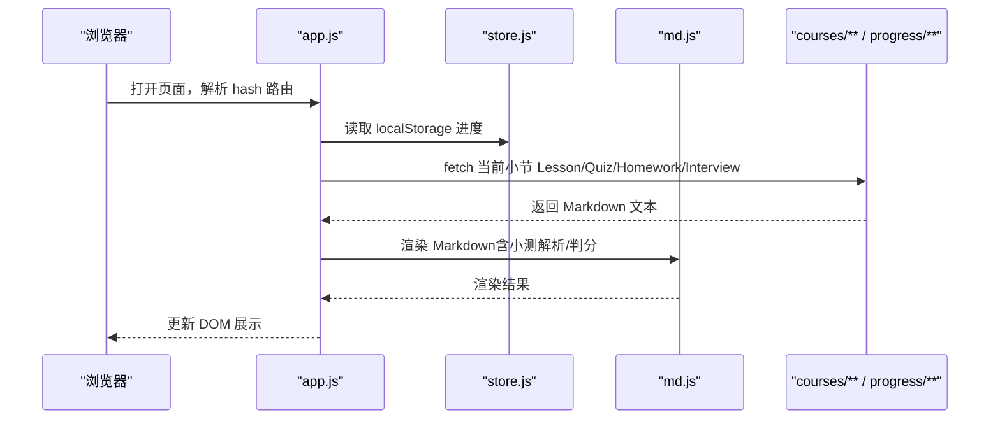
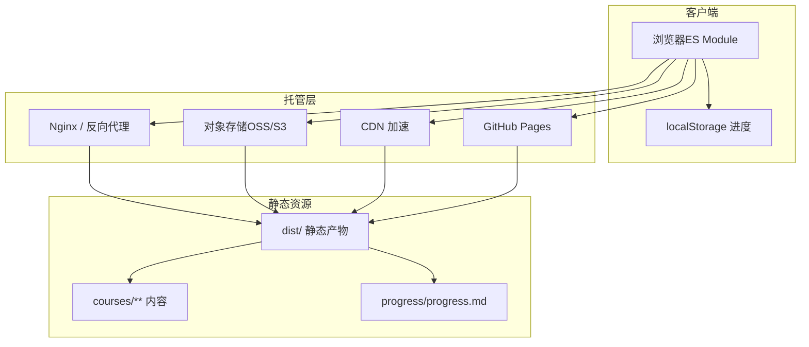
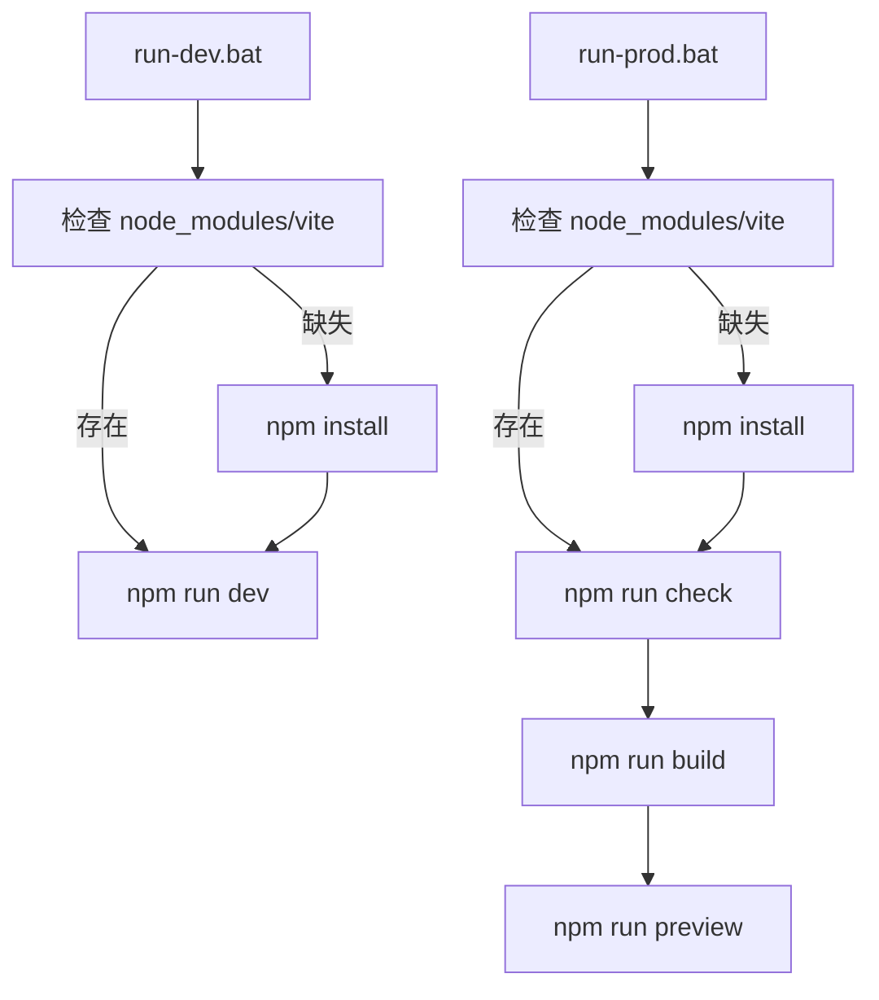

# 部署运维

<cite>
**本文引用的文件**   
- [README.md](file://README.md)
- [package.json](file://package.json)
- [vite.config.js](file://vite.config.js)
- [index.html](file://index.html)
- [run-dev.bat](file://run-dev.bat)
- [run-prod.bat](file://run-prod.bat)
- [assets/js/app.js](file://assets/js/app.js)
- [assets/js/store.js](file://assets/js/store.js)
</cite>

## 目录
1. [简介](#简介)
2. [项目结构与构建产物](#项目结构与构建产物)
3. [核心组件与运行流程](#核心组件与运行流程)
4. [架构总览](#架构总览)
5. [详细部署方案](#详细部署方案)
6. [性能优化策略](#性能优化策略)
7. [监控、日志与可观测性](#监控日志与可观测性)
8. [安全配置建议](#安全配置建议)
9. [自动化与版本管理](#自动化与版本管理)
10. [故障排除指南](#故障排除指南)
11. [结论](#结论)

## 简介
本仓库是一个“大 Java 后端学习平台”，采用 Vite 驱动开发、构建，最终产出为纯静态资源。运行时零第三方依赖，页面逻辑基于原生 ES Module，课程内容为 Markdown，进度保存在浏览器 `localStorage`，并支持导出/导入 Markdown 进度文件。构建产物位于 `dist/`，可直接交给 Nginx、对象存储、CDN 或 GitHub Pages 等任意静态托管服务上线。

该文档面向运维人员，重点说明：
- 构建产物结构、静态资源组织与缓存策略
- 多种部署方案（Nginx、对象存储、CDN、GitHub Pages）
- 性能优化措施（压缩、图片、字体、HTTP 缓存头）
- 监控与日志、错误跟踪与性能指标
- CI/CD 自动化、脚本化部署与版本管理
- HTTPS、CORS、XSS 防护等安全注意事项
- 常见问题诊断与性能瓶颈分析方法

**章节来源**
- [README.md:1-10](file://README.md#L1-L10)
- [README.md:39-78](file://README.md#L39-L78)
- [README.md:130-170](file://README.md#L130-L170)

## 项目结构与构建产物
### 源码与内容结构
- 入口 HTML：`index.html`，加载主题 CSS 与 JS 模块入口。
- 前端逻辑：`assets/js/app.js`、`assets/js/store.js`、`assets/js/md.js`、`assets/js/links.js`。
- 样式：`assets/css/main.css`、`assets/css/themes.css`。
- 课程内容：`courses/**`，按“包 → 阶段 → 小节”组织，包含课文、小测、作业、面试题。
- 进度种子：`progress/progress.md`，首次访问时用于恢复解锁状态。
- 工具脚本：`scripts/*.mjs`，提供 scaffold、outline、check 等内容生成与自检能力。
- 构建配置：`vite.config.js`，定义 base、publicDir、插件、端口、输出目录等。
- npm 脚本：`package.json`，封装 dev/build/preview/prod/check/scaffold/outline。

**图表来源**
- [index.html:9-10](file://index.html#L9-L10)
- [index.html:45-45](file://index.html#L45-L45)
- [vite.config.js:27-34](file://vite.config.js#L27-L34)

### 构建产物 dist 目录
- 构建输出目录：`dist/`，由 `vite.config.js` 的 `build.outDir` 指定。
- 构建后自动复制：`courses/` 与 `progress/` 通过自定义插件复制到 `dist/`，供运行时按需 `fetch`。
- 相对路径部署：`base` 设置为相对路径，便于部署到任意子路径或静态托管根路径。
- 目标环境：`target` 设为 `es2020`，现代浏览器可直接消费。

**图表来源**
- [vite.config.js:8-25](file://vite.config.js#L8-L25)
- [vite.config.js:27-34](file://vite.config.js#L27-L34)

**章节来源**
- [README.md:64-67](file://README.md#L64-L67)
- [README.md:145-170](file://README.md#L145-L170)
- [vite.config.js:27-34](file://vite.config.js#L27-L34)

## 核心组件与运行流程
### 前端路由与视图渲染
- 路由基于 `location.hash`，在 `app.js` 中实现首页、地图、进度、包、小节等视图渲染。
- 骨架数据源 `assets/js/data.js` 驱动首页分组、课程树、解锁链路。
- 进度主存储为 `localStorage`，键名如 `bjb.progress.v1`；同时支持 Markdown 导入导出。

**图表来源**
- [README.md:135-142](file://README.md#L135-L142)
- [assets/js/app.js:36-36](file://assets/js/app.js#L36-L36)
- [assets/js/store.js:169-169](file://assets/js/store.js#L169-L169)

**章节来源**
- [README.md:130-142](file://README.md#L130-L142)
- [assets/js/app.js:36-36](file://assets/js/app.js#L36-L36)
- [assets/js/store.js:169-169](file://assets/js/store.js#L169-L169)

## 架构总览
整体架构为“纯静态站点 + 浏览器端逻辑 + 外部静态托管”。

**图表来源**
- [README.md:64-78](file://README.md#L64-L78)
- [vite.config.js:27-34](file://vite.config.js#L27-L34)

## 详细部署方案
### Nginx 静态托管
- 将 `dist/` 整目录作为 Web 根目录或子路径发布。
- 启用 gzip/brotli 压缩以提升传输效率。
- 设置 HTTP 缓存头：对带哈希的资源设置长期缓存，对 HTML 设置较短缓存或 no-store。
- 确保 SPA 路由回退：当请求匹配不到静态文件时，回退到 `index.html`。

参考要点：
- 静态资源目录：`dist/`
- 路由回退：所有未命中静态资源的请求返回 `index.html`
- 缓存策略：HTML 短缓存或 no-store；JS/CSS/图片等长缓存（配合内容哈希）

**章节来源**
- [README.md:64-78](file://README.md#L64-L78)
- [vite.config.js:27-34](file://vite.config.js#L27-L34)

### 对象存储（OSS/S3）部署
- 上传 `dist/` 全部内容至对象存储桶。
- 开启静态网站托管（Bucket 根路径指向 `index.html`）。
- 为静态资源设置合适的 Content-Type 与缓存头。
- 如需私有访问，结合签名 URL 或 CDN 鉴权。

参考要点：
- 桶根路径：`index.html`
- 静态资源类型：`.js/.css/.png/.svg/.woff2` 等
- 缓存头：根据资源是否带哈希决定长期缓存或短期缓存

**章节来源**
- [README.md:64-78](file://README.md#L64-L78)

### CDN 加速配置
- 将对象存储域名接入 CDN，提升全球访问速度。
- 配置缓存规则：
  - HTML：不缓存或短缓存（no-cache/no-store）
  - JS/CSS：长期缓存（max-age=31536000），配合内容哈希
  - 图片/字体：长期缓存（max-age=31536000）
- 开启压缩（gzip/brotli）与 HTTP/2 或 HTTP/3。
- 配置回源规则：未命中缓存时回源对象存储。

参考要点：
- 缓存命中率：HTML 低命中，静态资源高命中
- 压缩：服务端或 CDN 层启用
- 回源：对象存储域名

**章节来源**
- [README.md:64-78](file://README.md#L64-L78)

### GitHub Pages 部署
- 使用 GitHub Actions 构建 `dist/` 并部署到 Pages。
- 分支策略：main 分支触发构建与部署。
- 自定义域名：在 Settings → Pages 配置域名与证书。
- 注意：Pages 默认提供 HTTPS，无需自行配置证书。

参考要点：
- 构建命令：`npm run build`
- 部署目录：`dist/`
- 域名与证书：GitHub Pages 管理

**章节来源**
- [README.md:64-78](file://README.md#L64-L78)

## 性能优化策略
### 资源压缩
- 建议在 Nginx/CDN 层启用 gzip 与 brotli 压缩。
- 对于 JS/CSS 等大体积资源，优先使用 brotli；对兼容性要求高的场景保留 gzip。
- 避免对已压缩格式（如 PNG/JPEG/WebP）重复压缩。

### 图片优化
- 使用现代格式（WebP/AVIF）替代传统 PNG/JPEG。
- 按需生成多分辨率尺寸，减少大图传输。
- 对图标类 SVG 内联或缓存，减少请求次数。

### 字体优化
- 使用 WOFF2 格式字体，减小体积。
- 对非首屏字体使用 `font-display: swap`，避免阻塞渲染。
- 仅加载必要字重与字符集。

### HTTP 缓存头配置
- HTML：`Cache-Control: no-cache` 或 `no-store`，确保用户获取最新版本。
- JS/CSS：`Cache-Control: public, max-age=31536000, immutable`，配合内容哈希。
- 图片/字体：`Cache-Control: public, max-age=31536000`。
- ETag/Last-Modified：可配合强缓存使用，但建议以哈希文件名为主。

### 构建期优化
- Vite 默认会对 JS/CSS 进行压缩与代码分割（视配置而定）。
- 保持 `base` 为相对路径，利于子路径部署与缓存失效控制。
- 避免在运行时动态引入大体积资源，尽量预加载关键资源。

**章节来源**
- [README.md:64-78](file://README.md#L64-L78)
- [vite.config.js:27-34](file://vite.config.js#L27-L34)

## 监控、日志与可观测性
### 网站访问监控
- 使用 CDN 访问日志分析 Top 请求、地域分布、带宽与 QPS。
- 使用对象存储访问日志统计静态资源命中率与回源率。
- 使用 Nginx access/error 日志分析 4xx/5xx 比例与慢请求。

### 错误跟踪
- 前端可通过全局错误捕获上报错误堆栈（需自建上报接口或使用第三方服务）。
- 关注 `fetch` 失败（如 `courses/**` 或 `progress/progress.md` 无法加载）。
- 在 Nginx/CDN 层记录 404/502/504 等异常响应。

### 性能指标收集
- 使用浏览器 Performance API 采集 LCP、FID、CLS 等指标。
- 使用 CDN 面板观察缓存命中率、首字节时间（TTFB）、端到端延迟。
- 定期执行性能审计（如 Lighthouse）评估构建产物质量。

**章节来源**
- [assets/js/app.js:36-36](file://assets/js/app.js#L36-L36)
- [assets/js/store.js:169-169](file://assets/js/store.js#L169-L169)

## 安全配置建议
### HTTPS 配置
- 强制 HTTPS：Nginx 重定向 HTTP 到 HTTPS。
- 启用 HSTS：`Strict-Transport-Security` 防止协议降级。
- 使用强加密套件与 TLS 1.2+。

### CORS 设置
- 若静态站点与后端 API 分离，需在 API 侧配置允许跨域。
- 静态资源本身一般不需要 CORS，除非从不同域名加载。

### XSS 防护
- 对用户输入进行严格校验与转义。
- 设置 `Content-Security-Policy` 限制脚本来源。
- 避免使用 `innerHTML` 直接注入不可信内容。

### 其他安全措施
- 禁用不必要的 HTTP 方法（仅保留 GET/HEAD/POST 等）。
- 隐藏服务器版本号与敏感头信息。
- 对敏感路径进行访问控制与限流。

**章节来源**
- [README.md:64-78](file://README.md#L64-L78)

## 自动化与版本管理
### CI/CD 流水线
- 触发条件：push 到 main 分支或创建 Release 标签。
- 步骤：
  1. 安装依赖：`npm install`
  2. 内容自检：`npm run check`
  3. 构建产物：`npm run build`
  4. 部署：上传 `dist/` 到 Nginx/OSS/CDN/GitHub Pages

### 自动化部署脚本
- Windows 本地一键脚本：
  - `run-dev.bat`：开发模式，自动安装依赖并启动 Vite dev server。
  - `run-prod.bat`：生产预览，先自检、再构建、最后启动 preview。

**图表来源**
- [run-dev.bat:13-34](file://run-dev.bat#L13-L34)
- [run-prod.bat:14-48](file://run-prod.bat#L14-L48)

### 版本管理
- 使用 Git 分支策略：feature → develop → main。
- 使用语义化版本（SemVer）标记 Release。
- 构建产物命名：Vite 默认按内容哈希命名，天然具备缓存失效能力。
- 发布前执行 `npm run audit-examples` 与 `npm run check` 保证内容与结构正确。

**章节来源**
- [run-dev.bat:13-34](file://run-dev.bat#L13-L34)
- [run-prod.bat:14-48](file://run-prod.bat#L14-L48)
- [README.md:95-102](file://README.md#L95-L102)

## 故障排除指南
### 常见问题诊断
- 页面空白或路由无效：
  - 确认 `index.html` 能正常加载。
  - 检查 Nginx 是否配置了 SPA 路由回退。
- 课程或小节内容无法加载：
  - 检查 `courses/**` 是否被复制到 `dist/`。
  - 确认运行时 `fetch` 路径正确（如 `S1-2-Lesson.md`）。
- 进度无法保存或导入：
  - 检查 `localStorage` 是否可用（隐私模式可能受限）。
  - 确认 `progress/progress.md` 可被访问。

### 性能瓶颈分析
- 首屏加载慢：
  - 检查 JS/CSS 体积与数量。
  - 启用 CDN 与压缩，优化图片与字体。
- 缓存未生效：
  - 检查 HTTP 缓存头是否正确设置。
  - 确认资源文件名是否包含内容哈希。
- 回源率高：
  - 调整 CDN 缓存规则，延长静态资源缓存时间。
  - 检查 HTML 是否误设长期缓存。

### 日志分析方法
- Nginx access.log：分析请求量、状态码、慢请求。
- Nginx error.log：定位 4xx/5xx 错误。
- CDN 日志：分析命中率、回源率、地域分布。
- 对象存储日志：统计访问热点与异常请求。

**章节来源**
- [README.md:64-78](file://README.md#L64-L78)
- [assets/js/app.js:36-36](file://assets/js/app.js#L36-L36)
- [assets/js/store.js:169-169](file://assets/js/store.js#L169-L169)

## 结论
本项目采用 Vite 构建纯静态站点，产物简洁、部署灵活，适合多种托管环境。运维层面应重点关注：
- 构建产物结构与缓存策略
- 多种部署方案的适配与优化
- 性能优化与安全加固
- 监控、日志与自动化部署
- 故障排查与性能调优

通过以上实践，可确保学习平台的稳定运行与良好用户体验。