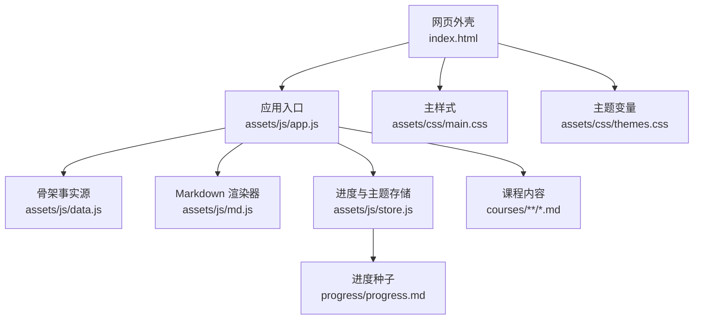
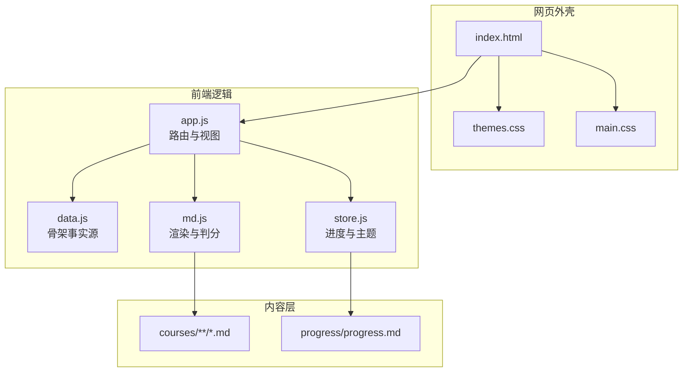
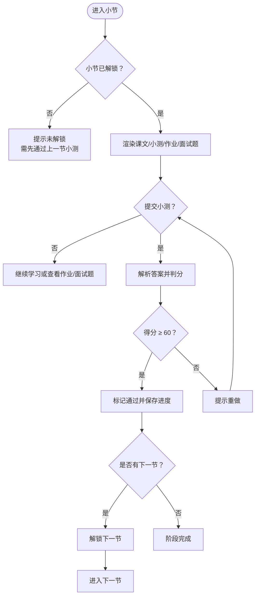
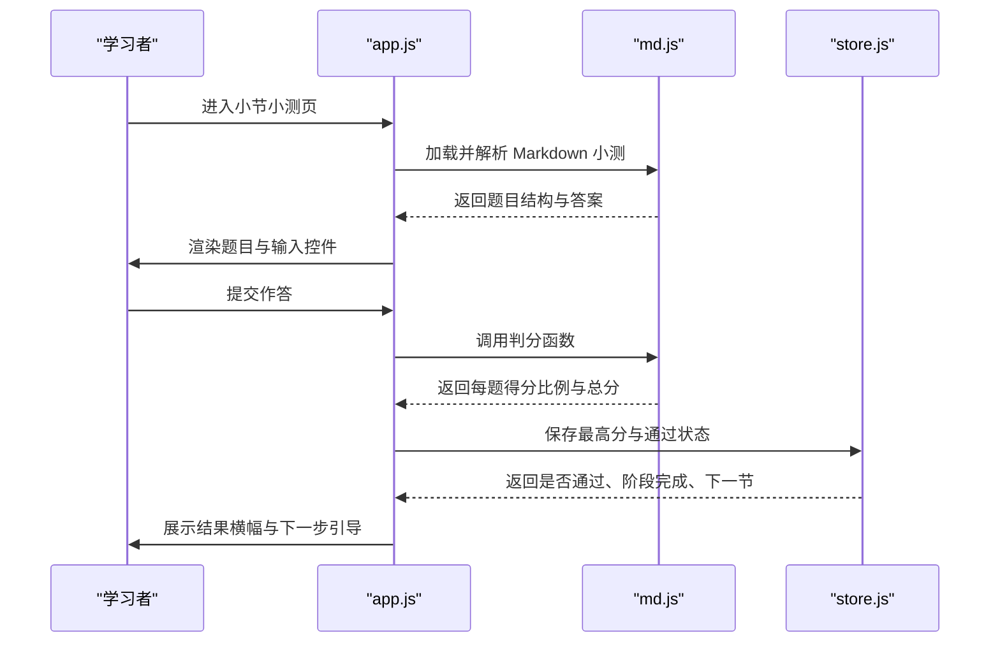
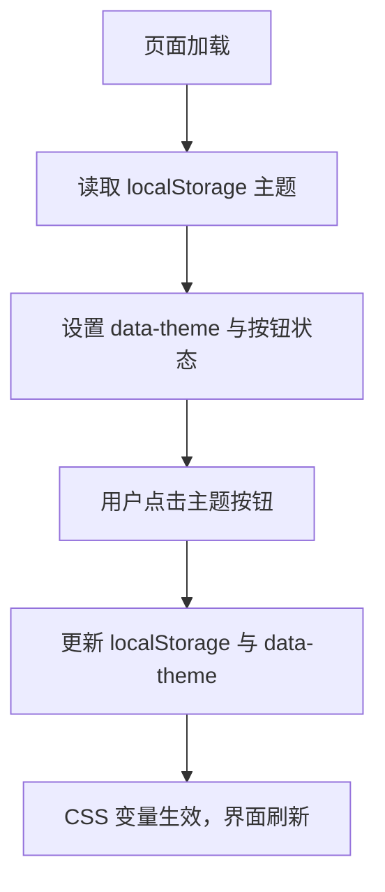
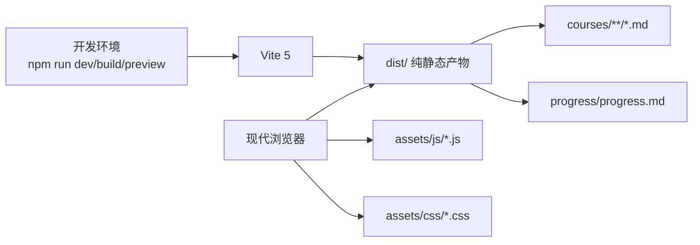

# 项目概述

<cite>
**本文引用的文件**   
- [README.md](file://README.md)
- [package.json](file://package.json)
- [vite.config.js](file://vite.config.js)
- [index.html](file://index.html)
- [assets/js/app.js](file://assets/js/app.js)
- [assets/js/data.js](file://assets/js/data.js)
- [assets/js/store.js](file://assets/js/store.js)
- [assets/js/md.js](file://assets/js/md.js)
- [assets/css/main.css](file://assets/css/main.css)
- [assets/css/themes.css](file://assets/css/themes.css)
</cite>

## 目录
1. [引言](#引言)
2. [项目结构](#项目结构)
3. [核心组件](#核心组件)
4. [架构总览](#架构总览)
5. [关键流程与机制](#关键流程与机制)
6. [依赖关系分析](#依赖关系分析)
7. [性能与可维护性](#性能与可维护性)
8. [快速开始指南](#快速开始指南)
9. [常见问题与排错](#常见问题与排错)
10. [结语](#结语)

## 引言
大Java后端是一个面向 Java 后端学习者的「打怪升级」学习平台。它的定位是：一个可运行、可打卡、可扩展的 Java 后端学习系统，运行时零第三方依赖，采用原生 ES Module + 自写 Markdown 渲染器；开发/构建走 Vite，产物为纯静态资源，彻底脱离 Python 与后端进程。

核心价值体现在：
- 以资深架构师视角组织知识体系，覆盖语言、框架、分布式、数据库、中间件、微服务治理、工程化、测试、安全、行业专题等方向。
- 通过过关制学习机制驱动学习节奏：同一课程包内按阶段与小节顺序逐关解锁，小测得分 ≥ 60 分即自动通关并解锁下一节。
- 进度保存在浏览器本地，同时支持导出/导入 Markdown 进度文件，纳入 Git 即可获得打卡记录。
- 多主题界面（深色、护眼、藏青、纸白）与响应式布局，适配桌面与移动端阅读体验。
- 骨架数据源唯一、课程内容纯 Markdown，扩展课程只需改一处骨架并补齐对应 Markdown 文件。

该文档既为初学者提供概念性概览，也为有经验的开发者提供足够的技术深度与实现细节。

**章节来源**
- [README.md:1-10](file://README.md#L1-L10)
- [README.md:13-37](file://README.md#L13-L37)
- [README.md:80-104](file://README.md#L80-L104)
- [README.md:130-143](file://README.md#L130-L143)

## 项目结构
仓库采用“网页外壳 + 前端脚本 + 纯 Markdown 内容”的分层组织方式：
- 网页外壳：`index.html` 加载主题 CSS 与 ES Module 入口。
- 前端逻辑：`assets/js/app.js` 负责路由与页面渲染；`assets/js/data.js` 是唯一骨架事实源；`assets/js/store.js` 管理进度与主题；`assets/js/md.js` 是自写 Markdown 渲染器与小测验解析判分器。
- 样式：`assets/css/main.css` 定义布局与组件，`assets/css/themes.css` 定义四套主题变量。
- 课程内容：`courses/<包id>/<阶段id>/Sx-y-{Lesson,Quiz,Homework,Interview}.md`，每小节固定四件套。
- 进度种子：`progress/progress.md`，首次打开时若本地无进度则自动恢复。
- 构建配置：`vite.config.js` 配置端口、相对 base、构建输出与自定义插件复制 `courses/` 与 `progress/`。
- 脚本与依赖：`package.json` 暴露 dev/build/preview/prod/check/scaffold/outline 等 npm 脚本，仅依赖 Vite。



**图表来源**
- [index.html:1-48](file://index.html#L1-L48)
- [assets/js/app.js:1-10](file://assets/js/app.js#L1-L10)
- [assets/js/data.js:1-8](file://assets/js/data.js#L1-L8)
- [assets/js/md.js:1-10](file://assets/js/md.js#L1-L10)
- [assets/js/store.js:1-10](file://assets/js/store.js#L1-L10)
- [assets/css/main.css:1-15](file://assets/css/main.css#L1-L15)
- [assets/css/themes.css:1-10](file://assets/css/themes.css#L1-L10)

**章节来源**
- [README.md:145-170](file://README.md#L145-L170)
- [vite.config.js:1-35](file://vite.config.js#L1-L35)
- [package.json:1-21](file://package.json#L1-L21)

## 核心组件
- 网页外壳与主题切换：`index.html` 提供站点头部导航、主题按钮与根容器 `#app`，并在首帧前从 `localStorage` 恢复主题，避免闪烁。
- 路由与视图渲染：`assets/js/app.js` 使用 `location.hash` 手写路由，渲染首页、课程包页、小节课文/小测/作业/面试题、学习地图与进度页。
- 骨架事实源：`assets/js/data.js` 定义 15 个大技术分区、86 个课程包、阶段与小节元组，驱动首页卡片、学习地图与解锁链路。
- 进度与主题存储：`assets/js/store.js` 基于 `localStorage` 保存小节最高分、是否通过、时间戳，并提供 Markdown 导入导出、主题存取与站点统计。
- Markdown 渲染与小测验：`assets/js/md.js` 实现标题、段落、列表、表格、代码块、引用、链接等渲染，并把站内 `.md` 链接转换为 hash 路由；同时解析小测验题型、参考答案与解析，计算卷面得分与百分制分数。
- 样式与主题：`assets/css/main.css` 定义布局、卡片、阶段小节、正文排版与测验 UI；`assets/css/themes.css` 通过 CSS 变量提供暗色、护眼、藏青、纸白四套主题。

这些组件共同构成“外壳 → 骨架 → 内容 → 交互 → 样式”的清晰分层，运行时不引入任何第三方库。

**章节来源**
- [index.html:17-45](file://index.html#L17-L45)
- [assets/js/app.js:1-10](file://assets/js/app.js#L1-L10)
- [assets/js/data.js:1-8](file://assets/js/data.js#L1-L8)
- [assets/js/store.js:1-10](file://assets/js/store.js#L1-L10)
- [assets/js/md.js:1-10](file://assets/js/md.js#L1-L10)
- [assets/css/main.css:16-50](file://assets/css/main.css#L16-L50)
- [assets/css/themes.css:1-10](file://assets/css/themes.css#L1-L10)

## 架构总览
整体架构遵循“网页外壳框架 → 大技术分区（15）→ 课程包（86）→ 阶段 → 小节（课文 + 小测 + 作业 + 面试题）”的层级模型。骨架数据源 `data.js` 是全站唯一事实源，所有页面与解锁逻辑都由此派生。



**图表来源**
- [index.html:1-48](file://index.html#L1-L48)
- [assets/js/app.js:472-500](file://assets/js/app.js#L472-L500)
- [assets/js/data.js:10-20](file://assets/js/data.js#L10-L20)
- [assets/js/store.js:106-173](file://assets/js/store.js#L106-L173)
- [assets/js/md.js:62-150](file://assets/js/md.js#L62-L150)

**章节来源**
- [README.md:13-37](file://README.md#L13-L37)
- [README.md:172-221](file://README.md#L172-L221)

## 关键流程与机制

### 过关制学习与进度追踪
过关制是平台的核心学习机制：
- 同一大技术包内的小节必须按顺序通过；不同包之间互不锁定。
- 小测得分 ≥ 60 分记为本小节通过，并自动解锁下一节。
- 阶段内全部小节通过后自动标记阶段完成。
- 进度主存储为 `localStorage`，键 `bjb.progress.v1`；同时支持导出/导入 `progress.md`。
- 首次打开且本地无进度时，网站会尝试从 `progress/progress.md` 恢复解锁状态。



**图表来源**
- [assets/js/store.js:28-45](file://assets/js/store.js#L28-L45)
- [assets/js/store.js:71-99](file://assets/js/store.js#L71-L99)
- [assets/js/app.js:185-208](file://assets/js/app.js#L185-L208)
- [assets/js/app.js:320-390](file://assets/js/app.js#L320-L390)

**章节来源**
- [README.md:33-37](file://README.md#L33-L37)
- [README.md:80-87](file://README.md#L80-L87)
- [assets/js/store.js:28-45](file://assets/js/store.js#L28-L45)
- [assets/js/store.js:71-99](file://assets/js/store.js#L71-L99)
- [assets/js/app.js:185-208](file://assets/js/app.js#L185-L208)
- [assets/js/app.js:320-390](file://assets/js/app.js#L320-L390)

### 小测验解析与判分
小测验采用约定格式：
- 题目以三级标题开头，题干可带分值。
- 选项行以字母键标识，支持单选、多选、判断。
- 无选项行为主观题：填空题含下划线或关键词，简答题按参考答案要点评分。
- 答案与解析可写在题目内或末尾统一“答案”段。
- 判分后展示每题结果、解析与总分横幅，≥ 60 分自动通关。



**图表来源**
- [assets/js/app.js:248-294](file://assets/js/app.js#L248-L294)
- [assets/js/app.js:320-390](file://assets/js/app.js#L320-L390)
- [assets/js/md.js:193-284](file://assets/js/md.js#L193-L284)
- [assets/js/md.js:329-337](file://assets/js/md.js#L329-L337)
- [assets/js/store.js:71-99](file://assets/js/store.js#L71-L99)

**章节来源**
- [assets/js/md.js:168-284](file://assets/js/md.js#L168-L284)
- [assets/js/md.js:297-337](file://assets/js/md.js#L297-L337)
- [assets/js/app.js:248-294](file://assets/js/app.js#L248-L294)
- [assets/js/app.js:320-390](file://assets/js/app.js#L320-L390)

### 主题切换与响应式设计
- 主题通过 `data-theme` 属性与 CSS 变量控制，支持深色、护眼、藏青、纸白四套主题。
- 主题在首帧前从 `localStorage` 恢复，避免闪烁。
- 响应式布局在小屏幕下自动调整侧边目录、小节区块与头部导航。



**图表来源**
- [index.html:11-14](file://index.html#L11-L14)
- [assets/js/app.js:502-511](file://assets/js/app.js#L502-L511)
- [assets/css/themes.css:1-69](file://assets/css/themes.css#L1-L69)
- [assets/css/main.css:234-240](file://assets/css/main.css#L234-L240)

**章节来源**
- [index.html:11-14](file://index.html#L11-L14)
- [assets/js/app.js:502-511](file://assets/js/app.js#L502-L511)
- [assets/css/themes.css:1-69](file://assets/css/themes.css#L1-L69)
- [assets/css/main.css:234-240](file://assets/css/main.css#L234-L240)

## 依赖关系分析
- 运行时依赖：零第三方依赖。页面逻辑由原生 ES Module 组成，不包含 Vue/React 等框架。
- 开发依赖：仅 Vite，用于开发服务器、热更新、构建与预览。
- 内容依赖：课程内容为纯 Markdown，无需额外渲染库。
- 构建依赖：Vite 自定义插件在构建后将 `courses/` 与 `progress/` 复制到 `dist/`，确保运行时 `fetch` 可访问。



**图表来源**
- [package.json:17-19](file://package.json#L17-L19)
- [vite.config.js:27-34](file://vite.config.js#L27-L34)
- [README.md:39-48](file://README.md#L39-L48)
- [README.md:64-68](file://README.md#L64-L68)

**章节来源**
- [README.md:39-48](file://README.md#L39-L48)
- [README.md:64-68](file://README.md#L64-L68)
- [README.md:130-143](file://README.md#L130-L143)
- [package.json:1-21](file://package.json#L1-L21)
- [vite.config.js:1-35](file://vite.config.js#L1-L35)

## 性能与可维护性
- 构建产物为纯静态资源，部署到任意静态服务器即可，无后端进程开销。
- 内容脚本（scaffold/outline/check）由 Node ESM 驱动，保证骨架与内容一致性。
- Markdown 渲染器自写且轻量，避免引入重型库带来的运行时成本。
- 骨架事实源唯一，扩展课程只需修改 `data.js` 并补齐 Markdown 文件，降低维护复杂度。
- 示例程序规范与审计脚本帮助保持课文质量，提升学习内容的可读性与正确性。

[本节为通用指导，不直接分析具体文件]

## 快速开始指南

### 环境要求
- Node.js ≥ 18（推荐 20+），随附 npm。
- 现代浏览器（支持 ES Modules）。
- 完全脱离 Python，开发/构建/预览全流程走 npm + Vite。
- 必须以 `http://` 访问，不要直接双击 `index.html`（`file://` 会被同源策略拦截）。

**章节来源**
- [README.md:39-48](file://README.md#L39-L48)

### 安装与运行
```bash
npm install        # 首次安装开发依赖（Vite）
npm run dev        # 开发模式：http://localhost:5180
npm run build      # 构建：输出 dist/
npm run preview    # 预览构建产物：http://localhost:8080
npm run prod       # 一键：build 完再 preview
```

- 开发模式支持热更新，改文件即时生效。
- 生产模式构建后自动复制 `courses/` 与 `progress/` 到 `dist/`。
- 可通过局域网 IP 在另一台设备预览。
- 部署时将 `dist/` 交给 Nginx、对象存储、GitHub Pages 或任意 CDN。

**章节来源**
- [README.md:53-78](file://README.md#L53-L78)
- [vite.config.js:27-34](file://vite.config.js#L27-L34)

### 基本使用方法
- 首页按 15 个大技术分区分组，每张课程卡显示重要性、阶段数、小节数与进度标签。
- 进入课程包后可查看阶段地图与小节四件套（课文、小测、作业、面试题）。
- 小测 ≥ 60 分自动通关并解锁下一节。
- 进度页支持导出/导入 `progress.md`，清空进度或恢复历史进度。
- 主题按钮可在深色、护眼、藏青、纸白之间切换。

**章节来源**
- [README.md:13-37](file://README.md#L13-L37)
- [README.md:80-104](file://README.md#L80-L104)
- [assets/js/app.js:73-111](file://assets/js/app.js#L73-L111)
- [assets/js/app.js:430-452](file://assets/js/app.js#L430-L452)

## 常见问题与排错
- Windows PowerShell 报“禁止运行脚本”：用 `npm.cmd` 代替 `npm`，或以管理员执行解锁策略。
- 直接双击 `index.html` 无法加载模块：必须通过 `http://` 访问。
- 进度未恢复：确认通过 HTTP 访问且 `progress/progress.md` 存在；或在进度页手动导入。
- 小测不计分：若小测采用自定义格式，需点击“我已完成本小节自定义测验，标记通过”。
- 构建后找不到课程内容：检查 Vite 自定义插件是否正确复制 `courses/` 与 `progress/`。

**章节来源**
- [README.md:49-51](file://README.md#L49-L51)
- [README.md:47-48](file://README.md#L47-L48)
- [README.md:80-87](file://README.md#L80-L87)
- [assets/js/app.js:255-263](file://assets/js/app.js#L255-L263)
- [vite.config.js:8-25](file://vite.config.js#L8-L25)

## 结语
大Java后端学习平台以“可运行、可打卡、可扩展”为核心目标，通过零运行时依赖的原生 ES Module 架构与自写 Markdown 渲染器，提供了轻量、高效、易维护的学习体验。过关制学习机制与进度追踪管理帮助学习者建立稳定的学习节奏；多主题与响应式设计提升了阅读体验；骨架事实源与纯 Markdown 内容使扩展与维护变得简单直观。无论是初学者还是经验丰富的开发者，都能在这个平台上找到适合自己的学习路径与技术深度。

[本节为总结性内容，不直接分析具体文件]